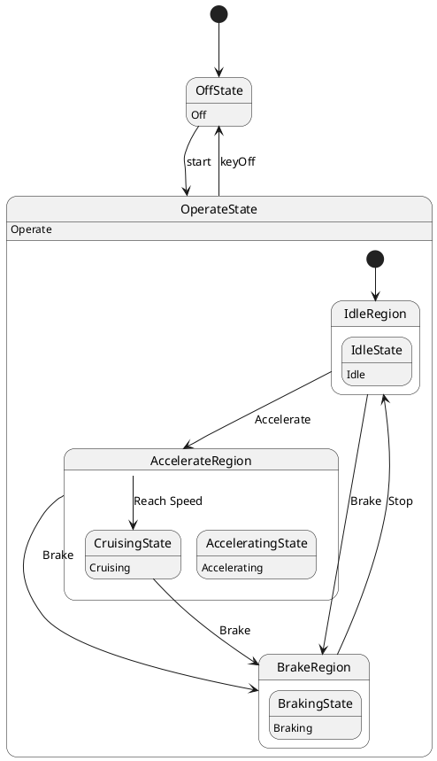

# Pair `0032`：NL + PlantUML STM0 + FCSTM STM0

[上一组 `0031`](../0031/README.md) | [返回 60 组索引](../../PAIR_INDEX.md) | [下一组 `0033`](../0033/README.md)

- LLM：`Kimi`
- 模型/场景：Hybrid Sport Utility Vehicle, HSUV
- 作者输出阶段：`Result with Semantic Checking`
- 作者输出单元格：`AE34`；Excel row：`34`
- Phase-I fallback：`false`
- 相对 Phase-I 是否变化：`true`
- Phase-I PlantUML SHA-256：`95515e5e0af74e499fafe8da9fd82fb1a94f745f719b94288e6ece5872545451`
- NL SHA-256：`9fe426ba761d5a52c3b670f35410502a5289bdd9489c4a9bfa983e34d565040c`
- PlantUML SHA-256：`27c46de7026a1e17808669ce36edee7d2d59b9033435581d56b1f0237dde7d92`
- FCSTM SHA-256：`55595caa46d6021a48d22c080a611db4e7866e5ae1496162aca73d305d406b8b`
- 结构裁决：`structure_preserved`
- source states / transitions：`9` / `10`
- mapped / blocked / silent drop：`10` / `0` / `0`
- final / lifecycle / body coverage：`0/0` / `0/0` / `6/6`
- concurrent region / separator coverage：`0/0` / `0/0`
- source normalization coverage：`0/0`
- official raw / validation：`state_diagram` / `state_diagram`
- official identity states / transitions：`9` / `10`
- official identity remaps：state `1` / transition endpoint `2`
- AST audit：`passed`
- FCSTM execution eligible：`false`
- Discover eligible：`false`
- 主 session 对读：完整对读：Operate/Idle/Accelerate/Brake 层次及 10 条边、6 个 body 全保留；官方把后置 CruisingState 绑定到 AccelerateRegion，跨层 Cruise/Brake 使用分段映射，三个空 region 缺 initial 均留债。
- 三个原始文件：[NL](./nl.txt) | [PlantUML](./plantuml.puml) | [FCSTM](./fcstm.fcstm)
- 审计入口：[canonical](../../canonical/llms_emp_feedback_final_0032.json) | [冻结 FCSTM](../../fcstm/llms_emp_feedback_final_0032.fcstm) | [case report](../../case_reports/llms_emp_feedback_final_0032.json) | [人工总账](../../MANUAL_REVIEW.md)

## 作者阶段 lineage

| stage | output cell | present | output SHA-256 | feedback | resolved |
|---|---|---|---|---|---|
| `phase_i_generation` | `I34` | `true` | `95515e5e0af74e499fafe8da9fd82fb1a94f745f719b94288e6ece5872545451` | - | - |
| `phase_ii_format` | `U34` | `true` | `c237ccacee9f024ce6e366d6ca35a54336991ae8b205880a92acff54ccef8562` | syntax error: stm [stateMachine] Device Operation [Device Operation State Machine] | YES |
| `phase_ii_grammar` | `Z34` | `false` | `-` | - | - |
| `phase_ii_semantic` | `AE34` | `true` | `27c46de7026a1e17808669ce36edee7d2d59b9033435581d56b1f0237dde7d92` | 1. missing composite state | 1.0 |

## Official identity ledger

- status：`aligned`
- canonical / official states：`9` / `9`
- aligned transition endpoints：`10`

| source-parser identity | pinned PlantUML identity | raw ref | reason |
|---|---|---|---|
| `OperateState.CruisingState` | `OperateState.AccelerateRegion.CruisingState` | `llms_emp_feedback_final_0032.puml:line:24` | `official_link_endpoint_identity` |

| transition | source before -> after | target before -> after | raw ref |
|---|---|---|---|
| `tr_0006` | `OperateState.AccelerateRegion` -> `OperateState.AccelerateRegion` | `OperateState.CruisingState` -> `OperateState.AccelerateRegion.CruisingState` | `llms_emp_feedback_final_0032.puml:line:24` |
| `tr_0008` | `OperateState.CruisingState` -> `OperateState.AccelerateRegion.CruisingState` | `OperateState.BrakeRegion` -> `OperateState.BrakeRegion` | `llms_emp_feedback_final_0032.puml:line:26` |

## Source normalization ledger

本组没有 source-input normalization。

## Concurrent region ledger

本组没有 PlantUML orthogonal/concurrent region separator。

## Operational debt

| reason code | count |
|---|---:|
| `R45.DEBT.missing_explicit_initial` | 3 |
| `R45.DEBT.opaque_state_body_semantics` | 6 |
| `R45.DEBT.opaque_transition_label_semantics` | 8 |

## NL

```text
1. Once the device is powered on, the system enters the `Operate` state, and based on user actions, it transitions between `Idle`, `Accelerating or Cruising`, and `Braking` states.
2. The system can be turned on with the `start` signal and turned off with the `keyOff` signal.
3. Within the `Operate` state, the system transitions between different substates depending on actions like accelerating, braking, or stopping.
```

## 作者 Phase-II 最终 PlantUML STM0



## 转换后 FCSTM STM0

```fcstm
state llms_emp_feedback_final_0032 named "llms_emp_feedback_final_0032" {
    event start named "start";
    event Accelerate named "Accelerate";
    event Brake named "Brake";
    event Reach_Speed named "Reach Speed";
    event Stop named "Stop";
    event keyOff named "keyOff";
    state OperateState named "OperateState\n[PlantUML body] Operate" {
        state IdleRegion named "IdleRegion" {
            state UnspecifiedInitial named "Unspecified initial";
            state IdleState named "IdleState\n[PlantUML body] Idle";
            [*] -> UnspecifiedInitial;
        }
        state AccelerateRegion named "AccelerateRegion" {
            state UnspecifiedInitial named "Unspecified initial";
            state CruisingState named "CruisingState\n[PlantUML body] Cruising";
            state AcceleratingState named "AcceleratingState\n[PlantUML body] Accelerating";
            ! * -> CruisingState : /Reach_Speed;
            CruisingState -> [*] : /Brake;
            [*] -> UnspecifiedInitial;
        }
        state BrakeRegion named "BrakeRegion" {
            state UnspecifiedInitial named "Unspecified initial";
            state BrakingState named "BrakingState\n[PlantUML body] Braking";
            [*] -> UnspecifiedInitial;
        }
        [*] -> IdleRegion;
        !IdleRegion -> AccelerateRegion : /Accelerate;
        !IdleRegion -> BrakeRegion : /Brake;
        !AccelerateRegion -> BrakeRegion : /Brake;
        AccelerateRegion -> BrakeRegion : /Brake;
        !BrakeRegion -> IdleRegion : /Stop;
    }
    state OffState named "OffState\n[PlantUML body] Off";
    [*] -> OffState;
    OffState -> OperateState : /start;
    !OperateState -> OffState : /keyOff;
}
```

[上一组 `0031`](../0031/README.md) | [返回 60 组索引](../../PAIR_INDEX.md) | [下一组 `0033`](../0033/README.md)
