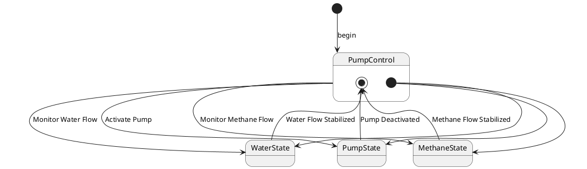

# Pair `0033`：NL + PlantUML STM0 + FCSTM STM0

[上一组 `0032`](../0032/README.md) | [返回 60 组索引](../../PAIR_INDEX.md) | [下一组 `0034`](../0034/README.md)

- LLM：`Kimi`
- 模型/场景：Pump Control state machine
- 作者输出阶段：`Result with Semantic Checking`
- 作者输出单元格：`AE35`；Excel row：`35`
- Phase-I fallback：`false`
- 相对 Phase-I 是否变化：`true`
- Phase-I PlantUML SHA-256：`a885b2b07e8c8761bd81c54e9e326daf3a2ce3138e4cae0c305ee6c9fe8145db`
- NL SHA-256：`a391765dba935d89e6d2467c97b218c0136d106ea9c00bac91e6525e28ac04f1`
- PlantUML SHA-256：`2404401116a5260b2f403016514c6c1a82cf79ed05ff8de1c92830b926dee2b0`
- FCSTM SHA-256：`db157da28b5a52f0e9f0eae8911b527c8b1d00246ccfb205b3003c670088512e`
- review subject SHA-256：`d869c69bf81f1b5aef1a576784142e6d9b8145e6a3fd8786fd11ca579e4d432d`
- working contract SHA-256：`c411914e0467e79f5c8cee9d026c495c031a64e086fe1718e72c75dfde5dda8f`
- 结构裁决：`structure_preserved`
- source states / transitions：`4` / `10`
- mapped / blocked / silent drop：`10` / `0` / `0`
- final / lifecycle / body coverage：`3/3` / `0/0` / `0/0`
- concurrent region / separator coverage：`0/0` / `0/0`
- source normalization coverage：`0/0`
- official raw / validation：`state_diagram` / `state_diagram`
- official identity states / transitions：`4` / `10`
- official identity remaps：state `0` / transition endpoint `0`
- AST audit：`passed`
- legacy whole-model FCSTM execution / Discover：`false` / `false`
- working bundle usage gate：`discover_input_with_capability_mask`
- ownership source / compiler / agent：`14` / `26` / `0`
- source macro / positive identity trace / conversion boundary trace：`10` / `14` / `0`
- capability source-static / simulation / transition-trace：`eligible_with_exclusions` / `ineligible` / `ineligible`
- compiler-only diagnostic policy：`rejected_conversion_artifact`；main-result conversion artifact limit：`0`
- 主 session 对读：`pass`；ownership/macro/capability 均为 `pass`；Case 0033 passes conversion-attribution review. This does not assert NL/PlantUML correctness or runtime equivalence; authored defects remain eligible for later source-grounded Discover. No conversion-specific blocker was found in the exact reviewed occurrences.
- source anchors：`source-ref:llms_emp_feedback_final_0033.puml:line:7\|state PumpControl {, source-ref:llms_emp_feedback_final_0033.puml:line:2\|[*] -down-> PumpControl : begin`；FCSTM anchors：`element-ref:source:state:PumpControl@line:13\|state PumpControl named "PumpControl" {, element-ref:compiler:state:llms_emp_feedback_final_0033.InitialWaittr_0001@line:9\|state InitialWaittr_0001 named "Awaiting initial event: begin";`
- 三个原始文件：[NL](./nl.txt) | [PlantUML](./plantuml.puml) | [FCSTM](./fcstm.fcstm)
- 审计入口：[canonical](../../canonical/llms_emp_feedback_final_0033.json) | [冻结 FCSTM](../../fcstm/llms_emp_feedback_final_0033.fcstm) | [case report](../../case_reports/llms_emp_feedback_final_0033.json) | [working contract](../../working_contracts/llms_emp_feedback_final_0033.json) | [source trace](../../source_traces/llms_emp_feedback_final_0033.json) | [人工总账](../../MANUAL_REVIEW.md)

## 主 session 三方语义对应

| projection | assessment | NL anchor | PlantUML anchor | FCSTM anchor | source roots | compiler members | rationale |
|---|---|---|---|---|---|---|---|
| `direct` | `preserved` | PumpControl | source-ref:llms_emp_feedback_final_0033.puml:line:7\|state PumpControl { | element-ref:source:state:PumpControl@line:13\|state PumpControl named "PumpControl" { | source:state:PumpControl | - | Case 0033 binds source:state:PumpControl to the exact authored occurrence 'state PumpControl {'; it is present as a direct FCSTM state projection with the same source identity and parent relation. |
| `macro` | `preserved_with_exclusions` | PumpControl | source-ref:llms_emp_feedback_final_0033.puml:line:2\|[*] -down-> PumpControl : begin | element-ref:compiler:state:llms_emp_feedback_final_0033.InitialWaittr_0001@line:9\|state InitialWaittr_0001 named "Awaiting initial event: begin"; | source:transition:tr_0001 | compiler:state:llms_emp_feedback_final_0033.InitialWaittr_0001 | Case 0033 binds source:transition:tr_0001 to the exact authored occurrence '[*] -down-> PumpControl : begin'; it is present as a source-owned transition root whose cited FCSTM line belongs to a protected compiler macro; the raw label remains opaque. |

## Risk occurrence 第二遍复核

| obligation | risk tag | assessment | PlantUML evidence | FCSTM evidence | ownership evidence | rationale |
|---|---|---|---|---|---|---|
| `review:multi_segment_macro:0001:tr_0001` | `multi_segment_macro` | `compiler_artifact_excluded` | source-ref:llms_emp_feedback_final_0033.puml:line:2\|[*] -down-> PumpControl : begin | element-ref:compiler:state:llms_emp_feedback_final_0033.InitialWaittr_0001@line:9\|state InitialWaittr_0001 named "Awaiting initial event: begin";, element-ref:compiler:transition_segment:tr_0001:segment:1@line:24\|[*] -> InitialWaittr_0001;, element-ref:compiler:transition_segment:tr_0001:segment:2@line:25\|InitialWaittr_0001 -> PumpControl : /begin; | compiler:state:llms_emp_feedback_final_0033.InitialWaittr_0001, compiler:transition_segment:tr_0001:segment:1, compiler:transition_segment:tr_0001:segment:2, source:transition:tr_0001 | Case 0033 risk multi_segment_macro occurrence review:multi_segment_macro:0001:tr_0001: The single authored transition remains one source-owned semantic root; all bound FCSTM segments are protected compiler artifacts and cannot become repair targets. |
| `review:final_boundary:0002:tr_0006` | `final_boundary` | `source_fact_preserved` | source-ref:llms_emp_feedback_final_0033.puml:line:9\|PumpState --> [*] : Pump Deactivated | element-ref:compiler:state:llms_emp_feedback_final_0033.InvalidFinaltr_0006@line:10\|state InvalidFinaltr_0006 named "PlantUML final boundary outside source ancestry: @final:PumpControl";, element-ref:compiler:transition_segment:tr_0006:segment:1@line:29\|PumpState -> InvalidFinaltr_0006 : /Pump_Deactivated; | compiler:state:llms_emp_feedback_final_0033.InvalidFinaltr_0006, compiler:transition_segment:tr_0006:segment:1, source:transition:tr_0006 | Case 0033 risk final_boundary occurrence review:final_boundary:0002:tr_0006: The authored PlantUML final boundary is preserved by the bound FCSTM termination macro rather than being converted into an ordinary user state. |
| `review:final_boundary:0003:tr_0008` | `final_boundary` | `source_fact_preserved` | source-ref:llms_emp_feedback_final_0033.puml:line:14\|WaterState --> [*] : Water Flow Stabilized | element-ref:compiler:state:llms_emp_feedback_final_0033.InvalidFinaltr_0008@line:11\|state InvalidFinaltr_0008 named "PlantUML final boundary outside source ancestry: @final:PumpControl";, element-ref:compiler:transition_segment:tr_0008:segment:1@line:30\|WaterState -> InvalidFinaltr_0008 : /Water_Flow_Stabilized; | compiler:state:llms_emp_feedback_final_0033.InvalidFinaltr_0008, compiler:transition_segment:tr_0008:segment:1, source:transition:tr_0008 | Case 0033 risk final_boundary occurrence review:final_boundary:0003:tr_0008: The authored PlantUML final boundary is preserved by the bound FCSTM termination macro rather than being converted into an ordinary user state. |
| `review:final_boundary:0004:tr_0010` | `final_boundary` | `source_fact_preserved` | source-ref:llms_emp_feedback_final_0033.puml:line:19\|MethaneState --> [*] : Methane Flow Stabilized | element-ref:compiler:state:llms_emp_feedback_final_0033.InvalidFinaltr_0010@line:12\|state InvalidFinaltr_0010 named "PlantUML final boundary outside source ancestry: @final:PumpControl";, element-ref:compiler:transition_segment:tr_0010:segment:1@line:31\|MethaneState -> InvalidFinaltr_0010 : /Methane_Flow_Stabilized; | compiler:state:llms_emp_feedback_final_0033.InvalidFinaltr_0010, compiler:transition_segment:tr_0010:segment:1, source:transition:tr_0010 | Case 0033 risk final_boundary occurrence review:final_boundary:0004:tr_0010: The authored PlantUML final boundary is preserved by the bound FCSTM termination macro rather than being converted into an ordinary user state. |
| `review:synthetic_state:0005:001-InitialWaittr_0001` | `synthetic_state` | `compiler_artifact_excluded` | source-ref:llms_emp_feedback_final_0033.puml:line:2\|[*] -down-> PumpControl : begin | element-ref:compiler:state:llms_emp_feedback_final_0033.InitialWaittr_0001@line:9\|state InitialWaittr_0001 named "Awaiting initial event: begin"; | compiler:state:llms_emp_feedback_final_0033.InitialWaittr_0001, source:transition:tr_0001 | Case 0033 risk synthetic_state occurrence review:synthetic_state:0005:001-InitialWaittr_0001: The helper state is a protected compiler-owned projection for a source structural fact; diagnostics on the helper itself are conversion artifacts. |
| `review:synthetic_state:0006:002-InvalidInitialtr_0005` | `synthetic_state` | `compiler_artifact_excluded` | source-ref:llms_emp_feedback_final_0033.puml:line:8\|[*] --> PumpState | element-ref:compiler:state:llms_emp_feedback_final_0033.PumpControl.InvalidInitialtr_0005@line:14\|state InvalidInitialtr_0005 named "PlantUML initial target outside child scope: PumpState"; | compiler:state:llms_emp_feedback_final_0033.PumpControl.InvalidInitialtr_0005, source:transition:tr_0005 | Case 0033 risk synthetic_state occurrence review:synthetic_state:0006:002-InvalidInitialtr_0005: The helper state is a protected compiler-owned projection for a source structural fact; diagnostics on the helper itself are conversion artifacts. |
| `review:synthetic_state:0007:003-InvalidFinaltr_0006` | `synthetic_state` | `compiler_artifact_excluded` | source-ref:llms_emp_feedback_final_0033.puml:line:9\|PumpState --> [*] : Pump Deactivated | element-ref:compiler:state:llms_emp_feedback_final_0033.InvalidFinaltr_0006@line:10\|state InvalidFinaltr_0006 named "PlantUML final boundary outside source ancestry: @final:PumpControl"; | compiler:state:llms_emp_feedback_final_0033.InvalidFinaltr_0006, source:transition:tr_0006 | Case 0033 risk synthetic_state occurrence review:synthetic_state:0007:003-InvalidFinaltr_0006: The helper state is a protected compiler-owned projection for a source structural fact; diagnostics on the helper itself are conversion artifacts. |
| `review:synthetic_state:0008:004-InvalidInitialtr_0007` | `synthetic_state` | `compiler_artifact_excluded` | source-ref:llms_emp_feedback_final_0033.puml:line:13\|[*] --> WaterState | element-ref:compiler:state:llms_emp_feedback_final_0033.PumpControl.InvalidInitialtr_0007@line:15\|state InvalidInitialtr_0007 named "PlantUML initial target outside child scope: WaterState"; | compiler:state:llms_emp_feedback_final_0033.PumpControl.InvalidInitialtr_0007, source:transition:tr_0007 | Case 0033 risk synthetic_state occurrence review:synthetic_state:0008:004-InvalidInitialtr_0007: The helper state is a protected compiler-owned projection for a source structural fact; diagnostics on the helper itself are conversion artifacts. |
| `review:synthetic_state:0009:005-InvalidFinaltr_0008` | `synthetic_state` | `compiler_artifact_excluded` | source-ref:llms_emp_feedback_final_0033.puml:line:14\|WaterState --> [*] : Water Flow Stabilized | element-ref:compiler:state:llms_emp_feedback_final_0033.InvalidFinaltr_0008@line:11\|state InvalidFinaltr_0008 named "PlantUML final boundary outside source ancestry: @final:PumpControl"; | compiler:state:llms_emp_feedback_final_0033.InvalidFinaltr_0008, source:transition:tr_0008 | Case 0033 risk synthetic_state occurrence review:synthetic_state:0009:005-InvalidFinaltr_0008: The helper state is a protected compiler-owned projection for a source structural fact; diagnostics on the helper itself are conversion artifacts. |
| `review:synthetic_state:0010:006-InvalidInitialtr_0009` | `synthetic_state` | `compiler_artifact_excluded` | source-ref:llms_emp_feedback_final_0033.puml:line:18\|[*] --> MethaneState | element-ref:compiler:state:llms_emp_feedback_final_0033.PumpControl.InvalidInitialtr_0009@line:16\|state InvalidInitialtr_0009 named "PlantUML initial target outside child scope: MethaneState"; | compiler:state:llms_emp_feedback_final_0033.PumpControl.InvalidInitialtr_0009, source:transition:tr_0009 | Case 0033 risk synthetic_state occurrence review:synthetic_state:0010:006-InvalidInitialtr_0009: The helper state is a protected compiler-owned projection for a source structural fact; diagnostics on the helper itself are conversion artifacts. |
| `review:synthetic_state:0011:007-InvalidFinaltr_0010` | `synthetic_state` | `compiler_artifact_excluded` | source-ref:llms_emp_feedback_final_0033.puml:line:19\|MethaneState --> [*] : Methane Flow Stabilized | element-ref:compiler:state:llms_emp_feedback_final_0033.InvalidFinaltr_0010@line:12\|state InvalidFinaltr_0010 named "PlantUML final boundary outside source ancestry: @final:PumpControl"; | compiler:state:llms_emp_feedback_final_0033.InvalidFinaltr_0010, source:transition:tr_0010 | Case 0033 risk synthetic_state occurrence review:synthetic_state:0011:007-InvalidFinaltr_0010: The helper state is a protected compiler-owned projection for a source structural fact; diagnostics on the helper itself are conversion artifacts. |
| `review:explicit_concurrency:0012:001-multiple_initial_fanout` | `explicit_concurrency` | `capability_excluded` | source-ref:llms_emp_feedback_final_0033.puml:line:13\|[*] --> WaterState, source-ref:llms_emp_feedback_final_0033.puml:line:18\|[*] --> MethaneState, source-ref:llms_emp_feedback_final_0033.puml:line:8\|[*] --> PumpState | element-ref:compiler:state:llms_emp_feedback_final_0033.PumpControl.InvalidInitialtr_0005@line:14\|state InvalidInitialtr_0005 named "PlantUML initial target outside child scope: PumpState";, element-ref:compiler:state:llms_emp_feedback_final_0033.PumpControl.InvalidInitialtr_0007@line:15\|state InvalidInitialtr_0007 named "PlantUML initial target outside child scope: WaterState";, element-ref:compiler:state:llms_emp_feedback_final_0033.PumpControl.InvalidInitialtr_0009@line:16\|state InvalidInitialtr_0009 named "PlantUML initial target outside child scope: MethaneState"; | source:transition:tr_0005, source:transition:tr_0007, source:transition:tr_0009 | Case 0033 risk explicit_concurrency occurrence review:explicit_concurrency:0012:001-multiple_initial_fanout: The authored concurrency occurrence remains visible, but the FCSTM projection does not claim fork/join product semantics and is excluded from runtime evidence. |

## 作者阶段 lineage

| stage | output cell | present | output SHA-256 | feedback | resolved |
|---|---|---|---|---|---|
| `phase_i_generation` | `I35` | `true` | `a885b2b07e8c8761bd81c54e9e326daf3a2ce3138e4cae0c305ee6c9fe8145db` | - | - |
| `phase_ii_format` | `U35` | `true` | `5e51641b5f8d11dbdce671c2e5ea1dbb1c7ce494e3850c78268f39677bad7768` | syntax error: stm PumpControlSystem { | YES |
| `phase_ii_grammar` | `Z35` | `false` | `-` | - | - |
| `phase_ii_semantic` | `AE35` | `true` | `2404401116a5260b2f403016514c6c1a82cf79ed05ff8de1c92830b926dee2b0` | 1. missing regions | 1.0 |

## Official identity ledger

- status：`aligned`
- canonical / official states：`4` / `4`
- aligned transition endpoints：`10`

本组 state identity 无需重映射。

本组 transition endpoint 无需重映射。

## Source normalization ledger

本组没有 source-input normalization。

## Concurrent region ledger

本组没有 PlantUML orthogonal/concurrent region separator。

## Operational debt

| reason code | count |
|---|---:|
| `R45.DEBT.invalid_source_final_scope` | 3 |
| `R45.DEBT.invalid_source_initial_target` | 3 |
| `R45.DEBT.multiple_initial_fanout` | 1 |
| `R45.DEBT.opaque_transition_label_semantics` | 7 |

## NL

```text
1. The system begins in the PumpControl state, from which it can transition to different substates based on specific conditions.
2. Within the PumpControl state, there are three main substates: PumpState, WaterState, and MethaneState.
3. The system first transitions to the PumpState substate, where the pump is activated or controlled.
4. The system can also transition to the WaterState substate, indicating that the pump is controlling or monitoring the water flow.
5. Similarly, the system can transition to the MethaneState substate, indicating that the pump is controlling or monitoring the methane flow.
```

## 作者 Phase-II 最终 PlantUML STM0



## 转换后 FCSTM STM0

```fcstm
state llms_emp_feedback_final_0033 named "llms_emp_feedback_final_0033" {
    event begin named "begin";
    event Activate_Pump named "Activate Pump";
    event Monitor_Water_Flow named "Monitor Water Flow";
    event Monitor_Methane_Flow named "Monitor Methane Flow";
    event Pump_Deactivated named "Pump Deactivated";
    event Water_Flow_Stabilized named "Water Flow Stabilized";
    event Methane_Flow_Stabilized named "Methane Flow Stabilized";
    state InitialWaittr_0001 named "Awaiting initial event: begin";
    state InvalidFinaltr_0006 named "PlantUML final boundary outside source ancestry: @final:PumpControl";
    state InvalidFinaltr_0008 named "PlantUML final boundary outside source ancestry: @final:PumpControl";
    state InvalidFinaltr_0010 named "PlantUML final boundary outside source ancestry: @final:PumpControl";
    state PumpControl named "PumpControl" {
        state InvalidInitialtr_0005 named "PlantUML initial target outside child scope: PumpState";
        state InvalidInitialtr_0007 named "PlantUML initial target outside child scope: WaterState";
        state InvalidInitialtr_0009 named "PlantUML initial target outside child scope: MethaneState";
        [*] -> InvalidInitialtr_0005;
        [*] -> InvalidInitialtr_0007;
        [*] -> InvalidInitialtr_0009;
    }
    state PumpState named "PumpState";
    state WaterState named "WaterState";
    state MethaneState named "MethaneState";
    [*] -> InitialWaittr_0001;
    InitialWaittr_0001 -> PumpControl : /begin;
    !PumpControl -> PumpState : /Activate_Pump;
    !PumpControl -> WaterState : /Monitor_Water_Flow;
    !PumpControl -> MethaneState : /Monitor_Methane_Flow;
    PumpState -> InvalidFinaltr_0006 : /Pump_Deactivated;
    WaterState -> InvalidFinaltr_0008 : /Water_Flow_Stabilized;
    MethaneState -> InvalidFinaltr_0010 : /Methane_Flow_Stabilized;
}
```

[上一组 `0032`](../0032/README.md) | [返回 60 组索引](../../PAIR_INDEX.md) | [下一组 `0034`](../0034/README.md)
