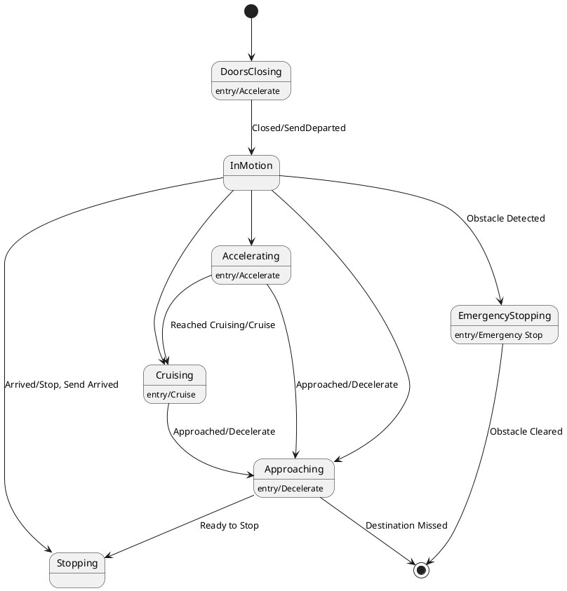

# Pair `0034`：NL + PlantUML STM0 + FCSTM STM0

[上一组 `0033`](../0033/README.md) | [返回 60 组索引](../../PAIR_INDEX.md) | [下一组 `0035`](../0035/README.md)

- LLM：`Kimi`
- 模型/场景：state machine for Train Control
- 作者输出阶段：`Result with Semantic Checking`
- 作者输出单元格：`AE36`；Excel row：`36`
- Phase-I fallback：`false`
- 相对 Phase-I 是否变化：`true`
- Phase-I PlantUML SHA-256：`47368dce1df97e572f9709094956208acb6532b92405a125582d2b538b3fe283`
- NL SHA-256：`3110cbcf15bfb507f0326965970888eada5541b791b5fa661698dfc74e82c2ce`
- PlantUML SHA-256：`7b8702713b8df8f9d419d808632d39871052f2f9d179f3fbfd01f3d133856d11`
- FCSTM SHA-256：`603cbd9f06b3ce7e91bf30a9410cffde846e2dae0da2eda8c794844b7601105d`
- review subject SHA-256：`eb4242a26f545717ffff244d93d1857d81b9a105536f6c7993df70d15cf87cab`
- working contract SHA-256：`9305f5e279885921a1aa335958415c4cc2607bcdd5838bcf728b04b5dd25bb63`
- 结构裁决：`structure_preserved`
- source states / transitions：`7` / `13`
- mapped / blocked / silent drop：`13` / `0` / `0`
- final / lifecycle / body coverage：`2/2` / `5/5` / `0/0`
- concurrent region / separator coverage：`0/0` / `0/0`
- source normalization coverage：`0/0`
- official raw / validation：`state_diagram` / `state_diagram`
- official identity states / transitions：`7` / `13`
- official identity remaps：state `0` / transition endpoint `0`
- AST audit：`passed`
- legacy whole-model FCSTM execution / Discover：`false` / `false`
- working bundle usage gate：`discover_input_with_capability_mask`
- ownership source / compiler / agent：`25` / `37` / `0`
- source macro / positive identity trace / conversion boundary trace：`18` / `25` / `0`
- capability source-static / simulation / transition-trace：`eligible_with_exclusions` / `ineligible` / `ineligible`
- compiler-only diagnostic policy：`rejected_conversion_artifact`；main-result conversion artifact limit：`0`
- 主 session 对读：`pass`；ownership/macro/capability 均为 `pass`；Case 0034 passes conversion-attribution review. This does not assert NL/PlantUML correctness or runtime equivalence; authored defects remain eligible for later source-grounded Discover. No conversion-specific blocker was found in the exact reviewed occurrences.
- source anchors：`source-ref:llms_emp_feedback_final_0034.puml:line:2\|[*] --> DoorsClosing, source-ref:llms_emp_feedback_final_0034.puml:line:5\|DoorsClosing --> InMotion : Closed/SendDeparted`；FCSTM anchors：`element-ref:source:state:DoorsClosing@line:10\|state DoorsClosing named "DoorsClosing" {, element-ref:compiler:transition_segment:tr_0002:segment:1@line:38\|!DoorsClosing -> InMotion : /Closed_SendDeparted;`
- 三个原始文件：[NL](./nl.txt) | [PlantUML](./plantuml.puml) | [FCSTM](./fcstm.fcstm)
- 审计入口：[canonical](../../canonical/llms_emp_feedback_final_0034.json) | [冻结 FCSTM](../../fcstm/llms_emp_feedback_final_0034.fcstm) | [case report](../../case_reports/llms_emp_feedback_final_0034.json) | [working contract](../../working_contracts/llms_emp_feedback_final_0034.json) | [source trace](../../source_traces/llms_emp_feedback_final_0034.json) | [人工总账](../../MANUAL_REVIEW.md)

## 主 session 三方语义对应

| projection | assessment | NL anchor | PlantUML anchor | FCSTM anchor | source roots | compiler members | rationale |
|---|---|---|---|---|---|---|---|
| `direct` | `preserved` | DoorsClosing | source-ref:llms_emp_feedback_final_0034.puml:line:2\|[*] --> DoorsClosing | element-ref:source:state:DoorsClosing@line:10\|state DoorsClosing named "DoorsClosing" { | source:state:DoorsClosing | - | Case 0034 binds source:state:DoorsClosing to the exact authored occurrence '[*] --> DoorsClosing'; it is present as a direct FCSTM state projection with the same source identity and parent relation. |
| `macro` | `preserved_with_exclusions` | Closed/SendDeparted | source-ref:llms_emp_feedback_final_0034.puml:line:5\|DoorsClosing --> InMotion : Closed/SendDeparted | element-ref:compiler:transition_segment:tr_0002:segment:1@line:38\|!DoorsClosing -> InMotion : /Closed_SendDeparted; | source:transition:tr_0002 | compiler:transition_segment:tr_0002:segment:1 | Case 0034 binds source:transition:tr_0002 to the exact authored occurrence 'DoorsClosing --> InMotion : Closed/SendDeparted'; it is present as a source-owned transition root whose cited FCSTM line belongs to a protected compiler macro; the raw label remains opaque. |

## Risk occurrence 第二遍复核

| obligation | risk tag | assessment | PlantUML evidence | FCSTM evidence | ownership evidence | rationale |
|---|---|---|---|---|---|---|
| `review:final_boundary:0001:tr_0005` | `final_boundary` | `source_fact_preserved` | source-ref:llms_emp_feedback_final_0034.puml:line:11\|EmergencyStopping --> [*] : Obstacle Cleared | element-ref:compiler:transition_segment:tr_0005:segment:1@line:41\|!EmergencyStopping -> [*] : /Obstacle_Cleared; | compiler:transition_segment:tr_0005:segment:1, source:transition:tr_0005 | Case 0034 risk final_boundary occurrence review:final_boundary:0001:tr_0005: The authored PlantUML final boundary is preserved by the bound FCSTM termination macro rather than being converted into an ordinary user state. |
| `review:final_boundary:0002:tr_0013` | `final_boundary` | `source_fact_preserved` | source-ref:llms_emp_feedback_final_0034.puml:line:25\|Approaching --> [*] : Destination Missed | element-ref:compiler:transition_segment:tr_0013:segment:1@line:49\|!Approaching -> [*] : /Destination_Missed; | compiler:transition_segment:tr_0013:segment:1, source:transition:tr_0013 | Case 0034 risk final_boundary occurrence review:final_boundary:0002:tr_0013: The authored PlantUML final boundary is preserved by the bound FCSTM termination macro rather than being converted into an ordinary user state. |
| `review:synthetic_state:0003:001-LifecycleActive` | `synthetic_state` | `compiler_artifact_excluded` | source-ref:llms_emp_feedback_final_0034.puml:line:2\|[*] --> DoorsClosing | element-ref:compiler:state:llms_emp_feedback_final_0034.DoorsClosing.LifecycleActive@line:12\|state LifecycleActive named "Active body of DoorsClosing";, element-ref:source:state:DoorsClosing@line:10\|state DoorsClosing named "DoorsClosing" { | compiler:state:llms_emp_feedback_final_0034.DoorsClosing.LifecycleActive, source:state:DoorsClosing | Case 0034 risk synthetic_state occurrence review:synthetic_state:0003:001-LifecycleActive: The helper state is a protected compiler-owned projection for a source structural fact; diagnostics on the helper itself are conversion artifacts. |
| `review:synthetic_state:0004:002-LifecycleActive` | `synthetic_state` | `compiler_artifact_excluded` | source-ref:llms_emp_feedback_final_0034.puml:line:8\|InMotion --> EmergencyStopping : Obstacle Detected | element-ref:compiler:state:llms_emp_feedback_final_0034.EmergencyStopping.LifecycleActive@line:19\|state LifecycleActive named "Active body of EmergencyStopping";, element-ref:source:state:EmergencyStopping@line:17\|state EmergencyStopping named "EmergencyStopping" { | compiler:state:llms_emp_feedback_final_0034.EmergencyStopping.LifecycleActive, source:state:EmergencyStopping | Case 0034 risk synthetic_state occurrence review:synthetic_state:0004:002-LifecycleActive: The helper state is a protected compiler-owned projection for a source structural fact; diagnostics on the helper itself are conversion artifacts. |
| `review:synthetic_state:0005:003-LifecycleActive` | `synthetic_state` | `compiler_artifact_excluded` | source-ref:llms_emp_feedback_final_0034.puml:line:13\|InMotion --> Accelerating | element-ref:compiler:state:llms_emp_feedback_final_0034.Accelerating.LifecycleActive@line:24\|state LifecycleActive named "Active body of Accelerating";, element-ref:source:state:Accelerating@line:22\|state Accelerating named "Accelerating" { | compiler:state:llms_emp_feedback_final_0034.Accelerating.LifecycleActive, source:state:Accelerating | Case 0034 risk synthetic_state occurrence review:synthetic_state:0005:003-LifecycleActive: The helper state is a protected compiler-owned projection for a source structural fact; diagnostics on the helper itself are conversion artifacts. |
| `review:synthetic_state:0006:004-LifecycleActive` | `synthetic_state` | `compiler_artifact_excluded` | source-ref:llms_emp_feedback_final_0034.puml:line:15\|Accelerating --> Cruising : Reached Cruising/Cruise | element-ref:compiler:state:llms_emp_feedback_final_0034.Cruising.LifecycleActive@line:29\|state LifecycleActive named "Active body of Cruising";, element-ref:source:state:Cruising@line:27\|state Cruising named "Cruising" { | compiler:state:llms_emp_feedback_final_0034.Cruising.LifecycleActive, source:state:Cruising | Case 0034 risk synthetic_state occurrence review:synthetic_state:0006:004-LifecycleActive: The helper state is a protected compiler-owned projection for a source structural fact; diagnostics on the helper itself are conversion artifacts. |
| `review:synthetic_state:0007:005-LifecycleActive` | `synthetic_state` | `compiler_artifact_excluded` | source-ref:llms_emp_feedback_final_0034.puml:line:16\|Accelerating --> Approaching : Approached/Decelerate | element-ref:compiler:state:llms_emp_feedback_final_0034.Approaching.LifecycleActive@line:34\|state LifecycleActive named "Active body of Approaching";, element-ref:source:state:Approaching@line:32\|state Approaching named "Approaching" { | compiler:state:llms_emp_feedback_final_0034.Approaching.LifecycleActive, source:state:Approaching | Case 0034 risk synthetic_state occurrence review:synthetic_state:0007:005-LifecycleActive: The helper state is a protected compiler-owned projection for a source structural fact; diagnostics on the helper itself are conversion artifacts. |
| `review:lifecycle:0008:001-DoorsClosing` | `lifecycle` | `capability_excluded` | source-ref:llms_emp_feedback_final_0034.puml:line:4\|DoorsClosing : entry/Accelerate | element-ref:compiler:lifecycle_action:DoorsClosing:1:Accelerate@line:11\|enter abstract Accelerate; | compiler:lifecycle_action:DoorsClosing:1:Accelerate, source:lifecycle:DoorsClosing:1 | Case 0034 risk lifecycle occurrence review:lifecycle:0008:001-DoorsClosing: The authored entry/do/exit occurrence retains its owner, lifecycle kind, action identity, and abstract FCSTM hook, without claiming runtime equivalence. |
| `review:lifecycle:0009:002-EmergencyStopping` | `lifecycle` | `capability_excluded` | source-ref:llms_emp_feedback_final_0034.puml:line:10\|EmergencyStopping : entry/Emergency Stop | element-ref:compiler:lifecycle_action:EmergencyStopping:2:EmergencyStop@line:18\|enter abstract EmergencyStop; | compiler:lifecycle_action:EmergencyStopping:2:EmergencyStop, source:lifecycle:EmergencyStopping:2 | Case 0034 risk lifecycle occurrence review:lifecycle:0009:002-EmergencyStopping: The authored entry/do/exit occurrence retains its owner, lifecycle kind, action identity, and abstract FCSTM hook, without claiming runtime equivalence. |
| `review:lifecycle:0010:003-Accelerating` | `lifecycle` | `capability_excluded` | source-ref:llms_emp_feedback_final_0034.puml:line:14\|Accelerating : entry/Accelerate | element-ref:compiler:lifecycle_action:Accelerating:3:Accelerate@line:23\|enter abstract Accelerate; | compiler:lifecycle_action:Accelerating:3:Accelerate, source:lifecycle:Accelerating:3 | Case 0034 risk lifecycle occurrence review:lifecycle:0010:003-Accelerating: The authored entry/do/exit occurrence retains its owner, lifecycle kind, action identity, and abstract FCSTM hook, without claiming runtime equivalence. |
| `review:lifecycle:0011:004-Cruising` | `lifecycle` | `capability_excluded` | source-ref:llms_emp_feedback_final_0034.puml:line:19\|Cruising : entry/Cruise | element-ref:compiler:lifecycle_action:Cruising:4:Cruise@line:28\|enter abstract Cruise; | compiler:lifecycle_action:Cruising:4:Cruise, source:lifecycle:Cruising:4 | Case 0034 risk lifecycle occurrence review:lifecycle:0011:004-Cruising: The authored entry/do/exit occurrence retains its owner, lifecycle kind, action identity, and abstract FCSTM hook, without claiming runtime equivalence. |
| `review:lifecycle:0012:005-Approaching` | `lifecycle` | `capability_excluded` | source-ref:llms_emp_feedback_final_0034.puml:line:23\|Approaching : entry/Decelerate | element-ref:compiler:lifecycle_action:Approaching:5:Decelerate@line:33\|enter abstract Decelerate; | compiler:lifecycle_action:Approaching:5:Decelerate, source:lifecycle:Approaching:5 | Case 0034 risk lifecycle occurrence review:lifecycle:0012:005-Approaching: The authored entry/do/exit occurrence retains its owner, lifecycle kind, action identity, and abstract FCSTM hook, without claiming runtime equivalence. |
| `review:explicit_concurrency:0013:001-ambiguous_unlabeled_fanout` | `explicit_concurrency` | `capability_excluded` | source-ref:llms_emp_feedback_final_0034.puml:line:13\|InMotion --> Accelerating, source-ref:llms_emp_feedback_final_0034.puml:line:18\|InMotion --> Cruising, source-ref:llms_emp_feedback_final_0034.puml:line:22\|InMotion --> Approaching, source-ref:llms_emp_feedback_final_0034.puml:line:5\|DoorsClosing --> InMotion : Closed/SendDeparted | element-ref:compiler:transition_segment:tr_0006:segment:1@line:42\|InMotion -> Accelerating;, element-ref:compiler:transition_segment:tr_0009:segment:1@line:45\|InMotion -> Cruising;, element-ref:compiler:transition_segment:tr_0011:segment:1@line:47\|InMotion -> Approaching;, element-ref:source:state:InMotion@line:15\|state InMotion named "InMotion"; | source:state:InMotion, source:transition:tr_0006, source:transition:tr_0009, source:transition:tr_0011 | Case 0034 risk explicit_concurrency occurrence review:explicit_concurrency:0013:001-ambiguous_unlabeled_fanout: The authored concurrency occurrence remains visible, but the FCSTM projection does not claim fork/join product semantics and is excluded from runtime evidence. |

## 作者阶段 lineage

| stage | output cell | present | output SHA-256 | feedback | resolved |
|---|---|---|---|---|---|
| `phase_i_generation` | `I36` | `true` | `47368dce1df97e572f9709094956208acb6532b92405a125582d2b538b3fe283` | - | - |
| `phase_ii_format` | `U36` | `true` | `697e6a22abedd11fce067c44f4fec67b6ffe1c37a833cb1acef019c33d22acd6` | 1. syntax error: stm TrainStateMachine { | YES |
| `phase_ii_grammar` | `Z36` | `false` | `-` | - | - |
| `phase_ii_semantic` | `AE36` | `true` | `7b8702713b8df8f9d419d808632d39871052f2f9d179f3fbfd01f3d133856d11` | 1. missing composite state | - |

## Official identity ledger

- status：`aligned`
- canonical / official states：`7` / `7`
- aligned transition endpoints：`13`

本组 state identity 无需重映射。

本组 transition endpoint 无需重映射。

## Source normalization ledger

本组没有 source-input normalization。

## Concurrent region ledger

本组没有 PlantUML orthogonal/concurrent region separator。

## Operational debt

| reason code | count |
|---|---:|
| `R45.DEBT.ambiguous_unlabeled_fanout` | 1 |
| `R45.DEBT.opaque_transition_label_semantics` | 9 |

## NL

```text
1. The system starts in the DoorsClosing state and transitions to InMotion when the doors are closed, triggered by the "Closed/SendDeparted" signal.
2. In the InMotion state, the system can either transition to the Stopping state when it arrives, indicated by the "Arrived/Stop, Send Arrived" signal, or to the EmergencyStopping state if an obstacle is detected.
3. When an obstacle is detected, the system enters the EmergencyStopping state, which includes the actions "Emergency Stop" and sends the "Obstacle Detected" signal.
4. Within the InMotion state, the system operates in three substates: Accelerating, Cruising, and Approaching, which represent different phases of the train's motion.
5. The system begins in the Accelerating substate, moving to the Cruising substate once cruising speed is reached, as indicated by the "Reached Cruising/Cruise" signal.
6. If the system is in the Accelerating substate and approaches its destination, it transitions to the Approaching substate upon receiving the "Approached/Decelerate" signal.
7. The system in the Cruising substate transitions to the Approaching substate when it approaches the destination, triggered by the "Approached/Decelerate" signal.
8. The system enters the Accelerating substate when motion begins, marked by the "Entry/Accelerate" action.
9. In the Approaching substate, the system sends the "Send" signal and continues to approach the destination.
10. The system remains in the Approaching substate while nearing the destination, until it is ready to stop or decelerate.
```

## 作者 Phase-II 最终 PlantUML STM0



## 转换后 FCSTM STM0

```fcstm
state llms_emp_feedback_final_0034 named "llms_emp_feedback_final_0034" {
    event Closed_SendDeparted named "Closed/SendDeparted";
    event Arrived_Stop_Send_Arrived named "Arrived/Stop, Send Arrived";
    event Obstacle_Detected named "Obstacle Detected";
    event Obstacle_Cleared named "Obstacle Cleared";
    event Reached_Cruising_Cruise named "Reached Cruising/Cruise";
    event Approached_Decelerate named "Approached/Decelerate";
    event Ready_to_Stop named "Ready to Stop";
    event Destination_Missed named "Destination Missed";
    state DoorsClosing named "DoorsClosing" {
        enter abstract Accelerate;
        state LifecycleActive named "Active body of DoorsClosing";
        [*] -> LifecycleActive;
    }
    state InMotion named "InMotion";
    state Stopping named "Stopping";
    state EmergencyStopping named "EmergencyStopping" {
        enter abstract EmergencyStop;
        state LifecycleActive named "Active body of EmergencyStopping";
        [*] -> LifecycleActive;
    }
    state Accelerating named "Accelerating" {
        enter abstract Accelerate;
        state LifecycleActive named "Active body of Accelerating";
        [*] -> LifecycleActive;
    }
    state Cruising named "Cruising" {
        enter abstract Cruise;
        state LifecycleActive named "Active body of Cruising";
        [*] -> LifecycleActive;
    }
    state Approaching named "Approaching" {
        enter abstract Decelerate;
        state LifecycleActive named "Active body of Approaching";
        [*] -> LifecycleActive;
    }
    [*] -> DoorsClosing;
    !DoorsClosing -> InMotion : /Closed_SendDeparted;
    InMotion -> Stopping : /Arrived_Stop_Send_Arrived;
    InMotion -> EmergencyStopping : /Obstacle_Detected;
    !EmergencyStopping -> [*] : /Obstacle_Cleared;
    InMotion -> Accelerating;
    !Accelerating -> Cruising : /Reached_Cruising_Cruise;
    !Accelerating -> Approaching : /Approached_Decelerate;
    InMotion -> Cruising;
    !Cruising -> Approaching : /Approached_Decelerate;
    InMotion -> Approaching;
    !Approaching -> Stopping : /Ready_to_Stop;
    !Approaching -> [*] : /Destination_Missed;
}
```

[上一组 `0033`](../0033/README.md) | [返回 60 组索引](../../PAIR_INDEX.md) | [下一组 `0035`](../0035/README.md)
