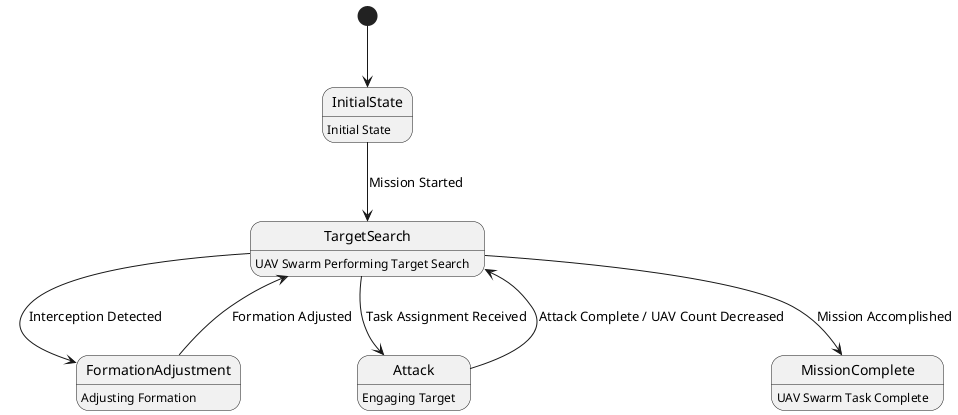

# Pair `0036`：NL + PlantUML STM0 + FCSTM STM0

[上一组 `0035`](../0035/README.md) | [返回 60 组索引](../../PAIR_INDEX.md) | [下一组 `0037`](../0037/README.md)

- LLM：`Kimi`
- 模型/场景：UAV swarm state machine diagram
- NL SHA-256：`a01c022f5380700b6c13800497291640b4d64abbadce1d8984be0c14880ebeb3`
- PlantUML SHA-256：`45c41ca247c3aa1603b8fdf0aea89013d27ab65071f2932dd4c4149a4681aa5b`
- FCSTM SHA-256：`fea8159c1273766073718d6346f83c46784c3eb1d45e1eb504a04b25613e9882`
- 结构裁决：`structure_preserved`
- FCSTM execution eligible：`false`
- Discover eligible：`false`
- 主 session 对读：UAV 5 state、7 edge 与 slash label/body 齐。
- 三个原始文件：[NL](./nl.txt) | [PlantUML](./plantuml.puml) | [FCSTM](./fcstm.fcstm)
- 审计入口：[canonical](../../canonical/llms_emp_stm_results_0036.json) | [冻结 FCSTM](../../fcstm/llms_emp_stm_results_0036.fcstm) | [case report](../../case_reports/llms_emp_stm_results_0036.json) | [人工总账](../../MANUAL_REVIEW.md)

## NL

```text
1 This state machine model describes the state transitions of a UAV swarm.
2 Before the mission is completed, the UAV swarm continuously performs target search tasks, during which it operates within three different state areas.
3 When the UAV swarm is intercepted, it transitions to the formation adjustment state.
4 During flight, if task assignment information is received, it enters the attack state. After completing the attack, the number of UAVs in the swarm decreases accordingly.
```

## 原装 PlantUML STM0



## 转换后 FCSTM STM0

```fcstm
state llms_emp_stm_results_0036 named "llms_emp_stm_results_0036" {
    event Mission_Started named "Mission Started";
    event Interception_Detected named "Interception Detected";
    event Task_Assignment_Received named "Task Assignment Received";
    event Attack_Complete_UAV_Count_Decreased named "Attack Complete / UAV Count Decreased";
    event Formation_Adjusted named "Formation Adjusted";
    event Mission_Accomplished named "Mission Accomplished";
    state InitialState named "InitialState\n[PlantUML body] Initial State";
    state TargetSearch named "TargetSearch\n[PlantUML body] UAV Swarm Performing Target Search";
    state FormationAdjustment named "FormationAdjustment\n[PlantUML body] Adjusting Formation";
    state Attack named "Attack\n[PlantUML body] Engaging Target";
    state MissionComplete named "MissionComplete\n[PlantUML body] UAV Swarm Task Complete";
    [*] -> InitialState;
    InitialState -> TargetSearch : /Mission_Started;
    TargetSearch -> FormationAdjustment : /Interception_Detected;
    TargetSearch -> Attack : /Task_Assignment_Received;
    Attack -> TargetSearch : /Attack_Complete_UAV_Count_Decreased;
    FormationAdjustment -> TargetSearch : /Formation_Adjusted;
    TargetSearch -> MissionComplete : /Mission_Accomplished;
}
```

[上一组 `0035`](../0035/README.md) | [返回 60 组索引](../../PAIR_INDEX.md) | [下一组 `0037`](../0037/README.md)
