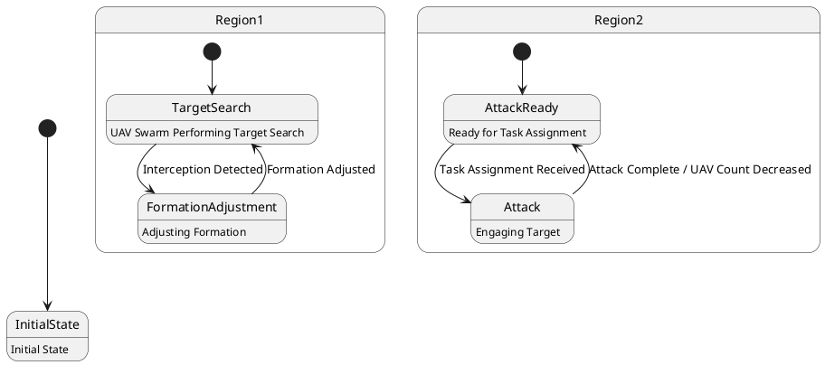

# Pair `0036`：NL + PlantUML STM0 + FCSTM STM0

[上一组 `0035`](../0035/README.md) | [返回 60 组索引](../../PAIR_INDEX.md) | [下一组 `0037`](../0037/README.md)

- LLM：`Kimi`
- 模型/场景：UAV swarm state machine diagram
- 作者输出阶段：`Result with Semantic Checking`
- 作者输出单元格：`AE38`；Excel row：`38`
- Phase-I fallback：`false`
- 相对 Phase-I 是否变化：`true`
- Phase-I PlantUML SHA-256：`45c41ca247c3aa1603b8fdf0aea89013d27ab65071f2932dd4c4149a4681aa5b`
- NL SHA-256：`a01c022f5380700b6c13800497291640b4d64abbadce1d8984be0c14880ebeb3`
- PlantUML SHA-256：`40269ab0cd2880edbb34aab10a8713971f4c7238530bdb249f19ec4745f02d46`
- FCSTM SHA-256：`14e370fd444c97d4950844ba035ea5c47d85d9003b25fa0312f765840003e3a2`
- 结构裁决：`structure_preserved`
- source states / transitions：`7` / `7`
- mapped / blocked / silent drop：`7` / `0` / `0`
- final / lifecycle / body coverage：`0/0` / `0/0` / `5/5`
- concurrent region / separator coverage：`3/3` / `2/2`
- source normalization coverage：`0/0`
- official raw / validation：`state_diagram` / `state_diagram`
- official identity states / transitions：`7` / `7`
- official identity remaps：state `0` / transition endpoint `0`
- AST audit：`passed`
- FCSTM execution eligible：`false`
- Discover eligible：`false`
- 主 session 对读：完整对读：root InitialState、Region1 搜索/编队链和 Region2 攻击链共 7 状态、7 边、5 个 body 均保留；两个 root separator 精确记录 3-region 并发事实，斜杠标签未擅自拆 effect。
- 三个原始文件：[NL](./nl.txt) | [PlantUML](./plantuml.puml) | [FCSTM](./fcstm.fcstm)
- 审计入口：[canonical](../../canonical/llms_emp_feedback_final_0036.json) | [冻结 FCSTM](../../fcstm/llms_emp_feedback_final_0036.fcstm) | [case report](../../case_reports/llms_emp_feedback_final_0036.json) | [人工总账](../../MANUAL_REVIEW.md)

## 作者阶段 lineage

| stage | output cell | present | output SHA-256 | feedback | resolved |
|---|---|---|---|---|---|
| `phase_i_generation` | `I38` | `true` | `45c41ca247c3aa1603b8fdf0aea89013d27ab65071f2932dd4c4149a4681aa5b` | - | - |
| `phase_ii_format` | `U38` | `false` | `-` | - | - |
| `phase_ii_grammar` | `Z38` | `false` | `-` | - | - |
| `phase_ii_semantic` | `AE38` | `true` | `40269ab0cd2880edbb34aab10a8713971f4c7238530bdb249f19ec4745f02d46` | 1. mising regions | 1.0 |

## Official identity ledger

- status：`aligned`
- canonical / official states：`7` / `7`
- aligned transition endpoints：`7`

本组 state identity 无需重映射。

本组 transition endpoint 无需重映射。

## Source normalization ledger

本组没有 source-input normalization。

## Concurrent region ledger

| owner | region | direct states | direct transitions | separator before | separator after |
|---|---:|---|---|---|---|
| `__root__` | 0 | InitialState | tr_0001 | - | llms_emp_feedback_final_0036.puml:line:5 |
| `__root__` | 1 | Region1 | - | llms_emp_feedback_final_0036.puml:line:5 | llms_emp_feedback_final_0036.puml:line:17 |
| `__root__` | 2 | Region2 | - | llms_emp_feedback_final_0036.puml:line:17 | - |

## Operational debt

| reason code | count |
|---|---:|
| `R45.DEBT.concurrent_region_semantics` | 1 |
| `R45.DEBT.opaque_state_body_semantics` | 5 |
| `R45.DEBT.opaque_transition_label_semantics` | 4 |

## NL

```text
1 This state machine model describes the state transitions of a UAV swarm.
2 Before the mission is completed, the UAV swarm continuously performs target search tasks, during which it operates within three different state areas.
3 When the UAV swarm is intercepted, it transitions to the formation adjustment state.
4 During flight, if task assignment information is received, it enters the attack state. After completing the attack, the number of UAVs in the swarm decreases accordingly.
```

## 作者 Phase-II 最终 PlantUML STM0



## 转换后 FCSTM STM0

```fcstm
state llms_emp_feedback_final_0036 named "llms_emp_feedback_final_0036\n[PlantUML concurrent region 0] states=InitialState; transitions=tr_0001\n[PlantUML concurrent region 1] states=Region1; transitions=-\n[PlantUML concurrent region 2] states=Region2; transitions=-\n[PlantUML concurrent separator] region 0 -> 1 at llms_emp_feedback_final_0036.puml:line:5\n[PlantUML concurrent separator] region 1 -> 2 at llms_emp_feedback_final_0036.puml:line:17" {
    event Interception_Detected named "Interception Detected";
    event Formation_Adjusted named "Formation Adjusted";
    event Task_Assignment_Received named "Task Assignment Received";
    event Attack_Complete_UAV_Count_Decreased named "Attack Complete / UAV Count Decreased";
    state Region1 named "Region1" {
        state TargetSearch named "TargetSearch\n[PlantUML body] UAV Swarm Performing Target Search";
        state FormationAdjustment named "FormationAdjustment\n[PlantUML body] Adjusting Formation";
        [*] -> TargetSearch;
        TargetSearch -> FormationAdjustment : /Interception_Detected;
        FormationAdjustment -> TargetSearch : /Formation_Adjusted;
    }
    state Region2 named "Region2" {
        state AttackReady named "AttackReady\n[PlantUML body] Ready for Task Assignment";
        state Attack named "Attack\n[PlantUML body] Engaging Target";
        [*] -> AttackReady;
        AttackReady -> Attack : /Task_Assignment_Received;
        Attack -> AttackReady : /Attack_Complete_UAV_Count_Decreased;
    }
    state InitialState named "InitialState\n[PlantUML body] Initial State";
    [*] -> InitialState;
}
```

[上一组 `0035`](../0035/README.md) | [返回 60 组索引](../../PAIR_INDEX.md) | [下一组 `0037`](../0037/README.md)
