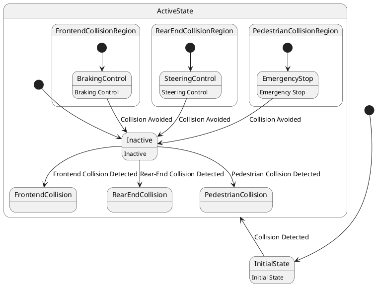

# Pair `0037`：NL + PlantUML STM0 + FCSTM STM0

[上一组 `0036`](../0036/README.md) | [返回 60 组索引](../../PAIR_INDEX.md) | [下一组 `0038`](../0038/README.md)

- LLM：`Kimi`
- 模型/场景：Collision avoidance sub-machine state diagram
- 作者输出阶段：`Result with Semantic Checking`
- 作者输出单元格：`AE39`；Excel row：`39`
- Phase-I fallback：`false`
- 相对 Phase-I 是否变化：`true`
- Phase-I PlantUML SHA-256：`98186aedfa61de1b81699fd4bd301bc000ab9f0bb900f68ff062a90c6a9e3d23`
- NL SHA-256：`49854d044ad99f16a710021500f5e972da93b27635a41144d9b91d32444c0f63`
- PlantUML SHA-256：`a6d5ba5080c30a4440845cc3e16259e0d82a4fe29d0aa4708111765563c41a76`
- FCSTM SHA-256：`03dc2942dd81003a1144d3ddae692ad5bceea0ab5644ca0c070ebfe08d5a4b3e`
- 结构裁决：`structure_preserved`
- source states / transitions：`12` / `12`
- mapped / blocked / silent drop：`12` / `0` / `0`
- final / lifecycle / body coverage：`0/0` / `0/0` / `5/5`
- concurrent region / separator coverage：`0/0` / `0/0`
- source normalization coverage：`0/0`
- official raw / validation：`state_diagram` / `state_diagram`
- official identity states / transitions：`12` / `12`
- official identity remaps：state `0` / transition endpoint `0`
- AST audit：`passed`
- FCSTM execution eligible：`false`
- Discover eligible：`false`
- 主 session 对读：完整对读：ActiveState 内三个碰撞普通状态、三个独立 Region composite 及控制 leaf 共 12 状态、12 边全在；三个控制 leaf 返回 ActiveState.Inactive 均以 child exit + parent transition 分段保留。
- 三个原始文件：[NL](./nl.txt) | [PlantUML](./plantuml.puml) | [FCSTM](./fcstm.fcstm)
- 审计入口：[canonical](../../canonical/llms_emp_feedback_final_0037.json) | [冻结 FCSTM](../../fcstm/llms_emp_feedback_final_0037.fcstm) | [case report](../../case_reports/llms_emp_feedback_final_0037.json) | [人工总账](../../MANUAL_REVIEW.md)

## 作者阶段 lineage

| stage | output cell | present | output SHA-256 | feedback | resolved |
|---|---|---|---|---|---|
| `phase_i_generation` | `I39` | `true` | `98186aedfa61de1b81699fd4bd301bc000ab9f0bb900f68ff062a90c6a9e3d23` | - | - |
| `phase_ii_format` | `U39` | `true` | `fe289684d91fbc5ccd734e2a825009d2f98437e3e7978b98a808a5035e74b227` | 1.syntax error: stm CollisionAvoidanceSystem<br>2. syntax error: [FrontendCollision] -down-> [BrakingControl] : Brake Signal Received | YES |
| `phase_ii_grammar` | `Z39` | `false` | `-` | - | - |
| `phase_ii_semantic` | `AE39` | `true` | `a6d5ba5080c30a4440845cc3e16259e0d82a4fe29d0aa4708111765563c41a76` | 1. missing regions | 1.0 |

## Official identity ledger

- status：`aligned`
- canonical / official states：`12` / `12`
- aligned transition endpoints：`12`

本组 state identity 无需重映射。

本组 transition endpoint 无需重映射。

## Source normalization ledger

本组没有 source-input normalization。

## Concurrent region ledger

本组没有 PlantUML orthogonal/concurrent region separator。

## Operational debt

| reason code | count |
|---|---:|
| `R45.DEBT.opaque_state_body_semantics` | 5 |
| `R45.DEBT.opaque_transition_label_semantics` | 7 |

## NL

```text
1. There are three region in this diagram
2. This sub-machine becomes active when a possible frontend collision, rear-end collision or collision with pedestrian is detected.
3. The orthogonal regions of the active mode of collision avoidance allow for concurrent activation different of collision avoidance controls.
```

## 作者 Phase-II 最终 PlantUML STM0



## 转换后 FCSTM STM0

```fcstm
state llms_emp_feedback_final_0037 named "llms_emp_feedback_final_0037" {
    event Frontend_Collision_Detected named "Frontend Collision Detected";
    event Collision_Avoided named "Collision Avoided";
    event Rear_End_Collision_Detected named "Rear-End Collision Detected";
    event Pedestrian_Collision_Detected named "Pedestrian Collision Detected";
    event Collision_Detected named "Collision Detected";
    state ActiveState named "ActiveState" {
        state FrontendCollisionRegion named "FrontendCollisionRegion" {
            state BrakingControl named "BrakingControl\n[PlantUML body] Braking Control";
            [*] -> BrakingControl;
            BrakingControl -> [*] : /Collision_Avoided;
        }
        state RearEndCollisionRegion named "RearEndCollisionRegion" {
            state SteeringControl named "SteeringControl\n[PlantUML body] Steering Control";
            [*] -> SteeringControl;
            SteeringControl -> [*] : /Collision_Avoided;
        }
        state PedestrianCollisionRegion named "PedestrianCollisionRegion" {
            state EmergencyStop named "EmergencyStop\n[PlantUML body] Emergency Stop";
            [*] -> EmergencyStop;
            EmergencyStop -> [*] : /Collision_Avoided;
        }
        state Inactive named "Inactive\n[PlantUML body] Inactive";
        state FrontendCollision named "FrontendCollision";
        state RearEndCollision named "RearEndCollision";
        state PedestrianCollision named "PedestrianCollision";
        [*] -> Inactive;
        Inactive -> FrontendCollision : /Frontend_Collision_Detected;
        FrontendCollisionRegion -> Inactive : /Collision_Avoided;
        Inactive -> RearEndCollision : /Rear_End_Collision_Detected;
        RearEndCollisionRegion -> Inactive : /Collision_Avoided;
        Inactive -> PedestrianCollision : /Pedestrian_Collision_Detected;
        PedestrianCollisionRegion -> Inactive : /Collision_Avoided;
    }
    state InitialState named "InitialState\n[PlantUML body] Initial State";
    [*] -> InitialState;
    InitialState -> ActiveState : /Collision_Detected;
}
```

[上一组 `0036`](../0036/README.md) | [返回 60 组索引](../../PAIR_INDEX.md) | [下一组 `0038`](../0038/README.md)
