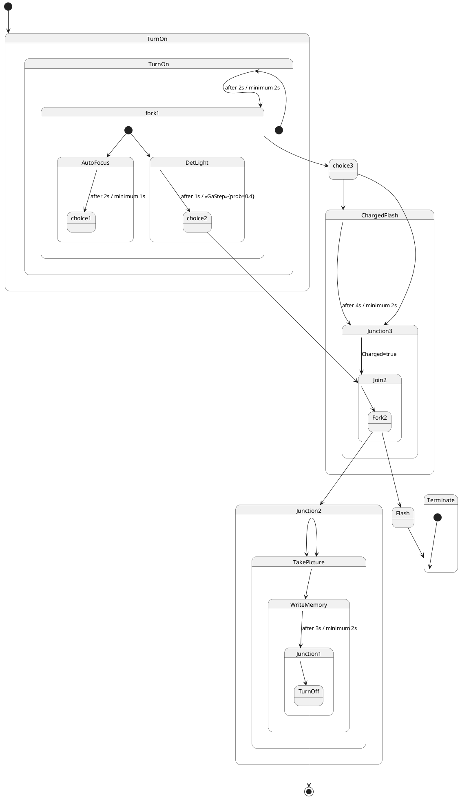

# Pair `0038`：NL + PlantUML STM0 + FCSTM STM0

[上一组 `0037`](../0037/README.md) | [返回 60 组索引](../../PAIR_INDEX.md) | [下一组 `0039`](../0039/README.md)

- LLM：`Kimi`
- 模型/场景： Digital camera state machine diagrams
- NL SHA-256：`6af3966c8b0e12004a22622cded88b07df6fef9d558534442e3309694543c76d`
- PlantUML SHA-256：`6a3092862359b6522c285a04a3cf1a796ed9462cda766a7dfe5815f2ce1b3e19`
- FCSTM SHA-256：`c460602ae931ee4fa9bacde0d6535ad038947f2e02fbfe9c2a6aec18abdcda24`
- 结构裁决：`structure_preserved`
- FCSTM execution eligible：`false`
- Discover eligible：`false`
- 主 session 对读：nested/root 同名实体不合并；24 edge、4 invalid initial surrogate、重复 Junction2 edge 与 placeholders 齐。
- 三个原始文件：[NL](./nl.txt) | [PlantUML](./plantuml.puml) | [FCSTM](./fcstm.fcstm)
- 审计入口：[canonical](../../canonical/llms_emp_stm_results_0038.json) | [冻结 FCSTM](../../fcstm/llms_emp_stm_results_0038.fcstm) | [case report](../../case_reports/llms_emp_stm_results_0038.json) | [人工总账](../../MANUAL_REVIEW.md)

## NL

```text
1. The system begins in the TurnOn state, which has two possible execution times, with a maximum of 2 seconds and a minimum of 2 seconds, before transitioning to the fork1 state.
2. The TurnOn state transitions into a fork1 state, which contains parallel paths leading to AutoFocus and DetLight.
3. The AutoFocus state has execution times of 2 seconds maximum and 1 second minimum before proceeding to the choice1 state, which is triggered when the condition memFull=true is true.
4. The DetLight state has execution times of 1 second maximum and 0 seconds minimum, transitioning to the choice2 state when the condition <>{prob=0.4} is met.
5. If the fork1 state transitions to choice3, it proceeds to the ChargedFlash state, which has execution times of 4 seconds maximum and 2 seconds minimum.
6. The ChargedFlash state can lead to Junction3, where the system starts and proceeds to the Join2 state. The transition occurs when Charged=true.
7. The choice3 state also transitions to Junction3, and once the system reaches Junction3, it joins the Join2 state.
8. The choice2 state transitions to Join2, and if the condition sunny=true is met, it further joins the Join1 state, which leads to Junction2.
9. In the Junction2 state, the system proceeds to TakePicture, followed by WriteMemory, with execution times of 3 seconds maximum and 2 seconds minimum.
10. After WriteMemory completes, the system enters Junction1 before proceeding to TurnOff, which ends the process and transitions back to the initial state, represented by [*].
11. In the Fork2 state, which is part of the Join2 substate, the system can either proceed to Junction2 or Flash. If the Flash state is activated, it transitions to Terminate, ending the sequence.
```

## 原装 PlantUML STM0



## 转换后 FCSTM STM0

```fcstm
state llms_emp_stm_results_0038 named "llms_emp_stm_results_0038" {
    event after_2s_minimum_2s named "after 2s / minimum 2s";
    event after_2s_minimum_1s named "after 2s / minimum 1s";
    event after_1s_GaStep_prob_0_4 named "after 1s / <<GaStep>>{prob=0.4}";
    event after_4s_minimum_2s named "after 4s / minimum 2s";
    event Charged_true named "Charged=true";
    event after_3s_minimum_2s named "after 3s / minimum 2s";
    state TurnOn named "TurnOn" {
        state UnspecifiedInitial named "Unspecified initial";
        state TurnOn named "TurnOn" {
            state InvalidInitialtr_0002 named "PlantUML initial target outside child scope: TurnOn.TurnOn";
            [*] -> InvalidInitialtr_0002;
        }
        !TurnOn -> [*] : /after_2s_minimum_2s;
        [*] -> UnspecifiedInitial;
    }
    state fork1 named "fork1" {
        state InvalidInitialtr_0004 named "PlantUML initial target outside child scope: AutoFocus";
        state InvalidInitialtr_0005 named "PlantUML initial target outside child scope: DetLight";
        [*] -> InvalidInitialtr_0004;
        [*] -> InvalidInitialtr_0005;
    }
    state AutoFocus named "AutoFocus" {
        state UnspecifiedInitial named "Unspecified initial";
        state choice1 named "choice1";
        ! * -> choice1 : /after_2s_minimum_1s;
        [*] -> UnspecifiedInitial;
    }
    state DetLight named "DetLight" {
        state UnspecifiedInitial named "Unspecified initial";
        state choice2 named "choice2";
        ! * -> choice2 : /after_1s_GaStep_prob_0_4;
        [*] -> UnspecifiedInitial;
    }
    state ChargedFlash named "ChargedFlash";
    state Junction3 named "Junction3";
    state Join2 named "Join2" {
        state UnspecifiedInitial named "Unspecified initial";
        state Fork2 named "Fork2";
        ! * -> Fork2;
        [*] -> UnspecifiedInitial;
    }
    state Junction2 named "Junction2";
    state TakePicture named "TakePicture";
    state WriteMemory named "WriteMemory";
    state Junction1 named "Junction1" {
        state UnspecifiedInitial named "Unspecified initial";
        state TurnOff named "TurnOff";
        ! * -> TurnOff;
        [*] -> UnspecifiedInitial;
    }
    state Terminate named "Terminate" {
        state InvalidInitialtr_0024 named "PlantUML initial target outside child scope: Terminate";
        [*] -> InvalidInitialtr_0024;
    }
    state choice3 named "choice3";
    state choice2 named "choice2";
    state Fork2 named "Fork2";
    state Flash named "Flash";
    state TurnOff named "TurnOff";
    [*] -> TurnOn;
    TurnOn -> fork1 : /after_2s_minimum_2s;
    !fork1 -> choice3;
    choice3 -> ChargedFlash;
    ChargedFlash -> Junction3 : /after_4s_minimum_2s;
    Junction3 -> Join2 : /Charged_true;
    choice3 -> Junction3;
    choice2 -> Join2;
    Fork2 -> Junction2;
    Fork2 -> Flash;
    Junction2 -> TakePicture;
    Junction2 -> TakePicture;
    TakePicture -> WriteMemory;
    WriteMemory -> Junction1 : /after_3s_minimum_2s;
    TurnOff -> [*];
    Flash -> Terminate;
}
```

[上一组 `0037`](../0037/README.md) | [返回 60 组索引](../../PAIR_INDEX.md) | [下一组 `0039`](../0039/README.md)
