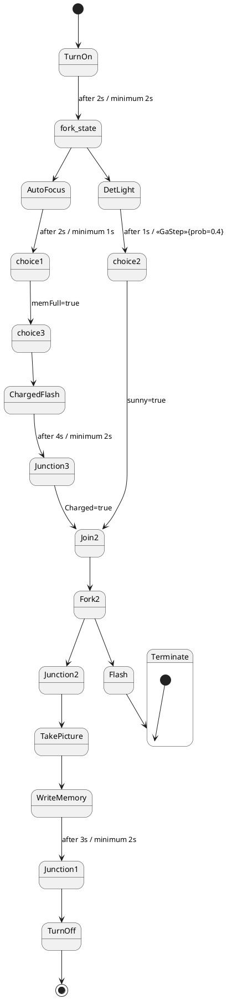

# Pair `0038`：NL + PlantUML STM0 + FCSTM STM0

[上一组 `0037`](../0037/README.md) | [返回 60 组索引](../../PAIR_INDEX.md) | [下一组 `0039`](../0039/README.md)

- LLM：`Kimi`
- 模型/场景： Digital camera state machine diagrams
- 作者输出阶段：`Result with Semantic Checking`
- 作者输出单元格：`AE40`；Excel row：`40`
- Phase-I fallback：`false`
- 相对 Phase-I 是否变化：`true`
- Phase-I PlantUML SHA-256：`6a3092862359b6522c285a04a3cf1a796ed9462cda766a7dfe5815f2ce1b3e19`
- NL SHA-256：`6af3966c8b0e12004a22622cded88b07df6fef9d558534442e3309694543c76d`
- PlantUML SHA-256：`e9585b863a71d041e76349e86e0cfade5a44edbbe9026d865f8cbf0b9befa035`
- FCSTM SHA-256：`921f384e4f4d00ac8cc3a486c72feee6f38e2db5443ad7009c2560d8886c270f`
- review subject SHA-256：`dee3e732fbc6dd40b821cc2a7b41d32dd66dc5d69c05c7e016ef182360f5047c`
- working contract SHA-256：`dac7c81179825db9c92b0ca09ce4440f7750fa73dd3775f6f85c8cac583fcba4`
- 结构裁决：`structure_preserved`
- source states / transitions：`18` / `21`
- mapped / blocked / silent drop：`21` / `0` / `0`
- final / lifecycle / body coverage：`1/1` / `0/0` / `0/0`
- concurrent region / separator coverage：`0/0` / `0/0`
- source normalization coverage：`0/0`
- official raw / validation：`state_diagram` / `state_diagram`
- official identity states / transitions：`18` / `21`
- official identity remaps：state `0` / transition endpoint `0`
- AST audit：`passed`
- legacy whole-model FCSTM execution / Discover：`false` / `false`
- working bundle usage gate：`discover_input_with_capability_mask`
- ownership source / compiler / agent：`39` / `31` / `0`
- source macro / positive identity trace / conversion boundary trace：`21` / `39` / `0`
- capability source-static / simulation / transition-trace：`eligible_with_exclusions` / `ineligible` / `ineligible`
- compiler-only diagnostic policy：`rejected_conversion_artifact`；main-result conversion artifact limit：`0`
- 主 session 对读：`pass`；ownership/macro/capability 均为 `pass`；Case 0038 passes conversion-attribution review. This does not assert NL/PlantUML correctness or runtime equivalence; authored defects remain eligible for later source-grounded Discover. No conversion-specific blocker was found in the exact reviewed occurrences.
- source anchors：`source-ref:llms_emp_feedback_final_0038.puml:line:40\|state Terminate {, source-ref:llms_emp_feedback_final_0038.puml:line:12\|choice1 --> choice3 : memFull=true`；FCSTM anchors：`element-ref:source:state:Terminate@line:14\|state Terminate named "Terminate" {, element-ref:compiler:transition_segment:tr_0007:segment:1@line:37\|choice1 -> choice3 : /memFull_true;`
- 三个原始文件：[NL](./nl.txt) | [PlantUML](./plantuml.puml) | [FCSTM](./fcstm.fcstm)
- 审计入口：[canonical](../../canonical/llms_emp_feedback_final_0038.json) | [冻结 FCSTM](../../fcstm/llms_emp_feedback_final_0038.fcstm) | [case report](../../case_reports/llms_emp_feedback_final_0038.json) | [working contract](../../working_contracts/llms_emp_feedback_final_0038.json) | [source trace](../../source_traces/llms_emp_feedback_final_0038.json) | [人工总账](../../MANUAL_REVIEW.md)

## 主 session 三方语义对应

| projection | assessment | NL anchor | PlantUML anchor | FCSTM anchor | source roots | compiler members | rationale |
|---|---|---|---|---|---|---|---|
| `direct` | `preserved` | Terminate | source-ref:llms_emp_feedback_final_0038.puml:line:40\|state Terminate { | element-ref:source:state:Terminate@line:14\|state Terminate named "Terminate" { | source:state:Terminate | - | Case 0038 binds source:state:Terminate to the exact authored occurrence 'state Terminate {'; it is present as a direct FCSTM state projection with the same source identity and parent relation. |
| `macro` | `preserved_with_exclusions` | memFull=true | source-ref:llms_emp_feedback_final_0038.puml:line:12\|choice1 --> choice3 : memFull=true | element-ref:compiler:transition_segment:tr_0007:segment:1@line:37\|choice1 -> choice3 : /memFull_true; | source:transition:tr_0007 | compiler:transition_segment:tr_0007:segment:1 | Case 0038 binds source:transition:tr_0007 to the exact authored occurrence 'choice1 --> choice3 : memFull=true'; it is present as a source-owned transition root whose cited FCSTM line belongs to a protected compiler macro; the raw label remains opaque. |

## Risk occurrence 第二遍复核

| obligation | risk tag | assessment | PlantUML evidence | FCSTM evidence | ownership evidence | rationale |
|---|---|---|---|---|---|---|
| `review:final_boundary:0001:tr_0019` | `final_boundary` | `source_fact_preserved` | source-ref:llms_emp_feedback_final_0038.puml:line:36\|TurnOff --> [*] | element-ref:compiler:transition_segment:tr_0019:segment:1@line:49\|TurnOff -> [*]; | compiler:transition_segment:tr_0019:segment:1, source:transition:tr_0019 | Case 0038 risk final_boundary occurrence review:final_boundary:0001:tr_0019: The authored PlantUML final boundary is preserved by the bound FCSTM termination macro rather than being converted into an ordinary user state. |
| `review:synthetic_state:0002:001-InvalidInitialtr_0021` | `synthetic_state` | `compiler_artifact_excluded` | source-ref:llms_emp_feedback_final_0038.puml:line:41\|[*] --> Terminate | element-ref:compiler:state:llms_emp_feedback_final_0038.Terminate.InvalidInitialtr_0021@line:15\|state InvalidInitialtr_0021 named "PlantUML initial target outside child scope: Terminate"; | compiler:state:llms_emp_feedback_final_0038.Terminate.InvalidInitialtr_0021, source:transition:tr_0021 | Case 0038 risk synthetic_state occurrence review:synthetic_state:0002:001-InvalidInitialtr_0021: The helper state is a protected compiler-owned projection for a source structural fact; diagnostics on the helper itself are conversion artifacts. |
| `review:explicit_concurrency:0003:001-ambiguous_unlabeled_fanout` | `explicit_concurrency` | `capability_excluded` | source-ref:llms_emp_feedback_final_0038.puml:line:5\|state fork_state <<fork>>, source-ref:llms_emp_feedback_final_0038.puml:line:6\|fork_state --> AutoFocus, source-ref:llms_emp_feedback_final_0038.puml:line:7\|fork_state --> DetLight | element-ref:compiler:transition_segment:tr_0003:segment:1@line:33\|fork_state -> AutoFocus;, element-ref:compiler:transition_segment:tr_0004:segment:1@line:34\|fork_state -> DetLight;, element-ref:source:state:fork_state@line:10\|pseudo state fork_state named "fork_state"; | source:state:fork_state, source:transition:tr_0003, source:transition:tr_0004 | Case 0038 risk explicit_concurrency occurrence review:explicit_concurrency:0003:001-ambiguous_unlabeled_fanout: The authored concurrency occurrence remains visible, but the FCSTM projection does not claim fork/join product semantics and is excluded from runtime evidence. |
| `review:explicit_concurrency:0004:002-ambiguous_unlabeled_fanout` | `explicit_concurrency` | `capability_excluded` | source-ref:llms_emp_feedback_final_0038.puml:line:23\|Join2 --> Fork2, source-ref:llms_emp_feedback_final_0038.puml:line:25\|Fork2 --> Junction2, source-ref:llms_emp_feedback_final_0038.puml:line:26\|Fork2 --> Flash | element-ref:compiler:transition_segment:tr_0013:segment:1@line:43\|Fork2 -> Junction2;, element-ref:compiler:transition_segment:tr_0014:segment:1@line:44\|Fork2 -> Flash;, element-ref:source:state:Fork2@line:25\|state Fork2 named "Fork2"; | source:state:Fork2, source:transition:tr_0013, source:transition:tr_0014 | Case 0038 risk explicit_concurrency occurrence review:explicit_concurrency:0004:002-ambiguous_unlabeled_fanout: The authored concurrency occurrence remains visible, but the FCSTM projection does not claim fork/join product semantics and is excluded from runtime evidence. |
| `review:explicit_concurrency:0005:003-explicit_concurrency_pseudostate` | `explicit_concurrency` | `capability_excluded` | source-ref:llms_emp_feedback_final_0038.puml:line:5\|state fork_state <<fork>> | element-ref:source:state:fork_state@line:10\|pseudo state fork_state named "fork_state"; | source:state:fork_state | Case 0038 risk explicit_concurrency occurrence review:explicit_concurrency:0005:003-explicit_concurrency_pseudostate: The authored concurrency occurrence remains visible, but the FCSTM projection does not claim fork/join product semantics and is excluded from runtime evidence. |
| `review:explicit_concurrency:0006:004-explicit_concurrency_pseudostate` | `explicit_concurrency` | `capability_excluded` | source-ref:llms_emp_feedback_final_0038.puml:line:17\|state Junction3 <<join>> | element-ref:source:state:Junction3@line:11\|pseudo state Junction3 named "Junction3"; | source:state:Junction3 | Case 0038 risk explicit_concurrency occurrence review:explicit_concurrency:0006:004-explicit_concurrency_pseudostate: The authored concurrency occurrence remains visible, but the FCSTM projection does not claim fork/join product semantics and is excluded from runtime evidence. |
| `review:explicit_concurrency:0007:005-explicit_concurrency_pseudostate` | `explicit_concurrency` | `capability_excluded` | source-ref:llms_emp_feedback_final_0038.puml:line:22\|state Join2 <<join>> | element-ref:source:state:Join2@line:12\|pseudo state Join2 named "Join2"; | source:state:Join2 | Case 0038 risk explicit_concurrency occurrence review:explicit_concurrency:0007:005-explicit_concurrency_pseudostate: The authored concurrency occurrence remains visible, but the FCSTM projection does not claim fork/join product semantics and is excluded from runtime evidence. |
| `review:explicit_concurrency:0008:006-explicit_concurrency_pseudostate` | `explicit_concurrency` | `capability_excluded` | source-ref:llms_emp_feedback_final_0038.puml:line:33\|state Junction1 <<join>> | element-ref:source:state:Junction1@line:13\|pseudo state Junction1 named "Junction1"; | source:state:Junction1 | Case 0038 risk explicit_concurrency occurrence review:explicit_concurrency:0008:006-explicit_concurrency_pseudostate: The authored concurrency occurrence remains visible, but the FCSTM projection does not claim fork/join product semantics and is excluded from runtime evidence. |

## 作者阶段 lineage

| stage | output cell | present | output SHA-256 | feedback | resolved |
|---|---|---|---|---|---|
| `phase_i_generation` | `I40` | `true` | `6a3092862359b6522c285a04a3cf1a796ed9462cda766a7dfe5815f2ce1b3e19` | - | - |
| `phase_ii_format` | `U40` | `false` | `-` | - | - |
| `phase_ii_grammar` | `Z40` | `true` | `bf153e52cf7601b7f5c2d0b9d7ffb2a659a31b5f36ceecd9bc8e3b9938ee65c0` | 1. Composite State error： state TurnOn is nested twice | YES |
| `phase_ii_semantic` | `AE40` | `true` | `e9585b863a71d041e76349e86e0cfade5a44edbbe9026d865f8cbf0b9befa035` | 1. Missing Junction Pseudostate and Fork Pseudostate<br> | 1.0 |

## Official identity ledger

- status：`aligned`
- canonical / official states：`18` / `18`
- aligned transition endpoints：`21`

本组 state identity 无需重映射。

本组 transition endpoint 无需重映射。

## Source normalization ledger

本组没有 source-input normalization。

## Concurrent region ledger

本组没有 PlantUML orthogonal/concurrent region separator。

## Operational debt

| reason code | count |
|---|---:|
| `R45.DEBT.ambiguous_unlabeled_fanout` | 2 |
| `R45.DEBT.explicit_concurrency_pseudostate` | 4 |
| `R45.DEBT.invalid_source_initial_target` | 1 |
| `R45.DEBT.opaque_transition_label_semantics` | 8 |

## NL

```text
1. The system begins in the TurnOn state, which has two possible execution times, with a maximum of 2 seconds and a minimum of 2 seconds, before transitioning to the fork1 state.
2. The TurnOn state transitions into a fork1 state, which contains parallel paths leading to AutoFocus and DetLight.
3. The AutoFocus state has execution times of 2 seconds maximum and 1 second minimum before proceeding to the choice1 state, which is triggered when the condition memFull=true is true.
4. The DetLight state has execution times of 1 second maximum and 0 seconds minimum, transitioning to the choice2 state when the condition <>{prob=0.4} is met.
5. If the fork1 state transitions to choice3, it proceeds to the ChargedFlash state, which has execution times of 4 seconds maximum and 2 seconds minimum.
6. The ChargedFlash state can lead to Junction3, where the system starts and proceeds to the Join2 state. The transition occurs when Charged=true.
7. The choice3 state also transitions to Junction3, and once the system reaches Junction3, it joins the Join2 state.
8. The choice2 state transitions to Join2, and if the condition sunny=true is met, it further joins the Join1 state, which leads to Junction2.
9. In the Junction2 state, the system proceeds to TakePicture, followed by WriteMemory, with execution times of 3 seconds maximum and 2 seconds minimum.
10. After WriteMemory completes, the system enters Junction1 before proceeding to TurnOff, which ends the process and transitions back to the initial state, represented by [*].
11. In the Fork2 state, which is part of the Join2 substate, the system can either proceed to Junction2 or Flash. If the Flash state is activated, it transitions to Terminate, ending the sequence.
```

## 作者 Phase-II 最终 PlantUML STM0



## 转换后 FCSTM STM0

```fcstm
state llms_emp_feedback_final_0038 named "llms_emp_feedback_final_0038" {
    event after_2s_minimum_2s named "after 2s / minimum 2s";
    event after_2s_minimum_1s named "after 2s / minimum 1s";
    event after_1s_GaStep_prob_0_4 named "after 1s / <<GaStep>>{prob=0.4}";
    event memFull_true named "memFull=true";
    event after_4s_minimum_2s named "after 4s / minimum 2s";
    event Charged_true named "Charged=true";
    event sunny_true named "sunny=true";
    event after_3s_minimum_2s named "after 3s / minimum 2s";
    pseudo state fork_state named "fork_state";
    pseudo state Junction3 named "Junction3";
    pseudo state Join2 named "Join2";
    pseudo state Junction1 named "Junction1";
    state Terminate named "Terminate" {
        state InvalidInitialtr_0021 named "PlantUML initial target outside child scope: Terminate";
        [*] -> InvalidInitialtr_0021;
    }
    state TurnOn named "TurnOn";
    state AutoFocus named "AutoFocus";
    state DetLight named "DetLight";
    state choice1 named "choice1";
    state choice2 named "choice2";
    state choice3 named "choice3";
    state ChargedFlash named "ChargedFlash";
    state Fork2 named "Fork2";
    state Junction2 named "Junction2";
    state Flash named "Flash";
    state TakePicture named "TakePicture";
    state WriteMemory named "WriteMemory";
    state TurnOff named "TurnOff";
    [*] -> TurnOn;
    TurnOn -> fork_state : /after_2s_minimum_2s;
    fork_state -> AutoFocus;
    fork_state -> DetLight;
    AutoFocus -> choice1 : /after_2s_minimum_1s;
    DetLight -> choice2 : /after_1s_GaStep_prob_0_4;
    choice1 -> choice3 : /memFull_true;
    choice3 -> ChargedFlash;
    ChargedFlash -> Junction3 : /after_4s_minimum_2s;
    Junction3 -> Join2 : /Charged_true;
    choice2 -> Join2 : /sunny_true;
    Join2 -> Fork2;
    Fork2 -> Junction2;
    Fork2 -> Flash;
    Junction2 -> TakePicture;
    TakePicture -> WriteMemory;
    WriteMemory -> Junction1 : /after_3s_minimum_2s;
    Junction1 -> TurnOff;
    TurnOff -> [*];
    Flash -> Terminate;
}
```

[上一组 `0037`](../0037/README.md) | [返回 60 组索引](../../PAIR_INDEX.md) | [下一组 `0039`](../0039/README.md)
