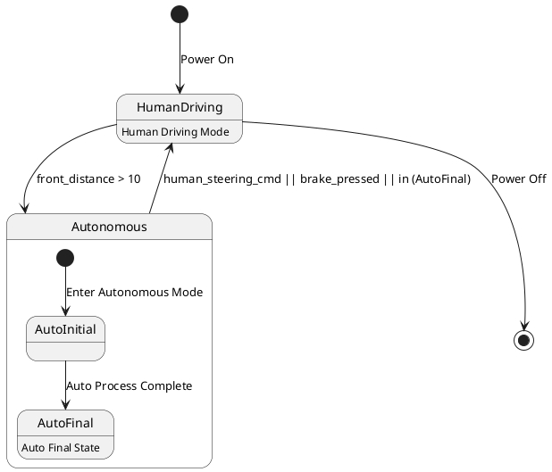

# Pair `0040`：NL + PlantUML STM0 + FCSTM STM0

[上一组 `0039`](../0039/README.md) | [返回 60 组索引](../../PAIR_INDEX.md) | [下一组 `0041`](../0041/README.md)

- LLM：`DeepSeek`
- 模型/场景：high-level driving module
- 作者输出阶段：`Result with Semantic Checking`
- 作者输出单元格：`AE42`；Excel row：`42`
- Phase-I fallback：`false`
- 相对 Phase-I 是否变化：`true`
- Phase-I PlantUML SHA-256：`42acdd25b7fad2ff8a9502db8169a3ff849a3ba164e3381d70467c97e615cf7e`
- NL SHA-256：`f1c3dc88371b8256352e7ab6ee7eb42424de6e11dfde70d185f224dd1d05a7a8`
- PlantUML SHA-256：`7a96af160f5a1c2a7e4ee172c5bdb24ea8008542b6be9fba5a5d5d77ae28a7e4`
- FCSTM SHA-256：`0308430881eca78099e6c318d6d375cfa3475bba33908b1f547ac1d097bd25bc`
- 结构裁决：`structure_preserved`
- source states / transitions：`4` / `6`
- mapped / blocked / silent drop：`6` / `0` / `0`
- final / lifecycle / body coverage：`1/1` / `0/0` / `2/2`
- concurrent region / separator coverage：`0/0` / `0/0`
- source normalization coverage：`0/0`
- official raw / validation：`state_diagram` / `state_diagram`
- official identity states / transitions：`4` / `6`
- official identity remaps：state `0` / transition endpoint `0`
- AST audit：`passed`
- FCSTM execution eligible：`false`
- Discover eligible：`false`
- 主 session 对读：完整对读：HumanDriving、Autonomous/AutoInitial/AutoFinal 四状态、6 边和两个 body 全保留；root 与 Autonomous 两个带事件 initial 均用 wait，Power Off 保持 root final，复合返回标签保持 opaque。
- 三个原始文件：[NL](./nl.txt) | [PlantUML](./plantuml.puml) | [FCSTM](./fcstm.fcstm)
- 审计入口：[canonical](../../canonical/llms_emp_feedback_final_0040.json) | [冻结 FCSTM](../../fcstm/llms_emp_feedback_final_0040.fcstm) | [case report](../../case_reports/llms_emp_feedback_final_0040.json) | [人工总账](../../MANUAL_REVIEW.md)

## 作者阶段 lineage

| stage | output cell | present | output SHA-256 | feedback | resolved |
|---|---|---|---|---|---|
| `phase_i_generation` | `I42` | `true` | `42acdd25b7fad2ff8a9502db8169a3ff849a3ba164e3381d70467c97e615cf7e` | - | - |
| `phase_ii_format` | `U42` | `true` | `9f27e155dbe01adcbc936599932bcd8f0556944a6e013a5ec7ccf8767738eda9` | syntax error：stm DrivingSystem [Driving System State Machine] | YES |
| `phase_ii_grammar` | `Z42` | `false` | `-` | - | - |
| `phase_ii_semantic` | `AE42` | `true` | `7a96af160f5a1c2a7e4ee172c5bdb24ea8008542b6be9fba5a5d5d77ae28a7e4` | 1. Duplicated composite state. | - |

## Official identity ledger

- status：`aligned`
- canonical / official states：`4` / `4`
- aligned transition endpoints：`6`

本组 state identity 无需重映射。

本组 transition endpoint 无需重映射。

## Source normalization ledger

本组没有 source-input normalization。

## Concurrent region ledger

本组没有 PlantUML orthogonal/concurrent region separator。

## Operational debt

| reason code | count |
|---|---:|
| `R45.DEBT.opaque_state_body_semantics` | 2 |
| `R45.DEBT.opaque_transition_label_semantics` | 6 |

## NL

```text
1 The human driving mode is represented by a simple state. 2 The autonomous mode has sub-states and is represented by a sub machine state. 3. when power on, the system turn into human driving mode 4when front_distance > 10, auto transport to autonomous state 4. transit to human driving mode when receive human steering cmd, brake pressed, in (auto final) 5 when power off, it will transit to final state
```

## 作者 Phase-II 最终 PlantUML STM0



## 转换后 FCSTM STM0

```fcstm
state llms_emp_feedback_final_0040 named "llms_emp_feedback_final_0040" {
    event Power_On named "Power On";
    event front_distance_10 named "front_distance > 10";
    event Enter_Autonomous_Mode named "Enter Autonomous Mode";
    event Auto_Process_Complete named "Auto Process Complete";
    event human_steering_cmd_brake_pressed_in_AutoFinal named "human_steering_cmd || brake_pressed || in (AutoFinal)";
    event Power_Off named "Power Off";
    state InitialWaittr_0001 named "Awaiting initial event: Power On";
    state Autonomous named "Autonomous" {
        state AutoInitial named "AutoInitial";
        state AutoFinal named "AutoFinal\n[PlantUML body] Auto Final State";
        state InitialWaittr_0003 named "Awaiting initial event: Enter Autonomous Mode";
        [*] -> InitialWaittr_0003;
        InitialWaittr_0003 -> AutoInitial : /Enter_Autonomous_Mode;
        AutoInitial -> AutoFinal : /Auto_Process_Complete;
    }
    state HumanDriving named "HumanDriving\n[PlantUML body] Human Driving Mode";
    [*] -> InitialWaittr_0001;
    InitialWaittr_0001 -> HumanDriving : /Power_On;
    HumanDriving -> Autonomous : /front_distance_10;
    !Autonomous -> HumanDriving : /human_steering_cmd_brake_pressed_in_AutoFinal;
    HumanDriving -> [*] : /Power_Off;
}
```

[上一组 `0039`](../0039/README.md) | [返回 60 组索引](../../PAIR_INDEX.md) | [下一组 `0041`](../0041/README.md)
