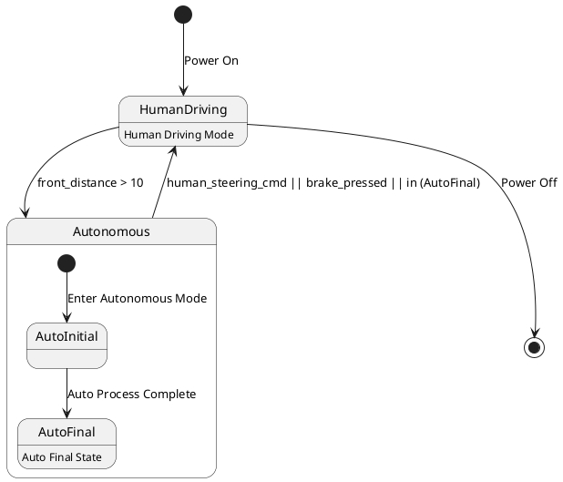

# Pair `0040`：NL + PlantUML STM0 + FCSTM STM0

[上一组 `0039`](../0039/README.md) | [返回 60 组索引](../../PAIR_INDEX.md) | [下一组 `0041`](../0041/README.md)

- LLM：`DeepSeek`
- 模型/场景：high-level driving module
- 作者输出阶段：`Result with Semantic Checking`
- 作者输出单元格：`AE42`；Excel row：`42`
- Phase-I fallback：`false`
- 相对 Phase-I 是否变化：`true`
- Phase-I PlantUML SHA-256：`42acdd25b7fad2ff8a9502db8169a3ff849a3ba164e3381d70467c97e615cf7e`
- NL SHA-256：`f1c3dc88371b8256352e7ab6ee7eb42424de6e11dfde70d185f224dd1d05a7a8`
- PlantUML SHA-256：`7a96af160f5a1c2a7e4ee172c5bdb24ea8008542b6be9fba5a5d5d77ae28a7e4`
- FCSTM SHA-256：`0308430881eca78099e6c318d6d375cfa3475bba33908b1f547ac1d097bd25bc`
- review subject SHA-256：`a8d01a175feaea2270bd75f894c86dab79406b951713ff4dc634fa8ff63a5962`
- working contract SHA-256：`a1951a16b8cfb9c1bfef85cbda8c9eb2cb2956a5d7678504c0fb52e6b964df46`
- 结构裁决：`structure_preserved`
- source states / transitions：`4` / `6`
- mapped / blocked / silent drop：`6` / `0` / `0`
- final / lifecycle / body coverage：`1/1` / `0/0` / `2/2`
- concurrent region / separator coverage：`0/0` / `0/0`
- source normalization coverage：`0/0`
- official raw / validation：`state_diagram` / `state_diagram`
- official identity states / transitions：`4` / `6`
- official identity remaps：state `0` / transition endpoint `0`
- AST audit：`passed`
- legacy whole-model FCSTM execution / Discover：`false` / `false`
- working bundle usage gate：`discover_input_with_capability_mask`
- ownership source / compiler / agent：`12` / `17` / `0`
- source macro / positive identity trace / conversion boundary trace：`8` / `12` / `0`
- capability source-static / simulation / transition-trace：`eligible_with_exclusions` / `ineligible` / `ineligible`
- compiler-only diagnostic policy：`rejected_conversion_artifact`；main-result conversion artifact limit：`0`
- 主 session 对读：`pass`；ownership/macro/capability 均为 `pass`；Case 0040 passes conversion-attribution review. This does not assert NL/PlantUML correctness or runtime equivalence; authored defects remain eligible for later source-grounded Discover. No conversion-specific blocker was found in the exact reviewed occurrences.
- source anchors：`source-ref:llms_emp_feedback_final_0040.puml:line:6\|state Autonomous {, source-ref:llms_emp_feedback_final_0040.puml:line:5\|HumanDriving --> Autonomous : front_distance > 10`；FCSTM anchors：`element-ref:source:state:Autonomous@line:9\|state Autonomous named "Autonomous" {, element-ref:compiler:transition_segment:tr_0002:segment:1@line:20\|HumanDriving -> Autonomous : /front_distance_10;`
- 三个原始文件：[NL](./nl.txt) | [PlantUML](./plantuml.puml) | [FCSTM](./fcstm.fcstm)
- 审计入口：[canonical](../../canonical/llms_emp_feedback_final_0040.json) | [冻结 FCSTM](../../fcstm/llms_emp_feedback_final_0040.fcstm) | [case report](../../case_reports/llms_emp_feedback_final_0040.json) | [working contract](../../working_contracts/llms_emp_feedback_final_0040.json) | [source trace](../../source_traces/llms_emp_feedback_final_0040.json) | [人工总账](../../MANUAL_REVIEW.md)

## 主 session 三方语义对应

| projection | assessment | NL anchor | PlantUML anchor | FCSTM anchor | source roots | compiler members | rationale |
|---|---|---|---|---|---|---|---|
| `direct` | `preserved` | autonomous | source-ref:llms_emp_feedback_final_0040.puml:line:6\|state Autonomous { | element-ref:source:state:Autonomous@line:9\|state Autonomous named "Autonomous" { | source:state:Autonomous | - | Case 0040 binds source:state:Autonomous to the exact authored occurrence 'state Autonomous {'; it is present as a direct FCSTM state projection with the same source identity and parent relation. |
| `macro` | `preserved_with_exclusions` | front_distance > 10 | source-ref:llms_emp_feedback_final_0040.puml:line:5\|HumanDriving --> Autonomous : front_distance > 10 | element-ref:compiler:transition_segment:tr_0002:segment:1@line:20\|HumanDriving -> Autonomous : /front_distance_10; | source:transition:tr_0002 | compiler:transition_segment:tr_0002:segment:1 | Case 0040 binds source:transition:tr_0002 to the exact authored occurrence 'HumanDriving --> Autonomous : front_distance > 10'; it is present as a source-owned transition root whose cited FCSTM line belongs to a protected compiler macro; the raw label remains opaque. |

## Risk occurrence 第二遍复核

| obligation | risk tag | assessment | PlantUML evidence | FCSTM evidence | ownership evidence | rationale |
|---|---|---|---|---|---|---|
| `review:multi_segment_macro:0001:tr_0001` | `multi_segment_macro` | `compiler_artifact_excluded` | source-ref:llms_emp_feedback_final_0040.puml:line:2\|[*] --> HumanDriving : Power On | element-ref:compiler:state:llms_emp_feedback_final_0040.InitialWaittr_0001@line:8\|state InitialWaittr_0001 named "Awaiting initial event: Power On";, element-ref:compiler:transition_segment:tr_0001:segment:1@line:18\|[*] -> InitialWaittr_0001;, element-ref:compiler:transition_segment:tr_0001:segment:2@line:19\|InitialWaittr_0001 -> HumanDriving : /Power_On; | compiler:state:llms_emp_feedback_final_0040.InitialWaittr_0001, compiler:transition_segment:tr_0001:segment:1, compiler:transition_segment:tr_0001:segment:2, source:transition:tr_0001 | Case 0040 risk multi_segment_macro occurrence review:multi_segment_macro:0001:tr_0001: The single authored transition remains one source-owned semantic root; all bound FCSTM segments are protected compiler artifacts and cannot become repair targets. |
| `review:multi_segment_macro:0002:tr_0003` | `multi_segment_macro` | `compiler_artifact_excluded` | source-ref:llms_emp_feedback_final_0040.puml:line:7\|[*] --> AutoInitial : Enter Autonomous Mode | element-ref:compiler:state:llms_emp_feedback_final_0040.Autonomous.InitialWaittr_0003@line:12\|state InitialWaittr_0003 named "Awaiting initial event: Enter Autonomous Mode";, element-ref:compiler:transition_segment:tr_0003:segment:1@line:13\|[*] -> InitialWaittr_0003;, element-ref:compiler:transition_segment:tr_0003:segment:2@line:14\|InitialWaittr_0003 -> AutoInitial : /Enter_Autonomous_Mode; | compiler:state:llms_emp_feedback_final_0040.Autonomous.InitialWaittr_0003, compiler:transition_segment:tr_0003:segment:1, compiler:transition_segment:tr_0003:segment:2, source:transition:tr_0003 | Case 0040 risk multi_segment_macro occurrence review:multi_segment_macro:0002:tr_0003: The single authored transition remains one source-owned semantic root; all bound FCSTM segments are protected compiler artifacts and cannot become repair targets. |
| `review:final_boundary:0003:tr_0006` | `final_boundary` | `source_fact_preserved` | source-ref:llms_emp_feedback_final_0040.puml:line:13\|HumanDriving --> [*] : Power Off | element-ref:compiler:transition_segment:tr_0006:segment:1@line:22\|HumanDriving -> [*] : /Power_Off; | compiler:transition_segment:tr_0006:segment:1, source:transition:tr_0006 | Case 0040 risk final_boundary occurrence review:final_boundary:0003:tr_0006: The authored PlantUML final boundary is preserved by the bound FCSTM termination macro rather than being converted into an ordinary user state. |
| `review:synthetic_state:0004:001-InitialWaittr_0001` | `synthetic_state` | `compiler_artifact_excluded` | source-ref:llms_emp_feedback_final_0040.puml:line:2\|[*] --> HumanDriving : Power On | element-ref:compiler:state:llms_emp_feedback_final_0040.InitialWaittr_0001@line:8\|state InitialWaittr_0001 named "Awaiting initial event: Power On"; | compiler:state:llms_emp_feedback_final_0040.InitialWaittr_0001, source:transition:tr_0001 | Case 0040 risk synthetic_state occurrence review:synthetic_state:0004:001-InitialWaittr_0001: The helper state is a protected compiler-owned projection for a source structural fact; diagnostics on the helper itself are conversion artifacts. |
| `review:synthetic_state:0005:002-InitialWaittr_0003` | `synthetic_state` | `compiler_artifact_excluded` | source-ref:llms_emp_feedback_final_0040.puml:line:7\|[*] --> AutoInitial : Enter Autonomous Mode | element-ref:compiler:state:llms_emp_feedback_final_0040.Autonomous.InitialWaittr_0003@line:12\|state InitialWaittr_0003 named "Awaiting initial event: Enter Autonomous Mode"; | compiler:state:llms_emp_feedback_final_0040.Autonomous.InitialWaittr_0003, source:transition:tr_0003 | Case 0040 risk synthetic_state occurrence review:synthetic_state:0005:002-InitialWaittr_0003: The helper state is a protected compiler-owned projection for a source structural fact; diagnostics on the helper itself are conversion artifacts. |

## 作者阶段 lineage

| stage | output cell | present | output SHA-256 | feedback | resolved |
|---|---|---|---|---|---|
| `phase_i_generation` | `I42` | `true` | `42acdd25b7fad2ff8a9502db8169a3ff849a3ba164e3381d70467c97e615cf7e` | - | - |
| `phase_ii_format` | `U42` | `true` | `9f27e155dbe01adcbc936599932bcd8f0556944a6e013a5ec7ccf8767738eda9` | syntax error：stm DrivingSystem [Driving System State Machine] | YES |
| `phase_ii_grammar` | `Z42` | `false` | `-` | - | - |
| `phase_ii_semantic` | `AE42` | `true` | `7a96af160f5a1c2a7e4ee172c5bdb24ea8008542b6be9fba5a5d5d77ae28a7e4` | 1. Duplicated composite state. | - |

## Official identity ledger

- status：`aligned`
- canonical / official states：`4` / `4`
- aligned transition endpoints：`6`

本组 state identity 无需重映射。

本组 transition endpoint 无需重映射。

## Source normalization ledger

本组没有 source-input normalization。

## Concurrent region ledger

本组没有 PlantUML orthogonal/concurrent region separator。

## Operational debt

| reason code | count |
|---|---:|
| `R45.DEBT.opaque_state_body_semantics` | 2 |
| `R45.DEBT.opaque_transition_label_semantics` | 6 |

## NL

```text
1 The human driving mode is represented by a simple state. 2 The autonomous mode has sub-states and is represented by a sub machine state. 3. when power on, the system turn into human driving mode 4when front_distance > 10, auto transport to autonomous state 4. transit to human driving mode when receive human steering cmd, brake pressed, in (auto final) 5 when power off, it will transit to final state
```

## 作者 Phase-II 最终 PlantUML STM0



## 转换后 FCSTM STM0

```fcstm
state llms_emp_feedback_final_0040 named "llms_emp_feedback_final_0040" {
    event Power_On named "Power On";
    event front_distance_10 named "front_distance > 10";
    event Enter_Autonomous_Mode named "Enter Autonomous Mode";
    event Auto_Process_Complete named "Auto Process Complete";
    event human_steering_cmd_brake_pressed_in_AutoFinal named "human_steering_cmd || brake_pressed || in (AutoFinal)";
    event Power_Off named "Power Off";
    state InitialWaittr_0001 named "Awaiting initial event: Power On";
    state Autonomous named "Autonomous" {
        state AutoInitial named "AutoInitial";
        state AutoFinal named "AutoFinal\n[PlantUML body] Auto Final State";
        state InitialWaittr_0003 named "Awaiting initial event: Enter Autonomous Mode";
        [*] -> InitialWaittr_0003;
        InitialWaittr_0003 -> AutoInitial : /Enter_Autonomous_Mode;
        AutoInitial -> AutoFinal : /Auto_Process_Complete;
    }
    state HumanDriving named "HumanDriving\n[PlantUML body] Human Driving Mode";
    [*] -> InitialWaittr_0001;
    InitialWaittr_0001 -> HumanDriving : /Power_On;
    HumanDriving -> Autonomous : /front_distance_10;
    !Autonomous -> HumanDriving : /human_steering_cmd_brake_pressed_in_AutoFinal;
    HumanDriving -> [*] : /Power_Off;
}
```

[上一组 `0039`](../0039/README.md) | [返回 60 组索引](../../PAIR_INDEX.md) | [下一组 `0041`](../0041/README.md)
