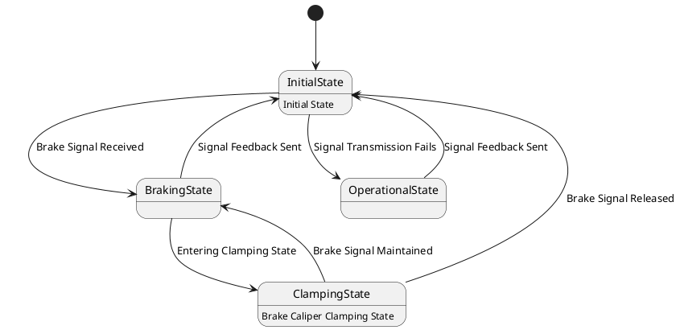

# Pair `0041`：NL + PlantUML STM0 + FCSTM STM0

[上一组 `0040`](../0040/README.md) | [返回 60 组索引](../../PAIR_INDEX.md) | [下一组 `0042`](../0042/README.md)

- LLM：`DeepSeek`
- 模型/场景：State machine diagram of the base brake subsystem
- 作者输出阶段：`Result with Semantic Checking`
- 作者输出单元格：`AE43`；Excel row：`43`
- Phase-I fallback：`false`
- 相对 Phase-I 是否变化：`true`
- Phase-I PlantUML SHA-256：`9dc040506c4abc2dc1dcee5536542e17a8b464277dc7f108c2a94941e969675e`
- NL SHA-256：`abb20a2187c100d7c75a3038df101c91b369df70a07dfafd6eafc72da859fc99`
- PlantUML SHA-256：`e574376ae58008bc3a246f72be7d4a125ae6846baa8d18045aeadf606839e1a4`
- FCSTM SHA-256：`9ca8bbb255d959d2b7d4142ed0d3d2fd48f0a12437ad6e68137142b5df5cd422`
- 结构裁决：`structure_preserved`
- source states / transitions：`4` / `8`
- mapped / blocked / silent drop：`8` / `0` / `0`
- final / lifecycle / body coverage：`0/0` / `0/0` / `2/2`
- concurrent region / separator coverage：`0/0` / `0/0`
- source normalization coverage：`0/0`
- official raw / validation：`state_diagram` / `state_diagram`
- official identity states / transitions：`4` / `8`
- official identity remaps：state `0` / transition endpoint `0`
- AST audit：`passed`
- FCSTM execution eligible：`false`
- Discover eligible：`false`
- 主 session 对读：完整对读：制动子系统 4 状态、8 条边和两个 body 逐项对应；Clamping 的 maintained/released 双出口与 Operational/Braking 两条同名反馈返回均未合并或遗漏。
- 三个原始文件：[NL](./nl.txt) | [PlantUML](./plantuml.puml) | [FCSTM](./fcstm.fcstm)
- 审计入口：[canonical](../../canonical/llms_emp_feedback_final_0041.json) | [冻结 FCSTM](../../fcstm/llms_emp_feedback_final_0041.fcstm) | [case report](../../case_reports/llms_emp_feedback_final_0041.json) | [人工总账](../../MANUAL_REVIEW.md)

## 作者阶段 lineage

| stage | output cell | present | output SHA-256 | feedback | resolved |
|---|---|---|---|---|---|
| `phase_i_generation` | `I43` | `true` | `9dc040506c4abc2dc1dcee5536542e17a8b464277dc7f108c2a94941e969675e` | - | - |
| `phase_ii_format` | `U43` | `true` | `566d10146e2e3b6bc3d510cbe29ece0c2dfa104ea0f4230be1989f6fe3112b2e` | syntax error: stm BasicBrakingDevice [State Machine Diagram] | YES |
| `phase_ii_grammar` | `Z43` | `false` | `-` | - | - |
| `phase_ii_semantic` | `AE43` | `true` | `e574376ae58008bc3a246f72be7d4a125ae6846baa8d18045aeadf606839e1a4` | 1. missing transition and states | - |

## Official identity ledger

- status：`aligned`
- canonical / official states：`4` / `4`
- aligned transition endpoints：`8`

本组 state identity 无需重映射。

本组 transition endpoint 无需重映射。

## Source normalization ledger

本组没有 source-input normalization。

## Concurrent region ledger

本组没有 PlantUML orthogonal/concurrent region separator。

## Operational debt

| reason code | count |
|---|---:|
| `R45.DEBT.opaque_state_body_semantics` | 2 |
| `R45.DEBT.opaque_transition_label_semantics` | 7 |

## NL

```text
1 This state machine model represents the train's basic braking device, which serves as the final execution unit for train braking operations.
2 When the basic braking device receives a brake signal, it transitions from the initial state to the braking state. If the signal transmission fails, it proceeds to the operational state. Once the signal feedback is sent, it returns to the initial state.
3 After entering the braking state, the system transitions to the brake caliper clamping state.
```

## 作者 Phase-II 最终 PlantUML STM0



## 转换后 FCSTM STM0

```fcstm
state llms_emp_feedback_final_0041 named "llms_emp_feedback_final_0041" {
    event Brake_Signal_Received named "Brake Signal Received";
    event Signal_Transmission_Fails named "Signal Transmission Fails";
    event Entering_Clamping_State named "Entering Clamping State";
    event Brake_Signal_Maintained named "Brake Signal Maintained";
    event Brake_Signal_Released named "Brake Signal Released";
    event Signal_Feedback_Sent named "Signal Feedback Sent";
    state InitialState named "InitialState\n[PlantUML body] Initial State";
    state BrakingState named "BrakingState";
    state OperationalState named "OperationalState";
    state ClampingState named "ClampingState\n[PlantUML body] Brake Caliper Clamping State";
    [*] -> InitialState;
    InitialState -> BrakingState : /Brake_Signal_Received;
    InitialState -> OperationalState : /Signal_Transmission_Fails;
    BrakingState -> ClampingState : /Entering_Clamping_State;
    ClampingState -> BrakingState : /Brake_Signal_Maintained;
    ClampingState -> InitialState : /Brake_Signal_Released;
    OperationalState -> InitialState : /Signal_Feedback_Sent;
    BrakingState -> InitialState : /Signal_Feedback_Sent;
}
```

[上一组 `0040`](../0040/README.md) | [返回 60 组索引](../../PAIR_INDEX.md) | [下一组 `0042`](../0042/README.md)
