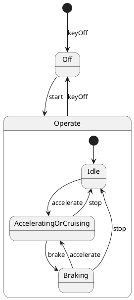

# Pair `0042`：NL + PlantUML STM0 + FCSTM STM0

[上一组 `0041`](../0041/README.md) | [返回 60 组索引](../../PAIR_INDEX.md) | [下一组 `0043`](../0043/README.md)

- LLM：`DeepSeek`
- 模型/场景：Hybrid Sport Utility Vehicle, HSUV
- 作者输出阶段：`Result with Semantic Checking`
- 作者输出单元格：`AE44`；Excel row：`44`
- Phase-I fallback：`false`
- 相对 Phase-I 是否变化：`true`
- Phase-I PlantUML SHA-256：`29fbe0d61ae3a876eff04656b538e326ef8e93b3df83da0bda9be7bcfb07eb97`
- NL SHA-256：`9fe426ba761d5a52c3b670f35410502a5289bdd9489c4a9bfa983e34d565040c`
- PlantUML SHA-256：`070fde750a28a8620c28503a159f148cb3b7adaf236037ca45a7b4af5f5522c7`
- FCSTM SHA-256：`2b67953d14172679c54c1bb96efd0f0a7f5f5f0d4e4e1c48f6a943b8ffbe2ecb`
- review subject SHA-256：`ed755b3246447e2916eb8a747b6f01fe8bd88a44a0b7dcbfba908c71ac6cf74a`
- working contract SHA-256：`621f38b97cd68d2289b7bbced526fb219fc6ef00953f820ea4e3eca628600f65`
- 结构裁决：`structure_preserved`
- source states / transitions：`5` / `9`
- mapped / blocked / silent drop：`9` / `0` / `0`
- final / lifecycle / body coverage：`0/0` / `0/0` / `0/0`
- concurrent region / separator coverage：`0/0` / `0/0`
- source normalization coverage：`0/0`
- official raw / validation：`state_diagram` / `state_diagram`
- official identity states / transitions：`5` / `9`
- official identity remaps：state `0` / transition endpoint `0`
- AST audit：`passed`
- legacy whole-model FCSTM execution / Discover：`false` / `false`
- working bundle usage gate：`discover_input_with_capability_mask`
- ownership source / compiler / agent：`14` / `17` / `0`
- source macro / positive identity trace / conversion boundary trace：`9` / `14` / `0`
- capability source-static / simulation / transition-trace：`eligible_with_exclusions` / `ineligible` / `ineligible`
- compiler-only diagnostic policy：`rejected_conversion_artifact`；main-result conversion artifact limit：`0`
- 主 session 对读：`pass`；ownership/macro/capability 均为 `pass`；Case 0042 passes conversion-attribution review. This does not assert NL/PlantUML correctness or runtime equivalence; authored defects remain eligible for later source-grounded Discover. No conversion-specific blocker was found in the exact reviewed occurrences. Fresh v6 main-session review re-read NL, PlantUML, FCSTM, working contract, and source trace after the portable Java identity change; source/FCSTM/trace bytes are unchanged and verification remains fail-closed.
- source anchors：`source-ref:llms_emp_feedback_final_0042.puml:line:6\|state Operate {, source-ref:llms_emp_feedback_final_0042.puml:line:11\|Braking --> Idle : stop`；FCSTM anchors：`element-ref:source:state:Operate@line:8\|state Operate named "Operate" {, element-ref:compiler:transition_segment:tr_0008:segment:1@line:16\|Braking -> Idle : /stop;`
- 三个原始文件：[NL](./nl.txt) | [PlantUML](./plantuml.puml) | [FCSTM](./fcstm.fcstm)
- 审计入口：[canonical](../../canonical/llms_emp_feedback_final_0042.json) | [冻结 FCSTM](../../fcstm/llms_emp_feedback_final_0042.fcstm) | [case report](../../case_reports/llms_emp_feedback_final_0042.json) | [working contract](../../working_contracts/llms_emp_feedback_final_0042.json) | [source trace](../../source_traces/llms_emp_feedback_final_0042.json) | [人工总账](../../MANUAL_REVIEW.md)

## 主 session 三方语义对应

| projection | assessment | NL anchor | PlantUML anchor | FCSTM anchor | source roots | compiler members | rationale |
|---|---|---|---|---|---|---|---|
| `direct` | `preserved` | Operate | source-ref:llms_emp_feedback_final_0042.puml:line:6\|state Operate { | element-ref:source:state:Operate@line:8\|state Operate named "Operate" { | source:state:Operate | - | Case 0042 binds source:state:Operate to the exact authored occurrence 'state Operate {'; it is present as a direct FCSTM state projection with the same source identity and parent relation. |
| `macro` | `preserved_with_exclusions` | Braking | source-ref:llms_emp_feedback_final_0042.puml:line:11\|Braking --> Idle : stop | element-ref:compiler:transition_segment:tr_0008:segment:1@line:16\|Braking -> Idle : /stop; | source:transition:tr_0008 | compiler:transition_segment:tr_0008:segment:1 | Case 0042 binds source:transition:tr_0008 to the exact authored occurrence 'Braking --> Idle : stop'; it is present as a source-owned transition root whose cited FCSTM line belongs to a protected compiler macro; the raw label remains opaque. |

## Risk occurrence 第二遍复核

| obligation | risk tag | assessment | PlantUML evidence | FCSTM evidence | ownership evidence | rationale |
|---|---|---|---|---|---|---|
| `review:multi_segment_macro:0001:tr_0001` | `multi_segment_macro` | `compiler_artifact_excluded` | source-ref:llms_emp_feedback_final_0042.puml:line:2\|[*] --> Off : keyOff | element-ref:compiler:state:llms_emp_feedback_final_0042.InitialWaittr_0001@line:7\|state InitialWaittr_0001 named "Awaiting initial event: keyOff";, element-ref:compiler:transition_segment:tr_0001:segment:1@line:20\|[*] -> InitialWaittr_0001;, element-ref:compiler:transition_segment:tr_0001:segment:2@line:21\|InitialWaittr_0001 -> Off : /keyOff; | compiler:state:llms_emp_feedback_final_0042.InitialWaittr_0001, compiler:transition_segment:tr_0001:segment:1, compiler:transition_segment:tr_0001:segment:2, source:transition:tr_0001 | Case 0042 risk multi_segment_macro occurrence review:multi_segment_macro:0001:tr_0001: The single authored transition remains one source-owned semantic root; all bound FCSTM segments are protected compiler artifacts and cannot become repair targets. |
| `review:synthetic_state:0002:001-InitialWaittr_0001` | `synthetic_state` | `compiler_artifact_excluded` | source-ref:llms_emp_feedback_final_0042.puml:line:2\|[*] --> Off : keyOff | element-ref:compiler:state:llms_emp_feedback_final_0042.InitialWaittr_0001@line:7\|state InitialWaittr_0001 named "Awaiting initial event: keyOff"; | compiler:state:llms_emp_feedback_final_0042.InitialWaittr_0001, source:transition:tr_0001 | Case 0042 risk synthetic_state occurrence review:synthetic_state:0002:001-InitialWaittr_0001: The helper state is a protected compiler-owned projection for a source structural fact; diagnostics on the helper itself are conversion artifacts. |

## 作者阶段 lineage

| stage | output cell | present | output SHA-256 | feedback | resolved |
|---|---|---|---|---|---|
| `phase_i_generation` | `I44` | `true` | `29fbe0d61ae3a876eff04656b538e326ef8e93b3df83da0bda9be7bcfb07eb97` | - | - |
| `phase_ii_format` | `U44` | `true` | `070fde750a28a8620c28503a159f148cb3b7adaf236037ca45a7b4af5f5522c7` | syntax error: stm DeviceStateMachine | YES |
| `phase_ii_grammar` | `Z44` | `false` | `-` | - | - |
| `phase_ii_semantic` | `AE44` | `true` | `070fde750a28a8620c28503a159f148cb3b7adaf236037ca45a7b4af5f5522c7` | None | - |

## Official identity ledger

- status：`aligned`
- canonical / official states：`5` / `5`
- aligned transition endpoints：`9`

本组 state identity 无需重映射。

本组 transition endpoint 无需重映射。

## Source normalization ledger

本组没有 source-input normalization。

## Concurrent region ledger

本组没有 PlantUML orthogonal/concurrent region separator。

## Operational debt

| reason code | count |
|---|---:|
| `R45.DEBT.opaque_transition_label_semantics` | 8 |

## NL

```text
1. Once the device is powered on, the system enters the `Operate` state, and based on user actions, it transitions between `Idle`, `Accelerating or Cruising`, and `Braking` states.
2. The system can be turned on with the `start` signal and turned off with the `keyOff` signal.
3. Within the `Operate` state, the system transitions between different substates depending on actions like accelerating, braking, or stopping.
```

## 作者 Phase-II 最终 PlantUML STM0



## 转换后 FCSTM STM0

```fcstm
state llms_emp_feedback_final_0042 named "llms_emp_feedback_final_0042" {
    event keyOff named "keyOff";
    event start named "start";
    event accelerate named "accelerate";
    event stop named "stop";
    event brake named "brake";
    state InitialWaittr_0001 named "Awaiting initial event: keyOff";
    state Operate named "Operate" {
        state Idle named "Idle";
        state AcceleratingOrCruising named "AcceleratingOrCruising";
        state Braking named "Braking";
        [*] -> Idle;
        Idle -> AcceleratingOrCruising : /accelerate;
        AcceleratingOrCruising -> Idle : /stop;
        AcceleratingOrCruising -> Braking : /brake;
        Braking -> Idle : /stop;
        Braking -> AcceleratingOrCruising : /accelerate;
    }
    state Off named "Off";
    [*] -> InitialWaittr_0001;
    InitialWaittr_0001 -> Off : /keyOff;
    Off -> Operate : /start;
    !Operate -> Off : /keyOff;
}
```

[上一组 `0041`](../0041/README.md) | [返回 60 组索引](../../PAIR_INDEX.md) | [下一组 `0043`](../0043/README.md)
