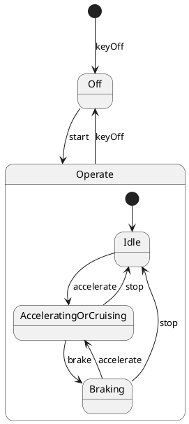

# Pair `0042`：NL + PlantUML STM0 + FCSTM STM0

[上一组 `0041`](../0041/README.md) | [返回 60 组索引](../../PAIR_INDEX.md) | [下一组 `0043`](../0043/README.md)

- LLM：`DeepSeek`
- 模型/场景：Hybrid Sport Utility Vehicle, HSUV
- 作者输出阶段：`Result with Semantic Checking`
- 作者输出单元格：`AE44`；Excel row：`44`
- Phase-I fallback：`false`
- 相对 Phase-I 是否变化：`true`
- Phase-I PlantUML SHA-256：`29fbe0d61ae3a876eff04656b538e326ef8e93b3df83da0bda9be7bcfb07eb97`
- NL SHA-256：`9fe426ba761d5a52c3b670f35410502a5289bdd9489c4a9bfa983e34d565040c`
- PlantUML SHA-256：`070fde750a28a8620c28503a159f148cb3b7adaf236037ca45a7b4af5f5522c7`
- FCSTM SHA-256：`2b67953d14172679c54c1bb96efd0f0a7f5f5f0d4e4e1c48f6a943b8ffbe2ecb`
- 结构裁决：`structure_preserved`
- source states / transitions：`5` / `9`
- mapped / blocked / silent drop：`9` / `0` / `0`
- final / lifecycle / body coverage：`0/0` / `0/0` / `0/0`
- concurrent region / separator coverage：`0/0` / `0/0`
- source normalization coverage：`0/0`
- official raw / validation：`state_diagram` / `state_diagram`
- official identity states / transitions：`5` / `9`
- official identity remaps：state `0` / transition endpoint `0`
- AST audit：`passed`
- FCSTM execution eligible：`false`
- Discover eligible：`false`
- 主 session 对读：完整对读：Off 与 Operate 三子态共 5 状态、9 边全保留；带 keyOff 的 root initial 使用 wait，Operate 内 Idle 初态及 accelerate/stop/brake 往返链均为直接映射。
- 三个原始文件：[NL](./nl.txt) | [PlantUML](./plantuml.puml) | [FCSTM](./fcstm.fcstm)
- 审计入口：[canonical](../../canonical/llms_emp_feedback_final_0042.json) | [冻结 FCSTM](../../fcstm/llms_emp_feedback_final_0042.fcstm) | [case report](../../case_reports/llms_emp_feedback_final_0042.json) | [人工总账](../../MANUAL_REVIEW.md)

## 作者阶段 lineage

| stage | output cell | present | output SHA-256 | feedback | resolved |
|---|---|---|---|---|---|
| `phase_i_generation` | `I44` | `true` | `29fbe0d61ae3a876eff04656b538e326ef8e93b3df83da0bda9be7bcfb07eb97` | - | - |
| `phase_ii_format` | `U44` | `true` | `070fde750a28a8620c28503a159f148cb3b7adaf236037ca45a7b4af5f5522c7` | syntax error: stm DeviceStateMachine | YES |
| `phase_ii_grammar` | `Z44` | `false` | `-` | - | - |
| `phase_ii_semantic` | `AE44` | `true` | `070fde750a28a8620c28503a159f148cb3b7adaf236037ca45a7b4af5f5522c7` | None | - |

## Official identity ledger

- status：`aligned`
- canonical / official states：`5` / `5`
- aligned transition endpoints：`9`

本组 state identity 无需重映射。

本组 transition endpoint 无需重映射。

## Source normalization ledger

本组没有 source-input normalization。

## Concurrent region ledger

本组没有 PlantUML orthogonal/concurrent region separator。

## Operational debt

| reason code | count |
|---|---:|
| `R45.DEBT.opaque_transition_label_semantics` | 8 |

## NL

```text
1. Once the device is powered on, the system enters the `Operate` state, and based on user actions, it transitions between `Idle`, `Accelerating or Cruising`, and `Braking` states.
2. The system can be turned on with the `start` signal and turned off with the `keyOff` signal.
3. Within the `Operate` state, the system transitions between different substates depending on actions like accelerating, braking, or stopping.
```

## 作者 Phase-II 最终 PlantUML STM0



## 转换后 FCSTM STM0

```fcstm
state llms_emp_feedback_final_0042 named "llms_emp_feedback_final_0042" {
    event keyOff named "keyOff";
    event start named "start";
    event accelerate named "accelerate";
    event stop named "stop";
    event brake named "brake";
    state InitialWaittr_0001 named "Awaiting initial event: keyOff";
    state Operate named "Operate" {
        state Idle named "Idle";
        state AcceleratingOrCruising named "AcceleratingOrCruising";
        state Braking named "Braking";
        [*] -> Idle;
        Idle -> AcceleratingOrCruising : /accelerate;
        AcceleratingOrCruising -> Idle : /stop;
        AcceleratingOrCruising -> Braking : /brake;
        Braking -> Idle : /stop;
        Braking -> AcceleratingOrCruising : /accelerate;
    }
    state Off named "Off";
    [*] -> InitialWaittr_0001;
    InitialWaittr_0001 -> Off : /keyOff;
    Off -> Operate : /start;
    !Operate -> Off : /keyOff;
}
```

[上一组 `0041`](../0041/README.md) | [返回 60 组索引](../../PAIR_INDEX.md) | [下一组 `0043`](../0043/README.md)
