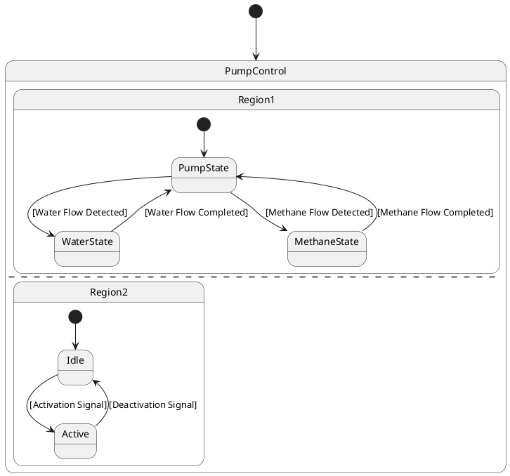

# Pair `0043`：NL + PlantUML STM0 + FCSTM STM0

[上一组 `0042`](../0042/README.md) | [返回 60 组索引](../../PAIR_INDEX.md) | [下一组 `0044`](../0044/README.md)

- LLM：`DeepSeek`
- 模型/场景：Pump Control state machine
- 作者输出阶段：`Result with Semantic Checking`
- 作者输出单元格：`AE45`；Excel row：`45`
- Phase-I fallback：`false`
- 相对 Phase-I 是否变化：`true`
- Phase-I PlantUML SHA-256：`aebd7f70f2529017cb257c1b3001e18cadc8222c085b3cf7a33aada16cfb3bd1`
- NL SHA-256：`a391765dba935d89e6d2467c97b218c0136d106ea9c00bac91e6525e28ac04f1`
- PlantUML SHA-256：`8bc45430d366c7bb9ac30e65bd644f947f805ea11e5d359480fe55053b846baa`
- FCSTM SHA-256：`dedab1ad7f3f03a0871a1648e094c7688833ad9b7fc702f4117d3fc30323ff4b`
- review subject SHA-256：`7c4c56b54d00c14b12825a6aaccd1a6c7a35b156cb63fcf8b3084bdbd8833c0c`
- working contract SHA-256：`b578a7b74761041efe5aa5ed0ccee2fcaacb50428058c83d7460cbe3546b92d2`
- 结构裁决：`structure_preserved`
- source states / transitions：`8` / `9`
- mapped / blocked / silent drop：`9` / `0` / `0`
- final / lifecycle / body coverage：`0/0` / `0/0` / `0/0`
- concurrent region / separator coverage：`2/2` / `1/1`
- source normalization coverage：`0/0`
- official raw / validation：`state_diagram` / `state_diagram`
- official identity states / transitions：`8` / `9`
- official identity remaps：state `0` / transition endpoint `0`
- AST audit：`passed`
- legacy whole-model FCSTM execution / Discover：`false` / `false`
- working bundle usage gate：`discover_input_with_capability_mask`
- ownership source / compiler / agent：`19` / `18` / `0`
- source macro / positive identity trace / conversion boundary trace：`11` / `19` / `0`
- capability source-static / simulation / transition-trace：`eligible_with_exclusions` / `ineligible` / `ineligible`
- compiler-only diagnostic policy：`rejected_conversion_artifact`；main-result conversion artifact limit：`0`
- 主 session 对读：`pass`；ownership/macro/capability 均为 `pass`；Case 0043 passes conversion-attribution review. This does not assert NL/PlantUML correctness or runtime equivalence; authored defects remain eligible for later source-grounded Discover. No conversion-specific blocker was found in the exact reviewed occurrences. Fresh v6 main-session review re-read NL, PlantUML, FCSTM, working contract, and source trace after the portable Java identity change; source/FCSTM/trace bytes are unchanged and verification remains fail-closed.
- source anchors：`source-ref:llms_emp_feedback_final_0043.puml:line:4\|state PumpControl {, source-ref:llms_emp_feedback_final_0043.puml:line:7\|PumpState --> WaterState : [Water Flow Detected]`；FCSTM anchors：`element-ref:source:state:PumpControl@line:8\|state PumpControl named "PumpControl\n[PlantUML concurrent region 0] states=PumpControl.Region1; transitions=-\n[PlantUML concurrent region 1] states=PumpControl.Region2; transitions=-\n[PlantUML concurrent separator] region 0 -> 1 at llms_emp_feedback_final_0043.puml:line:12" {, element-ref:compiler:transition_segment:tr_0003:segment:1@line:15\|PumpState -> WaterState : /_Water_Flow_Detected;`
- 三个原始文件：[NL](./nl.txt) | [PlantUML](./plantuml.puml) | [FCSTM](./fcstm.fcstm)
- 审计入口：[canonical](../../canonical/llms_emp_feedback_final_0043.json) | [冻结 FCSTM](../../fcstm/llms_emp_feedback_final_0043.fcstm) | [case report](../../case_reports/llms_emp_feedback_final_0043.json) | [working contract](../../working_contracts/llms_emp_feedback_final_0043.json) | [source trace](../../source_traces/llms_emp_feedback_final_0043.json) | [人工总账](../../MANUAL_REVIEW.md)

## 主 session 三方语义对应

| projection | assessment | NL anchor | PlantUML anchor | FCSTM anchor | source roots | compiler members | rationale |
|---|---|---|---|---|---|---|---|
| `direct` | `preserved` | PumpControl | source-ref:llms_emp_feedback_final_0043.puml:line:4\|state PumpControl { | element-ref:source:state:PumpControl@line:8\|state PumpControl named "PumpControl\n[PlantUML concurrent region 0] states=PumpControl.Region1; transitions=-\n[PlantUML concurrent region 1] states=PumpControl.Region2; transitions=-\n[PlantUML concurrent separator] region 0 -> 1 at llms_emp_feedback_final_0043.puml:line:12" { | source:state:PumpControl | - | Case 0043 binds source:state:PumpControl to the exact authored occurrence 'state PumpControl {'; it is present as a direct FCSTM state projection with the same source identity and parent relation. |
| `macro` | `preserved_with_exclusions` | WaterState | source-ref:llms_emp_feedback_final_0043.puml:line:7\|PumpState --> WaterState : [Water Flow Detected] | element-ref:compiler:transition_segment:tr_0003:segment:1@line:15\|PumpState -> WaterState : /_Water_Flow_Detected; | source:transition:tr_0003 | compiler:transition_segment:tr_0003:segment:1 | Case 0043 binds source:transition:tr_0003 to the exact authored occurrence 'PumpState --> WaterState : [Water Flow Detected]'; it is present as a source-owned transition root whose cited FCSTM line belongs to a protected compiler macro; the raw label remains opaque. |

## Risk occurrence 第二遍复核

| obligation | risk tag | assessment | PlantUML evidence | FCSTM evidence | ownership evidence | rationale |
|---|---|---|---|---|---|---|
| `review:synthetic_state:0001:001-UnspecifiedInitial` | `synthetic_state` | `compiler_artifact_excluded` | source-ref:llms_emp_feedback_final_0043.puml:line:4\|state PumpControl { | element-ref:compiler:state:llms_emp_feedback_final_0043.PumpControl.UnspecifiedInitial@line:9\|state UnspecifiedInitial named "Unspecified initial";, element-ref:source:state:PumpControl@line:8\|state PumpControl named "PumpControl\n[PlantUML concurrent region 0] states=PumpControl.Region1; transitions=-\n[PlantUML concurrent region 1] states=PumpControl.Region2; transitions=-\n[PlantUML concurrent separator] region 0 -> 1 at llms_emp_feedback_final_0043.puml:line:12" { | compiler:state:llms_emp_feedback_final_0043.PumpControl.UnspecifiedInitial, source:state:PumpControl | Case 0043 risk synthetic_state occurrence review:synthetic_state:0001:001-UnspecifiedInitial: The helper state is a protected compiler-owned projection for a source structural fact; diagnostics on the helper itself are conversion artifacts. |
| `review:concurrent_region:0002:PumpControl:region:0` | `concurrent_region` | `capability_excluded` | source-ref:llms_emp_feedback_final_0043.puml:line:12\|-- | element-ref:source:region:PumpControl:region:0@line:8\|state PumpControl named "PumpControl\n[PlantUML concurrent region 0] states=PumpControl.Region1; transitions=-\n[PlantUML concurrent region 1] states=PumpControl.Region2; transitions=-\n[PlantUML concurrent separator] region 0 -> 1 at llms_emp_feedback_final_0043.puml:line:12" { | source:region:PumpControl:region:0 | Case 0043 risk concurrent_region occurrence review:concurrent_region:0002:PumpControl:region:0: The authored region occurrence and its FCSTM metadata projection are present, while executable orthogonal-region semantics remain capability-excluded. |
| `review:concurrent_region:0003:PumpControl:region:1` | `concurrent_region` | `capability_excluded` | source-ref:llms_emp_feedback_final_0043.puml:line:12\|-- | element-ref:source:region:PumpControl:region:1@line:8\|state PumpControl named "PumpControl\n[PlantUML concurrent region 0] states=PumpControl.Region1; transitions=-\n[PlantUML concurrent region 1] states=PumpControl.Region2; transitions=-\n[PlantUML concurrent separator] region 0 -> 1 at llms_emp_feedback_final_0043.puml:line:12" { | source:region:PumpControl:region:1 | Case 0043 risk concurrent_region occurrence review:concurrent_region:0003:PumpControl:region:1: The authored region occurrence and its FCSTM metadata projection are present, while executable orthogonal-region semantics remain capability-excluded. |

## 作者阶段 lineage

| stage | output cell | present | output SHA-256 | feedback | resolved |
|---|---|---|---|---|---|
| `phase_i_generation` | `I45` | `true` | `aebd7f70f2529017cb257c1b3001e18cadc8222c085b3cf7a33aada16cfb3bd1` | - | - |
| `phase_ii_format` | `U45` | `true` | `f08b0a4f64ee845a6936e5bcc492e9ac1c4a739a0a2ded357b7d684d88ee2653` | syntax error: stm PumpControlSystem [Pump Control State Machine] | YES |
| `phase_ii_grammar` | `Z45` | `false` | `-` | - | - |
| `phase_ii_semantic` | `AE45` | `true` | `8bc45430d366c7bb9ac30e65bd644f947f805ea11e5d359480fe55053b846baa` | 1. missing regions | 1.0 |

## Official identity ledger

- status：`aligned`
- canonical / official states：`8` / `8`
- aligned transition endpoints：`9`

本组 state identity 无需重映射。

本组 transition endpoint 无需重映射。

## Source normalization ledger

本组没有 source-input normalization。

## Concurrent region ledger

| owner | region | direct states | direct transitions | separator before | separator after |
|---|---:|---|---|---|---|
| `PumpControl` | 0 | PumpControl.Region1 | - | - | llms_emp_feedback_final_0043.puml:line:12 |
| `PumpControl` | 1 | PumpControl.Region2 | - | llms_emp_feedback_final_0043.puml:line:12 | - |

## Operational debt

| reason code | count |
|---|---:|
| `R45.DEBT.concurrent_region_semantics` | 1 |
| `R45.DEBT.missing_explicit_initial` | 1 |
| `R45.DEBT.opaque_transition_label_semantics` | 6 |

## NL

```text
1. The system begins in the PumpControl state, from which it can transition to different substates based on specific conditions.
2. Within the PumpControl state, there are three main substates: PumpState, WaterState, and MethaneState.
3. The system first transitions to the PumpState substate, where the pump is activated or controlled.
4. The system can also transition to the WaterState substate, indicating that the pump is controlling or monitoring the water flow.
5. Similarly, the system can transition to the MethaneState substate, indicating that the pump is controlling or monitoring the methane flow.
```

## 作者 Phase-II 最终 PlantUML STM0



## 转换后 FCSTM STM0

```fcstm
state llms_emp_feedback_final_0043 named "llms_emp_feedback_final_0043" {
    event _Water_Flow_Detected named "[Water Flow Detected]";
    event _Methane_Flow_Detected named "[Methane Flow Detected]";
    event _Water_Flow_Completed named "[Water Flow Completed]";
    event _Methane_Flow_Completed named "[Methane Flow Completed]";
    event _Activation_Signal named "[Activation Signal]";
    event _Deactivation_Signal named "[Deactivation Signal]";
    state PumpControl named "PumpControl\n[PlantUML concurrent region 0] states=PumpControl.Region1; transitions=-\n[PlantUML concurrent region 1] states=PumpControl.Region2; transitions=-\n[PlantUML concurrent separator] region 0 -> 1 at llms_emp_feedback_final_0043.puml:line:12" {
        state UnspecifiedInitial named "Unspecified initial";
        state Region1 named "Region1" {
            state PumpState named "PumpState";
            state WaterState named "WaterState";
            state MethaneState named "MethaneState";
            [*] -> PumpState;
            PumpState -> WaterState : /_Water_Flow_Detected;
            PumpState -> MethaneState : /_Methane_Flow_Detected;
            WaterState -> PumpState : /_Water_Flow_Completed;
            MethaneState -> PumpState : /_Methane_Flow_Completed;
        }
        state Region2 named "Region2" {
            state Idle named "Idle";
            state Active named "Active";
            [*] -> Idle;
            Idle -> Active : /_Activation_Signal;
            Active -> Idle : /_Deactivation_Signal;
        }
        [*] -> UnspecifiedInitial;
    }
    [*] -> PumpControl;
}
```

[上一组 `0042`](../0042/README.md) | [返回 60 组索引](../../PAIR_INDEX.md) | [下一组 `0044`](../0044/README.md)
