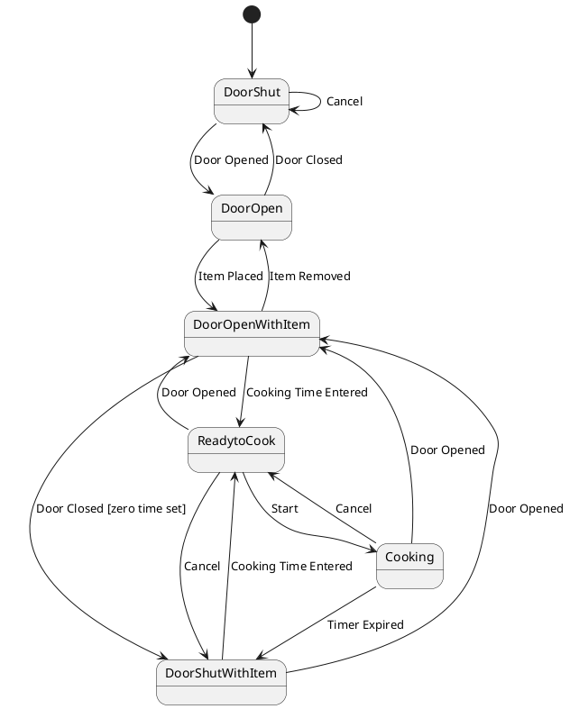

# Pair `0045`：NL + PlantUML STM0 + FCSTM STM0

[上一组 `0044`](../0044/README.md) | [返回 60 组索引](../../PAIR_INDEX.md) | [下一组 `0046`](../0046/README.md)

- LLM：`DeepSeek`
- 模型/场景：Microwave Oven Control with entry and <br> exit actions
- 作者输出阶段：`Result with Semantic Checking`
- 作者输出单元格：`AE47`；Excel row：`47`
- Phase-I fallback：`false`
- 相对 Phase-I 是否变化：`true`
- Phase-I PlantUML SHA-256：`bfe9731bf60d0dc17fd31b89dec3826f9c29be2eeebb752b48b5a1289440425e`
- NL SHA-256：`934e19bd4ae2a793c334fdcf486092d3aa20858f09ae892753ef87698feb061f`
- PlantUML SHA-256：`d419cd364edc48e03ceff9e07cad9c5f51c7656a86dc05ba40c9684f95bafa9e`
- FCSTM SHA-256：`51a66dd724f5b185fa075eccffc9c70e8841646bc90d2f1a39b8dd6ebf1fa3a7`
- review subject SHA-256：`c6d68adfdbd6114152eb113aa54491a3c7eb07afe45eea2022eaf363fadec898`
- working contract SHA-256：`a7ac83bb68bb395a5ff365a3da4e41260b415c0bec9ce4e010079ed6ff900413`
- 结构裁决：`structure_preserved`
- source states / transitions：`6` / `16`
- mapped / blocked / silent drop：`16` / `0` / `0`
- final / lifecycle / body coverage：`0/0` / `0/0` / `0/0`
- concurrent region / separator coverage：`0/0` / `0/0`
- source normalization coverage：`0/0`
- official raw / validation：`state_diagram` / `state_diagram`
- official identity states / transitions：`6` / `16`
- official identity remaps：state `0` / transition endpoint `0`
- AST audit：`passed`
- legacy whole-model FCSTM execution / Discover：`false` / `false`
- working bundle usage gate：`discover_input_with_capability_mask`
- ownership source / compiler / agent：`22` / `26` / `0`
- source macro / positive identity trace / conversion boundary trace：`16` / `22` / `0`
- capability source-static / simulation / transition-trace：`eligible_with_exclusions` / `ineligible` / `ineligible`
- compiler-only diagnostic policy：`rejected_conversion_artifact`；main-result conversion artifact limit：`0`
- 主 session 对读：`pass`；ownership/macro/capability 均为 `pass`；Case 0045 passes conversion-attribution review. This does not assert NL/PlantUML correctness or runtime equivalence; authored defects remain eligible for later source-grounded Discover. No conversion-specific blocker was found in the exact reviewed occurrences. Fresh v6 main-session review re-read NL, PlantUML, FCSTM, working contract, and source trace after the portable Java identity change; source/FCSTM/trace bytes are unchanged and verification remains fail-closed.
- source anchors：`source-ref:llms_emp_feedback_final_0045.puml:line:3\|state "DoorShut" as DoorShut, source-ref:llms_emp_feedback_final_0045.puml:line:12\|DoorShut --> DoorOpen : Door Opened`；FCSTM anchors：`element-ref:source:state:DoorShut@line:11\|state DoorShut named "DoorShut";, element-ref:compiler:transition_segment:tr_0002:segment:1@line:18\|DoorShut -> DoorOpen : /Door_Opened;`
- 三个原始文件：[NL](./nl.txt) | [PlantUML](./plantuml.puml) | [FCSTM](./fcstm.fcstm)
- 审计入口：[canonical](../../canonical/llms_emp_feedback_final_0045.json) | [冻结 FCSTM](../../fcstm/llms_emp_feedback_final_0045.fcstm) | [case report](../../case_reports/llms_emp_feedback_final_0045.json) | [working contract](../../working_contracts/llms_emp_feedback_final_0045.json) | [source trace](../../source_traces/llms_emp_feedback_final_0045.json) | [人工总账](../../MANUAL_REVIEW.md)

## 主 session 三方语义对应

| projection | assessment | NL anchor | PlantUML anchor | FCSTM anchor | source roots | compiler members | rationale |
|---|---|---|---|---|---|---|---|
| `direct` | `preserved` | DoorShut | source-ref:llms_emp_feedback_final_0045.puml:line:3\|state "DoorShut" as DoorShut | element-ref:source:state:DoorShut@line:11\|state DoorShut named "DoorShut"; | source:state:DoorShut | - | Case 0045 binds source:state:DoorShut to the exact authored occurrence 'state "DoorShut" as DoorShut'; it is present as a direct FCSTM state projection with the same source identity and parent relation. |
| `macro` | `preserved_with_exclusions` | Door Opened | source-ref:llms_emp_feedback_final_0045.puml:line:12\|DoorShut --> DoorOpen : Door Opened | element-ref:compiler:transition_segment:tr_0002:segment:1@line:18\|DoorShut -> DoorOpen : /Door_Opened; | source:transition:tr_0002 | compiler:transition_segment:tr_0002:segment:1 | Case 0045 binds source:transition:tr_0002 to the exact authored occurrence 'DoorShut --> DoorOpen : Door Opened'; it is present as a source-owned transition root whose cited FCSTM line belongs to a protected compiler macro; the raw label remains opaque. |

## Risk occurrence 第二遍复核

本组不要求 risk-tag 第二遍复核。

## 作者阶段 lineage

| stage | output cell | present | output SHA-256 | feedback | resolved |
|---|---|---|---|---|---|
| `phase_i_generation` | `I47` | `true` | `bfe9731bf60d0dc17fd31b89dec3826f9c29be2eeebb752b48b5a1289440425e` | - | - |
| `phase_ii_format` | `U47` | `true` | `aa067f92f2486b54bde118155b987e714da23c000bf548318fa0d8fa1e0ee815` | syntax error: stm MicrowaveStateMachine [Microwave State Machine] | YES |
| `phase_ii_grammar` | `Z47` | `false` | `-` | - | - |
| `phase_ii_semantic` | `AE47` | `true` | `d419cd364edc48e03ceff9e07cad9c5f51c7656a86dc05ba40c9684f95bafa9e` | 1. duplicated use of composite state<br>2. interaction error | 1.0 |

## Official identity ledger

- status：`aligned`
- canonical / official states：`6` / `6`
- aligned transition endpoints：`16`

本组 state identity 无需重映射。

本组 transition endpoint 无需重映射。

## Source normalization ledger

本组没有 source-input normalization。

## Concurrent region ledger

本组没有 PlantUML orthogonal/concurrent region separator。

## Operational debt

| reason code | count |
|---|---:|
| `R45.DEBT.opaque_transition_label_semantics` | 15 |

## NL

```text
1. The microwave starts in the DoorShut state. From this state, the system can either remain in DoorShut if a Cancel action is performed or transition to the DoorOpen state when the door is opened.
2. When the Door Opened action occurs in the DoorShut state, the system transitions to the DoorOpen state. The door can be closed to return to the DoorShut state.
3. In the DoorOpen state, placing an item inside the microwave transitions the system to DoorOpenWithItem. If the item is removed, the system returns to DoorOpen.
4. From DoorOpenWithItem, the system can transition to DoorShutWithItem if the door is closed with zero time set or to ReadytoCook if cooking time is entered.
5. In the DoorShutWithItem state, opening the door transitions the system back to DoorOpenWithItem, while entering cooking time takes the system to ReadytoCook, where the cooking time is displayed and updated.
6. In the ReadytoCook state, if the Cancel action is performed, the system returns to DoorShutWithItem, canceling or updating the cooking time. If the door is opened, the system transitions to DoorOpenWithItem.
7. When the Start action is performed in ReadytoCook, the system transitions to the Cooking state, where the timer starts.
8. In the Cooking state, opening the door stops the timer and the system transitions to DoorOpenWithItem, while if the timer expires, the system moves to DoorShutWithItem. A Cancel action transitions the system back to ReadytoCook.
```

## 作者 Phase-II 最终 PlantUML STM0



## 转换后 FCSTM STM0

```fcstm
state llms_emp_feedback_final_0045 named "llms_emp_feedback_final_0045" {
    event Door_Opened named "Door Opened";
    event Cancel named "Cancel";
    event Door_Closed named "Door Closed";
    event Item_Placed named "Item Placed";
    event Item_Removed named "Item Removed";
    event Door_Closed_zero_time_set named "Door Closed [zero time set]";
    event Cooking_Time_Entered named "Cooking Time Entered";
    event Start named "Start";
    event Timer_Expired named "Timer Expired";
    state DoorShut named "DoorShut";
    state DoorOpen named "DoorOpen";
    state DoorOpenWithItem named "DoorOpenWithItem";
    state DoorShutWithItem named "DoorShutWithItem";
    state ReadytoCook named "ReadytoCook";
    state Cooking named "Cooking";
    [*] -> DoorShut;
    DoorShut -> DoorOpen : /Door_Opened;
    DoorShut -> DoorShut : /Cancel;
    DoorOpen -> DoorShut : /Door_Closed;
    DoorOpen -> DoorOpenWithItem : /Item_Placed;
    DoorOpenWithItem -> DoorOpen : /Item_Removed;
    DoorOpenWithItem -> DoorShutWithItem : /Door_Closed_zero_time_set;
    DoorOpenWithItem -> ReadytoCook : /Cooking_Time_Entered;
    DoorShutWithItem -> DoorOpenWithItem : /Door_Opened;
    DoorShutWithItem -> ReadytoCook : /Cooking_Time_Entered;
    ReadytoCook -> DoorShutWithItem : /Cancel;
    ReadytoCook -> DoorOpenWithItem : /Door_Opened;
    ReadytoCook -> Cooking : /Start;
    Cooking -> DoorOpenWithItem : /Door_Opened;
    Cooking -> DoorShutWithItem : /Timer_Expired;
    Cooking -> ReadytoCook : /Cancel;
}
```

[上一组 `0044`](../0044/README.md) | [返回 60 组索引](../../PAIR_INDEX.md) | [下一组 `0046`](../0046/README.md)
