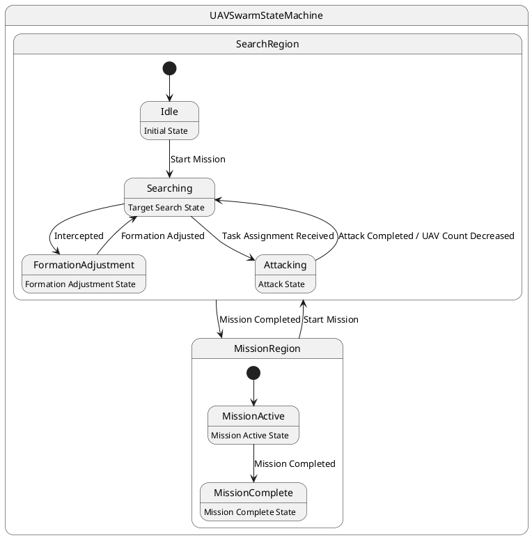

# Pair `0046`：NL + PlantUML STM0 + FCSTM STM0

[上一组 `0045`](../0045/README.md) | [返回 60 组索引](../../PAIR_INDEX.md) | [下一组 `0047`](../0047/README.md)

- LLM：`DeepSeek`
- 模型/场景：UAV swarm state machine diagram
- 作者输出阶段：`Result with Semantic Checking`
- 作者输出单元格：`AE48`；Excel row：`48`
- Phase-I fallback：`false`
- 相对 Phase-I 是否变化：`true`
- Phase-I PlantUML SHA-256：`709704f395b88943b357c62d4b4c1f93cb2b1e09ef0f72f8f26648de311b99fc`
- NL SHA-256：`a01c022f5380700b6c13800497291640b4d64abbadce1d8984be0c14880ebeb3`
- PlantUML SHA-256：`de64704c2571b8915067365e1dfe1b336b93228e5776eeca7fcf92a9a29d9ddc`
- FCSTM SHA-256：`01ea38a2c439aea4a06d866dee2ca8fd52cee5c1120de6d88b3db1da8d8492a5`
- 结构裁决：`structure_preserved`
- source states / transitions：`9` / `10`
- mapped / blocked / silent drop：`10` / `0` / `0`
- final / lifecycle / body coverage：`0/0` / `0/0` / `6/6`
- concurrent region / separator coverage：`0/0` / `0/0`
- source normalization coverage：`0/0`
- official raw / validation：`state_diagram` / `state_diagram`
- official identity states / transitions：`9` / `10`
- official identity remaps：state `0` / transition endpoint `0`
- AST audit：`passed`
- FCSTM execution eligible：`false`
- Discover eligible：`false`
- 主 session 对读：完整对读：UAVSwarmStateMachine、SearchRegion 四态与 MissionRegion 双态共 9 状态、10 边、6 个 body 全保留；root 与 owner 缺 initial 均留债，两个 region 间往返边未被当作并发自动补全。
- 三个原始文件：[NL](./nl.txt) | [PlantUML](./plantuml.puml) | [FCSTM](./fcstm.fcstm)
- 审计入口：[canonical](../../canonical/llms_emp_feedback_final_0046.json) | [冻结 FCSTM](../../fcstm/llms_emp_feedback_final_0046.fcstm) | [case report](../../case_reports/llms_emp_feedback_final_0046.json) | [人工总账](../../MANUAL_REVIEW.md)

## 作者阶段 lineage

| stage | output cell | present | output SHA-256 | feedback | resolved |
|---|---|---|---|---|---|
| `phase_i_generation` | `I48` | `true` | `709704f395b88943b357c62d4b4c1f93cb2b1e09ef0f72f8f26648de311b99fc` | - | - |
| `phase_ii_format` | `U48` | `true` | `b3023ff8047c0dfd30780c30a8e285c085a73de7857077baa08c47655bfa297c` | syntax error: stm UAVSwarmStateMachine [UAV Swarm State Machine] | YES |
| `phase_ii_grammar` | `Z48` | `false` | `-` | - | - |
| `phase_ii_semantic` | `AE48` | `true` | `de64704c2571b8915067365e1dfe1b336b93228e5776eeca7fcf92a9a29d9ddc` | 1. missing regions | - |

## Official identity ledger

- status：`aligned`
- canonical / official states：`9` / `9`
- aligned transition endpoints：`10`

本组 state identity 无需重映射。

本组 transition endpoint 无需重映射。

## Source normalization ledger

本组没有 source-input normalization。

## Concurrent region ledger

本组没有 PlantUML orthogonal/concurrent region separator。

## Operational debt

| reason code | count |
|---|---:|
| `R45.DEBT.missing_explicit_initial` | 2 |
| `R45.DEBT.opaque_state_body_semantics` | 6 |
| `R45.DEBT.opaque_transition_label_semantics` | 8 |

## NL

```text
1 This state machine model describes the state transitions of a UAV swarm.
2 Before the mission is completed, the UAV swarm continuously performs target search tasks, during which it operates within three different state areas.
3 When the UAV swarm is intercepted, it transitions to the formation adjustment state.
4 During flight, if task assignment information is received, it enters the attack state. After completing the attack, the number of UAVs in the swarm decreases accordingly.
```

## 作者 Phase-II 最终 PlantUML STM0



## 转换后 FCSTM STM0

```fcstm
state llms_emp_feedback_final_0046 named "llms_emp_feedback_final_0046" {
    event Start_Mission named "Start Mission";
    event Intercepted named "Intercepted";
    event Task_Assignment_Received named "Task Assignment Received";
    event Formation_Adjusted named "Formation Adjusted";
    event Attack_Completed_UAV_Count_Decreased named "Attack Completed / UAV Count Decreased";
    event Mission_Completed named "Mission Completed";
    state UnspecifiedInitial named "Unspecified initial";
    state UAVSwarmStateMachine named "UAVSwarmStateMachine" {
        state UnspecifiedInitial named "Unspecified initial";
        state SearchRegion named "SearchRegion" {
            state Idle named "Idle\n[PlantUML body] Initial State";
            state Searching named "Searching\n[PlantUML body] Target Search State";
            state FormationAdjustment named "FormationAdjustment\n[PlantUML body] Formation Adjustment State";
            state Attacking named "Attacking\n[PlantUML body] Attack State";
            [*] -> Idle;
            Idle -> Searching : /Start_Mission;
            Searching -> FormationAdjustment : /Intercepted;
            Searching -> Attacking : /Task_Assignment_Received;
            FormationAdjustment -> Searching : /Formation_Adjusted;
            Attacking -> Searching : /Attack_Completed_UAV_Count_Decreased;
        }
        state MissionRegion named "MissionRegion" {
            state MissionActive named "MissionActive\n[PlantUML body] Mission Active State";
            state MissionComplete named "MissionComplete\n[PlantUML body] Mission Complete State";
            [*] -> MissionActive;
            MissionActive -> MissionComplete : /Mission_Completed;
        }
        !SearchRegion -> MissionRegion : /Mission_Completed;
        !MissionRegion -> SearchRegion : /Start_Mission;
        [*] -> UnspecifiedInitial;
    }
    [*] -> UnspecifiedInitial;
}
```

[上一组 `0045`](../0045/README.md) | [返回 60 组索引](../../PAIR_INDEX.md) | [下一组 `0047`](../0047/README.md)
