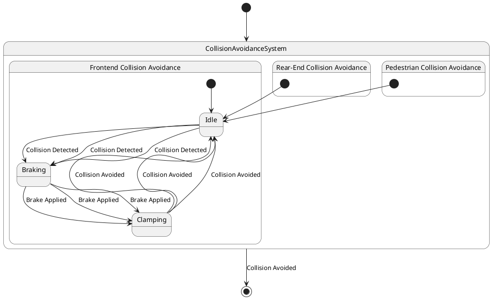

# Pair `0047`：NL + PlantUML STM0 + FCSTM STM0

[上一组 `0046`](../0046/README.md) | [返回 60 组索引](../../PAIR_INDEX.md) | [下一组 `0048`](../0048/README.md)

- LLM：`DeepSeek`
- 模型/场景：Collision avoidance sub-machine state diagram
- 作者输出阶段：`Result with Semantic Checking`
- 作者输出单元格：`AE49`；Excel row：`49`
- Phase-I fallback：`false`
- 相对 Phase-I 是否变化：`true`
- Phase-I PlantUML SHA-256：`fff82632ec465f502612c40dfe4ccf552d9cf88db9e0074d533201587108ebd0`
- NL SHA-256：`49854d044ad99f16a710021500f5e972da93b27635a41144d9b91d32444c0f63`
- PlantUML SHA-256：`4e161360e5cf8af9da41402e70a5c58505252226c290cc1e7cabf4a95acf61a0`
- FCSTM SHA-256：`bc79e2a4617ea93f8eeb79c0bc369533e5baef9f93d7389ba0a7ff2543a49a86`
- 结构裁决：`structure_preserved`
- source states / transitions：`7` / `14`
- mapped / blocked / silent drop：`14` / `0` / `0`
- final / lifecycle / body coverage：`1/1` / `0/0` / `0/0`
- concurrent region / separator coverage：`0/0` / `0/0`
- source normalization coverage：`0/0`
- official raw / validation：`state_diagram` / `state_diagram`
- official identity states / transitions：`7` / `14`
- official identity remaps：state `2` / transition endpoint `6`
- AST audit：`passed`
- FCSTM execution eligible：`false`
- Discover eligible：`false`
- 主 session 对读：完整对读：按官方 first-created identity，RearEnd/Pedestrian 的 Idle/Braking/Clamping 引用复用 Frontend 三实体；7 个官方状态、14 边全保留，两个越界 initial 用 Invalid surrogate，owner 缺 initial 与 root final 明示。
- 三个原始文件：[NL](./nl.txt) | [PlantUML](./plantuml.puml) | [FCSTM](./fcstm.fcstm)
- 审计入口：[canonical](../../canonical/llms_emp_feedback_final_0047.json) | [冻结 FCSTM](../../fcstm/llms_emp_feedback_final_0047.fcstm) | [case report](../../case_reports/llms_emp_feedback_final_0047.json) | [人工总账](../../MANUAL_REVIEW.md)

## 作者阶段 lineage

| stage | output cell | present | output SHA-256 | feedback | resolved |
|---|---|---|---|---|---|
| `phase_i_generation` | `I49` | `true` | `fff82632ec465f502612c40dfe4ccf552d9cf88db9e0074d533201587108ebd0` | - | - |
| `phase_ii_format` | `U49` | `true` | `b238e84a7e1b45c18e0743258fec8e9fb553fca4ac91dce86710f759ff0aad5e` | syntax error: stm CollisionAvoidanceSystem [Collision Avoidance State Machine] | YES |
| `phase_ii_grammar` | `Z49` | `false` | `-` | - | - |
| `phase_ii_semantic` | `AE49` | `true` | `4e161360e5cf8af9da41402e70a5c58505252226c290cc1e7cabf4a95acf61a0` | missing regions | - |

## Official identity ledger

- status：`aligned`
- canonical / official states：`7` / `7`
- aligned transition endpoints：`14`

| source-parser identity | pinned PlantUML identity | raw ref | reason |
|---|---|---|---|
| `CollisionAvoidanceSystem.RearEnd.Idle` | `CollisionAvoidanceSystem.Frontend.Idle` | `llms_emp_feedback_final_0047.puml:line:11` | `official_link_endpoint_identity` |
| `CollisionAvoidanceSystem.Pedestrian.Idle` | `CollisionAvoidanceSystem.Frontend.Idle` | `llms_emp_feedback_final_0047.puml:line:18` | `official_link_endpoint_identity` |

| transition | source before -> after | target before -> after | raw ref |
|---|---|---|---|
| `tr_0005` | `@initial:CollisionAvoidanceSystem.RearEnd` -> `@initial:CollisionAvoidanceSystem.RearEnd` | `CollisionAvoidanceSystem.RearEnd.Idle` -> `CollisionAvoidanceSystem.Frontend.Idle` | `llms_emp_feedback_final_0047.puml:line:11` |
| `tr_0006` | `CollisionAvoidanceSystem.RearEnd.Idle` -> `CollisionAvoidanceSystem.Frontend.Idle` | `CollisionAvoidanceSystem.Frontend.Braking` -> `CollisionAvoidanceSystem.Frontend.Braking` | `llms_emp_feedback_final_0047.puml:line:12` |
| `tr_0008` | `CollisionAvoidanceSystem.Frontend.Clamping` -> `CollisionAvoidanceSystem.Frontend.Clamping` | `CollisionAvoidanceSystem.RearEnd.Idle` -> `CollisionAvoidanceSystem.Frontend.Idle` | `llms_emp_feedback_final_0047.puml:line:14` |
| `tr_0009` | `@initial:CollisionAvoidanceSystem.Pedestrian` -> `@initial:CollisionAvoidanceSystem.Pedestrian` | `CollisionAvoidanceSystem.Pedestrian.Idle` -> `CollisionAvoidanceSystem.Frontend.Idle` | `llms_emp_feedback_final_0047.puml:line:18` |
| `tr_0010` | `CollisionAvoidanceSystem.Pedestrian.Idle` -> `CollisionAvoidanceSystem.Frontend.Idle` | `CollisionAvoidanceSystem.Frontend.Braking` -> `CollisionAvoidanceSystem.Frontend.Braking` | `llms_emp_feedback_final_0047.puml:line:19` |
| `tr_0012` | `CollisionAvoidanceSystem.Frontend.Clamping` -> `CollisionAvoidanceSystem.Frontend.Clamping` | `CollisionAvoidanceSystem.Pedestrian.Idle` -> `CollisionAvoidanceSystem.Frontend.Idle` | `llms_emp_feedback_final_0047.puml:line:21` |

## Source normalization ledger

本组没有 source-input normalization。

## Concurrent region ledger

本组没有 PlantUML orthogonal/concurrent region separator。

## Operational debt

| reason code | count |
|---|---:|
| `R45.DEBT.invalid_source_initial_target` | 2 |
| `R45.DEBT.missing_explicit_initial` | 1 |
| `R45.DEBT.opaque_transition_label_semantics` | 10 |

## NL

```text
1. There are three region in this diagram
2. This sub-machine becomes active when a possible frontend collision, rear-end collision or collision with pedestrian is detected.
3. The orthogonal regions of the active mode of collision avoidance allow for concurrent activation different of collision avoidance controls.
```

## 作者 Phase-II 最终 PlantUML STM0



## 转换后 FCSTM STM0

```fcstm
state llms_emp_feedback_final_0047 named "llms_emp_feedback_final_0047" {
    event Collision_Detected named "Collision Detected";
    event Brake_Applied named "Brake Applied";
    event Collision_Avoided named "Collision Avoided";
    state CollisionAvoidanceSystem named "CollisionAvoidanceSystem" {
        state UnspecifiedInitial named "Unspecified initial";
        state Frontend named "Frontend Collision Avoidance" {
            state Idle named "Idle";
            state Braking named "Braking";
            state Clamping named "Clamping";
            [*] -> Idle;
            Idle -> Braking : /Collision_Detected;
            Braking -> Clamping : /Brake_Applied;
            Clamping -> Idle : /Collision_Avoided;
            Idle -> Braking : /Collision_Detected;
            Braking -> Clamping : /Brake_Applied;
            Clamping -> Idle : /Collision_Avoided;
            Idle -> Braking : /Collision_Detected;
            Braking -> Clamping : /Brake_Applied;
            Clamping -> Idle : /Collision_Avoided;
        }
        state RearEnd named "Rear-End Collision Avoidance" {
            state InvalidInitialtr_0005 named "PlantUML initial target outside child scope: CollisionAvoidanceSystem.Frontend.Idle";
            [*] -> InvalidInitialtr_0005;
        }
        state Pedestrian named "Pedestrian Collision Avoidance" {
            state InvalidInitialtr_0009 named "PlantUML initial target outside child scope: CollisionAvoidanceSystem.Frontend.Idle";
            [*] -> InvalidInitialtr_0009;
        }
        [*] -> UnspecifiedInitial;
    }
    [*] -> CollisionAvoidanceSystem;
    !CollisionAvoidanceSystem -> [*] : /Collision_Avoided;
}
```

[上一组 `0046`](../0046/README.md) | [返回 60 组索引](../../PAIR_INDEX.md) | [下一组 `0048`](../0048/README.md)
