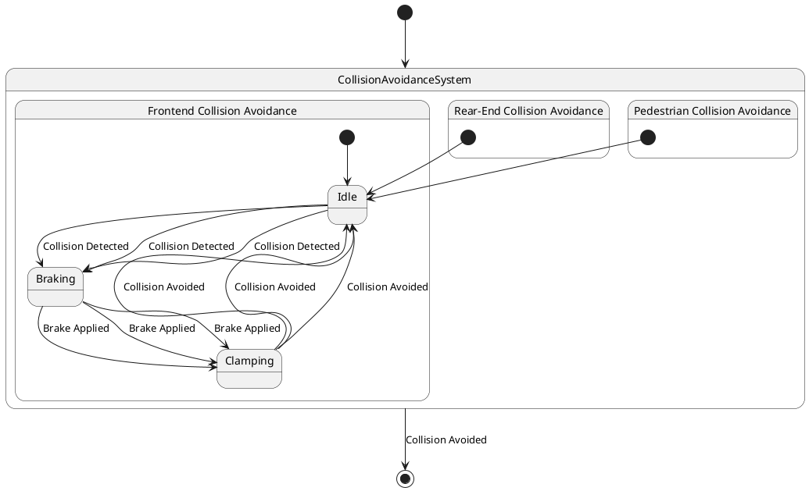

# Pair `0047`：NL + PlantUML STM0 + FCSTM STM0

[上一组 `0046`](../0046/README.md) | [返回 60 组索引](../../PAIR_INDEX.md) | [下一组 `0048`](../0048/README.md)

- LLM：`DeepSeek`
- 模型/场景：Collision avoidance sub-machine state diagram
- 作者输出阶段：`Result with Semantic Checking`
- 作者输出单元格：`AE49`；Excel row：`49`
- Phase-I fallback：`false`
- 相对 Phase-I 是否变化：`true`
- Phase-I PlantUML SHA-256：`fff82632ec465f502612c40dfe4ccf552d9cf88db9e0074d533201587108ebd0`
- NL SHA-256：`49854d044ad99f16a710021500f5e972da93b27635a41144d9b91d32444c0f63`
- PlantUML SHA-256：`4e161360e5cf8af9da41402e70a5c58505252226c290cc1e7cabf4a95acf61a0`
- FCSTM SHA-256：`bc79e2a4617ea93f8eeb79c0bc369533e5baef9f93d7389ba0a7ff2543a49a86`
- review subject SHA-256：`4623ec62d88ee7cdf07f8fb9efb507ea998d875bca3e5c203ab8dfc12c20847b`
- working contract SHA-256：`7abc3bd191e1871d10aef826223b3b5c804f80bc8d36b4aea1c37555f6c60def`
- 结构裁决：`structure_preserved`
- source states / transitions：`7` / `14`
- mapped / blocked / silent drop：`14` / `0` / `0`
- final / lifecycle / body coverage：`1/1` / `0/0` / `0/0`
- concurrent region / separator coverage：`0/0` / `0/0`
- source normalization coverage：`0/0`
- official raw / validation：`state_diagram` / `state_diagram`
- official identity states / transitions：`7` / `14`
- official identity remaps：state `2` / transition endpoint `6`
- AST audit：`passed`
- legacy whole-model FCSTM execution / Discover：`false` / `false`
- working bundle usage gate：`discover_input_with_capability_mask`
- ownership source / compiler / agent：`21` / `22` / `0`
- source macro / positive identity trace / conversion boundary trace：`14` / `21` / `0`
- capability source-static / simulation / transition-trace：`eligible_with_exclusions` / `ineligible` / `ineligible`
- compiler-only diagnostic policy：`rejected_conversion_artifact`；main-result conversion artifact limit：`0`
- 主 session 对读：`pass`；ownership/macro/capability 均为 `pass`；Case 0047 passes conversion-attribution review. This does not assert NL/PlantUML correctness or runtime equivalence; authored defects remain eligible for later source-grounded Discover. RearEnd and Pedestrian reuse Frontend's unqualified Idle/Braking/Clamping identities under pinned PlantUML semantics; InvalidInitial helpers expose but do not create it.
- source anchors：`source-ref:llms_emp_feedback_final_0047.puml:line:2\|state CollisionAvoidanceSystem {, source-ref:llms_emp_feedback_final_0047.puml:line:5\|Idle --> Braking : Collision Detected`；FCSTM anchors：`element-ref:source:state:CollisionAvoidanceSystem@line:5\|state CollisionAvoidanceSystem named "CollisionAvoidanceSystem" {, element-ref:compiler:transition_segment:tr_0002:segment:1@line:12\|Idle -> Braking : /Collision_Detected;`
- 三个原始文件：[NL](./nl.txt) | [PlantUML](./plantuml.puml) | [FCSTM](./fcstm.fcstm)
- 审计入口：[canonical](../../canonical/llms_emp_feedback_final_0047.json) | [冻结 FCSTM](../../fcstm/llms_emp_feedback_final_0047.fcstm) | [case report](../../case_reports/llms_emp_feedback_final_0047.json) | [working contract](../../working_contracts/llms_emp_feedback_final_0047.json) | [source trace](../../source_traces/llms_emp_feedback_final_0047.json) | [人工总账](../../MANUAL_REVIEW.md)

## 主 session 三方语义对应

| projection | assessment | NL anchor | PlantUML anchor | FCSTM anchor | source roots | compiler members | rationale |
|---|---|---|---|---|---|---|---|
| `direct` | `preserved` | There are three region in this diagram | source-ref:llms_emp_feedback_final_0047.puml:line:2\|state CollisionAvoidanceSystem { | element-ref:source:state:CollisionAvoidanceSystem@line:5\|state CollisionAvoidanceSystem named "CollisionAvoidanceSystem" { | source:state:CollisionAvoidanceSystem | - | Case 0047 binds source:state:CollisionAvoidanceSystem to the exact authored occurrence 'state CollisionAvoidanceSystem {'; it is present as a direct FCSTM state projection with the same source identity and parent relation. |
| `macro` | `preserved_with_exclusions` | This sub-machine becomes active when a possible frontend collision, rear-end collision or collision with pedestrian is | source-ref:llms_emp_feedback_final_0047.puml:line:5\|Idle --> Braking : Collision Detected | element-ref:compiler:transition_segment:tr_0002:segment:1@line:12\|Idle -> Braking : /Collision_Detected; | source:transition:tr_0002 | compiler:transition_segment:tr_0002:segment:1 | Case 0047 binds source:transition:tr_0002 to the exact authored occurrence 'Idle --> Braking : Collision Detected'; it is present as a source-owned transition root whose cited FCSTM line belongs to a protected compiler macro; the raw label remains opaque. |

## Risk occurrence 第二遍复核

| obligation | risk tag | assessment | PlantUML evidence | FCSTM evidence | ownership evidence | rationale |
|---|---|---|---|---|---|---|
| `review:official_identity_remap:0001:state-001` | `official_identity_remap` | `source_fact_preserved` | source-ref:llms_emp_feedback_final_0047.puml:line:11\|[*] --> Idle, source-ref:llms_emp_feedback_final_0047.puml:line:18\|[*] --> Idle | element-ref:source:state:CollisionAvoidanceSystem.Frontend.Idle@line:8\|state Idle named "Idle"; | source:state:CollisionAvoidanceSystem.Frontend.Idle | Case 0047 risk official_identity_remap occurrence review:official_identity_remap:0001:state-001: The occurrence follows the pinned PlantUML qualified Entity/Link identity result, including the recorded remap, instead of substituting a lexical guess. |
| `review:official_identity_remap:0002:state-002` | `official_identity_remap` | `source_fact_preserved` | source-ref:llms_emp_feedback_final_0047.puml:line:18\|[*] --> Idle | element-ref:source:state:CollisionAvoidanceSystem.Frontend.Idle@line:8\|state Idle named "Idle"; | source:state:CollisionAvoidanceSystem.Frontend.Idle | Case 0047 risk official_identity_remap occurrence review:official_identity_remap:0002:state-002: The occurrence follows the pinned PlantUML qualified Entity/Link identity result, including the recorded remap, instead of substituting a lexical guess. |
| `review:official_identity_remap:0003:transition-001-tr_0005` | `official_identity_remap` | `source_fact_preserved` | source-ref:llms_emp_feedback_final_0047.puml:line:11\|[*] --> Idle | element-ref:compiler:state:llms_emp_feedback_final_0047.CollisionAvoidanceSystem.RearEnd.InvalidInitialtr_0005@line:23\|state InvalidInitialtr_0005 named "PlantUML initial target outside child scope: CollisionAvoidanceSystem.Frontend.Idle"; | source:transition:tr_0005 | Case 0047 risk official_identity_remap occurrence review:official_identity_remap:0003:transition-001-tr_0005: The occurrence follows the pinned PlantUML qualified Entity/Link identity result, including the recorded remap, instead of substituting a lexical guess. |
| `review:official_identity_remap:0004:transition-002-tr_0006` | `official_identity_remap` | `source_fact_preserved` | source-ref:llms_emp_feedback_final_0047.puml:line:12\|Idle --> Braking : Collision Detected | element-ref:compiler:transition_segment:tr_0006:segment:1@line:15\|Idle -> Braking : /Collision_Detected; | source:transition:tr_0006 | Case 0047 risk official_identity_remap occurrence review:official_identity_remap:0004:transition-002-tr_0006: The occurrence follows the pinned PlantUML qualified Entity/Link identity result, including the recorded remap, instead of substituting a lexical guess. |
| `review:official_identity_remap:0005:transition-003-tr_0008` | `official_identity_remap` | `source_fact_preserved` | source-ref:llms_emp_feedback_final_0047.puml:line:14\|Clamping --> Idle : Collision Avoided | element-ref:compiler:transition_segment:tr_0008:segment:1@line:17\|Clamping -> Idle : /Collision_Avoided; | source:transition:tr_0008 | Case 0047 risk official_identity_remap occurrence review:official_identity_remap:0005:transition-003-tr_0008: The occurrence follows the pinned PlantUML qualified Entity/Link identity result, including the recorded remap, instead of substituting a lexical guess. |
| `review:official_identity_remap:0006:transition-004-tr_0009` | `official_identity_remap` | `source_fact_preserved` | source-ref:llms_emp_feedback_final_0047.puml:line:18\|[*] --> Idle | element-ref:compiler:state:llms_emp_feedback_final_0047.CollisionAvoidanceSystem.Pedestrian.InvalidInitialtr_0009@line:27\|state InvalidInitialtr_0009 named "PlantUML initial target outside child scope: CollisionAvoidanceSystem.Frontend.Idle"; | source:transition:tr_0009 | Case 0047 risk official_identity_remap occurrence review:official_identity_remap:0006:transition-004-tr_0009: The occurrence follows the pinned PlantUML qualified Entity/Link identity result, including the recorded remap, instead of substituting a lexical guess. |
| `review:official_identity_remap:0007:transition-005-tr_0010` | `official_identity_remap` | `source_fact_preserved` | source-ref:llms_emp_feedback_final_0047.puml:line:19\|Idle --> Braking : Collision Detected | element-ref:compiler:transition_segment:tr_0010:segment:1@line:18\|Idle -> Braking : /Collision_Detected; | source:transition:tr_0010 | Case 0047 risk official_identity_remap occurrence review:official_identity_remap:0007:transition-005-tr_0010: The occurrence follows the pinned PlantUML qualified Entity/Link identity result, including the recorded remap, instead of substituting a lexical guess. |
| `review:official_identity_remap:0008:transition-006-tr_0012` | `official_identity_remap` | `source_fact_preserved` | source-ref:llms_emp_feedback_final_0047.puml:line:21\|Clamping --> Idle : Collision Avoided | element-ref:compiler:transition_segment:tr_0012:segment:1@line:20\|Clamping -> Idle : /Collision_Avoided; | source:transition:tr_0012 | Case 0047 risk official_identity_remap occurrence review:official_identity_remap:0008:transition-006-tr_0012: The occurrence follows the pinned PlantUML qualified Entity/Link identity result, including the recorded remap, instead of substituting a lexical guess. |
| `review:final_boundary:0009:tr_0014` | `final_boundary` | `source_fact_preserved` | source-ref:llms_emp_feedback_final_0047.puml:line:26\|CollisionAvoidanceSystem --> [*] : Collision Avoided | element-ref:compiler:transition_segment:tr_0014:segment:1@line:33\|!CollisionAvoidanceSystem -> [*] : /Collision_Avoided; | compiler:transition_segment:tr_0014:segment:1, source:transition:tr_0014 | Case 0047 risk final_boundary occurrence review:final_boundary:0009:tr_0014: The authored PlantUML final boundary is preserved by the bound FCSTM termination macro rather than being converted into an ordinary user state. |
| `review:synthetic_state:0010:001-InvalidInitialtr_0005` | `synthetic_state` | `compiler_artifact_excluded` | source-ref:llms_emp_feedback_final_0047.puml:line:11\|[*] --> Idle | element-ref:compiler:state:llms_emp_feedback_final_0047.CollisionAvoidanceSystem.RearEnd.InvalidInitialtr_0005@line:23\|state InvalidInitialtr_0005 named "PlantUML initial target outside child scope: CollisionAvoidanceSystem.Frontend.Idle"; | compiler:state:llms_emp_feedback_final_0047.CollisionAvoidanceSystem.RearEnd.InvalidInitialtr_0005, source:transition:tr_0005 | Case 0047 risk synthetic_state occurrence review:synthetic_state:0010:001-InvalidInitialtr_0005: The helper state is a protected compiler-owned projection for a source structural fact; diagnostics on the helper itself are conversion artifacts. |
| `review:synthetic_state:0011:002-InvalidInitialtr_0009` | `synthetic_state` | `compiler_artifact_excluded` | source-ref:llms_emp_feedback_final_0047.puml:line:18\|[*] --> Idle | element-ref:compiler:state:llms_emp_feedback_final_0047.CollisionAvoidanceSystem.Pedestrian.InvalidInitialtr_0009@line:27\|state InvalidInitialtr_0009 named "PlantUML initial target outside child scope: CollisionAvoidanceSystem.Frontend.Idle"; | compiler:state:llms_emp_feedback_final_0047.CollisionAvoidanceSystem.Pedestrian.InvalidInitialtr_0009, source:transition:tr_0009 | Case 0047 risk synthetic_state occurrence review:synthetic_state:0011:002-InvalidInitialtr_0009: The helper state is a protected compiler-owned projection for a source structural fact; diagnostics on the helper itself are conversion artifacts. |
| `review:synthetic_state:0012:003-UnspecifiedInitial` | `synthetic_state` | `compiler_artifact_excluded` | source-ref:llms_emp_feedback_final_0047.puml:line:2\|state CollisionAvoidanceSystem { | element-ref:compiler:state:llms_emp_feedback_final_0047.CollisionAvoidanceSystem.UnspecifiedInitial@line:6\|state UnspecifiedInitial named "Unspecified initial";, element-ref:source:state:CollisionAvoidanceSystem@line:5\|state CollisionAvoidanceSystem named "CollisionAvoidanceSystem" { | compiler:state:llms_emp_feedback_final_0047.CollisionAvoidanceSystem.UnspecifiedInitial, source:state:CollisionAvoidanceSystem | Case 0047 risk synthetic_state occurrence review:synthetic_state:0012:003-UnspecifiedInitial: The helper state is a protected compiler-owned projection for a source structural fact; diagnostics on the helper itself are conversion artifacts. |

## 作者阶段 lineage

| stage | output cell | present | output SHA-256 | feedback | resolved |
|---|---|---|---|---|---|
| `phase_i_generation` | `I49` | `true` | `fff82632ec465f502612c40dfe4ccf552d9cf88db9e0074d533201587108ebd0` | - | - |
| `phase_ii_format` | `U49` | `true` | `b238e84a7e1b45c18e0743258fec8e9fb553fca4ac91dce86710f759ff0aad5e` | syntax error: stm CollisionAvoidanceSystem [Collision Avoidance State Machine] | YES |
| `phase_ii_grammar` | `Z49` | `false` | `-` | - | - |
| `phase_ii_semantic` | `AE49` | `true` | `4e161360e5cf8af9da41402e70a5c58505252226c290cc1e7cabf4a95acf61a0` | missing regions | - |

## Official identity ledger

- status：`aligned`
- canonical / official states：`7` / `7`
- aligned transition endpoints：`14`

| source-parser identity | pinned PlantUML identity | raw ref | reason |
|---|---|---|---|
| `CollisionAvoidanceSystem.RearEnd.Idle` | `CollisionAvoidanceSystem.Frontend.Idle` | `llms_emp_feedback_final_0047.puml:line:11` | `official_link_endpoint_identity` |
| `CollisionAvoidanceSystem.Pedestrian.Idle` | `CollisionAvoidanceSystem.Frontend.Idle` | `llms_emp_feedback_final_0047.puml:line:18` | `official_link_endpoint_identity` |

| transition | source before -> after | target before -> after | raw ref |
|---|---|---|---|
| `tr_0005` | `@initial:CollisionAvoidanceSystem.RearEnd` -> `@initial:CollisionAvoidanceSystem.RearEnd` | `CollisionAvoidanceSystem.RearEnd.Idle` -> `CollisionAvoidanceSystem.Frontend.Idle` | `llms_emp_feedback_final_0047.puml:line:11` |
| `tr_0006` | `CollisionAvoidanceSystem.RearEnd.Idle` -> `CollisionAvoidanceSystem.Frontend.Idle` | `CollisionAvoidanceSystem.Frontend.Braking` -> `CollisionAvoidanceSystem.Frontend.Braking` | `llms_emp_feedback_final_0047.puml:line:12` |
| `tr_0008` | `CollisionAvoidanceSystem.Frontend.Clamping` -> `CollisionAvoidanceSystem.Frontend.Clamping` | `CollisionAvoidanceSystem.RearEnd.Idle` -> `CollisionAvoidanceSystem.Frontend.Idle` | `llms_emp_feedback_final_0047.puml:line:14` |
| `tr_0009` | `@initial:CollisionAvoidanceSystem.Pedestrian` -> `@initial:CollisionAvoidanceSystem.Pedestrian` | `CollisionAvoidanceSystem.Pedestrian.Idle` -> `CollisionAvoidanceSystem.Frontend.Idle` | `llms_emp_feedback_final_0047.puml:line:18` |
| `tr_0010` | `CollisionAvoidanceSystem.Pedestrian.Idle` -> `CollisionAvoidanceSystem.Frontend.Idle` | `CollisionAvoidanceSystem.Frontend.Braking` -> `CollisionAvoidanceSystem.Frontend.Braking` | `llms_emp_feedback_final_0047.puml:line:19` |
| `tr_0012` | `CollisionAvoidanceSystem.Frontend.Clamping` -> `CollisionAvoidanceSystem.Frontend.Clamping` | `CollisionAvoidanceSystem.Pedestrian.Idle` -> `CollisionAvoidanceSystem.Frontend.Idle` | `llms_emp_feedback_final_0047.puml:line:21` |

## Source normalization ledger

本组没有 source-input normalization。

## Concurrent region ledger

本组没有 PlantUML orthogonal/concurrent region separator。

## Operational debt

| reason code | count |
|---|---:|
| `R45.DEBT.invalid_source_initial_target` | 2 |
| `R45.DEBT.missing_explicit_initial` | 1 |
| `R45.DEBT.opaque_transition_label_semantics` | 10 |

## NL

```text
1. There are three region in this diagram
2. This sub-machine becomes active when a possible frontend collision, rear-end collision or collision with pedestrian is detected.
3. The orthogonal regions of the active mode of collision avoidance allow for concurrent activation different of collision avoidance controls.
```

## 作者 Phase-II 最终 PlantUML STM0



## 转换后 FCSTM STM0

```fcstm
state llms_emp_feedback_final_0047 named "llms_emp_feedback_final_0047" {
    event Collision_Detected named "Collision Detected";
    event Brake_Applied named "Brake Applied";
    event Collision_Avoided named "Collision Avoided";
    state CollisionAvoidanceSystem named "CollisionAvoidanceSystem" {
        state UnspecifiedInitial named "Unspecified initial";
        state Frontend named "Frontend Collision Avoidance" {
            state Idle named "Idle";
            state Braking named "Braking";
            state Clamping named "Clamping";
            [*] -> Idle;
            Idle -> Braking : /Collision_Detected;
            Braking -> Clamping : /Brake_Applied;
            Clamping -> Idle : /Collision_Avoided;
            Idle -> Braking : /Collision_Detected;
            Braking -> Clamping : /Brake_Applied;
            Clamping -> Idle : /Collision_Avoided;
            Idle -> Braking : /Collision_Detected;
            Braking -> Clamping : /Brake_Applied;
            Clamping -> Idle : /Collision_Avoided;
        }
        state RearEnd named "Rear-End Collision Avoidance" {
            state InvalidInitialtr_0005 named "PlantUML initial target outside child scope: CollisionAvoidanceSystem.Frontend.Idle";
            [*] -> InvalidInitialtr_0005;
        }
        state Pedestrian named "Pedestrian Collision Avoidance" {
            state InvalidInitialtr_0009 named "PlantUML initial target outside child scope: CollisionAvoidanceSystem.Frontend.Idle";
            [*] -> InvalidInitialtr_0009;
        }
        [*] -> UnspecifiedInitial;
    }
    [*] -> CollisionAvoidanceSystem;
    !CollisionAvoidanceSystem -> [*] : /Collision_Avoided;
}
```

[上一组 `0046`](../0046/README.md) | [返回 60 组索引](../../PAIR_INDEX.md) | [下一组 `0048`](../0048/README.md)
