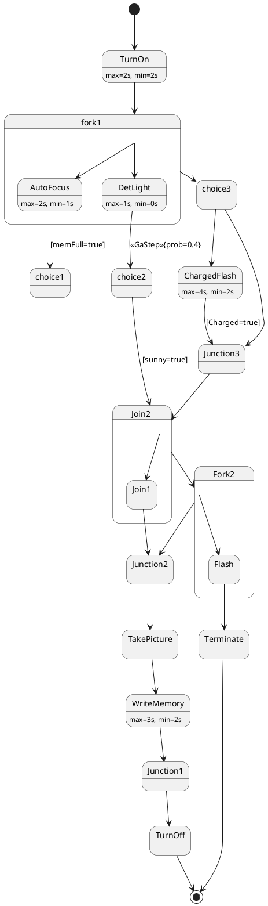

# Pair `0048`：NL + PlantUML STM0 + FCSTM STM0

[上一组 `0047`](../0047/README.md) | [返回 60 组索引](../../PAIR_INDEX.md) | [下一组 `0049`](../0049/README.md)

- LLM：`DeepSeek`
- 模型/场景： Digital camera state machine diagrams
- 作者输出阶段：`Result with Semantic Checking`
- 作者输出单元格：`AE50`；Excel row：`50`
- Phase-I fallback：`false`
- 相对 Phase-I 是否变化：`true`
- Phase-I PlantUML SHA-256：`91951da63cfb9eef882f8f3b45d69fbba6c22dcc4c1f1247dd4a7f91a2f079ab`
- NL SHA-256：`6af3966c8b0e12004a22622cded88b07df6fef9d558534442e3309694543c76d`
- PlantUML SHA-256：`a1de42bed4d559454458b8b096b06dfbebcb660775f1e864fdc87f6980ffcdfb`
- FCSTM SHA-256：`c5e9af79be0eb85505af5b7b84474d748425b366dbed75cc5f86b574e28d3d31`
- 结构裁决：`structure_preserved`
- source states / transitions：`19` / `24`
- mapped / blocked / silent drop：`24` / `0` / `0`
- final / lifecycle / body coverage：`2/2` / `0/0` / `5/5`
- concurrent region / separator coverage：`0/0` / `0/0`
- source normalization coverage：`0/0`
- official raw / validation：`state_diagram` / `state_diagram`
- official identity states / transitions：`19` / `24`
- official identity remaps：state `2` / transition endpoint `0`
- AST audit：`passed`
- FCSTM execution eligible：`false`
- Discover eligible：`false`
- 主 session 对读：完整对读：官方把带 block 的 fork1/Join2/Fork2 作为 composite，并将 AutoFocus/DetLight 归入 fork1；19 个官方实体、24 边、5 个 timing body 全在，两条 root final 与所有跨层边均分段保留。
- 三个原始文件：[NL](./nl.txt) | [PlantUML](./plantuml.puml) | [FCSTM](./fcstm.fcstm)
- 审计入口：[canonical](../../canonical/llms_emp_feedback_final_0048.json) | [冻结 FCSTM](../../fcstm/llms_emp_feedback_final_0048.fcstm) | [case report](../../case_reports/llms_emp_feedback_final_0048.json) | [人工总账](../../MANUAL_REVIEW.md)

## 作者阶段 lineage

| stage | output cell | present | output SHA-256 | feedback | resolved |
|---|---|---|---|---|---|
| `phase_i_generation` | `I50` | `true` | `91951da63cfb9eef882f8f3b45d69fbba6c22dcc4c1f1247dd4a7f91a2f079ab` | - | - |
| `phase_ii_format` | `U50` | `true` | `4bc691dc6f9fc63dcf230550d577c9cea5fabef5cc5cd66089605e0585352d67` | syntax error: stm [stateMachine] SystemStateMachine [SystemStateMachineDiagram]<br> | YES |
| `phase_ii_grammar` | `Z50` | `false` | `-` | - | - |
| `phase_ii_semantic` | `AE50` | `true` | `a1de42bed4d559454458b8b096b06dfbebcb660775f1e864fdc87f6980ffcdfb` | 1. Missing Junction Pseudostate, Fork Pseudostate, Join <br>use state join1 <<join>> to represent join pseudostate | - |

## Official identity ledger

- status：`aligned`
- canonical / official states：`19` / `19`
- aligned transition endpoints：`24`

| source-parser identity | pinned PlantUML identity | raw ref | reason |
|---|---|---|---|
| `AutoFocus` | `fork1.AutoFocus` | `llms_emp_feedback_final_0048.puml:line:11` | `unique_official_entity_identity` |
| `DetLight` | `fork1.DetLight` | `llms_emp_feedback_final_0048.puml:line:14` | `unique_official_entity_identity` |

本组 transition endpoint 无需重映射。

## Source normalization ledger

本组没有 source-input normalization。

## Concurrent region ledger

本组没有 PlantUML orthogonal/concurrent region separator。

## Operational debt

| reason code | count |
|---|---:|
| `R45.DEBT.ambiguous_unlabeled_fanout` | 4 |
| `R45.DEBT.missing_explicit_initial` | 3 |
| `R45.DEBT.opaque_state_body_semantics` | 5 |
| `R45.DEBT.opaque_transition_label_semantics` | 4 |

## NL

```text
1. The system begins in the TurnOn state, which has two possible execution times, with a maximum of 2 seconds and a minimum of 2 seconds, before transitioning to the fork1 state.
2. The TurnOn state transitions into a fork1 state, which contains parallel paths leading to AutoFocus and DetLight.
3. The AutoFocus state has execution times of 2 seconds maximum and 1 second minimum before proceeding to the choice1 state, which is triggered when the condition memFull=true is true.
4. The DetLight state has execution times of 1 second maximum and 0 seconds minimum, transitioning to the choice2 state when the condition <>{prob=0.4} is met.
5. If the fork1 state transitions to choice3, it proceeds to the ChargedFlash state, which has execution times of 4 seconds maximum and 2 seconds minimum.
6. The ChargedFlash state can lead to Junction3, where the system starts and proceeds to the Join2 state. The transition occurs when Charged=true.
7. The choice3 state also transitions to Junction3, and once the system reaches Junction3, it joins the Join2 state.
8. The choice2 state transitions to Join2, and if the condition sunny=true is met, it further joins the Join1 state, which leads to Junction2.
9. In the Junction2 state, the system proceeds to TakePicture, followed by WriteMemory, with execution times of 3 seconds maximum and 2 seconds minimum.
10. After WriteMemory completes, the system enters Junction1 before proceeding to TurnOff, which ends the process and transitions back to the initial state, represented by [*].
11. In the Fork2 state, which is part of the Join2 substate, the system can either proceed to Junction2 or Flash. If the Flash state is activated, it transitions to Terminate, ending the sequence.
```

## 作者 Phase-II 最终 PlantUML STM0



## 转换后 FCSTM STM0

```fcstm
state llms_emp_feedback_final_0048 named "llms_emp_feedback_final_0048" {
    event _memFull_true named "[memFull=true]";
    event _GaStep_prob_0_4 named "<<GaStep>>{prob=0.4}";
    event _Charged_true named "[Charged=true]";
    event _sunny_true named "[sunny=true]";
    state fork1 named "fork1" {
        state UnspecifiedInitial named "Unspecified initial";
        state AutoFocus named "AutoFocus\n[PlantUML body] max=2s, min=1s";
        state DetLight named "DetLight\n[PlantUML body] max=1s, min=0s";
        ! * -> AutoFocus;
        ! * -> DetLight;
        AutoFocus -> [*] : /_memFull_true;
        DetLight -> [*] : /_GaStep_prob_0_4;
        [*] -> UnspecifiedInitial;
    }
    state Join2 named "Join2" {
        state UnspecifiedInitial named "Unspecified initial";
        state Join1 named "Join1";
        ! * -> Join1;
        Join1 -> [*];
        [*] -> UnspecifiedInitial;
    }
    state Fork2 named "Fork2" {
        state UnspecifiedInitial named "Unspecified initial";
        state Flash named "Flash";
        ! * -> Flash;
        Flash -> [*];
        [*] -> UnspecifiedInitial;
    }
    state TurnOn named "TurnOn\n[PlantUML body] max=2s, min=2s";
    state choice1 named "choice1";
    state choice2 named "choice2";
    state choice3 named "choice3";
    state ChargedFlash named "ChargedFlash\n[PlantUML body] max=4s, min=2s";
    state Junction3 named "Junction3";
    state Junction2 named "Junction2";
    state TakePicture named "TakePicture";
    state WriteMemory named "WriteMemory\n[PlantUML body] max=3s, min=2s";
    state Junction1 named "Junction1";
    state TurnOff named "TurnOff";
    state Terminate named "Terminate";
    [*] -> TurnOn;
    TurnOn -> fork1;
    fork1 -> choice1 : /_memFull_true;
    fork1 -> choice2 : /_GaStep_prob_0_4;
    !fork1 -> choice3;
    choice3 -> ChargedFlash;
    ChargedFlash -> Junction3 : /_Charged_true;
    choice3 -> Junction3;
    Junction3 -> Join2;
    choice2 -> Join2 : /_sunny_true;
    Join2 -> Junction2;
    Junction2 -> TakePicture;
    TakePicture -> WriteMemory;
    WriteMemory -> Junction1;
    Junction1 -> TurnOff;
    TurnOff -> [*];
    !Join2 -> Fork2;
    !Fork2 -> Junction2;
    Fork2 -> Terminate;
    Terminate -> [*];
}
```

[上一组 `0047`](../0047/README.md) | [返回 60 组索引](../../PAIR_INDEX.md) | [下一组 `0049`](../0049/README.md)
