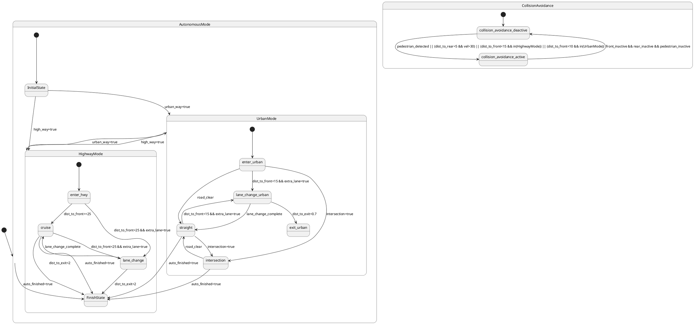

# Pair `0049`：NL + PlantUML STM0 + FCSTM STM0

[上一组 `0048`](../0048/README.md) | [返回 60 组索引](../../PAIR_INDEX.md) | [下一组 `0050`](../0050/README.md)

- LLM：`DeepSeek`
- 模型/场景：autonomous mode
- 作者输出阶段：`Result with Semantic Checking`
- 作者输出单元格：`AE51`；Excel row：`51`
- Phase-I fallback：`false`
- 相对 Phase-I 是否变化：`false`
- Phase-I PlantUML SHA-256：`85f000271f03ab4d83260494bfe73b053111cfaf660a9f3d79c7ea912063ded6`
- NL SHA-256：`b7425c44960b36c3534f118279e347786d4074191efea7bf9a7c5ba032c9e82c`
- PlantUML SHA-256：`85f000271f03ab4d83260494bfe73b053111cfaf660a9f3d79c7ea912063ded6`
- FCSTM SHA-256：`0468915fa40bca52d92cab287b36a62e4f26e7cf867e86843c3921ac1fbb26d0`
- review subject SHA-256：`1d98df5c08a26698496f8a2bff58052249b50285fa1906a44fe335ae6662be6c`
- working contract SHA-256：`4fff2f8188a56e45e4c3e0fba1638067b1df0fcec47cf1ff365bbf440f7bfac5`
- 结构裁决：`structure_preserved`
- source states / transitions：`16` / `29`
- mapped / blocked / silent drop：`29` / `0` / `0`
- final / lifecycle / body coverage：`0/0` / `0/0` / `0/0`
- concurrent region / separator coverage：`0/0` / `0/0`
- source normalization coverage：`0/0`
- official raw / validation：`state_diagram` / `state_diagram`
- official identity states / transitions：`16` / `29`
- official identity remaps：state `0` / transition endpoint `0`
- AST audit：`passed`
- legacy whole-model FCSTM execution / Discover：`false` / `false`
- working bundle usage gate：`discover_input_with_capability_mask`
- ownership source / compiler / agent：`45` / `48` / `0`
- source macro / positive identity trace / conversion boundary trace：`29` / `45` / `0`
- capability source-static / simulation / transition-trace：`eligible_with_exclusions` / `ineligible` / `ineligible`
- compiler-only diagnostic policy：`rejected_conversion_artifact`；main-result conversion artifact limit：`0`
- 主 session 对读：`pass`；ownership/macro/capability 均为 `pass`；Case 0049 passes conversion-attribution review. This does not assert NL/PlantUML correctness or runtime equivalence; authored defects remain eligible for later source-grounded Discover. No conversion-specific blocker was found in the exact reviewed occurrences. Fresh v6 main-session review re-read NL, PlantUML, FCSTM, working contract, and source trace after the portable Java identity change; source/FCSTM/trace bytes are unchanged and verification remains fail-closed.
- source anchors：`source-ref:llms_emp_feedback_final_0049.puml:line:3\|state AutonomousMode {, source-ref:llms_emp_feedback_final_0049.puml:line:5\|InitialState --> HighwayMode : high_way=true`；FCSTM anchors：`element-ref:source:state:AutonomousMode@line:15\|state AutonomousMode named "AutonomousMode" {, element-ref:compiler:transition_segment:tr_0003:segment:1@line:53\|InitialState -> HighwayMode : /high_way_true;`
- 三个原始文件：[NL](./nl.txt) | [PlantUML](./plantuml.puml) | [FCSTM](./fcstm.fcstm)
- 审计入口：[canonical](../../canonical/llms_emp_feedback_final_0049.json) | [冻结 FCSTM](../../fcstm/llms_emp_feedback_final_0049.fcstm) | [case report](../../case_reports/llms_emp_feedback_final_0049.json) | [working contract](../../working_contracts/llms_emp_feedback_final_0049.json) | [source trace](../../source_traces/llms_emp_feedback_final_0049.json) | [人工总账](../../MANUAL_REVIEW.md)

## 主 session 三方语义对应

| projection | assessment | NL anchor | PlantUML anchor | FCSTM anchor | source roots | compiler members | rationale |
|---|---|---|---|---|---|---|---|
| `direct` | `preserved` | AutonomousMode | source-ref:llms_emp_feedback_final_0049.puml:line:3\|state AutonomousMode { | element-ref:source:state:AutonomousMode@line:15\|state AutonomousMode named "AutonomousMode" { | source:state:AutonomousMode | - | Case 0049 binds source:state:AutonomousMode to the exact authored occurrence 'state AutonomousMode {'; it is present as a direct FCSTM state projection with the same source identity and parent relation. |
| `macro` | `preserved_with_exclusions` | high_way=true | source-ref:llms_emp_feedback_final_0049.puml:line:5\|InitialState --> HighwayMode : high_way=true | element-ref:compiler:transition_segment:tr_0003:segment:1@line:53\|InitialState -> HighwayMode : /high_way_true; | source:transition:tr_0003 | compiler:transition_segment:tr_0003:segment:1 | Case 0049 binds source:transition:tr_0003 to the exact authored occurrence 'InitialState --> HighwayMode : high_way=true'; it is present as a source-owned transition root whose cited FCSTM line belongs to a protected compiler macro; the raw label remains opaque. |

## Risk occurrence 第二遍复核

| obligation | risk tag | assessment | PlantUML evidence | FCSTM evidence | ownership evidence | rationale |
|---|---|---|---|---|---|---|
| `review:multi_segment_macro:0001:tr_0021` | `multi_segment_macro` | `compiler_artifact_excluded` | source-ref:llms_emp_feedback_final_0049.puml:line:28\|straight --> FinishState : auto_finished=true | element-ref:compiler:transition_segment:tr_0021:segment:1@line:47\|straight -> [*] : /auto_finished_true;, element-ref:compiler:transition_segment:tr_0021:segment:2@line:55\|UrbanMode -> HighwayMode : /auto_finished_true;, element-ref:compiler:transition_segment:tr_0021:segment:3@line:21\|[*] -> FinishState : /auto_finished_true; | compiler:transition_segment:tr_0021:segment:1, compiler:transition_segment:tr_0021:segment:2, compiler:transition_segment:tr_0021:segment:3, source:transition:tr_0021 | Case 0049 risk multi_segment_macro occurrence review:multi_segment_macro:0001:tr_0021: The single authored transition remains one source-owned semantic root; all bound FCSTM segments are protected compiler artifacts and cannot become repair targets. |
| `review:multi_segment_macro:0002:tr_0023` | `multi_segment_macro` | `compiler_artifact_excluded` | source-ref:llms_emp_feedback_final_0049.puml:line:30\|intersection --> FinishState : auto_finished=true | element-ref:compiler:transition_segment:tr_0023:segment:1@line:49\|intersection -> [*] : /auto_finished_true;, element-ref:compiler:transition_segment:tr_0023:segment:2@line:56\|UrbanMode -> HighwayMode : /auto_finished_true;, element-ref:compiler:transition_segment:tr_0023:segment:3@line:22\|[*] -> FinishState : /auto_finished_true; | compiler:transition_segment:tr_0023:segment:1, compiler:transition_segment:tr_0023:segment:2, compiler:transition_segment:tr_0023:segment:3, source:transition:tr_0023 | Case 0049 risk multi_segment_macro occurrence review:multi_segment_macro:0002:tr_0023: The single authored transition remains one source-owned semantic root; all bound FCSTM segments are protected compiler artifacts and cannot become repair targets. |
| `review:multi_segment_macro:0003:tr_0029` | `multi_segment_macro` | `compiler_artifact_excluded` | source-ref:llms_emp_feedback_final_0049.puml:line:43\|AutonomousMode --> FinishState : auto_finished=true | element-ref:compiler:transition_segment:tr_0029:segment:1@line:59\|! * -> HighwayMode : /auto_finished_true;, element-ref:compiler:transition_segment:tr_0029:segment:2@line:23\|[*] -> FinishState : /auto_finished_true; | compiler:transition_segment:tr_0029:segment:1, compiler:transition_segment:tr_0029:segment:2, source:transition:tr_0029 | Case 0049 risk multi_segment_macro occurrence review:multi_segment_macro:0003:tr_0029: The single authored transition remains one source-owned semantic root; all bound FCSTM segments are protected compiler artifacts and cannot become repair targets. |

## 作者阶段 lineage

| stage | output cell | present | output SHA-256 | feedback | resolved |
|---|---|---|---|---|---|
| `phase_i_generation` | `I51` | `true` | `85f000271f03ab4d83260494bfe73b053111cfaf660a9f3d79c7ea912063ded6` | - | - |
| `phase_ii_format` | `U51` | `false` | `-` | - | - |
| `phase_ii_grammar` | `Z51` | `false` | `-` | - | - |
| `phase_ii_semantic` | `AE51` | `true` | `85f000271f03ab4d83260494bfe73b053111cfaf660a9f3d79c7ea912063ded6` | None | - |

## Official identity ledger

- status：`aligned`
- canonical / official states：`16` / `16`
- aligned transition endpoints：`29`

本组 state identity 无需重映射。

本组 transition endpoint 无需重映射。

## Source normalization ledger

本组没有 source-input normalization。

## Concurrent region ledger

本组没有 PlantUML orthogonal/concurrent region separator。

## Operational debt

| reason code | count |
|---|---:|
| `R45.DEBT.opaque_transition_label_semantics` | 24 |

## NL

```text
1. The system begins in the AutonomousMode state, which transitions into the InitialState substate, marking the starting point of the autonomous driving mode.
2. From the InitialState, the system can transition to either HighwayMode or UrbanMode based on conditions: `high_way=true` for HighwayMode or `urban_way=true` for UrbanMode.
3. In the HighwayMode state, the system begins in the enter_hwy substate, and can transition to cruise or lane_change based on the distance to the front vehicle (`dist_to_front<25`) and the availability of an extra lane (`extra_lane=true`).
4. If the system is in lane_change, it can return to cruise once the lane change is completed or exit the highway if the distance to the exit is less than 2 kilometers (`dist_to_exit<2`).
5. In the cruise substate, if the distance to the front vehicle becomes less than 25 meters (`dist_to_front<25`) and there is an extra lane available, the system transitions to lane_change. The system can also exit the highway if the distance to the exit is less than 2 kilometers (`dist_to_exit<2`).
6. The HighwayMode ends when the system transitions to FinishState, triggered by the `auto_finished=true` condition.
7. In UrbanMode, the system begins in the enter_urban substate. From here, it can transition to lane_change_urban if the distance to the front vehicle is less than 15 meters (`dist_to_front<15`) and an extra lane is available, or straight if the road ahead is clear, or intersection if it detects an intersection (`intersection=true`).
8. In the lane_change_urban substate, the system transitions to straight if the lane change is complete or to exit_urban if the distance to the urban exit is less than 0.7 kilometers (`dist_to_exit<0.7`).
9. In the straight substate, if the system detects an intersection, it transitions to the intersection substate. If the distance to the front vehicle becomes less than 15 meters (`dist_to_front<15`) and an extra lane is available, it transitions to lane_change_urban.
10. The system exits the UrbanMode state by transitioning to FinishState once `auto_finished=true` is satisfied.
11. The system supports dynamic transitions between HighwayMode and UrbanMode based on the conditions `urban_way=true` and `high_way=true`, respectively, facilitating seamless mode shifts during the drive.
12. The collision avoidance system is initially in the collision_avoidance_deactive state. It transitions to collision_avoidance_active when certain conditions are met, such as detecting pedestrians (`pedestrian_detected`), the rear distance being less than 5 meters with a velocity over 30 km/h (`dist_to_rear<5 & vel>30`), or the front distance being less than 15 meters in highway mode or 10 meters in urban mode.
13. Once in the collision_avoidance_active state, the collision avoidance system returns to the collision_avoidance_deactive state when there is no active danger, as indicated by the conditions `front_inactive`, `rear_inactive`, and `pedestrian_inactive`.
```

## 作者 Phase-II 最终 PlantUML STM0



## 转换后 FCSTM STM0

```fcstm
state llms_emp_feedback_final_0049 named "llms_emp_feedback_final_0049" {
    event high_way_true named "high_way=true";
    event urban_way_true named "urban_way=true";
    event dist_to_front_25 named "dist_to_front>=25";
    event dist_to_front_25_extra_lane_true named "dist_to_front<25 && extra_lane=true";
    event lane_change_complete named "lane_change_complete";
    event dist_to_exit_2 named "dist_to_exit<2";
    event auto_finished_true named "auto_finished=true";
    event dist_to_front_15_extra_lane_true named "dist_to_front<15 && extra_lane=true";
    event road_clear named "road_clear";
    event intersection_true named "intersection=true";
    event dist_to_exit_0_7 named "dist_to_exit<0.7";
    event pedestrian_detected_dist_to_rear_5_vel_30_dist_to_front_15_in_HighwayMode_dist_to_front_10_in_UrbanMode named "pedestrian_detected || (dist_to_rear<5 && vel>30) || (dist_to_front<15 && in(HighwayMode)) || (dist_to_front<10 && in(UrbanMode))";
    event front_inactive_rear_inactive_pedestrian_inactive named "front_inactive && rear_inactive && pedestrian_inactive";
    state AutonomousMode named "AutonomousMode" {
        state HighwayMode named "HighwayMode" {
            state enter_hwy named "enter_hwy";
            state cruise named "cruise";
            state lane_change named "lane_change";
            state FinishState named "FinishState";
            [*] -> FinishState : /auto_finished_true;
            [*] -> FinishState : /auto_finished_true;
            [*] -> FinishState : /auto_finished_true;
            [*] -> enter_hwy;
            enter_hwy -> cruise : /dist_to_front_25;
            enter_hwy -> lane_change : /dist_to_front_25_extra_lane_true;
            lane_change -> cruise : /lane_change_complete;
            lane_change -> FinishState : /dist_to_exit_2;
            cruise -> lane_change : /dist_to_front_25_extra_lane_true;
            cruise -> FinishState : /dist_to_exit_2;
            cruise -> FinishState : /auto_finished_true;
        }
        state UrbanMode named "UrbanMode" {
            state enter_urban named "enter_urban";
            state lane_change_urban named "lane_change_urban";
            state straight named "straight";
            state intersection named "intersection";
            state exit_urban named "exit_urban";
            [*] -> enter_urban;
            enter_urban -> lane_change_urban : /dist_to_front_15_extra_lane_true;
            enter_urban -> straight : /road_clear;
            enter_urban -> intersection : /intersection_true;
            lane_change_urban -> straight : /lane_change_complete;
            lane_change_urban -> exit_urban : /dist_to_exit_0_7;
            straight -> intersection : /intersection_true;
            straight -> lane_change_urban : /dist_to_front_15_extra_lane_true;
            straight -> [*] : /auto_finished_true;
            intersection -> straight : /road_clear;
            intersection -> [*] : /auto_finished_true;
        }
        state InitialState named "InitialState";
        [*] -> InitialState;
        InitialState -> HighwayMode : /high_way_true;
        InitialState -> UrbanMode : /urban_way_true;
        UrbanMode -> HighwayMode : /auto_finished_true;
        UrbanMode -> HighwayMode : /auto_finished_true;
        !HighwayMode -> UrbanMode : /urban_way_true;
        !UrbanMode -> HighwayMode : /high_way_true;
        ! * -> HighwayMode : /auto_finished_true;
    }
    state CollisionAvoidance named "CollisionAvoidance" {
        state collision_avoidance_deactive named "collision_avoidance_deactive";
        state collision_avoidance_active named "collision_avoidance_active";
        [*] -> collision_avoidance_deactive;
        collision_avoidance_deactive -> collision_avoidance_active : /pedestrian_detected_dist_to_rear_5_vel_30_dist_to_front_15_in_HighwayMode_dist_to_front_10_in_UrbanMode;
        collision_avoidance_active -> collision_avoidance_deactive : /front_inactive_rear_inactive_pedestrian_inactive;
    }
    [*] -> AutonomousMode;
}
```

[上一组 `0048`](../0048/README.md) | [返回 60 组索引](../../PAIR_INDEX.md) | [下一组 `0050`](../0050/README.md)
