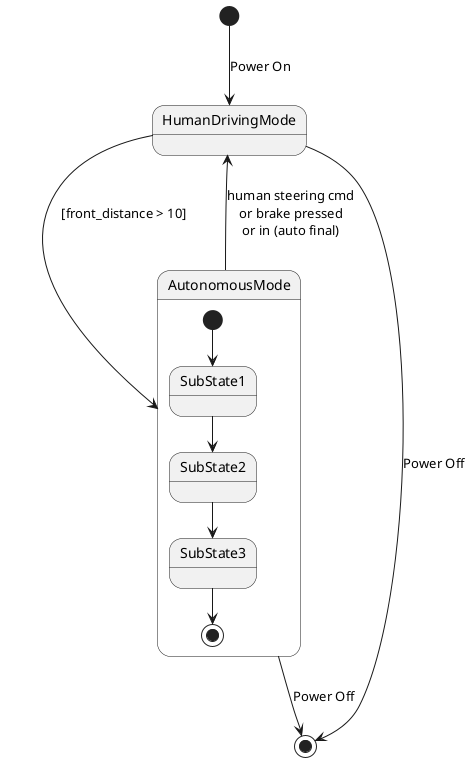

# Pair `0050`：NL + PlantUML STM0 + FCSTM STM0

[上一组 `0049`](../0049/README.md) | [返回 60 组索引](../../PAIR_INDEX.md) | [下一组 `0051`](../0051/README.md)

- LLM：`Claude`
- 模型/场景：high-level driving module
- 作者输出阶段：`Result with Semantic Checking`
- 作者输出单元格：`AE52`；Excel row：`52`
- Phase-I fallback：`false`
- 相对 Phase-I 是否变化：`false`
- Phase-I PlantUML SHA-256：`317f517490d7ed5d6520fc8f56045625d4d9c9b870a058e6a0f1d2c21a1e24e4`
- NL SHA-256：`f1c3dc88371b8256352e7ab6ee7eb42424de6e11dfde70d185f224dd1d05a7a8`
- PlantUML SHA-256：`317f517490d7ed5d6520fc8f56045625d4d9c9b870a058e6a0f1d2c21a1e24e4`
- FCSTM SHA-256：`e177a0ff8af9e12db063c42b377b8615e99f9fd4b1825ab51ee71d7e3364f8a4`
- review subject SHA-256：`ec9c8600cecdef753271fc081055ec7b6e79c58998d99f92ab107fa6fc39f3b5`
- working contract SHA-256：`5c6623b026f4db2845044bdc175c069d6004e443043529e52d87355cf5fcfddc`
- 结构裁决：`structure_preserved`
- source states / transitions：`5` / `9`
- mapped / blocked / silent drop：`9` / `0` / `0`
- final / lifecycle / body coverage：`3/3` / `0/0` / `0/0`
- concurrent region / separator coverage：`0/0` / `0/0`
- source normalization coverage：`0/0`
- official raw / validation：`state_diagram` / `state_diagram`
- official identity states / transitions：`5` / `9`
- official identity remaps：state `0` / transition endpoint `0`
- AST audit：`passed`
- legacy whole-model FCSTM execution / Discover：`false` / `false`
- working bundle usage gate：`discover_input_with_capability_mask`
- ownership source / compiler / agent：`14` / `19` / `0`
- source macro / positive identity trace / conversion boundary trace：`9` / `14` / `0`
- capability source-static / simulation / transition-trace：`eligible_with_exclusions` / `ineligible` / `ineligible`
- compiler-only diagnostic policy：`rejected_conversion_artifact`；main-result conversion artifact limit：`0`
- 主 session 对读：`pass`；ownership/macro/capability 均为 `pass`；Case 0050 passes conversion-attribution review. This does not assert NL/PlantUML correctness or runtime equivalence; authored defects remain eligible for later source-grounded Discover. No conversion-specific blocker was found in the exact reviewed occurrences.
- source anchors：`source-ref:llms_emp_feedback_final_0050.puml:line:5\|state HumanDrivingMode {, source-ref:llms_emp_feedback_final_0050.puml:line:3\|[*] --> HumanDrivingMode : Power On`；FCSTM anchors：`element-ref:source:state:HumanDrivingMode@line:7\|state HumanDrivingMode named "HumanDrivingMode" {, element-ref:compiler:state:llms_emp_feedback_final_0050.InitialWaittr_0001@line:6\|state InitialWaittr_0001 named "Awaiting initial event: Power On";`
- 三个原始文件：[NL](./nl.txt) | [PlantUML](./plantuml.puml) | [FCSTM](./fcstm.fcstm)
- 审计入口：[canonical](../../canonical/llms_emp_feedback_final_0050.json) | [冻结 FCSTM](../../fcstm/llms_emp_feedback_final_0050.fcstm) | [case report](../../case_reports/llms_emp_feedback_final_0050.json) | [working contract](../../working_contracts/llms_emp_feedback_final_0050.json) | [source trace](../../source_traces/llms_emp_feedback_final_0050.json) | [人工总账](../../MANUAL_REVIEW.md)

## 主 session 三方语义对应

| projection | assessment | NL anchor | PlantUML anchor | FCSTM anchor | source roots | compiler members | rationale |
|---|---|---|---|---|---|---|---|
| `direct` | `preserved` | 1 The human driving mode is represented by a simple state. | source-ref:llms_emp_feedback_final_0050.puml:line:5\|state HumanDrivingMode { | element-ref:source:state:HumanDrivingMode@line:7\|state HumanDrivingMode named "HumanDrivingMode" { | source:state:HumanDrivingMode | - | Case 0050 binds source:state:HumanDrivingMode to the exact authored occurrence 'state HumanDrivingMode {'; it is present as a direct FCSTM state projection with the same source identity and parent relation. |
| `macro` | `preserved_with_exclusions` | power on | source-ref:llms_emp_feedback_final_0050.puml:line:3\|[*] --> HumanDrivingMode : Power On | element-ref:compiler:state:llms_emp_feedback_final_0050.InitialWaittr_0001@line:6\|state InitialWaittr_0001 named "Awaiting initial event: Power On"; | source:transition:tr_0001 | compiler:state:llms_emp_feedback_final_0050.InitialWaittr_0001 | Case 0050 binds source:transition:tr_0001 to the exact authored occurrence '[*] --> HumanDrivingMode : Power On'; it is present as a source-owned transition root whose cited FCSTM line belongs to a protected compiler macro; the raw label remains opaque. |

## Risk occurrence 第二遍复核

| obligation | risk tag | assessment | PlantUML evidence | FCSTM evidence | ownership evidence | rationale |
|---|---|---|---|---|---|---|
| `review:multi_segment_macro:0001:tr_0001` | `multi_segment_macro` | `compiler_artifact_excluded` | source-ref:llms_emp_feedback_final_0050.puml:line:3\|[*] --> HumanDrivingMode : Power On | element-ref:compiler:state:llms_emp_feedback_final_0050.InitialWaittr_0001@line:6\|state InitialWaittr_0001 named "Awaiting initial event: Power On";, element-ref:compiler:transition_segment:tr_0001:segment:1@line:21\|[*] -> InitialWaittr_0001;, element-ref:compiler:transition_segment:tr_0001:segment:2@line:22\|InitialWaittr_0001 -> HumanDrivingMode : /Power_On; | compiler:state:llms_emp_feedback_final_0050.InitialWaittr_0001, compiler:transition_segment:tr_0001:segment:1, compiler:transition_segment:tr_0001:segment:2, source:transition:tr_0001 | Case 0050 risk multi_segment_macro occurrence review:multi_segment_macro:0001:tr_0001: The single authored transition remains one source-owned semantic root; all bound FCSTM segments are protected compiler artifacts and cannot become repair targets. |
| `review:final_boundary:0002:tr_0005` | `final_boundary` | `source_fact_preserved` | source-ref:llms_emp_feedback_final_0050.puml:line:12\|SubState3 --> [*] | element-ref:compiler:state:llms_emp_feedback_final_0050.AutonomousMode.FinalWaittr_0005@line:15\|state FinalWaittr_0005 named "Completed final boundary: AutonomousMode.SubState3";, element-ref:compiler:transition_segment:tr_0005:segment:1@line:19\|SubState3 -> FinalWaittr_0005; | compiler:state:llms_emp_feedback_final_0050.AutonomousMode.FinalWaittr_0005, compiler:transition_segment:tr_0005:segment:1, source:transition:tr_0005 | Case 0050 risk final_boundary occurrence review:final_boundary:0002:tr_0005: The authored PlantUML final boundary is preserved by the bound FCSTM termination macro rather than being converted into an ordinary user state. |
| `review:final_boundary:0003:tr_0008` | `final_boundary` | `source_fact_preserved` | source-ref:llms_emp_feedback_final_0050.puml:line:19\|HumanDrivingMode --> [*] : Power Off | element-ref:compiler:transition_segment:tr_0008:segment:1@line:25\|!HumanDrivingMode -> [*] : /Power_Off; | compiler:transition_segment:tr_0008:segment:1, source:transition:tr_0008 | Case 0050 risk final_boundary occurrence review:final_boundary:0003:tr_0008: The authored PlantUML final boundary is preserved by the bound FCSTM termination macro rather than being converted into an ordinary user state. |
| `review:final_boundary:0004:tr_0009` | `final_boundary` | `source_fact_preserved` | source-ref:llms_emp_feedback_final_0050.puml:line:20\|AutonomousMode --> [*] : Power Off | element-ref:compiler:transition_segment:tr_0009:segment:1@line:26\|!AutonomousMode -> [*] : /Power_Off; | compiler:transition_segment:tr_0009:segment:1, source:transition:tr_0009 | Case 0050 risk final_boundary occurrence review:final_boundary:0004:tr_0009: The authored PlantUML final boundary is preserved by the bound FCSTM termination macro rather than being converted into an ordinary user state. |
| `review:synthetic_state:0005:001-InitialWaittr_0001` | `synthetic_state` | `compiler_artifact_excluded` | source-ref:llms_emp_feedback_final_0050.puml:line:3\|[*] --> HumanDrivingMode : Power On | element-ref:compiler:state:llms_emp_feedback_final_0050.InitialWaittr_0001@line:6\|state InitialWaittr_0001 named "Awaiting initial event: Power On"; | compiler:state:llms_emp_feedback_final_0050.InitialWaittr_0001, source:transition:tr_0001 | Case 0050 risk synthetic_state occurrence review:synthetic_state:0005:001-InitialWaittr_0001: The helper state is a protected compiler-owned projection for a source structural fact; diagnostics on the helper itself are conversion artifacts. |
| `review:synthetic_state:0006:002-FinalWaittr_0005` | `synthetic_state` | `compiler_artifact_excluded` | source-ref:llms_emp_feedback_final_0050.puml:line:12\|SubState3 --> [*] | element-ref:compiler:state:llms_emp_feedback_final_0050.AutonomousMode.FinalWaittr_0005@line:15\|state FinalWaittr_0005 named "Completed final boundary: AutonomousMode.SubState3"; | compiler:state:llms_emp_feedback_final_0050.AutonomousMode.FinalWaittr_0005, source:transition:tr_0005 | Case 0050 risk synthetic_state occurrence review:synthetic_state:0006:002-FinalWaittr_0005: The helper state is a protected compiler-owned projection for a source structural fact; diagnostics on the helper itself are conversion artifacts. |
| `review:synthetic_state:0007:003-UnspecifiedInitial` | `synthetic_state` | `compiler_artifact_excluded` | source-ref:llms_emp_feedback_final_0050.puml:line:5\|state HumanDrivingMode { | element-ref:compiler:state:llms_emp_feedback_final_0050.HumanDrivingMode.UnspecifiedInitial@line:8\|state UnspecifiedInitial named "Unspecified initial";, element-ref:source:state:HumanDrivingMode@line:7\|state HumanDrivingMode named "HumanDrivingMode" { | compiler:state:llms_emp_feedback_final_0050.HumanDrivingMode.UnspecifiedInitial, source:state:HumanDrivingMode | Case 0050 risk synthetic_state occurrence review:synthetic_state:0007:003-UnspecifiedInitial: The helper state is a protected compiler-owned projection for a source structural fact; diagnostics on the helper itself are conversion artifacts. |

## 作者阶段 lineage

| stage | output cell | present | output SHA-256 | feedback | resolved |
|---|---|---|---|---|---|
| `phase_i_generation` | `I52` | `true` | `317f517490d7ed5d6520fc8f56045625d4d9c9b870a058e6a0f1d2c21a1e24e4` | - | - |
| `phase_ii_format` | `U52` | `false` | `-` | - | - |
| `phase_ii_grammar` | `Z52` | `false` | `-` | - | - |
| `phase_ii_semantic` | `AE52` | `true` | `317f517490d7ed5d6520fc8f56045625d4d9c9b870a058e6a0f1d2c21a1e24e4` | None | - |

## Official identity ledger

- status：`aligned`
- canonical / official states：`5` / `5`
- aligned transition endpoints：`9`

本组 state identity 无需重映射。

本组 transition endpoint 无需重映射。

## Source normalization ledger

本组没有 source-input normalization。

## Concurrent region ledger

本组没有 PlantUML orthogonal/concurrent region separator。

## Operational debt

| reason code | count |
|---|---:|
| `R45.DEBT.missing_explicit_initial` | 1 |
| `R45.DEBT.opaque_transition_label_semantics` | 5 |

## NL

```text
1 The human driving mode is represented by a simple state. 2 The autonomous mode has sub-states and is represented by a sub machine state. 3. when power on, the system turn into human driving mode 4when front_distance > 10, auto transport to autonomous state 4. transit to human driving mode when receive human steering cmd, brake pressed, in (auto final) 5 when power off, it will transit to final state
```

## 作者 Phase-II 最终 PlantUML STM0



## 转换后 FCSTM STM0

```fcstm
state llms_emp_feedback_final_0050 named "llms_emp_feedback_final_0050" {
    event Power_On named "Power On";
    event _front_distance_10 named "[front_distance > 10]";
    event human_steering_cmd_nor_brake_pressed_nor_in_auto_final named "human steering cmd\\nor brake pressed\\nor in (auto final)";
    event Power_Off named "Power Off";
    state InitialWaittr_0001 named "Awaiting initial event: Power On";
    state HumanDrivingMode named "HumanDrivingMode" {
        state UnspecifiedInitial named "Unspecified initial";
        [*] -> UnspecifiedInitial;
    }
    state AutonomousMode named "AutonomousMode" {
        state SubState1 named "SubState1";
        state SubState2 named "SubState2";
        state SubState3 named "SubState3";
        state FinalWaittr_0005 named "Completed final boundary: AutonomousMode.SubState3";
        [*] -> SubState1;
        SubState1 -> SubState2;
        SubState2 -> SubState3;
        SubState3 -> FinalWaittr_0005;
    }
    [*] -> InitialWaittr_0001;
    InitialWaittr_0001 -> HumanDrivingMode : /Power_On;
    !HumanDrivingMode -> AutonomousMode : /_front_distance_10;
    !AutonomousMode -> HumanDrivingMode : /human_steering_cmd_nor_brake_pressed_nor_in_auto_final;
    !HumanDrivingMode -> [*] : /Power_Off;
    !AutonomousMode -> [*] : /Power_Off;
}
```

[上一组 `0049`](../0049/README.md) | [返回 60 组索引](../../PAIR_INDEX.md) | [下一组 `0051`](../0051/README.md)
