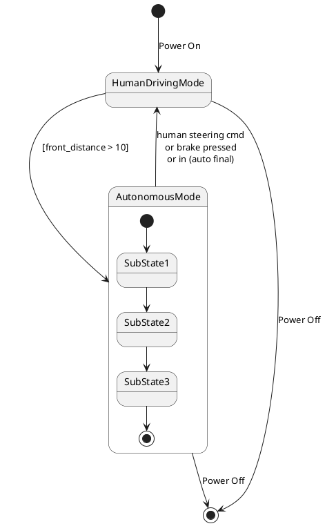

# Pair `0050`：NL + PlantUML STM0 + FCSTM STM0

[上一组 `0049`](../0049/README.md) | [返回 60 组索引](../../PAIR_INDEX.md) | [下一组 `0051`](../0051/README.md)

- LLM：`Claude`
- 模型/场景：high-level driving module
- NL SHA-256：`f1c3dc88371b8256352e7ab6ee7eb42424de6e11dfde70d185f224dd1d05a7a8`
- PlantUML SHA-256：`317f517490d7ed5d6520fc8f56045625d4d9c9b870a058e6a0f1d2c21a1e24e4`
- FCSTM SHA-256：`b30001cc132aa29a9b218136993edc9c8eb72479da46397bf25c94cd1aa2dd42`
- 结构裁决：`structure_preserved`
- FCSTM execution eligible：`false`
- Discover eligible：`false`
- 主 session 对读：literal `\n` label 原样命名；deep chain、nested final 和两个 root final 齐。
- 三个原始文件：[NL](./nl.txt) | [PlantUML](./plantuml.puml) | [FCSTM](./fcstm.fcstm)
- 审计入口：[canonical](../../canonical/llms_emp_stm_results_0050.json) | [冻结 FCSTM](../../fcstm/llms_emp_stm_results_0050.fcstm) | [case report](../../case_reports/llms_emp_stm_results_0050.json) | [人工总账](../../MANUAL_REVIEW.md)

## NL

```text
1 The human driving mode is represented by a simple state. 2 The autonomous mode has sub-states and is represented by a sub machine state. 3. when power on, the system turn into human driving mode 4when front_distance > 10, auto transport to autonomous state 4. transit to human driving mode when receive human steering cmd, brake pressed, in (auto final) 5 when power off, it will transit to final state
```

## 原装 PlantUML STM0



## 转换后 FCSTM STM0

```fcstm
state llms_emp_stm_results_0050 named "llms_emp_stm_results_0050" {
    event Power_On named "Power On";
    event _front_distance_10 named "[front_distance > 10]";
    event human_steering_cmd_nor_brake_pressed_nor_in_auto_final named "human steering cmd\\nor brake pressed\\nor in (auto final)";
    event Power_Off named "Power Off";
    state InitialWaittr_0001 named "Awaiting initial event: Power On";
    state HumanDrivingMode named "HumanDrivingMode";
    state AutonomousMode named "AutonomousMode" {
        state SubState1 named "SubState1";
        state SubState2 named "SubState2";
        state SubState3 named "SubState3";
        state FinalWaittr_0005 named "Completed final boundary: AutonomousMode.SubState3";
        [*] -> SubState1;
        SubState1 -> SubState2;
        SubState2 -> SubState3;
        SubState3 -> FinalWaittr_0005;
    }
    [*] -> InitialWaittr_0001;
    InitialWaittr_0001 -> HumanDrivingMode : /Power_On;
    HumanDrivingMode -> AutonomousMode : /_front_distance_10;
    !AutonomousMode -> HumanDrivingMode : /human_steering_cmd_nor_brake_pressed_nor_in_auto_final;
    HumanDrivingMode -> [*] : /Power_Off;
    !AutonomousMode -> [*] : /Power_Off;
}
```

[上一组 `0049`](../0049/README.md) | [返回 60 组索引](../../PAIR_INDEX.md) | [下一组 `0051`](../0051/README.md)
