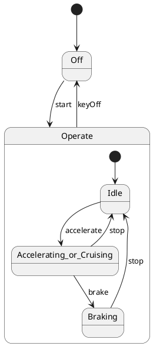

# Pair `0052`：NL + PlantUML STM0 + FCSTM STM0

[上一组 `0051`](../0051/README.md) | [返回 60 组索引](../../PAIR_INDEX.md) | [下一组 `0053`](../0053/README.md)

- LLM：`Claude`
- 模型/场景：Hybrid Sport Utility Vehicle, HSUV
- NL SHA-256：`9fe426ba761d5a52c3b670f35410502a5289bdd9489c4a9bfa983e34d565040c`
- PlantUML SHA-256：`13021d64f5ea5479d51dadc86dcfd1125d4f8535cd5a807ebf54df1d8df385b1`
- FCSTM SHA-256：`2e9a687e4b7ebbd39127a927eb8260ac35ae872ad8c0d86825d05cc956d8c0bf`
- 结构裁决：`structure_preserved`
- FCSTM execution eligible：`false`
- Discover eligible：`false`
- 主 session 对读：Off/Operate 两级结构、8 edge 与 forced keyOff 齐。
- 三个原始文件：[NL](./nl.txt) | [PlantUML](./plantuml.puml) | [FCSTM](./fcstm.fcstm)
- 审计入口：[canonical](../../canonical/llms_emp_stm_results_0052.json) | [冻结 FCSTM](../../fcstm/llms_emp_stm_results_0052.fcstm) | [case report](../../case_reports/llms_emp_stm_results_0052.json) | [人工总账](../../MANUAL_REVIEW.md)

## NL

```text
1. Once the device is powered on, the system enters the `Operate` state, and based on user actions, it transitions between `Idle`, `Accelerating or Cruising`, and `Braking` states.
2. The system can be turned on with the `start` signal and turned off with the `keyOff` signal.
3. Within the `Operate` state, the system transitions between different substates depending on actions like accelerating, braking, or stopping.
```

## 原装 PlantUML STM0



## 转换后 FCSTM STM0

```fcstm
state llms_emp_stm_results_0052 named "llms_emp_stm_results_0052" {
    event start named "start";
    event accelerate named "accelerate";
    event brake named "brake";
    event stop named "stop";
    event keyOff named "keyOff";
    state Operate named "Operate" {
        state Idle named "Idle";
        state Accelerating_or_Cruising named "Accelerating_or_Cruising";
        state Braking named "Braking";
        [*] -> Idle;
        Idle -> Accelerating_or_Cruising : /accelerate;
        Accelerating_or_Cruising -> Braking : /brake;
        Braking -> Idle : /stop;
        Accelerating_or_Cruising -> Idle : /stop;
    }
    state Off named "Off";
    [*] -> Off;
    Off -> Operate : /start;
    !Operate -> Off : /keyOff;
}
```

[上一组 `0051`](../0051/README.md) | [返回 60 组索引](../../PAIR_INDEX.md) | [下一组 `0053`](../0053/README.md)
