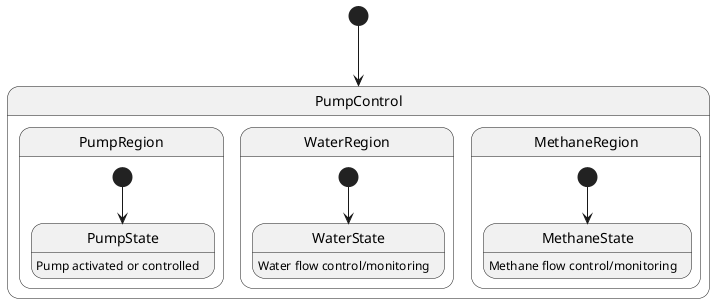

# Pair `0053`：NL + PlantUML STM0 + FCSTM STM0

[上一组 `0052`](../0052/README.md) | [返回 60 组索引](../../PAIR_INDEX.md) | [下一组 `0054`](../0054/README.md)

- LLM：`Claude`
- 模型/场景：Pump Control state machine
- 作者输出阶段：`Result with Semantic Checking`
- 作者输出单元格：`AE55`；Excel row：`55`
- Phase-I fallback：`false`
- 相对 Phase-I 是否变化：`true`
- Phase-I PlantUML SHA-256：`ce9980726ff386e89f12448d5c9cfd123590e6b3e804649ff6c3928054a1edc3`
- NL SHA-256：`a391765dba935d89e6d2467c97b218c0136d106ea9c00bac91e6525e28ac04f1`
- PlantUML SHA-256：`b153279f857c7cd61ea92a60e3970d39454d2199a56f999942f4647031b81211`
- FCSTM SHA-256：`4195bbf7a4a9a9e9862b98640ffaf1c36e3db51dafc5a90bd67be91bab45a604`
- 结构裁决：`structure_preserved`
- source states / transitions：`7` / `4`
- mapped / blocked / silent drop：`4` / `0` / `0`
- final / lifecycle / body coverage：`0/0` / `0/0` / `3/3`
- concurrent region / separator coverage：`0/0` / `0/0`
- source normalization coverage：`0/0`
- official raw / validation：`state_diagram` / `state_diagram`
- official identity states / transitions：`7` / `4`
- official identity remaps：state `0` / transition endpoint `0`
- AST audit：`passed`
- FCSTM execution eligible：`false`
- Discover eligible：`false`
- 主 session 对读：完整对读：PumpControl 下 Pump/Water/Methane 三个普通 nested composite、各自 leaf 与 initial 共 7 状态、4 边、3 个 body 均保留；源无 `--` separator，未虚构正交 region，owner 缺 initial 明确留债。
- 三个原始文件：[NL](./nl.txt) | [PlantUML](./plantuml.puml) | [FCSTM](./fcstm.fcstm)
- 审计入口：[canonical](../../canonical/llms_emp_feedback_final_0053.json) | [冻结 FCSTM](../../fcstm/llms_emp_feedback_final_0053.fcstm) | [case report](../../case_reports/llms_emp_feedback_final_0053.json) | [人工总账](../../MANUAL_REVIEW.md)

## 作者阶段 lineage

| stage | output cell | present | output SHA-256 | feedback | resolved |
|---|---|---|---|---|---|
| `phase_i_generation` | `I55` | `true` | `ce9980726ff386e89f12448d5c9cfd123590e6b3e804649ff6c3928054a1edc3` | - | - |
| `phase_ii_format` | `U55` | `false` | `-` | - | - |
| `phase_ii_grammar` | `Z55` | `false` | `-` | - | - |
| `phase_ii_semantic` | `AE55` | `true` | `b153279f857c7cd61ea92a60e3970d39454d2199a56f999942f4647031b81211` | 1. missing regions | 1.0 |

## Official identity ledger

- status：`aligned`
- canonical / official states：`7` / `7`
- aligned transition endpoints：`4`

本组 state identity 无需重映射。

本组 transition endpoint 无需重映射。

## Source normalization ledger

本组没有 source-input normalization。

## Concurrent region ledger

本组没有 PlantUML orthogonal/concurrent region separator。

## Operational debt

| reason code | count |
|---|---:|
| `R45.DEBT.missing_explicit_initial` | 1 |
| `R45.DEBT.opaque_state_body_semantics` | 3 |

## NL

```text
1. The system begins in the PumpControl state, from which it can transition to different substates based on specific conditions.
2. Within the PumpControl state, there are three main substates: PumpState, WaterState, and MethaneState.
3. The system first transitions to the PumpState substate, where the pump is activated or controlled.
4. The system can also transition to the WaterState substate, indicating that the pump is controlling or monitoring the water flow.
5. Similarly, the system can transition to the MethaneState substate, indicating that the pump is controlling or monitoring the methane flow.
```

## 作者 Phase-II 最终 PlantUML STM0



## 转换后 FCSTM STM0

```fcstm
state llms_emp_feedback_final_0053 named "llms_emp_feedback_final_0053" {
    state PumpControl named "PumpControl" {
        state UnspecifiedInitial named "Unspecified initial";
        state PumpRegion named "PumpRegion" {
            state PumpState named "PumpState\n[PlantUML body] Pump activated or controlled";
            [*] -> PumpState;
        }
        state WaterRegion named "WaterRegion" {
            state WaterState named "WaterState\n[PlantUML body] Water flow control/monitoring";
            [*] -> WaterState;
        }
        state MethaneRegion named "MethaneRegion" {
            state MethaneState named "MethaneState\n[PlantUML body] Methane flow control/monitoring";
            [*] -> MethaneState;
        }
        [*] -> UnspecifiedInitial;
    }
    [*] -> PumpControl;
}
```

[上一组 `0052`](../0052/README.md) | [返回 60 组索引](../../PAIR_INDEX.md) | [下一组 `0054`](../0054/README.md)
