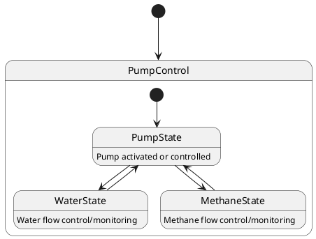

# Pair `0053`：NL + PlantUML STM0 + FCSTM STM0

[上一组 `0052`](../0052/README.md) | [返回 60 组索引](../../PAIR_INDEX.md) | [下一组 `0054`](../0054/README.md)

- LLM：`Claude`
- 模型/场景：Pump Control state machine
- NL SHA-256：`a391765dba935d89e6d2467c97b218c0136d106ea9c00bac91e6525e28ac04f1`
- PlantUML SHA-256：`ce9980726ff386e89f12448d5c9cfd123590e6b3e804649ff6c3928054a1edc3`
- FCSTM SHA-256：`c5b082dcd1d567b99a3a07e2e659bb9d16a4125a25c120029e76bb8df9f07552`
- 结构裁决：`structure_preserved`
- FCSTM execution eligible：`false`
- Discover eligible：`false`
- 主 session 对读：两条 PumpState 无标签 fan-out 均按源顺序保留；三条 body 齐，运行歧义单列 debt。
- 三个原始文件：[NL](./nl.txt) | [PlantUML](./plantuml.puml) | [FCSTM](./fcstm.fcstm)
- 审计入口：[canonical](../../canonical/llms_emp_stm_results_0053.json) | [冻结 FCSTM](../../fcstm/llms_emp_stm_results_0053.fcstm) | [case report](../../case_reports/llms_emp_stm_results_0053.json) | [人工总账](../../MANUAL_REVIEW.md)

## NL

```text
1. The system begins in the PumpControl state, from which it can transition to different substates based on specific conditions.
2. Within the PumpControl state, there are three main substates: PumpState, WaterState, and MethaneState.
3. The system first transitions to the PumpState substate, where the pump is activated or controlled.
4. The system can also transition to the WaterState substate, indicating that the pump is controlling or monitoring the water flow.
5. Similarly, the system can transition to the MethaneState substate, indicating that the pump is controlling or monitoring the methane flow.
```

## 原装 PlantUML STM0



## 转换后 FCSTM STM0

```fcstm
state llms_emp_stm_results_0053 named "llms_emp_stm_results_0053" {
    state PumpControl named "PumpControl" {
        state PumpState named "PumpState\n[PlantUML body] Pump activated or controlled";
        state WaterState named "WaterState\n[PlantUML body] Water flow control/monitoring";
        state MethaneState named "MethaneState\n[PlantUML body] Methane flow control/monitoring";
        [*] -> PumpState;
        PumpState -> WaterState;
        PumpState -> MethaneState;
        WaterState -> PumpState;
        MethaneState -> PumpState;
    }
    [*] -> PumpControl;
}
```

[上一组 `0052`](../0052/README.md) | [返回 60 组索引](../../PAIR_INDEX.md) | [下一组 `0054`](../0054/README.md)
