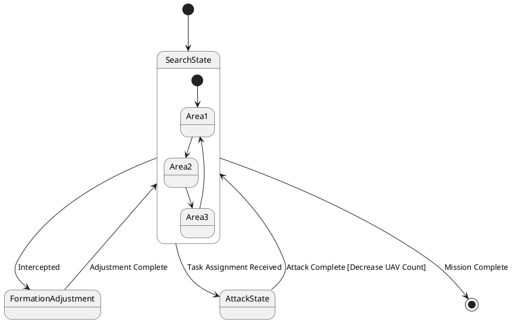

# Pair `0056`：NL + PlantUML STM0 + FCSTM STM0

[上一组 `0055`](../0055/README.md) | [返回 60 组索引](../../PAIR_INDEX.md) | [下一组 `0057`](../0057/README.md)

- LLM：`Claude`
- 模型/场景：UAV swarm state machine diagram
- NL SHA-256：`a01c022f5380700b6c13800497291640b4d64abbadce1d8984be0c14880ebeb3`
- PlantUML SHA-256：`bf93ab42299d56f2aca29149e61760019633d58293e0b2b464360e4d5c20c97f`
- FCSTM SHA-256：`78a7e6e7529e24d272fb6794349c0324db7e886bf20445a18a4f829b8ff0ce6f`
- 结构裁决：`structure_preserved`
- FCSTM execution eligible：`false`
- Discover eligible：`false`
- 主 session 对读：Search composite loop、4 条 root transition 与 root final 齐。
- 三个原始文件：[NL](./nl.txt) | [PlantUML](./plantuml.puml) | [FCSTM](./fcstm.fcstm)
- 审计入口：[canonical](../../canonical/llms_emp_stm_results_0056.json) | [冻结 FCSTM](../../fcstm/llms_emp_stm_results_0056.fcstm) | [case report](../../case_reports/llms_emp_stm_results_0056.json) | [人工总账](../../MANUAL_REVIEW.md)

## NL

```text
1 This state machine model describes the state transitions of a UAV swarm.
2 Before the mission is completed, the UAV swarm continuously performs target search tasks, during which it operates within three different state areas.
3 When the UAV swarm is intercepted, it transitions to the formation adjustment state.
4 During flight, if task assignment information is received, it enters the attack state. After completing the attack, the number of UAVs in the swarm decreases accordingly.
```

## 原装 PlantUML STM0



## 转换后 FCSTM STM0

```fcstm
state llms_emp_stm_results_0056 named "llms_emp_stm_results_0056" {
    event Intercepted named "Intercepted";
    event Adjustment_Complete named "Adjustment Complete";
    event Task_Assignment_Received named "Task Assignment Received";
    event Attack_Complete_Decrease_UAV_Count named "Attack Complete [Decrease UAV Count]";
    event Mission_Complete named "Mission Complete";
    state SearchState named "SearchState" {
        state Area1 named "Area1";
        state Area2 named "Area2";
        state Area3 named "Area3";
        [*] -> Area1;
        Area1 -> Area2;
        Area2 -> Area3;
        Area3 -> Area1;
    }
    state FormationAdjustment named "FormationAdjustment";
    state AttackState named "AttackState";
    [*] -> SearchState;
    !SearchState -> FormationAdjustment : /Intercepted;
    FormationAdjustment -> SearchState : /Adjustment_Complete;
    !SearchState -> AttackState : /Task_Assignment_Received;
    AttackState -> SearchState : /Attack_Complete_Decrease_UAV_Count;
    !SearchState -> [*] : /Mission_Complete;
}
```

[上一组 `0055`](../0055/README.md) | [返回 60 组索引](../../PAIR_INDEX.md) | [下一组 `0057`](../0057/README.md)
