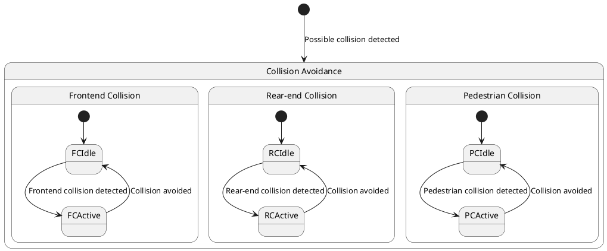

# Pair `0057`：NL + PlantUML STM0 + FCSTM STM0

[上一组 `0056`](../0056/README.md) | [返回 60 组索引](../../PAIR_INDEX.md) | [下一组 `0058`](../0058/README.md)

- LLM：`Claude`
- 模型/场景：Collision avoidance sub-machine state diagram
- NL SHA-256：`49854d044ad99f16a710021500f5e972da93b27635a41144d9b91d32444c0f63`
- PlantUML SHA-256：`6678019769df574ad084ce86bfe39e078fce4203e6de76b77755b89c3d037a79`
- FCSTM SHA-256：`67c243f4db94710ba103956765ba1ed33866a98661bf53a101fab211b22eebd6`
- 结构裁决：`structure_preserved`
- FCSTM execution eligible：`false`
- Discover eligible：`false`
- 主 session 对读：CA/FC/RC/PC hierarchy 与10条 edge 齐；event root initial 进入 CA 后停 placeholder，不猜三分支。
- 三个原始文件：[NL](./nl.txt) | [PlantUML](./plantuml.puml) | [FCSTM](./fcstm.fcstm)
- 审计入口：[canonical](../../canonical/llms_emp_stm_results_0057.json) | [冻结 FCSTM](../../fcstm/llms_emp_stm_results_0057.fcstm) | [case report](../../case_reports/llms_emp_stm_results_0057.json) | [人工总账](../../MANUAL_REVIEW.md)

## NL

```text
1. There are three region in this diagram
2. This sub-machine becomes active when a possible frontend collision, rear-end collision or collision with pedestrian is detected.
3. The orthogonal regions of the active mode of collision avoidance allow for concurrent activation different of collision avoidance controls.
```

## 原装 PlantUML STM0



## 转换后 FCSTM STM0

```fcstm
state llms_emp_stm_results_0057 named "llms_emp_stm_results_0057" {
    event Frontend_collision_detected named "Frontend collision detected";
    event Collision_avoided named "Collision avoided";
    event Rear_end_collision_detected named "Rear-end collision detected";
    event Pedestrian_collision_detected named "Pedestrian collision detected";
    event Possible_collision_detected named "Possible collision detected";
    state InitialWaittr_0010 named "Awaiting initial event: Possible collision detected";
    state CA named "Collision Avoidance" {
        state UnspecifiedInitial named "Unspecified initial";
        state FC named "Frontend Collision" {
            state FCIdle named "FCIdle";
            state FCActive named "FCActive";
            [*] -> FCIdle;
            FCIdle -> FCActive : /Frontend_collision_detected;
            FCActive -> FCIdle : /Collision_avoided;
        }
        state RC named "Rear-end Collision" {
            state RCIdle named "RCIdle";
            state RCActive named "RCActive";
            [*] -> RCIdle;
            RCIdle -> RCActive : /Rear_end_collision_detected;
            RCActive -> RCIdle : /Collision_avoided;
        }
        state PC named "Pedestrian Collision" {
            state PCIdle named "PCIdle";
            state PCActive named "PCActive";
            [*] -> PCIdle;
            PCIdle -> PCActive : /Pedestrian_collision_detected;
            PCActive -> PCIdle : /Collision_avoided;
        }
        [*] -> UnspecifiedInitial;
    }
    [*] -> InitialWaittr_0010;
    InitialWaittr_0010 -> CA : /Possible_collision_detected;
}
```

[上一组 `0056`](../0056/README.md) | [返回 60 组索引](../../PAIR_INDEX.md) | [下一组 `0058`](../0058/README.md)
