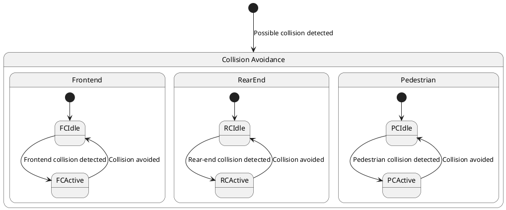

# Pair `0057`：NL + PlantUML STM0 + FCSTM STM0

[上一组 `0056`](../0056/README.md) | [返回 60 组索引](../../PAIR_INDEX.md) | [下一组 `0058`](../0058/README.md)

- LLM：`Claude`
- 模型/场景：Collision avoidance sub-machine state diagram
- 作者输出阶段：`Result with Semantic Checking`
- 作者输出单元格：`AE59`；Excel row：`59`
- Phase-I fallback：`false`
- 相对 Phase-I 是否变化：`true`
- Phase-I PlantUML SHA-256：`6678019769df574ad084ce86bfe39e078fce4203e6de76b77755b89c3d037a79`
- NL SHA-256：`49854d044ad99f16a710021500f5e972da93b27635a41144d9b91d32444c0f63`
- PlantUML SHA-256：`dad4f00d0dfce1ab40970f524ea2c95d2c8c9b1e1480b91287c5a009e2662c3c`
- FCSTM SHA-256：`2ef295e6a539dd6a406ba83e12356c94f8d9c14057e9059f437b6d912797da57`
- review subject SHA-256：`0ddce51e4229947e16fe37d98fcbd3c8888f9efeac89e5988c317bbdea83237c`
- working contract SHA-256：`7c28032620af012fc9ace10b007c1bcc5484f2baaa5f244adcc99be05fff5f47`
- 结构裁决：`structure_preserved`
- source states / transitions：`10` / `10`
- mapped / blocked / silent drop：`10` / `0` / `0`
- final / lifecycle / body coverage：`0/0` / `0/0` / `0/0`
- concurrent region / separator coverage：`0/0` / `0/0`
- source normalization coverage：`0/0`
- official raw / validation：`state_diagram` / `state_diagram`
- official identity states / transitions：`10` / `10`
- official identity remaps：state `0` / transition endpoint `0`
- AST audit：`passed`
- legacy whole-model FCSTM execution / Discover：`false` / `false`
- working bundle usage gate：`discover_input_with_capability_mask`
- ownership source / compiler / agent：`20` / `20` / `0`
- source macro / positive identity trace / conversion boundary trace：`10` / `20` / `0`
- capability source-static / simulation / transition-trace：`eligible_with_exclusions` / `ineligible` / `ineligible`
- compiler-only diagnostic policy：`rejected_conversion_artifact`；main-result conversion artifact limit：`0`
- 主 session 对读：`pass`；ownership/macro/capability 均为 `pass`；Case 0057 passes conversion-attribution review. This does not assert NL/PlantUML correctness or runtime equivalence; authored defects remain eligible for later source-grounded Discover. No conversion-specific blocker was found in the exact reviewed occurrences.
- source anchors：`source-ref:llms_emp_feedback_final_0057.puml:line:2\|state "Collision Avoidance" as CA {, source-ref:llms_emp_feedback_final_0057.puml:line:5\|FCIdle --> FCActive : Frontend collision detected`；FCSTM anchors：`element-ref:source:state:CA@line:8\|state CA named "Collision Avoidance" {, element-ref:compiler:transition_segment:tr_0002:segment:1@line:14\|FCIdle -> FCActive : /Frontend_collision_detected;`
- 三个原始文件：[NL](./nl.txt) | [PlantUML](./plantuml.puml) | [FCSTM](./fcstm.fcstm)
- 审计入口：[canonical](../../canonical/llms_emp_feedback_final_0057.json) | [冻结 FCSTM](../../fcstm/llms_emp_feedback_final_0057.fcstm) | [case report](../../case_reports/llms_emp_feedback_final_0057.json) | [working contract](../../working_contracts/llms_emp_feedback_final_0057.json) | [source trace](../../source_traces/llms_emp_feedback_final_0057.json) | [人工总账](../../MANUAL_REVIEW.md)

## 主 session 三方语义对应

| projection | assessment | NL anchor | PlantUML anchor | FCSTM anchor | source roots | compiler members | rationale |
|---|---|---|---|---|---|---|---|
| `direct` | `preserved` | collision avoidance | source-ref:llms_emp_feedback_final_0057.puml:line:2\|state "Collision Avoidance" as CA { | element-ref:source:state:CA@line:8\|state CA named "Collision Avoidance" { | source:state:CA | - | Case 0057 binds source:state:CA to the exact authored occurrence 'state "Collision Avoidance" as CA {'; it is present as a direct FCSTM state projection with the same source identity and parent relation. |
| `macro` | `preserved_with_exclusions` | This sub-machine becomes active when a possible frontend collision, rear-end collision or collision with pedestrian is | source-ref:llms_emp_feedback_final_0057.puml:line:5\|FCIdle --> FCActive : Frontend collision detected | element-ref:compiler:transition_segment:tr_0002:segment:1@line:14\|FCIdle -> FCActive : /Frontend_collision_detected; | source:transition:tr_0002 | compiler:transition_segment:tr_0002:segment:1 | Case 0057 binds source:transition:tr_0002 to the exact authored occurrence 'FCIdle --> FCActive : Frontend collision detected'; it is present as a source-owned transition root whose cited FCSTM line belongs to a protected compiler macro; the raw label remains opaque. |

## Risk occurrence 第二遍复核

| obligation | risk tag | assessment | PlantUML evidence | FCSTM evidence | ownership evidence | rationale |
|---|---|---|---|---|---|---|
| `review:multi_segment_macro:0001:tr_0010` | `multi_segment_macro` | `compiler_artifact_excluded` | source-ref:llms_emp_feedback_final_0057.puml:line:22\|[*] --> CA : Possible collision detected | element-ref:compiler:state:llms_emp_feedback_final_0057.InitialWaittr_0010@line:7\|state InitialWaittr_0010 named "Awaiting initial event: Possible collision detected";, element-ref:compiler:transition_segment:tr_0010:segment:1@line:33\|[*] -> InitialWaittr_0010;, element-ref:compiler:transition_segment:tr_0010:segment:2@line:34\|InitialWaittr_0010 -> CA : /Possible_collision_detected; | compiler:state:llms_emp_feedback_final_0057.InitialWaittr_0010, compiler:transition_segment:tr_0010:segment:1, compiler:transition_segment:tr_0010:segment:2, source:transition:tr_0010 | Case 0057 risk multi_segment_macro occurrence review:multi_segment_macro:0001:tr_0010: The single authored transition remains one source-owned semantic root; all bound FCSTM segments are protected compiler artifacts and cannot become repair targets. |
| `review:synthetic_state:0002:001-InitialWaittr_0010` | `synthetic_state` | `compiler_artifact_excluded` | source-ref:llms_emp_feedback_final_0057.puml:line:22\|[*] --> CA : Possible collision detected | element-ref:compiler:state:llms_emp_feedback_final_0057.InitialWaittr_0010@line:7\|state InitialWaittr_0010 named "Awaiting initial event: Possible collision detected"; | compiler:state:llms_emp_feedback_final_0057.InitialWaittr_0010, source:transition:tr_0010 | Case 0057 risk synthetic_state occurrence review:synthetic_state:0002:001-InitialWaittr_0010: The helper state is a protected compiler-owned projection for a source structural fact; diagnostics on the helper itself are conversion artifacts. |
| `review:synthetic_state:0003:002-UnspecifiedInitial` | `synthetic_state` | `compiler_artifact_excluded` | source-ref:llms_emp_feedback_final_0057.puml:line:2\|state "Collision Avoidance" as CA { | element-ref:compiler:state:llms_emp_feedback_final_0057.CA.UnspecifiedInitial@line:9\|state UnspecifiedInitial named "Unspecified initial";, element-ref:source:state:CA@line:8\|state CA named "Collision Avoidance" { | compiler:state:llms_emp_feedback_final_0057.CA.UnspecifiedInitial, source:state:CA | Case 0057 risk synthetic_state occurrence review:synthetic_state:0003:002-UnspecifiedInitial: The helper state is a protected compiler-owned projection for a source structural fact; diagnostics on the helper itself are conversion artifacts. |

## 作者阶段 lineage

| stage | output cell | present | output SHA-256 | feedback | resolved |
|---|---|---|---|---|---|
| `phase_i_generation` | `I59` | `true` | `6678019769df574ad084ce86bfe39e078fce4203e6de76b77755b89c3d037a79` | - | - |
| `phase_ii_format` | `U59` | `false` | `-` | - | - |
| `phase_ii_grammar` | `Z59` | `false` | `-` | - | - |
| `phase_ii_semantic` | `AE59` | `true` | `dad4f00d0dfce1ab40970f524ea2c95d2c8c9b1e1480b91287c5a009e2662c3c` | 1. missing region | - |

## Official identity ledger

- status：`aligned`
- canonical / official states：`10` / `10`
- aligned transition endpoints：`10`

本组 state identity 无需重映射。

本组 transition endpoint 无需重映射。

## Source normalization ledger

本组没有 source-input normalization。

## Concurrent region ledger

本组没有 PlantUML orthogonal/concurrent region separator。

## Operational debt

| reason code | count |
|---|---:|
| `R45.DEBT.missing_explicit_initial` | 1 |
| `R45.DEBT.opaque_transition_label_semantics` | 7 |

## NL

```text
1. There are three region in this diagram
2. This sub-machine becomes active when a possible frontend collision, rear-end collision or collision with pedestrian is detected.
3. The orthogonal regions of the active mode of collision avoidance allow for concurrent activation different of collision avoidance controls.
```

## 作者 Phase-II 最终 PlantUML STM0



## 转换后 FCSTM STM0

```fcstm
state llms_emp_feedback_final_0057 named "llms_emp_feedback_final_0057" {
    event Frontend_collision_detected named "Frontend collision detected";
    event Collision_avoided named "Collision avoided";
    event Rear_end_collision_detected named "Rear-end collision detected";
    event Pedestrian_collision_detected named "Pedestrian collision detected";
    event Possible_collision_detected named "Possible collision detected";
    state InitialWaittr_0010 named "Awaiting initial event: Possible collision detected";
    state CA named "Collision Avoidance" {
        state UnspecifiedInitial named "Unspecified initial";
        state Frontend named "Frontend" {
            state FCIdle named "FCIdle";
            state FCActive named "FCActive";
            [*] -> FCIdle;
            FCIdle -> FCActive : /Frontend_collision_detected;
            FCActive -> FCIdle : /Collision_avoided;
        }
        state RearEnd named "RearEnd" {
            state RCIdle named "RCIdle";
            state RCActive named "RCActive";
            [*] -> RCIdle;
            RCIdle -> RCActive : /Rear_end_collision_detected;
            RCActive -> RCIdle : /Collision_avoided;
        }
        state Pedestrian named "Pedestrian" {
            state PCIdle named "PCIdle";
            state PCActive named "PCActive";
            [*] -> PCIdle;
            PCIdle -> PCActive : /Pedestrian_collision_detected;
            PCActive -> PCIdle : /Collision_avoided;
        }
        [*] -> UnspecifiedInitial;
    }
    [*] -> InitialWaittr_0010;
    InitialWaittr_0010 -> CA : /Possible_collision_detected;
}
```

[上一组 `0056`](../0056/README.md) | [返回 60 组索引](../../PAIR_INDEX.md) | [下一组 `0058`](../0058/README.md)
