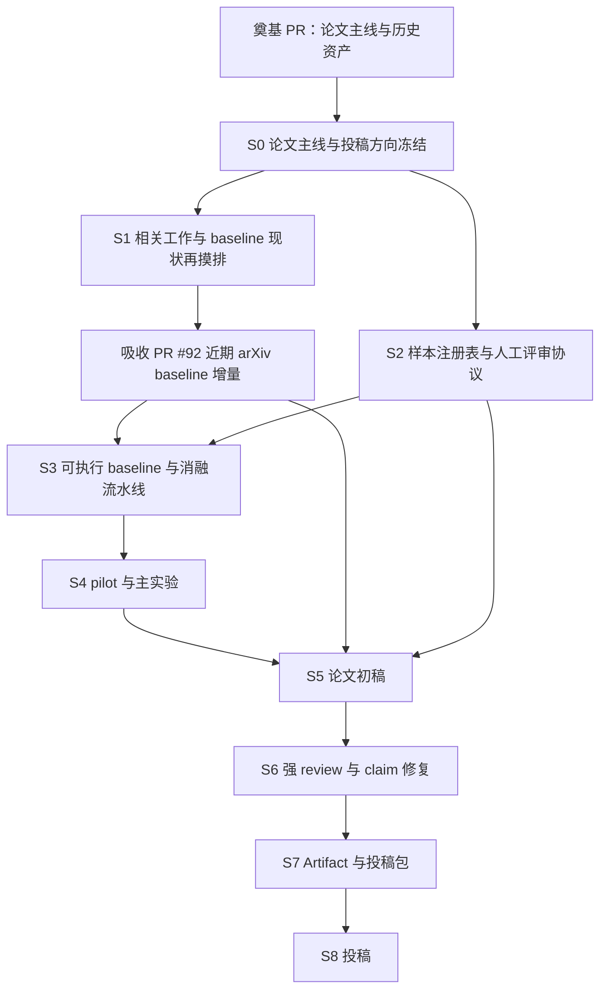

# Path-1 Execution Plan

## 1. 总体目标

将当前 foundation 工作区推进为 Project 1 第一篇论文的可投稿工作流：先冻结 story、样本、baseline、oracle 和 run record，再运行主实验与消融，最后进入 manuscript / review / submission package。

当前计划对齐 issue [#67](https://github.com/HansBug/research_ideas/issues/67)：按 CCF-A 论文标准打磨，2026 夏季第一投优先 CCF-B 期刊；主投 SoSyM regular rolling，ASE Journal / RE Journal regular rolling 作备投。

## 2. 阶段 gate

| Gate | 目标日期 | 必需产物 | Pass 标准 | Fail 动作 |
|---|---|---|---|---|
| G0 论文主线 / 投稿方向冻结 | 本 PR 合入后 1 天内 | [paper_story.md](../story/paper_story.md)、投稿方向决议、摘要 v0 | thesis、scope、claims-to-avoid、target venue 清楚 | 不进入主实验，只继续 story review |
| G1 baseline 现状再摸排与 pilot 可行性 | 2026-06-17 | PR #92 增量吸收报告、pilot sample、minimal runs、oracle draft | baseline corpus 最新，`>=3` 系统 / `>=30` 需求 pilot 可跑；run record 完整 | 先补 baseline / 降低规模或修 pipeline |
| G2 Submission viability | 2026-06-24 | frozen sample registry、baseline matrix、oracle protocol | 样本、baseline、human rubric、LLM usage、artifact 方案冻结 | 不能承诺 7/31 投稿 |
| G3 Main experiment freeze | 2026-07-05 | runs/main、results tables、failure taxonomy | 主实验和 ablation 支撑至少 3 个 RQ | 降级 claim 或补实验 |
| G4 Manuscript v1 | 2026-07-10 | 完整英文稿 v1、figures/tables | 所有章节非空，所有强 claim 有证据 | 暂停新实验 48h 补稿 |
| G5 Strong review closeout | 2026-07-18 | 导师/同门/agent review C/I/M | C/I 清零或 claim 降级 | 不允许 7/31 投稿 |
| G6 Submission package ready | 2026-07-26 | manuscript v2、artifact、cover letter、checklist | artifact 可复现最小结果，投稿材料齐 | 只允许格式修复 |
| G7 First submission | 2026-07-31 | submission id / email | 完成 SoSyM 或导师确认 venue 投稿 | 进入 G8 |
| G8 Fallback decision | 2026-08-15 | fallback_decision、修订稿 | 一次 fallback 投稿或正式延期 | 关闭夏季首投目标 |

## 3. Work packages

| WP | 任务 | 主要文件 | 依赖 | 验收 |
|---|---|---|---|---|
| S0 | story / venue freeze | `DIRECTION.md`、`abstract_v0.md` | foundation | G0 |
| S1a | baseline 现状再摸排 | `baseline_refresh_report.md`、PR #92 增量吸收记录 | baselines corpus + PR #92 | 明确 direct / near / evidence-only 候选，不混称强近邻 |
| S1b | related work / competitors | `related_work_matrix.md`、`references.bib` | S1a | `>=3` closest prior works |
| S2 | sample / oracle protocol | `tables/03_sample_registry.csv`、`oracle_protocol.md`、`human_rubric.md` | sample assets / eval protocol | frozen samples + annotator plan |
| S3 | executable baselines | `experiment_plan.md`、runner scripts、baseline prompts | S1a/S1b/S2 | B0-B5 + external approximate path |
| S4 | experiments | `runs/main/`、`results/rq_tables.*`、`failure_taxonomy.md` | S3 | G3 |
| S5 | writing | manuscript sections、figures/tables | S0-S4 | G4 |
| S6 | review/fix | `review/round1_notes.md`、`ci_fix_plan.md` | manuscript v1 | G5 |
| S7 | artifact/submission | `artifact/README.md`、cover letter、checklist | S6 | G6 |

## 4. Immediate actions after this PR

1. 将本 foundation PR 作为后续 paper 主线入口合并或保持 open 后持续迭代。
2. 冻结 `DIRECTION.md`：确定 Path-1 hard comparison 为第一篇主线，Path-2 / BMC / LTL / variables role 放后续。
3. 先吸收 `main` 中 PR [#92](https://github.com/HansBug/research_ideas/pull/92) 已合入的近期 arXiv baseline / 强近邻增量，形成 `baseline_refresh_report.md`；再从 [baseline_and_related_work_matrix.md](../evidence/baseline_and_related_work_matrix.md) 选 `>=3` closest prior works 并明确可复现程度。
4. 从 [sample_assets.md](../dataset_selection/sample_assets.md) 与 Path-1 9/101 数据中设计 `sample_registry.csv`。
5. 把 [../../../eval/PROTOCOL.md](../../../eval/PROTOCOL.md) 扩展成正式 human adjudication protocol。
6. 建立 pilot run record：至少 direct / structured / full method 三条线，保留 provider/model/prompt/raw output/eligibility。

## 5. 本 PR 不做的事

- 不跑真实四例或主实验。
- 不改 method runtime。
- 不新增 baseline 复现代码。
- 不写完整 manuscript。
- 不提交大体积 run artifacts。

这些进入后续执行 PR。
