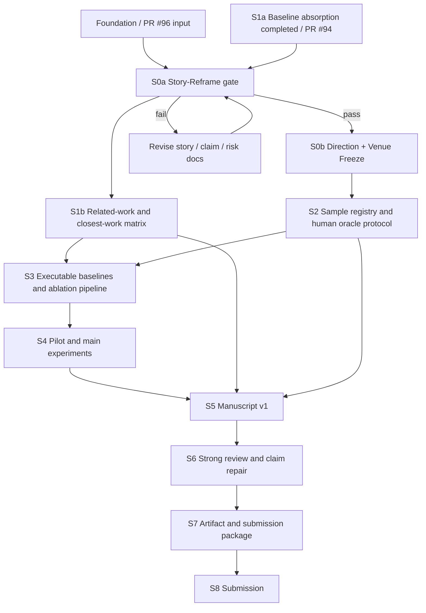

# Path-1 Execution Plan

## 1. 总体目标

将当前 foundation 工作区推进为 Project 1 第一篇论文的可投稿工作流：先通过 **S0a Story-Reframe gate** 冻结可防守 story、claim boundary、RQ 与 reviewer risk，再在 **S0b Direction + Venue Freeze** 中基于新 story 冻结方向、摘要和投稿路线；之后才进入 baseline、sample、oracle、runner、主实验与 manuscript。

当前计划仍对齐 issue [#67](https://github.com/HansBug/research_ideas/issues/67)：按 CCF-A 论文标准打磨，2026 夏季第一投优先 CCF-B 期刊。但 S0a 不决定最终投稿期刊，也不冻结 abstract with results；具体 target venue 与质量门禁由后续 S0b 在新 story 通过后处理，参考 [../story/venue_readiness_gate.md](../story/venue_readiness_gate.md)。

## 2. 阶段 gate

| Gate | 目标日期 | 必需产物 | Pass 标准 | Fail / stop 动作 |
|---|---|---|---|---|
| G0a / S0a Story-Reframe gate | PR #96 / 本阶段 | [`../story/paper_story.md`](../story/paper_story.md)、[`../story/claim_evidence_map.md`](../story/claim_evidence_map.md)、[`experiment_inventory.md`](./experiment_inventory.md)、[`reviewer_risk_register.md`](./reviewer_risk_register.md)、本文件 | thesis、gap、RQ、contribution boundary、terminology policy、reviewer risk 已吸收 PR #94 / baselines §11；不含 first STM / feedback / new DSL / run-record contribution 回潮；E1/E2 降级为 condition | **Stop**：不得进入 S0b、S1b、S2、S3、S5；继续 story / claim / risk review，不跑实验 |
| G0b / S0b Direction + Venue Freeze | S0a 通过后 | `DIRECTION.md`、`abstract_v0.md`、`target_venue_decision.md`、CCF-A 标准自查表、venue handoff | 在 S0a 新 story 上冻结 direction、scope、abstract without result overclaim、fit-first venue；明确 SoSyM / ASEJ / REJ 等路线是否成立 | **Stop**：不得承诺投稿日期；回到 S0a 或 venue gate 重新定位 |
| G1 S1b manuscript-level baseline positioning 与 pilot 可行性 | 2026-06-17 | S1a 结论到 manuscript-level related-work matrix / citation inventory 的转写、pilot sample、minimal dry-run / smoke plan、oracle draft | 已消费 PR #94 / S1a 九篇逐篇反证表；`Structure/Event SMF`、`LLMs for EMP`、`TTool-AI`、`Designing FSMs` 已进入 closest positioning；`>=3` 系统 / `>=30` 需求 pilot 可跑；run-record schema 可记录必要字段 | 先补 S1b 转写 / 降低规模或修 pipeline；不得写 related-work final claims |
| G2 投稿可行性冻结 | 2026-06-24 | frozen sample registry、baseline matrix、oracle protocol、LLM usage disclosure plan | 样本、baseline、human rubric、LLM usage、artifact 方案冻结；至少 1 个 same-sample approximate baseline 有可执行计划 | 不能承诺 7/31 投稿；不进入 full main experiment |
| G3 Main experiment freeze | 2026-07-05 | runs/main、results tables、failure taxonomy、eligibility report | 主实验和 ablation 支撑 RQ1-RQ4 中至少 3 个；失败 run 有 eligibility filter | 降级 claim 或补实验 |
| G4 Manuscript v1 | 2026-07-10 | 完整英文稿 v1、figures/tables、claim-evidence audit | 所有章节非空，所有强 claim 有证据；E1/E2 不作为贡献 | 暂停新实验 48h 补稿 |
| G5 Strong review closeout | 2026-07-18 | 导师/同门/agent review C/I/M、CCF-A 标准自查表 | C/I 清零或 claim 降级；novelty / baseline / oracle / artifact / threats 达到 [venue_readiness_gate.md](../story/venue_readiness_gate.md) 的最低门禁 | 不允许 7/31 投稿 |
| G6 Submission package ready | 2026-07-26 | manuscript v2、artifact、cover letter、checklist | artifact 可复现最小结果，投稿材料齐 | 只允许格式修复 |
| G7 First submission | 2026-07-31 | submission id / email | 完成 S0b 冻结 venue 或导师确认 venue 投稿 | 进入 G8 |
| G8 Fallback decision | 2026-08-15 | fallback_decision、修订稿 | 一次 fallback 投稿或正式延期 | 关闭夏季首投目标 |

### 2.1 S0a stop condition

只要出现以下任一情况，S0a 不通过，后续阶段必须停止：

1. RQ 仍围绕“first STM generation”或泛化 NL-to-STM novelty，而不是 diagnostics / scenario-level simulation feedback / structured repair decision / baseline-aware evaluation。
2. E1/E2、LangGraph、Codex/Claude skill、run record 或 `fcstm` / `pyfcstm` 被写成独立 contribution。
3. `Structure/Event SMF`、`LLMs for EMP`、`TTool-AI`、`Designing FSMs` 任一缺席 novelty carve-out。
4. execution plan 仍表达“先冻结 abstract / venue，再重构 story”的旧 S0 路线。
5. 文档暗示本 PR 已经跑过四例真实 agent-loop、pilot 或主实验。

## 3. Work packages

| WP | 任务 | 主要文件 | 依赖 | 验收 |
|---|---|---|---|---|
| S0a | story / claim / experiment-design reframe | [`../story/paper_story.md`](../story/paper_story.md)、[`../story/claim_evidence_map.md`](../story/claim_evidence_map.md)、[`experiment_inventory.md`](./experiment_inventory.md)、[`reviewer_risk_register.md`](./reviewer_risk_register.md)、本文件 | PR #96、PR #94、[`../baselines/SUMMARY.md`](../baselines/SUMMARY.md) §11 | G0a；新 story 与 RQ 通过 reviewer risk gate |
| S0b | direction / abstract / venue freeze | `DIRECTION.md`、`abstract_v0.md`、`target_venue_decision.md`、CCF-A 标准自查表 | S0a pass | G0b；不得覆盖 S0a carve-out |
| S1a | baseline 阻塞吸收（已由 PR #94 完成，是 S0a 输入而非后续待做项） | [`../baselines/SUMMARY.md`](../baselines/SUMMARY.md) 与 [`../baselines/papers/*.md`](../baselines/papers/) 九篇逐篇反证表 | baselines corpus + PR #92 | 已明确 same-sample approximate / near / evidence-only；mandatory closest work 不缺失；S0a/S1b 需继续消费其结论 |
| S1b | 相关工作 / 对手矩阵 | `related_work_matrix.md`、`references.bib`、closest-work matrix | S0a + 已完成 S1a | `>=4` mandatory closest works，`>=1` same-sample approximate baseline 计划 |
| S2 | sample / oracle protocol | `tables/03_sample_registry.csv`、`oracle_protocol.md`、`human_rubric.md` | S0a/S0b + sample assets / eval protocol | frozen samples + annotator plan |
| S3 | executable baselines | `experiment_plan.md`、runner scripts、baseline prompts | S0a/S1b/S2 | B0-B5 + external approximate path；run-record schema ready |
| S4 | experiments | `runs/main/`、`results/rq_tables.*`、`failure_taxonomy.md` | S3 | G3；eligible runs only enter main statistics |
| S5 | writing | manuscript sections、figures/tables、claim-evidence audit | S0a-S4 | G4；no novelty / naming / run-record relapse |
| S6 | review/fix | `review/round1_notes.md`、`ci_fix_plan.md` | manuscript v1 | G5 |
| S7 | artifact/submission | `artifact/README.md`、cover letter、checklist | S6 | G6 |

## 4. Immediate actions after S0a

1. 若 S0a pass，先进入 S0b：冻结 `DIRECTION.md`、`abstract_v0.md`、`target_venue_decision.md`，且所有表述必须复用 S0a 的 diagnostics / simulation / structured repair / baseline-aware story。
2. 进入 S1b：消费已完成的 S1a [`../baselines/SUMMARY.md`](../baselines/SUMMARY.md) 与 [`../baselines/papers/*.md`](../baselines/papers/) 逐篇反证表，将其转成 manuscript-level related-work matrix、citation inventory 和 closest-work positioning。
3. 从 [`../evidence/baseline_and_related_work_matrix.md`](../evidence/baseline_and_related_work_matrix.md) 选择 same-sample approximate / near / evidence-only 路线，并冻结至少一个 closest-work approximate baseline 计划。
4. 从 [sample_assets.md](../dataset_selection/sample_assets.md) 与 Path-1 9/101 数据中设计 `sample_registry.csv`，明确 main sample、stress-test sample 与 diagnostic failures。
5. 把 [../../../eval/PROTOCOL.md](../../../eval/PROTOCOL.md) 扩展成正式 human adjudication protocol，覆盖 LLM 辅助披露、双人盲审、agreement 与仲裁。
6. 到 S3/S4 后再建立真实 pilot / main run record：至少 direct / structured / diagnostics-only / simulation-feedback / full structured-repair 条件，保留 provider/model/prompt/raw output/eligibility。

## 5. 本 PR 不做的事

- 不跑真实四例 agent-loop、pilot 或主实验。
- 不改 method runtime、pyfcstm submodule、runner 或 provider 配置。
- 不新增 baseline 复现代码。
- 不冻结 final sample registry / final human oracle。
- 不写完整 manuscript，也不写带结果的最终 abstract。
- 不决定最终投稿期刊；只为 S0b 提供 story 与 experiment-design 前提。
- 不提交大体积 run artifacts。

原因：PR #96 / S0a 是计划与文档 gate，用于冻结可审计的 story、RQ、risk 与执行依赖；真实 agent-loop 会触碰 runtime / 实验链路，在样本、oracle、baseline budget 与 eligibility policy 未冻结前运行会产生不可用于主统计的伪证据。
