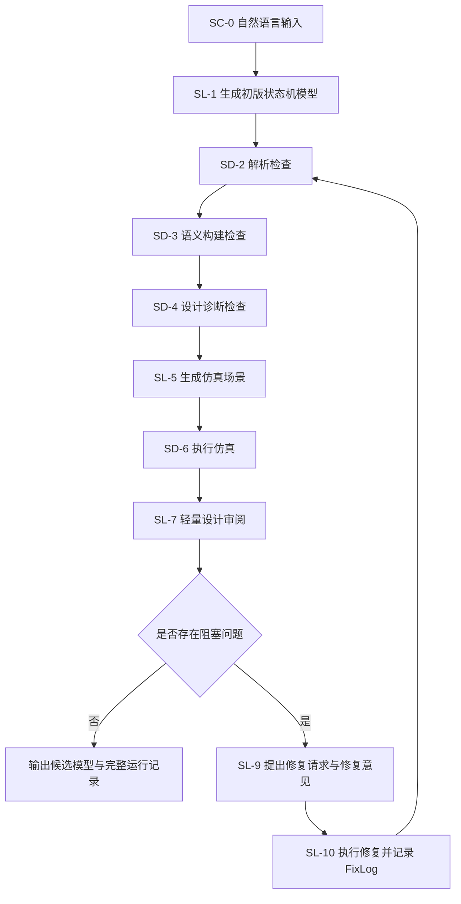

# 2026-06-04 导师讨论：第一篇论文路线与 E1/E2 定位

## 1. 执行摘要

本次讨论对 `project_1_llm_state_machine_modeling` 第一篇论文的主线做了重要修正。讨论前，PR [#31](https://github.com/HansBug/research_ideas/pull/31) 的材料倾向于把 **Path-2 控制系统差异化** 与 **E1/E2 Hybrid** 作为候选主线；讨论后，导师建议第一篇更应聚焦 **Path-1 baseline 硬对比（baseline hard comparison）**，把 Path-2 作为后续另一篇论文继续发展。

新的核心判断如下：

1. **第一篇更倾向 Path-1**：优先围绕可比 baseline，证明我们的方法在状态机建模要素、形式化反馈、模型仿真执行和 LLM Agent 闭环方面比已有方法更进一步。
2. **Path-2 可以成为第二篇**：控制系统差异化、变量角色、深控制系统语义、BMC/LTL 等内容有价值，但不宜压进第一篇。
3. **E1/E2 不再主打 Hybrid**：E1 是同一方法底座运行在自建 agent-loop 上的实验形态；E2 是同一方法底座运行在 Codex / Claude 等成熟 agent 上的实验形态。二者差异本身可以成为一个 RQ。
4. **核心学术贡献应聚焦方法底座**：形式化状态机模型表示、形式化检查反馈、模型仿真执行反馈、LLM Agent 建模/修复，而不是某个 DSL 名称、某个 agent 框架或某个具体实现。
5. **论文中弱化 `fcstm` 名称**：内部仍可用现有 DSL 与工具链，但论文写作中更适合称为“形式化状态机模型表示”，以避免额外解释 DSL 本身贡献。
6. **baseline 还要继续强化**：尤其关注去年和近期 CCF-A/B/C 相关会议中与 LLM 建模、状态机生成、SysML/UML 行为模型生成、agentic modeling 接近的工作。
7. **数据选择要用代表性与统计性说明抵抗 cherry-pick 质疑**：立足控制系统建模对象和样本特征覆盖，而不是只挑对我们有利的成功样本。
8. **变量三分法、BMC/LTL 暂缓**：这些内容可以作为后续论文或 future work，不应抢第一篇主线。
9. **E1 可考虑成熟框架化**：例如 LangChain / LangGraph，以增强 agent-loop 实现的可解释性和审计可信度。
10. **已有 baseline / STM 文献池可探索 survey**：后续可评估是否整理为 survey / mapping study，并可考虑与韵阳合作。

一句话概括：

> 第一篇应更聚焦 Path-1：提出一种结合形式化模型表示、形式化检查、模型仿真执行与 LLM Agent 反馈的状态机建模方法，并系统比较该底座在自建 agent-loop 与 Codex/Claude 等成熟 agent 框架下的表现；Path-2、变量角色、BMC/LTL 和更深控制系统差异化可作为后续论文继续展开。

## 2. 讨论背景与上游材料

本次讨论发生在 PR [#31](https://github.com/HansBug/research_ideas/pull/31) 已经完成导师讨论材料整理之后。PR #31 在导师讨论前起初是一个空讨论 PR，base 为伞形 PR [#22](https://github.com/HansBug/research_ideas/pull/22)，PR body 用于汇总第一篇论文的 Path-1 / Path-2、E1 / E2、真实运行结果和导师讨论问题；本次提交进一步把导师讨论后的结论沉淀为 project_1 正式导师讨论文库。

与本次讨论直接相关的上游材料包括：

| 类型 | 链接 | 作用 |
|---|---|---|
| 伞形 PR | [#22](https://github.com/HansBug/research_ideas/pull/22) | 完整分阶段 agent-loop（full staged agent-loop）总账与后续子 PR 汇总入口。 |
| 讨论 PR | [#31](https://github.com/HansBug/research_ideas/pull/31) | 本次导师讨论前的自包含材料，包含 Path-1/Path-2、E1/E2、真实证据和行动计划。 |
| 导师讨论后 comment | [#31 comment](https://github.com/HansBug/research_ideas/pull/31#issuecomment-4619453977) | 本文的直接来源之一，记录导师讨论后的路线更新。 |
| Path-1 PR | [#9](https://github.com/HansBug/research_ideas/pull/9) | baseline 硬对比（baseline hard comparison）路线背景。 |
| Path-2 PR | [#10](https://github.com/HansBug/research_ideas/pull/10) | 控制系统差异化（control-system differentiation）路线背景。 |
| PR-E1 | [#28](https://github.com/HansBug/research_ideas/pull/28) | 自建完整分阶段 agent-loop（full staged agent-loop）实测与问题闭环。 |
| PR-E2 | [#29](https://github.com/HansBug/research_ideas/pull/29) | Codex / Claude 技能驱动（skill-driven）参考模型（ref-model）生产实测。 |
| NFRR 讨论区 | [#30](https://github.com/HansBug/research_ideas/issues/30) | 参考模型候选（ref-model candidate）质量评价体系。 |
| baseline 文库 | [../baselines/](../baselines/) | 已有方法与可比 baseline 的论文池。 |
| sources 文库 | [../sources/](../sources/) | 控制系统状态机样本来源池。 |
| project_1 内部讨论 | [../discussions/](../discussions/) | 早期 AI/用户内部推演和方向草案。 |

讨论前，PR #31 的核心倾向是：Path-2 控制系统差异化可能更贴博士主题，E1/E2 Hybrid 可能是更稳妥的证据组合。该倾向基于当时对 E1 Round22/Round23、E2 R5、Path-1/Path-2 的综合观察。但导师讨论后，这一倾向被明确修正：第一篇更应先聚焦 Path-1，Path-2 可以作为另一篇论文。

## 3. 关键术语与本文口径

本节不是对外发表论文的最终定义，而是为了让后续 agent 能稳定复用本文信息，先固定本次导师讨论中反复出现的内部工作口径。

| 术语 | 定义类型 | 本文使用口径 | 为什么需要固定 | 与邻近概念的区别 |
|---|---|---|---|---|
| Path-1 baseline 硬对比 | 本研究内部工作口径 | 第一篇优先采用的论文路线：围绕已有 LLM 状态机生成 baseline，使用尽量可比的输入、评价协议和模型要素指标证明方法增量。 | 避免后续继续沿用“Path-2/Hybrid 是第一篇主线”的旧判断。 | 它不是控制系统差异化论文，而是先解决“我们相对已有方法更进一步”这个可比问题。 |
| Path-2 控制系统差异化 | 本研究内部工作口径 | 后续另一篇论文候选路线：围绕控制系统对象特征、变量角色、域内仿真和更深形式化语义展开。 | 避免把第一篇 scope 撑得过大。 | 它不是被否定，只是不作为第一篇主线。 |
| E1 自建完整分阶段 agent-loop | 本研究内部工作口径 | 同一方法底座运行在自建 / 可控 agent-loop 中的实验形态，强调标准化、可审计、可复现 run record。 | 用来保存方法闭环证据和失败/修复轨迹。 | 它不是与 E2 拼接成 Hybrid 的一半，而是一种 agent 框架实验条件。 |
| E2 技能驱动成熟 agent | 本研究内部工作口径 | 同一方法底座通过 Codex / Claude skill 被成熟 coding agent 调用的实验形态，强调高质量候选模型生产能力。 | 用来解释为什么成熟 agent 上效果更好，并形成 E1 vs E2 的 RQ。 | 它不是“单纯 Codex/Claude baseline”，而是同一形式化检查、仿真和评价底座在成熟 agent 中的运行方式。 |
| 形式化状态机模型表示 | 本研究操作性口径 | 为了便于检查、仿真和反馈，将自然语言需求转化成结构化、可解析、可执行的状态机表示。 | 论文中应弱化具体 `fcstm` 名称，避免把主线带成 DSL 设计论文。 | 它强调方法所需的模型表示能力，不等同于要对外主张一个新 DSL。 |
| 形式化检查反馈 | 本研究操作性口径 | parse、semantic、inspect、轻量约束检查等确定性工具产生的反馈，用于发现模型结构、语义和设计问题。 | 这是导师确认的核心贡献之一，即使当前形式化验证较初阶也成立。 | 它不是 BMC/LTL 级重型形式化验证；第一篇不需要把形式化验证做深。 |
| 模型仿真执行反馈 | 本研究操作性口径 | 通过 LLM 生成场景并用确定性 simulator 执行模型，得到通过/失败、轨迹和行为反馈。 | 区分我们的方法和纯离线状态机生成 baseline。 | 它不是完整系统级 virtual commissioning，而是服务状态机建模质量的可执行反馈。 |
| NFRR 质量评价 | 本研究内部评价口径 | 面向 NL + generated model 的多维质量评价框架，用于判断 ref-model candidate 是否进入 reviewer queue。 | 用来支撑 E2 产物和 E1 final model 的准出与人工复核。 | 它不依赖已有 reference model，因此适合早期 ref model 构造。 |

## 4. 讨论前的主要判断

PR #31 讨论稿在导师讨论前形成了以下判断：

1. **Path-1** 提供与已有 LLM 状态机生成 baseline 的可比性，重点是同一 NL、同一 evaluation protocol、同一组件维度的 hard comparison。
2. **Path-2** 提供控制系统差异化叙事，重点是控制系统特征、形式化状态机表示、工具反馈、仿真执行和 audit trail。
3. **E1** 是自建完整分阶段 agent-loop（full staged agent-loop），能提供标准化 run record、stage trace、repair trace 和流程级可复现性。
4. **E2** 是 Codex / Claude 技能驱动工作流（skill-driven workflow），能利用同一工具底座快速产出高质量参考模型候选（ref-model candidate），并通过 NFRR 进入 reviewer queue。
5. **E1/E2 Hybrid** 曾被视为候选主线：E1 提供自动闭环证据，E2 提供高质量候选生产证据。
6. **Path-2 + Hybrid** 曾被认为更贴控制系统方向，但需要更多样本、NFRR/人工复核和 anti cherry-picking 设计。

这些判断不是完全错误，而是过于分散：它们同时承载了 baseline 对比、控制系统差异化、agent-loop 实现、成熟 agent 对照、变量角色、仿真和形式化检查等过多目标。导师讨论后的核心变化，就是把第一篇收敛到更容易讲清楚、更容易比较、更容易投稿的 Path-1 主线。

### 4.1 PR #31 body 中的现状压缩汇总

为了让后续 agent 不必反复翻阅 PR #31 的长 body，本文在这里保留一份压缩但自包含的现状汇总。更细的运行日志、样本表、review comment 和真实模型产物仍以 PR / issue 链接为准。

#### 4.1.1 方法链路总览

PR #31 body 将当前底座概括为一条从自然语言到形式化状态机模型、再到检查、仿真、审阅和修复的闭环链路。内部工程中用 SC / SD / SL 表示不同 stage：SC 是控制段，SD 是确定性工具段，SL 是 LLM 段。论文写作时不必显式强调这些工程缩写，但它们对理解现有证据很重要。

| 阶段 | 类型 | 获取的信息 | 对后续的作用 | 当前注意点 |
|---|---|---|---|---|
| SC-0 自然语言输入 | 控制段 | 原始需求、系统描述、可选样本来源和任务元数据。 | 决定模型必须覆盖的状态、事件、守卫、动作与行为边界。 | 第一篇应尽量用可对比、可追溯、可解释的样本纪律。 |
| SL-1 初版建模 | LLM 段 | 自然语言输入、形式化模型表示规范、建模 prompt。 | 生成第一版形式化状态机模型。 | 强模型加硬 prompt 时 SD-2/3 往往一遍过，后续消融要验证这一点。 |
| SD-2/3 解析与语义检查 | 确定性工具段 | 模型代码、语法解析结果、语义构建结果、错误信息。 | 确认模型是否能被工具链理解，阻断非法模型进入仿真。 | 当前在强模型上贡献可能不如预期，但仍是可复现实验的底线门控。 |
| SD-4 设计诊断检查 | 确定性工具段 | 拓扑、可达性、变量使用、轻量约束和部分 z3 诊断。 | 提供形式化/静态分析反馈，是当前底座的关键贡献之一。 | 论文中应称为形式化检查反馈，而不是把工具名写成贡献。 |
| SL-5 场景生成 | LLM 段 | 自然语言、模型结构、已通过的检查结果。 | 生成用于仿真的 test scenario / 场景矩阵（scenario matrix）。 | E1 中的主要不稳定来源之一；场景一旦生成通常应冻结以避免 oracle 漂移。 |
| SD-6 仿真执行 | 确定性工具段 | 模型、场景、仿真轨迹、通过/失败结果。 | 提供可执行行为反馈，判断模型是否满足场景期望。 | 是区别于纯离线生成 baseline 的重要证据。 |
| SL-7 轻量设计审阅 | LLM 段 | 自然语言、模型、检查/仿真摘要、候选问题。 | 从设计合理性、需求覆盖和潜在漂移角度补充审阅。 | 贡献可能不如 SD-4 和 SD-6 明显，但可作为质量门控。 |
| SL-9/SL-10 修复 | LLM 段 | NL、全部失败信息、FixRequestBatch、FixLog、历史模型。 | 产生修复 patch / 修复后模型，并重新回到 SD-2/3 开始全链路验证。 | 修复建议只能作为参考，修复后必须重新从上到下验证，不能直接宣告结束。 |

#### 4.1.2 E1 与 E2 的真实证据状态

PR #31 body 汇总的核心事实是：E1 已经能提供标准化、可审计、可复现的完整分阶段 agent-loop（full staged agent-loop）证据，但在复杂样本、场景生成和收敛稳定性上仍暴露问题；E2 在同一底座的技能化（skill）包装下，借助 Codex / Claude 这类成熟 agent，生成质量出乎意料地强。

| 路线 | 代表 PR | 已有证据 | 主要价值 | 主要风险 |
|---|---|---|---|---|
| E1 自建完整分阶段 agent-loop（full staged agent-loop） | [PR #28](https://github.com/HansBug/research_ideas/pull/28) | Round22 / Round23 真实运行，包含成功、repair-positive、not-converged 等多种轨迹。 | 标准化 run record、stage trace、FixLog、可复现闭环，适合作为方法可审计证据。 | SL-5 场景生成和复杂样本收敛仍不稳定；部分成功模型需要 NFRR / 人工质量复核。 |
| E2 技能驱动成熟 agent（skill-driven mature agent） | [PR #29](https://github.com/HansBug/research_ideas/pull/29) | 四个真实样本的 Codex / Claude skill 生成，产出多为可进入 reviewer queue 的 T2 候选。 | 证明同一形式化检查、仿真、评价底座在成熟 agent 中可快速产出高质量参考模型候选（ref-model candidate）。 | 容易被质疑只是 Codex / Claude 强；需要通过 ablation 和 E1/E2 RQ 拆解底座贡献。 |
| NFRR 质量评价 | [Issue #30](https://github.com/HansBug/research_ideas/issues/30) | 已形成 NL + generated model 的多维评价框架，用于参考模型候选（ref-model candidate）准出。 | 为 E2 产物和 E1 final model 提供可执行质量评价。 | 仍需更多人工签核与跨样本一致性验证。 |

#### 4.1.3 Path-1 / Path-2 在 PR #31 body 中的原始定位

PR #31 body 讨论前的核心纠结是 Path-1 与 Path-2 谁应成为第一篇主线。本文后续会给出导师更新后的答案，但为了保留上下文，原始问题结构如下。

| 路线 | 原始吸引力 | 原始风险 | 导师讨论后的处理 |
|---|---|---|---|
| Path-1 baseline 硬对比（baseline hard comparison） | 可与已有方法同输入、同组件评价、同 baseline 协议比较，审稿人更容易理解。 | 如果样本太容易，强 LLM + 强 prompt 可能让增量不明显；需要继续找近期强 baseline。 | 成为第一篇更优先主线。 |
| Path-2 控制系统差异化（control-system differentiation） | 更贴博士主题，可围绕控制系统特征、变量、仿真、形式化检查讲差异化。 | 定义负担重，样本和指标需要自建，容易被质疑 cherry-pick。 | 作为另一篇论文或后续深化方向。 |
| E1/E2 Hybrid | 兼顾标准化闭环证据与成熟 agent 高质量产物。 | story 容易变成工程拼装，且贡献边界不清。 | 暂不主打 Hybrid，改成同一底座在不同 agent 框架下的实验对照。 |

## 5. 导师讨论后的路线更新

### 5.1 第一篇更倾向 Path-1

导师建议第一篇更倾向 **Path-1 baseline 硬对比（baseline hard comparison）**。原因不是 Path-2 不重要，而是第一篇需要先形成一个聚焦、可比较、容易被审稿人理解的 story。

Path-1 的优势在于：

1. 可以直接回答“相对于已有 LLM 状态机生成方法，我们是否做得更好”。
2. 可以沿用或改造已有组件级（component-level）evaluation，例如 states、transitions、guards、actions、hierarchy 等要素。
3. 可以更自然地说明我们能建模的要素更丰富，尤其是 guard、action、变量、仿真可执行行为和形式化检查反馈。
4. 可以把形式化检查、仿真执行和 agent feedback 写成方法增量，而不需要同时承担“重新定义控制系统对象”的压力。

新的第一篇主线可以写成：

> We propose an LLM-agent-based state-machine modeling method that converts natural-language requirements into a formal state-machine representation and iteratively improves the model using formal checking and executable simulation feedback.

中文口径是：

> 我们提出一种结合形式化状态机模型表示、形式化检查反馈、模型仿真执行反馈与 LLM Agent 修复的状态机建模方法，并通过与近期 baseline 的系统比较，证明该方法能生成要素更丰富、可检查、可执行、可追溯的状态机模型。

### 5.2 Path-2 更适合作为另一篇论文

Path-2 控制系统差异化仍然有价值，但导师建议不要把它压进第一篇。Path-2 可以作为另一篇论文继续发展，围绕以下问题展开：

1. 什么是“控制系统状态机建模”相对于 generic state machine generation 的差异。
2. 控制系统样本如何按周期执行、数值 guard/effect、硬件解耦、fault/recovery、变量角色等维度分层。
3. 形式化模型表示和仿真执行如何支撑更深的控制系统语义。
4. 变量角色、BMC/LTL、复杂仿真和更强形式化验证如何进入后续研究。

这样做可以避免第一篇过载。第一篇先建立方法与 baseline 增量，第二篇再深化控制系统差异化。

### 5.3 暂不主打 E1+E2 Hybrid

导师建议当前不必把 E1+E2 Hybrid 写成方法主线。更合理的定位是：同一套方法底座分别运行在两类 agent 框架上。

| 实验形态 | 新定位 | 论文中的作用 |
|---|---|---|
| E1 | 方法底座运行在自建 agent-loop / 可控 agent-loop 上 | 检验标准化、可审计、可复现闭环下的方法表现。 |
| E2 | 方法底座运行在 Codex / Claude 等成熟 agent 上 | 检验同一底座在成熟 coding agent 框架中的表现上限和产出质量。 |
| E1 vs E2 | 一个实验分析 RQ | 分析同一底座在不同 agent 框架下为什么表现不同。 |

这意味着 E1/E2 不再是“两个方法合成一个 Hybrid”，而是“同一方法在不同 agent 编排（agent orchestration） 环境中的两种实现/实验形态”。

可形成的 RQ 是：

> **RQ：同一形式化建模与验证/仿真反馈底座，在自建 agent-loop 与成熟 coding agent 框架中表现有何差异，差异由哪些因素导致？**

这个 RQ 可以从以下维度分析：

1. 模型质量：组件级（component-level） F1、guard/action/variable 覆盖、NFRR 或人工审查。
2. 稳定性：是否容易收敛、是否跨轮波动、是否受 provider / prompt / 场景判定器（scenario oracle） 影响。
3. 可审计性：run record、stage trace、FixLog、场景矩阵（scenario matrix） 是否完整。
4. 自动化控制程度：自建 loop 可控但可能僵硬，Codex/Claude 更灵活但实验可控性较弱。
5. 人工成本：哪种形态更适合作为 ref-model 生产、哪种更适合作为 paper method 的标准化证据。

## 6. 核心学术贡献的重写

导师强调，第一篇的核心学术贡献不是 `fcstm`、不是 LangChain/LangGraph、不是 Codex/Claude，也不是某个具体工程实现。真正应该强调的是：

1. **形式化状态机模型表示**：为了支持检查和执行，把自然语言需求转化为结构化、可解析、可执行的状态机模型。
2. **形式化检查反馈**：通过 parse、semantic、inspect、轻量约束检查等方式，把模型中的语法、语义、拓扑、变量使用和轻量一致性问题反馈给 LLM。
3. **模型仿真执行反馈**：通过 scenario generation 与 simulation execution 检查模型是否能按预期行为运行。
4. **LLM Agent 修复与审阅**：让 LLM 在上述反馈基础上修复模型、解释问题、保留修复记录并重新验证。
5. **跨 agent 框架实证分析**：考察同一底座在自建 agent-loop 与成熟 coding agent 中的表现差异。

这些要素共同构成方法贡献。形式化检查即使比较初阶，也不是问题，因为它服务于建模问题：只要它能发现并纠正模型缺陷，就能构成有效反馈源。论文不需要把第一篇写成“深形式化验证论文”，而应写成“形式化反馈增强的 LLM 状态机建模论文”。

可采用的 contribution 草案如下；它们是基于导师讨论要点整理出的 paper drafting 起点，尚未经导师逐字确认：

1. We define a formal state-machine representation suitable for automated checking and executable simulation in an LLM modeling loop.
2. We design an iterative LLM-agent modeling method that combines formal checking feedback and simulation feedback to repair and improve generated state-machine models.
3. We empirically compare the method under a controlled custom agent loop and mature coding-agent environments, analyzing how agent 编排（agent orchestration） affects model quality, stability, and auditability.
4. We evaluate the method against recent baselines and show that it supports richer modeling elements and stronger executable feedback than recent LLM-based state-machine generation approaches.

## 7. 论文中弱化 `fcstm` 名称

导师建议论文里不要直接主打 `fcstm`。原因是：一旦写出一个新 DSL 名称，就需要解释它是什么、为什么存在、与 UML/SysML/Statechart/Umple 的关系、它本身有什么贡献。这会把论文从“LLM + 形式化反馈 + 状态机建模”带偏到“DSL 设计论文”。

更好的写法是：

> 为了便于形式化检查、模型仿真执行和闭环反馈，我们将自然语言需求转化为一种形式化状态机模型表示。

内部实现仍可继续使用当前 DSL、runtime、inspect、simulate、scenario、FixLog 等工具，但论文中优先使用：

- formal state-machine representation
- executable state-machine model
- structured state-machine DSL for checking and simulation
- formalized state-machine representation

而不是把 `fcstm` 当成必须解释的核心术语。

这也意味着后续 paper draft 中应避免过多工具名堆叠。工具名可以在 artifact / implementation section 中出现，但 contribution 和 method story 应围绕“形式化模型表示 + 检查 + 仿真 + agent feedback”。

## 8. Baseline 调研的新要求

导师提醒，baseline 必须继续强化，尤其关注去年和近期 CCF-A/B/C 类会议中是否已有类似方向工作。已有 [../baselines/](../baselines/) 文库很重要，但还需要确认最近工作做到什么程度。

后续 baseline 调研重点包括：

1. LLM 生成 UML/SysML/Statechart/状态机模型的近期论文。
2. 接入语法检查、语义检查、模型检查、仿真执行或 iterative repair 的 LLM modeling 方法。
3. 面向 MBSE / software modeling / requirements-to-model / behavior model generation 的 agentic 方法。
4. 输出模型是否包含 state、transition、guard、action、hierarchy、variable、timer、fault recovery 等要素。
5. 是否有公开数据集、benchmark、manual evaluation protocol 或可复现实验。
6. 是否有近期 CCF-A/B/C 会议论文，例如软件工程、程序语言、形式化方法、AI4SE、MBSE 相关 venue。

与 baseline 的对比不应只说“我们分数更高”，而要说明：

1. 我们能生成的模型要素更丰富。
2. 我们不只是离线生成，而是接入形式化检查与仿真执行反馈。
3. 我们能记录可追溯的反馈、修复和执行证据。
4. 我们的方法能在不同 agent 框架中运行并进行系统比较。

## 9. 数据选择与 cherry-pick 风险

导师建议数据选择要立足于“控制系统建模”的代表性，而不是事后挑成功样本。

合理口径是：

1. 先说明研究对象是控制系统状态机建模，关注模式切换、守卫条件、动作、变量、异常恢复、可执行行为等要素。
2. 再说明样本选择覆盖这些要素，而不是任意抽样。
3. 对样本池做统计性概述，例如：
   - 样本数量；
   - 系统领域；
   - 状态数 / transition 数 / guard 数 / action 数；
   - 是否有层次结构；
   - 是否有变量；
   - 是否可仿真；
   - 是否适合作为 baseline 硬对比（baseline hard comparison）；
   - 是否被排除及排除原因。
4. 保留失败样本、边界样本和排除样本，不只报告成功样本。

可在论文中写成：

> We select representative control-system state-machine modeling tasks according to predefined structural and behavioral features, rather than post-hoc success. The selected tasks cover different combinations of states, transitions, guards, actions, variables, hierarchy, and executable scenarios, and we report both successful and non-convergent cases to avoid cherry-picking.

这条建议对 Path-1 也很重要。即使第一篇更偏 baseline 硬对比（baseline hard comparison），也仍然需要说明样本代表性与选择纪律。

## 10. 变量三分法暂缓

此前内部讨论中，变量可能被分为：

1. 内部控制变量；
2. 外部输入 / 环境值；
3. 输出变量。

导师建议这部分第一篇暂时按下不表，原因是：

1. 一旦展开，就需要定义变量角色语义。
2. 需要解释不同变量角色对 guard、action、inspect、simulation、repair 的影响。
3. 还可能牵涉 DSL 设计、类型系统、输入/输出边界、执行器建模等额外贡献。
4. 第一篇主线已经包括 LLM、形式化检查、仿真执行、agent-loop、baseline、E1/E2 对比，变量角色会让 story 过载。

因此后续建议：

- 工程上保留 role ledger / waiver 的意识；
- 实验和错误分析中如果遇到变量角色问题，可以作为局部 limitation 记录；
- 第一篇不把变量三分法写成核心贡献；
- Path-2 或后续论文再系统处理变量角色。

## 11. 自建 agent-loop 可考虑成熟框架化

导师建议，如果 E1 继续作为自建 agent-loop 形态保留，最好考虑用 LangChain / LangGraph 等成熟 agent 编排（agent orchestration） framework 包装或迁移。

理由是：

1. 审稿人或读者更容易理解 agent state graph、tool call、memory、retry、trace 等结构。
2. 代码审计时不容易被怀疑用了各种 ad-hoc trick。
3. 与 E2 的对照更自然：E1 是标准 agent framework 上的 controlled loop，E2 是 Codex / Claude 等成熟 coding agent。
4. 这能增强方法实现的 solid 程度和可复现可信度。

这并不意味着必须立刻重写所有实现，但后续至少应评估：

1. 当前 SC/SD/SL stage graph 能否映射到 LangGraph node / edge。
2. FixLog、run record、retry、scenario freeze 能否自然落到 framework state。
3. 是否能保持现有测试和真实 run evidence。
4. 迁移成本是否值得在第一篇前承担。

如果迁移成本过高，也可以在论文中谨慎表述为“implemented as a staged agent workflow”，但需要保留足够清晰的 stage graph、run record 和复现实验，避免像临时脚本。

## 12. BMC / LTL 不进入第一篇

导师确认，BMC / LTL 这类更重的形式化验证内容不要放进第一篇主线。

理由是：

1. 第一篇范围已经足够重。
2. 当前形式化检查虽然相对初阶，但它是为了解决建模质量问题，不需要变成完整 model checking 论文。
3. BMC / LTL 可以作为后续形式化验证论文或 Path-2 深化论文的内容。
4. 如果第一篇强行加入，会稀释主线并增加大量实现与解释成本。

因此第一篇的形式化反馈主要聚焦：

- parse / syntax checking；
- semantic construction；
- inspect / static diagnostics；
- 轻量约束检查；
- scenario-based simulation execution；
- repair / review feedback。

## 13. Survey / mapping study 可能性

导师还提到，已有 baseline 池、STM 池和相关调研材料可能具备整理成 survey / mapping study 的潜力。这个方向可以作为毕业成果的一部分，但不抢第一篇主线。

后续可以初步做：

1. 盘点 [../baselines/](../baselines/) 当前收录数量、类别、年份、输入/输出、LLM、验证/仿真情况。
2. 盘点 [../sources/](../sources/) 和状态机类型相关材料是否足够支撑系统映射。
3. 看是否能形成“LLM for software/system modeling”或“natural language to state-machine modeling”的 mapping study。
4. 询问韵阳是否有兴趣合作。
5. 如果材料充足，再单独开 issue / PR 规划，不与第一篇方法论文混在一起。

## 14. 对 PR #31 原讨论稿的覆盖关系

本次导师意见对 PR #31 原讨论稿的覆盖关系如下：

| PR #31 原倾向 | 本次导师讨论后更新 |
|---|---|
| Path-2 + E1/E2 Hybrid 更值得认真考虑 | 第一篇更倾向 Path-1，Path-2 可作为另一篇。 |
| E1/E2 Hybrid 是候选方法形态 | 暂不主打 Hybrid；E1/E2 是同一方法底座在不同 agent 框架下的实验形态。 |
| E1 标准化闭环 + E2 高质量候选生产 | 该区别仍有价值，但应转化为 RQ：为什么同一底座在不同 agent 框架下表现不同。 |
| `fcstm` / DSL 可作为显式对象 | 论文弱化具体名称，强调形式化状态机模型表示。 |
| 变量角色可能成为 Path-2 关键语义 | 第一篇暂不展开，作为后续论文或 future work。 |
| LTL/BMC 可作为形式化验证增强 | 第一篇不纳入，留后续。 |

因此，后续如果更新 PR #31 body 或起草 paper outline，应以本文为准，而不是继续沿用 PR #31 早期的 Path-2/Hybrid 倾向。

## 15. 后续行动计划

### 15.1 近期优先事项

1. **调整第一篇 RQ**：从 Path-2/Hybrid 倾向改为 Path-1 主线 + E1/E2 agent framework 对比。
2. **重写 contribution**：聚焦形式化模型表示、形式化检查反馈、仿真执行反馈、LLM Agent 建模/修复。
3. **继续 baseline 调研**：重点补近期 CCF-A/B/C 相关工作，确认现有方法做到什么程度。
4. **设计对比表**：突出我们能建模的要素更丰富、反馈链更完整、模型可执行/可检查。
5. **整理样本统计表**：说明样本选择代表性，降低 cherry-pick 风险。
6. **评估 E1 框架化**：调研是否迁移/包装到 LangChain / LangGraph。
7. **保持 E2 证据**：E2 仍作为同一底座在成熟 agent（mature agent）上的表现上限与对比实验，不丢弃。

### 15.2 暂缓事项

1. 暂不把 Path-2 写进第一篇主线。
2. 暂不把变量三分法作为第一篇贡献。
3. 暂不把 BMC / LTL 纳入第一篇。
4. 暂不把 `fcstm` 名称写成论文核心对象。
5. 暂不把 E1+E2 Hybrid 写成方法贡献。

### 15.3 后续可开新线

1. Path-2 控制系统差异化论文。
2. 变量角色与控制系统状态机语义论文。
3. BMC / LTL / 更强形式化验证论文。
4. LLM-to-state-machine / LLM-for-modeling survey 或 mapping study。

## 16. 后续 agent 工作提示

后续 AI / Codex / Claude 在 project_1 下工作时，应优先遵守以下提示：

1. 若任务涉及第一篇论文主线，不要默认继续使用 Path-2/Hybrid 口径，应先读本文。
2. 不要把 `fcstm` 作为论文核心贡献名词；除非任务明确是工程实现或内部工具说明。
3. 不要主动把变量三分法、BMC、LTL 加回第一篇主线。
4. baseline 调研要继续向近期 CCF-A/B/C 与 2025-2026 工作扩展。
5. E1/E2 的实验分析应围绕“同一底座在不同 agent 框架下的表现差异”。
6. 任何后续 PR body、issue body、paper outline 如果与本文冲突，应显式说明是新导师意见覆盖了本文，还是只是内部推测。

## 17. 关键链接索引

| 主题 | 链接 |
|---|---|
| 本次讨论前 PR body | [PR #31](https://github.com/HansBug/research_ideas/pull/31) |
| 本次讨论后 comment | [PR #31 comment](https://github.com/HansBug/research_ideas/pull/31#issuecomment-4619453977) |
| 完整分阶段 agent-loop（full staged agent-loop） 伞形 PR | [PR #22](https://github.com/HansBug/research_ideas/pull/22) |
| E1 自建 agent-loop 实测总入口 | [PR #28](https://github.com/HansBug/research_ideas/pull/28) |
| E1 Round22 real-run evidence | [PR #28 comment](https://github.com/HansBug/research_ideas/pull/28#issuecomment-4617557482) |
| E1 Round23 Lingya valid rerun | [PR #28 comment](https://github.com/HansBug/research_ideas/pull/28#issuecomment-4618206208) |
| E2 技能驱动成熟 agent（skill-driven mature agent）实测总入口 | [PR #29](https://github.com/HansBug/research_ideas/pull/29) |
| E2 R5 ABS / Elevator / CARA / LNG 四例 | [ABS](https://github.com/HansBug/research_ideas/pull/29#issuecomment-4610233550) / [Elevator](https://github.com/HansBug/research_ideas/pull/29#issuecomment-4610233768) / [CARA](https://github.com/HansBug/research_ideas/pull/29#issuecomment-4610233994) / [LNG](https://github.com/HansBug/research_ideas/pull/29#issuecomment-4610234214) |
| E2 T2/T3 解释 | [PR #29 comment](https://github.com/HansBug/research_ideas/pull/29#issuecomment-4610624125) |
| NFRR 质量评价体系 | [Issue #30](https://github.com/HansBug/research_ideas/issues/30) |
| Path-1 hard comparison | [PR #9](https://github.com/HansBug/research_ideas/pull/9) |
| Path-2 differentiation | [PR #10](https://github.com/HansBug/research_ideas/pull/10) |
| baseline 文库 | [../baselines/](../baselines/) |
| sources 文库 | [../sources/](../sources/) |
| 内部 discussions | [../discussions/](../discussions/) |
