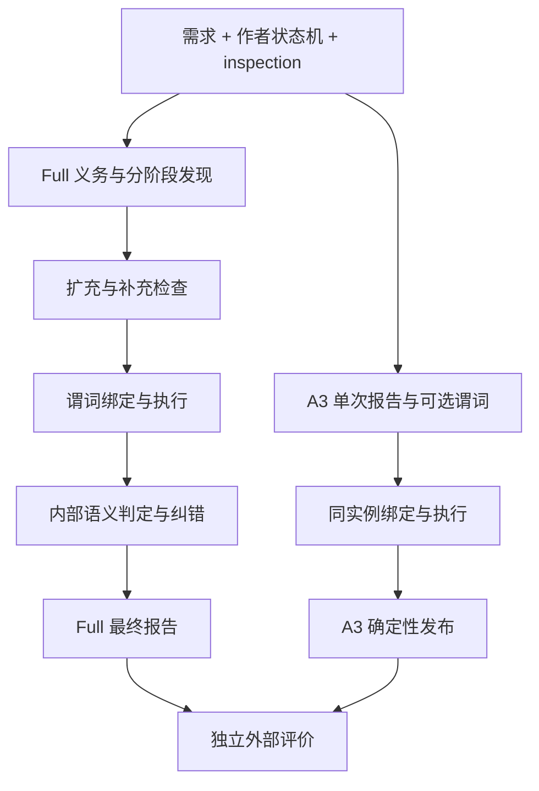

# A3 中间引导消融：有效发现与论文叙事

> 本文是用户明确要求沉淀的实验结果型学术讨论材料，供导师讨论与论文写作使用。设计边界依据用户决定；数据解释和机制推断不代表导师已确认的新意见。数字来自[A3 四模型正式报告](../paper_stm_issue_discover/reports/2026-09-10-20-39-37-a3-four-model-results.md)及其冻结 JSON，核验日期为 2026-09-10。全量计数为机械可复算证据；三组案例为按分析目的选取、经 AI 逐条核对的源文本样例；机制解释属于推断。本轮新增人工确认数为 0。

## 一、中间引导的价值首先体现在能否找到问题

状态机缺陷发现需要把分散在需求中的条件、状态层级和行为要求对应到作者模型。直接阅读可能找出一部分明显不一致，却不保证每条需求都有检查对象，也不保证已有报告覆盖了相邻的行为问题。完整方法通过义务提取、分阶段发现、候选扩充和内部核对组织这个过程。A3 检验这些中间引导在已有需求、模型和确定性检查信息之外，是否仍然带来有效发现。

这里的“有效发现”需要分开观察数量与覆盖。增加多份关于同一问题的报告，能够增加报告产出，却不一定扩大缺陷覆盖；只保留少数可靠报告，能够提高准确率，却可能遗漏大量问题。因此本实验同时查看有效报告数、固定台账的去重命中和报告有效比例，并保留更严格的敏感性口径。

冻结假设包含两层：撤去中间引导后，有效报告和台账覆盖下降；报告准确率也可能下降。四模型结果支持第一层，第二层呈现模型差异。Qwen 在有效产出与覆盖收缩时提高了较严格口径的报告有效比例（第三节定义），这个反向结果说明论文必须把发现能力与剩余报告的有效比例分开讨论。

## 二、A3 用单次生成替换整套中间引导

### 2.1 对照保留相同输入与执行能力

Full 指完整方法。A3 的输入仍是自然语言需求（NL）、作者原始状态机（STM）和 inspection，即工具给出的确定性检查事实。A3 让一个大语言模型（LLM）直接生成缺陷报告，并在适用时附带类型化谓词及参数。谓词表示可由既定后端执行的检查，程序随后进行精确绑定、编译、执行与发布资格核对。

下表说明中间引导原本承担的功能，以及 A3 的干预。义务是从需求中明确的待检查要求；候选是尚未最终发布的缺陷主张；内部 D 是方法在发布前对主张成立程度所做的语义判定。内部判定与实验用的独立外部评价是两个步骤。

| 功能 | Full 的中间引导 | A3 |
| --- | --- | --- |
| 明确需要检查什么 | 提取、补全义务并追踪片段覆盖 | 移除 |
| 将要求与模型对应 | 分阶段发现、不同发现视角 | 单次直接生成报告 |
| 扩大候选范围 | 候选扩充、未解缺口展开、领域不变量和源迁移闭合 | 移除 |
| 补充模型侧发现 | 确定性清单（inventory）候选与额外执行探针 | 移除；已有 inspection 仍输入 |
| 语义复核与纠错 | 内部 D、反驳和修订 | 移除 |
| 核对已生成的精确实例 | 绑定、编译、执行 | 保留 |
| 形成最终报告 | 执行反馈、来源和证据资格、去重与发布 | 保留确定性规则及 A3 适配 |
| 衡量结果 | 独立外部有效性与台账关系评价 | 保留 |

A3 移除的是一组中间环节。它没有把义务清单或覆盖策略重新塞入单次提示，也没有关闭所有确定性处理。尤其是，已生成谓词仍会执行，执行反馈仍影响最终发布；单次生成也不要求每份报告都有可执行谓词。图中的分支只在候选形成与内部复核处不同，下游执行和独立评价的角色保持清楚。

该图表示功能对照；Full 的具体循环由冻结方法定义。实验识别的是这套中间引导的联合贡献，没有保持模型调用预算相等，也没有逐个隔离义务提取、扩充或内部复核的效应。

### 2.2 未验证主张与外部有效性保持区分

谓词检查结果 true 表示相应检查成立，确定性发布拦截同一缺陷主张；false 提供检查失败证据，但仍需判断它是否真正违反源级要求；unknown 表示没有确定结果。无法支持的检查（unsupported）继续保留未验证状态，不能写成已经证明的缺陷。

方法用 W0/W1/W2 区分证据资格：W0 表示缺少足够定位或资格，W1 表示有具体来源支撑但没有合格机械执行确认，W2 表示满足身份、来源和绑定资格的执行证据。谓词为空时，具体源级主张仍可能以 W1 发布。外部评价另行判断报告有效性，所以执行成功、获得 W2 和缺陷有效并非同一个命题。

## 三、四模型比较同一批输入的三轮结果

### 3.1 配对单位与判定装置

实验覆盖 Claude Sonnet 5、GPT-5.6 Luna、Qwen3.8-27B 和 Muse Glimmer-30B 四个固定配置。每个配置有 54 个需求/作者 STM 输入对，每对三轮，共 162 格；A3 合计 648 格，2207 份最终报告全部裁定。Sonnet、Qwen、Muse 的 Full 来自冻结 E2 完整方法，Luna 来自冻结 v61 历史完整方法。比较按同模型、同输入对和同轮次配对，不为本次对照重新选择 Full 结果。

外部评价采用固定 Luna judge：两次独立阅读，分歧时进行必要仲裁。有效性步骤读取报告、需求、作者源及允许的制品事实，并与台账答案、方法内部标签及执行 verdict 隔离；关系步骤再按隔离协议判断报告与台账缺陷的对应。全部最终报告进入评价，零报告格也保留在完成集合。本文的“独立”指评价角色与材料隔离，不能解释为人类复核或采用不同模型家族。

54 对输入共享九个自然语言簇。同需求的不同模型、同输入的重复轮次都有关联，不能把 162 格当作 162 个独立任务。历史 Full 与 A3 的运行日期、服务和随机性未同步控制，Luna 的历史阶段输出上限与 A3 单次输出上限也不同。它们限定比较的外推范围，但不改变这批冻结报告的完整性。

### 3.2 四类读数分别回答产出、覆盖和质量

K 是与台账存在 FULL 或 PARTIAL 关系的有效报告，N 是有效但无上述关系的报告，I 是无效报告。设有效报告 V=K+N，总报告 R=K+N+I，则普通 precision 为 V/R。N 的单位仍是报告，不代表独立新缺陷，更不代表新增人工确认。

strict precision 只把有效且达到外部 D1/D2 的报告计入分子，分母仍为 R。外部 D2 表示支持主张的关键事实和被违反要求成立，且没有与现有证据相容、能使该设计合法的替代解释；D1 表示事实成立，但仍有此类替代解释；D0 表示违反要求未建立或设计读法正当。strict 用于检查普通核算对这些等级的敏感性，不能用已移除的内部 D 替代它。

hit 计台账项在某轮是否至少获得一份 K 报告的 FULL 匹配，同项同轮多份报告只计一次，PARTIAL 不计。台账固定为 145 项，三轮 hit@1 的分母为 435；它不是 435 个互相独立的缺陷。有效报告数反映产出，hit 反映固定台账覆盖，普通与 strict precision 反映报告质量的两种计分范围。主表对每模型先合并三轮分子、分母再计算比率。

## 四、发现与覆盖一致下降，准确率具有模型差异

### 4.1 四模型完整结果

表 1 给出各模型 Full 与 A3 的全部 K/N/I、普通和 strict precision，以及三轮去重命中。表内完整分数使报告分母和台账分母保持分离。

| 模型 | 条件 | 报告 R | K/N/I | 普通 precision | strict precision | hit@1 |
| --- | --- | --- | --- | --- | --- | --- |
| Sonnet | FULL | 823 | 536/183/104 | 719/823（87.36%） | 650/823（78.98%） | 291/435（66.90%） |
| Sonnet | A3 | 684 | 463/91/130 | 554/684（80.99%） | 508/684（74.27%） | 230/435（52.87%） |
| Luna | FULL | 903 | 561/198/144 | 759/903（84.05%） | 678/903（75.08%） | 323/435（74.25%） |
| Luna | A3 | 670 | 404/90/176 | 494/670（73.73%） | 458/670（68.36%） | 245/435（56.32%） |
| Qwen | FULL | 958 | 599/256/103 | 855/958（89.25%） | 781/958（81.52%） | 311/435（71.49%） |
| Qwen | A3 | 358 | 262/56/40 | 318/358（88.83%） | 310/358（86.59%） | 193/435（44.37%） |
| Muse | FULL | 910 | 544/229/137 | 773/910（84.95%） | 712/910（78.24%） | 322/435（74.02%） |
| Muse | A3 | 495 | 233/70/192 | 303/495（61.21%） | 277/495（55.96%） | 175/435（40.23%） |

四模型 A3 的有效报告数和 hit 均低于 Full。普通与 strict precision 在 Sonnet、Luna、Muse 上同时下降，Qwen 则表现为普通比例接近 Full、strict 提高。跨模型稳定的发现是有效产出和覆盖收缩，准确率变化不能概括为所有模型同向。

### 4.2 有效产出损失大于无效报告净增

表 2 将有效报告相对变化与 I 的绝对变化放在一起。pp 为百分点，I/格统一除以 162。

| 模型 | 有效报告 Full → A3 | 相对变化 | ΔI | I/格 Full → A3 | Δ普通 pp | Δstrict pp |
| --- | --- | --- | --- | --- | --- | --- |
| Sonnet | 719 → 554 | -22.95% | +26 | 0.642 → 0.802 | -6.37 | -4.71 |
| Luna | 759 → 494 | -34.91% | +32 | 0.889 → 1.086 | -10.32 | -6.72 |
| Qwen | 855 → 318 | -62.81% | -63 | 0.636 → 0.247 | -0.42 | +5.07 |
| Muse | 773 → 303 | -60.80% | +55 | 0.846 → 1.185 | -23.73 | -22.28 |

合计有效报告从 3106 减至 1669，减少 1437（46.27%）；I 从 488 增至 538，净增 50。Sonnet、Luna、Muse 的 I 绝对数量分别增加，说明质量变化同时涉及有效报告减少与无效报告增加。Qwen 的 I 下降抵消了部分合计增量，不能用合计 I 掩盖模型差异。

四模型三轮台账命中从 1247 降至 843，分母均为 1740=4×3×145，相对减少 32.40%。这个数按模型和轮次累计，843 不是跨模型去重后的独立缺陷数量。将各模型的三轮 pooled 比率等权平均，普通 precision 从 86.40% 降至 76.19%，strict 从 78.46% 降至 71.29%，hit 从 71.67% 降至 48.45%。

若先把四模型全部报告合并再计算，普通 precision 为 86.42%→75.62%，strict 为 78.49%→70.37%。这与模型等权平均不同，因为报告多的模型获得了更大权重。论文总括采用模型等权结果，详细表保留各模型计数；所有计数差都只描述组成变化，未进行语义对应的报告不能称为逐条“转成”了另一类。

### 4.3 重复轮次和配对区间支持有边界的解释

四模型各三轮的 hit 都低于匹配 Full，共 12/12 组方向一致。跨轮至少一次命中（hit@3）与三轮均命中（hit@all）也均下降；后两者以 145 项为分母，用于区分扩大尝试后的覆盖与重复发现的稳定性。完整 24 行逐轮表及分层表见正式报告，方向判断来自全量结果。

九个 NL 簇、10000 次配对 bootstrap 的区间进一步说明，覆盖下降比准确率下降更一致。Sonnet、Luna、Qwen、Muse 的 Δhit@1 95% 区间依次为 [-27.02, 0.00]、[-30.42, -5.01]、[-38.81, -9.63]、[-43.20, -23.12] pp；普通 precision 的区间依次为 [-15.99, 2.72]、[-20.10, -1.74]、[-8.09, 6.78]、[-33.33, -13.95] pp。Sonnet 的 hit 上界到零，Sonnet、Qwen 的 precision 区间跨零，因此不能统一宣称四模型显著退化。九簇区间也不能消除历史配置差异或替代人工金标准。

## 五、Qwen 与 Muse 展示两种退化模式

### 5.1 Qwen：剩余报告更集中，发现范围收缩

Qwen 的 strict precision 提高与发现损失同时存在。报告量从 958 减至 358，有效报告从 855 减至 318，strict 分子从 781 减至 310；分母收缩使较少报告中的 strict 比例上升。hit 从 311 减至 193，说明较高比例没有维持原有覆盖。

A3 的 Qwen 生成 379 条主张，最终发布 358 条，只有 4 条因 true 结果拦截。因此观察到的少报已经出现在直接生成端，不能全部归因于末端筛除。可确认的解释是直接报告形成了较窄的输出集合，剩余报告较集中于 strict 计分范围；本实验没有证据推断它采用了某种隐藏推理策略。

### 5.2 Muse：发现范围与发布质量同时受损

Muse 的有效产出从 773 减至 303，I 从 137 增至 192，普通 precision 从 84.95% 降至 61.21%。三轮都出现有效报告、precision 与 hit 低于 Full 的方向，损失同时发生在找到有效问题和避免无效主张两端。Sonnet、Luna 与其同向，幅度较小。

这个模式与中间引导同时承担覆盖组织和语义核对相一致。它仍然只是联合干预的结果：义务提取、候选扩充与内部复核一起撤除，不能仅根据最终 I 数把责任归给某个环节。下面的内容分层和具体样例用于解释这种联合贡献可以怎样表现，而不替代组件级因果实验。

## 六、条件与行为组合损失更突出，部分拓扑问题仍能发现

表 3 按既有台账分类统计 FULL 命中。trigger、guard、effect 分别指触发、守卫和动作效果；nondeterminism、nontermination、unreachable 分别指非确定性、不终止和不可达。表中分类来自不同轴，不能相加为总命中；分母累计四模型三轮，单模型单元格为 Full→A3。

| 台账分类 | 分母 | Full hit | A3 hit | Sonnet | Luna | Qwen | Muse |
| --- | --- | --- | --- | --- | --- | --- | --- |
| trigger | 300 | 249 | 134 | 64 → 40 | 66 → 32 | 60 → 28 | 59 → 34 |
| guard | 48 | 45 | 15 | 11 → 5 | 12 → 5 | 11 → 1 | 11 → 4 |
| nondeterminism | 60 | 43 | 9 | 12 → 1 | 12 → 5 | 8 → 2 | 11 → 1 |
| nontermination | 60 | 36 | 2 | 10 → 0 | 10 → 1 | 7 → 0 | 9 → 1 |
| unreachable | 96 | 73 | 81 | 21 → 21 | 17 → 22 | 16 → 19 | 19 → 19 |
| effect | 216 | 171 | 131 | 30 → 34 | 43 → 46 | 48 → 32 | 50 → 19 |

条件类与行为组合类的下降，与中间引导帮助逐项核对条件及展开行为要求的解释一致。尤其是非确定性与不终止问题，主张通常需要说明多个迁移怎样共同形成冲突或循环；A3 的命中大幅减少，提示保留检查接口并不足以保证这些问题会被提出。当前数据没有单独识别是义务遗漏、候选缺失还是后续语义处理导致这一结果。

不可达类命中从 73 增至 81，为上述解释提供限定。inspection 仍提供拓扑信息，直接报告可以保留部分明确的可达性问题。effect 则具有模型差异：Sonnet、Luna 上升，Qwen、Muse 下降。因此不能把结果归纳为“所有行为问题下降，所有局部问题保持”；分层体现的是本批台账上的探索性倾向。

## 七、三组案例区分遗漏、来源混淆与保留能力

三组案例按机制目的选择，共比较六个 Full/A3 格，均核对了原始需求、作者 STM、完整发布集合与外部理由。它们不是随机样本，不用于估计某种错误的发生比例。精确报告 ID、台账 ID、路径及 hash 集中放在正式报告第七节与审计附录。

### 7.1 自动驾驶接管要求没有进入直接报告

高层驾驶需求原句为 “transit to human driving mode when receive human steering cmd, brake pressed, in (auto final)”。原文残缺，条件是并列选择还是合取存在歧义。作者 STM 把两条返回边放在 `AutonomousActive`，分别标注方向盘命令和刹车；`AutonomousFinal` 没有返回边。Full 的 Muse 报告指出 auto-final 接管路径缺失，冻结外部裁定接受该读法、判为有效并命中对应台账项。台账中的两个对应 ID 记录同一处缺失，案例只将其作为一个问题。

A3 同格只报告 autonomous 子状态的嵌套错误和 Power On 边的目标错误，两份都有效，但完整发布集合没有接管路径主张。这个例子说明，报告准确率可以保持为满分，仍遗漏冻结裁定接受的另一项行为问题；这个结论保留了原需求的解释边界。Full 把更多要求落实为发现对象的功能在这里有对应现象，至于哪一个中间阶段起决定作用，案例无法独立识别。

### 7.2 工具表示中的 keyOff 差异被归给作者

另一份车辆状态机需求写明通过 `start` 开启、通过 `keyOff` 关闭，作者源也写出 `Operate --> PoweredOff : keyOff`。Muse 的 A3 报告却根据派生表示中空的触发字段和路由 token 守卫，声称作者迁移缺少 keyOff。外部裁定认为作者已表达触发信号，单独类型化载体的差异没有建立源级违反义务，因而判为无效。

同格另外两份 A3 报告把派生 token guard/effect 和子状态退出边也当作作者缺陷，外部同样判无效。Full 同格发布的是另一份台账外有效报告，不能与三份 A3 主张逐条配对。这里可观察的失败是来源层次混淆：工具事实即使描述正确，也需要检查它是否真的属于作者模型。执行反馈能够检查精确实例，却不自动回答源级义务是否成立。

### 7.3 避碰系统不可达仍被 Qwen 保留

自主驾驶需求规定避碰系统从 deactive 状态开始，并在危险出现和消失时切换状态。作者模型的唯一顶层初始边进入 `AutonomousMode`，同级 `CollisionAvoidanceSystem` 没有外部入边。后者内部的局部初始边只在进入复合状态后生效，不能自行建立顶层可达性。本研究不采用同级复合状态隐式并行的解释，作者也没有声明并发区。

Full 与 A3 的 Qwen 都指出这个问题，外部均判有效并命中同一台账项。与此同时，同格有效报告从 13 份减至 2 份，去重台账命中从五项减至两项。这个保留能力的例子与总体不可达类未下降一致，也说明报告减少不等于所有发现机制失效。13 份报告中包含重复关系，不能把其差值解释为 11 个独立缺陷的丢失。

## 八、A3 为论文提供了哪一层证据

### 8.1 从端到端增益推进到中间引导的联合贡献

E2 已经说明完整方法相对同模型基线的端到端效果，但该比较同时包含输入表示、inspection、中间引导和执行约束，不能单凭总体增益判断中间引导是否有贡献。A3 保留需求、作者 STM、inspection 与谓词执行，只把整套中间引导替换为单次直接生成。它的核心预期是：这种替换仍会减少有效发现与覆盖。本次四模型均出现有效报告数和去重 hit 下降，十二组逐轮 hit 也全部同向。这个结果支持完整中间引导在单次直接报告之外具有发现贡献；它不是仅靠多报同一问题形成的数量优势，因为固定台账内部去重后的覆盖也下降。

| 论文论证 | 本次可用证据 | 学术口径与范围 |
| --- | --- | --- |
| 中间引导帮助形成有效发现（H1） | 四模型有效量、hit@1、hit@3、hit@all 均下降；12/12 组逐轮 hit 下降 | 支持中间引导提高有效发现与覆盖的核心预期 |
| 中间引导对报告有效比例的作用（H2） | Sonnet、Luna、Muse 普通和 strict precision 同降；Qwen 普通近乎持平、strict 提高 | 获得部分支持；准确性收益依赖模型配置 |
| 中间引导组织需求检查并补足发现的机制解释 | 条件与行为组合类命中减少；案例出现具体要求遗漏，同时保留部分不可达发现 | 与该解释一致；各环节的独立作用仍待专门对照 |

H1 的支持范围是本批固定配置与输入中的方向一致性，配对区间仍按第四节解释。H2 的边界不能省略：Qwen 的反向 strict 结果真实存在，但其有效分子和覆盖同步下降，因此没有推翻 H1。两种假设分别对应发现能力和报告质量，不能要求一个比例同时回答两个问题。

### 8.2 Qwen 的反向结果限定质量主张，不推翻发现主张

Qwen 说明 A3 为论文提供的是分层证据。发现层面，有效量与台账覆盖一致下降；质量层面，剩余报告可以拥有更高的 strict 比例。前者支持中间引导帮助找到更多有用问题，后者要求论文避免把发现量、覆盖与准确率合并成单一“效果更好”的判断。将这个例外纳入主结论，才能解释中间引导贡献的具体含义。

A3 同时撤去义务提取、发现、扩充与内部语义复核，因此它还没有提供组件级证据。当前可以把内容分层和案例用作机制解释的支持材料，但不能据此确定各步骤的独立增益。A4 则另行检验固定候选下的末端执行反馈，二者与 C-2 的关系见第九节。

### 8.3 可直接用于论文的学术口径

**A3 消融结果支持中间引导对有效发现和台账覆盖的联合贡献。** 在四个固定模型配置、同一批 54 个输入对和三轮重复中，以单次直接报告替代义务提取、分阶段发现、候选扩充、确定性补充发现及内部语义复核后，有效报告和去重台账命中均下降。有效报告合计减少 46.27%，模型等权 hit@1 从 71.67% 降至 48.45%，下降 23.22 个百分点。即使保留 inspection 与谓词执行，单次生成也未维持完整方法的发现范围。

**报告准确性的收益具有模型差异。** Sonnet、Luna、Muse 在普通与 strict precision 上均下降；Qwen 的 strict precision 上升，同时有效分子和覆盖收缩。因此，实验支持“中间引导提高有效发现与覆盖，并在三个配置上改善报告有效比例”，不支持“四模型准确性均改善”的总括。该结论针对整组中间环节；调用预算与历史运行条件的差异仍保留，不能进一步声称某一个步骤独立造成全部增益。

论文中将这两段作为 A3 的结果结论，能够直接回答预期是否得到支持，也为 Qwen 的反向结果留下解释位置。内容分层与三个案例用于说明结果与哪些机制解释相容，不升级为已独立证实的组件级因果链。

## 九、A3 与 A4 为 C-2 提供互补证据

论文的 C-2 关注类型化谓词及其执行证据如何约束问题发现。A3 保留谓词定义和执行，撤除整套中间引导，检验单次直接报告能否维持有效发现；结果最一致的变化是有效量与覆盖下降。这说明只保留检查接口和后端，并不足以替代完整的发现组织过程。

[A4](https://github.com/HansBug/research_ideas/blob/8b4715200d85140a07294fd2aacd29fb31f51ed4/project_1_llm_state_machine_modeling/talks/2026-09-10-实验-A4谓词执行反馈消融与论文叙事.md)固定 Full 已形成的上游候选，撤去末端执行反馈，检验反馈对最终发布与误报抑制的作用。A3 的定位在于形成什么有价值主张，A4 的定位在于面对既有候选如何利用执行证据决定发布。两个设计的评价路径也有差异，不能将它们视为同一消融的重复，或直接把差值相加。

两项实验共同约束 C-2 的学术解释：形成有价值的主张需要发现组织，决定哪些主张可以发布需要证据约束。A3 为前者提供本节之外的独立干预结果，A4 为后者提供固定候选下的末端对照；第八节的结论仅归于 A3 的实际干预范围。

这个结论限定于已完成配置与语料。A3 没有单独撤去谓词定义，也未保持等调用预算；A4 仅撤去末端反馈，没有消除其可能已有的上游影响。两者的交互效应、各删除组件的独立作用、跨语言泛化以及实际人工确认工时均未由本次实验测量。

## 十、稳定事实与复核入口

| 入口 | 用途 |
| --- | --- |
| [四模型正式报告](../paper_stm_issue_discover/reports/2026-09-10-20-39-37-a3-four-model-results.md) | 全量主表、24 行逐轮、配对区间、案例定位与审计附录 |
| [四模型冻结归档](../paper_stm_issue_discover/final_results/a3_open_judge_20260910/README.md) | 完整机器结果和 provider-free 复算 |
| [A3 冻结协议](../paper_stm_issue_discover/discover_matrix/docs/generations/a3_20260910/preregistered.md) | 干预范围、假设、评价隔离与历史限制 |
| [E1/E2 多模型 talk](./2026-09-09-实验-E1E2多模型结果与论文叙事.md) | 完整方法对照的既有背景；其中消融状态按其历史日期理解 |
| [9 月 5 日导师讨论](./2026-09-05-导师-paper1多模型对照与谓词降幻觉.md) | 同模型配对与谓词降无依据报告的路线依据 |

本文不修改台账或冻结标签。后续写作引用数值时应从正式报告回到对应 JSON，区分计数、探索性解释和未测量的机制。
