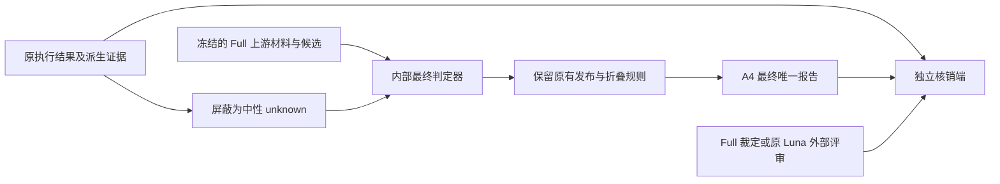

# A4 谓词执行反馈消融：执行证据如何影响四模型的最终报告

本文是供导师讨论和论文写作使用的实验解释材料。实验设计与解释范围依据用户明确决定；以下结果和机制分析不代表导师已经确认的新意见。数字来自[A4 正式报告](../paper_stm_issue_discover/reports/2026-09-10-17-01-11-a4-frozen-full-tail-results.md)及其四模型核算文件，核验日期为 2026-09-10。全部 648 格、3675 份最终报告均已完成裁定。本文只解释这批已完成数据，不另建机器事实源。

## 一、执行反馈的价值要在最终报告质量上检验

状态机错误发现需要同时回答两个问题：模型能否提出有价值的缺陷，以及它能否在交付前排除不成立的主张。一个候选即使带有位置、理由和看似合理的行为解释，也可能把建模选择当作需求违反。谓词把候选转为可执行的问题，执行结果则为最后的发布判断补充约束。论文需要检验的是，这些结果是否实际改善了报告选择。

[9 月 5 日导师讨论](./2026-09-05-导师-paper1多模型对照与谓词降幻觉.md)区分了谓词的两个作用：定义提供搜索和组织线索，执行后端提供可核查的反馈。完整方法与 baseline 的比较包含这两个作用及其他组件，不能仅凭总体增益确定哪个环节发挥了作用。A4 固定完整方法已经形成的候选，只撤去末端可见的谓词执行反馈，用来观察同一批候选最终会被发布成什么。

方向性假说是：缺少执行反馈后，一部分本应拦截的候选会进入报告，无效报告增加，precision 下降。执行证据也可能支持真正的缺陷，因此撤去反馈还可能损失有效报告。hit 的变化取决于这两种作用及报告重组，不能预先要求它一定上升或下降。下面先说明干预和评价，再用绝对计数解释比率，最后回到具体决策过程。

## 二、A4 只切断 method 的执行反馈，独立评价保留原规则

### 2.1 固定候选后，重新作最终判定

Full 指使用完整方法形成的结果；A4 指在同一 Full 上游制品上进行谓词执行反馈消融。两边共享自然语言需求、作者状态机、静态检查、契约、候选顺序、来源定位、谓词路由、绑定和执行计划。A4 把原 true、false、unknown 全部替换成 method 可见的中性 unknown，并移除执行派生的轨迹、反例和旧运行理由。依赖这些执行结果的自动拦截同时撤去，其余语义判定、校验和发布规则保持不变。

内部最终判定器仍可读取需求、源模型和保留的静态事实，并决定是否发布候选。它也保留原来的反驳与证据不足处理。因而 unknown 只是“没有提供这次执行结论”，并不等于“候选成立”。多个候选可以合并成一份报告，不成立的候选可以被拒绝，证据未闭合的候选也可以按原规则不发布。

图中原执行结果只通向独立核销端，不绕过屏蔽重新进入内部最终判定器。外部 Luna 评审提示本身也不注入 backend 回执；“评价端保留真实结果”指核销程序可以使用它，而非让外部 LLM 多看一份答案。

### 2.2 四模型采用同一核算定义

Sonnet 5、GPT-5.6 Luna、Qwen3.8-27B、Muse Glimmer-30B 各有 54 个需求—状态机输入对，每对三轮，共 162 格；四模型共 648 格。Sonnet、Qwen、Muse 的 Full 来自 E2 ours，Luna 来自冻结 v61，并沿用已登记的 0045/r1 替代来源。本次按实际使用的 12 条谓词理解 Luna，同时保留历史制品身份。配对单位是同模型、同输入对、同轮次的 Full 与 A4，候选和报告均不视为独立总体样本。

每份最终唯一报告只走一条评价路径：实际发布了原 true 候选的同一主张，按既定政策计 I；其余内容等价报告复用 Full 裁定；剩余报告交给原 Luna judge。等价要求主张、位置、需求、性质、违例方向与实质子主张一致，单纯 reason/basis 措辞变化不要求重判。新增 Luna 评审沿用两次独立阅读、必要仲裁和台账关系判定；本轮没有新增人工金标准。四模型分别有 39/50/22/19 份指定 I、660/852/882/846 份 Full 复用和 142/34/81/48 份新增评审，合计 3675 份，待判为 0。

指定 true→I 是本实验的核算政策，其适用对象是实际发布的同一原 true 主张。谓词 true 可能只证明一条精确边存在，不能把它扩大解释为对任意自然语言缺陷主张的完备证伪。因此，下面的“无效报告”和“误报抑制”均按这套已说明的评价定义理解，指定 I 与外部 Luna 判定 I 在报告中分别可追溯。

### 2.3 指标分别衡量质量、有效产出与覆盖

K 是与缺陷台账有 FULL 或 PARTIAL 关系的有效报告，N 是有效但没有上述关系的报告，I 是无效报告。令 V=K+N，R=K+N+I。折叠前的候选不计入报告分母。两种 precision 定义如下：

\[ P=\frac{K+N}{R},\qquad P_s=\frac{\#\{q\in K\cup N:D_{\mathrm{external}}(q)\in\{D1,D2\}\}}{R}. \]

P 表示沿用原 relation-first 核算的有效比例；strict precision（P_s）进一步要求有效报告达到外部 D1/D2 等级，两者分母相同。D2 表示承重事实与被违反义务成立，且没有站得住的称职反读法；D1 表示事实成立，但存在与结构事实相容的第二种称职读法；D0 表示未建立被违反义务或设计读法正当。内部判定器的同名等级只决定发布选择，不能替代外部等级。台账关系与外部等级的既有核算差异由 strict 口径显式检查，不删除 D0 后缩小分母。

hit 计数的是台账条目—轮次单元：同一台账条目在同一轮至少被一份 K 报告 FULL 匹配，就计一次。台账唯一 145 条，三轮分母为 435；PARTIAL 不计 hit，多份报告命中同一单元也只计一次。因此 K 报告数与命中缺陷数不能互换。三轮合并结果先汇总分子、分母再求比率；它不同于三个轮次的 precision 简单均值。

## 三、四模型的无效报告均增加，效应幅度不同

### 3.1 绝对计数表明质量下降主要伴随 I 增加

| 模型 | Full K/N/I | A4 K/N/I | 报告数 Full→A4 | Δ有效报告 V | Δ无效报告 I | hit Full→A4（/435） |
|---|---|---|---|---:|---:|---|
| Sonnet | 536/183/104 | 525/176/140 | 823→841 | −18 | +36 | 291→285 |
| Luna | 561/198/144 | 549/200/187 | 903→936 | −10 | +43 | 323→314 |
| Qwen | 599/256/103 | 601/251/133 | 958→985 | −3 | +30 | 311→312 |
| Muse | 544/229/137 | 532/237/144 | 910→913 | −4 | +7 | 322→319 |

表中计数可从完成的逐报告裁定机械复算。四模型在 A4 下都发布了更多报告，有效报告却分别减少 18、10、3、4 条。新增总量因此没有转化成相同比例的有效产出。特别是 Qwen，有效报告从 855 到 852 基本保持，无效报告从 103 增至 133；其 hit 还净增一个单元。这个组合说明增加覆盖和降低误报是不同目标，只看 hit 会漏掉最终交付质量的下降。

### 3.2 普通与 strict precision 给出一致的 pooled 方向

| 模型 | 普通 precision Full→A4 | ΔP（百分点） | strict 分子 Full→A4 | strict precision Full→A4 | ΔP_s（百分点） |
|---|---|---:|---|---|---:|
| Sonnet | 87.36%→83.35% | −4.01 | 650→630 | 78.98%→74.91% | −4.07 |
| Luna | 84.05%→80.02% | −4.03 | 678→665 | 75.08%→71.05% | −4.04 |
| Qwen | 89.25%→86.50% | −2.75 | 781→775 | 81.52%→78.68% | −2.84 |
| Muse | 84.95%→84.23% | −0.72 | 712→713 | 78.24%→78.09% | −0.15 |

Sonnet 与 Luna 的普通、strict precision 都下降约四个百分点；Qwen 都下降约三个百分点。因此，前三款的方向不只依赖普通口径中接受了多少外部 D0 报告，严格等级核算仍显示相同变化。它们支持执行反馈有助于控制最终无效报告，但下降幅度不能直接当作模型的一般幻觉倾向排名。

Muse 的变化明显较小。它的 strict 有效分子增加一条，却因总报告分母增加三条而使 strict precision 下降约 0.15 个百分点。更重要的是，Muse 第二轮的普通 precision 从 84.52% 升到 85.53%，strict 从 76.77% 升到 78.62%。其三轮 pooled 下降与第二轮反向表现必须同时保留：反馈作用并非在每轮、每个模型上等幅发生。本实验报告这些配对点差，不声称统计显著性。

## 四、从候选到报告，解释净变化为何不同

### 4.1 解除执行拦截后，大多数原 true 候选仍被拒绝

| 模型 | 原 true 候选 | D0 拒绝 | 未决且未发布 | 参与发布的候选 | 指定 I 唯一报告 |
|---|---:|---:|---:|---:|---:|
| Sonnet | 358 | 305 | 11 | 42 | 39 |
| Luna | 573 | 505 | 4 | 64 | 50 |
| Qwen | 346 | 318 | 0 | 28 | 22 |
| Muse | 181 | 157 | 0 | 24 | 19 |

这里的候选是 Full 执行批次中的实例，包含执行探针和上游展开，不等于 E2 的 raw candidate 数。参与发布包括主报告候选及折叠成员；同一报告可能吸收多个候选，所以最后一列不能由参与发布数直接替代。原 true 总量也不能按统一比例外推新增误报，因为其大部分在保留的语义判定中仍被拒绝。

这一层给出了模型差异的第一个来源：进入消融的证据组成不同。Muse 的原 true 候选总量为 181，少于其余三款，指定 I 也最少；但其 24/181 参与发布率并非最低，故不能据较小 precision 变化就断言 Muse 更善于拒绝原 true 候选。总量、选择和折叠必须一起解释。

### 4.2 旧报告的消失或变化抵消部分新无效报告

| 模型 | 等价保留 K/N/I | 旧报告失去等价对应 K/N/I | 新增或实质改变 K/N/I |
|---|---|---|---|
| Sonnet | 435/151/74 | 101/32/30 | 90/25/66 |
| Luna | 532/190/130 | 29/8/14 | 17/10/57 |
| Qwen | 557/230/95 | 42/26/8 | 44/21/38 |
| Muse | 517/214/115 | 27/15/22 | 15/23/29 |

每行前两列相加得到 Full，第一列与第三列相加得到 A4。“失去等价对应”既可能是不再发布，也可能是主张内容改变；这里不把它全部称为缺陷消失。以 I 为例，Sonnet 是 66−30=36，Luna 是 57−14=43，Qwen 是 38−8=30，Muse 是 29−22=7。这才是主结果中的无效报告净增量。

指定 I 只占新增或改变 I 的一部分。Sonnet/Luna/Qwen/Muse 分别还有 27/7/16/10 条由新增 Luna 评审判 I。Muse 一方面增加 29 条 I，另一方面 22 条旧 I 失去等价对应，抵消较强；Qwen 只失去 8 条旧 I，抵消较弱。两者相近的指定 I 数（19 与 22）最终形成不同的净增量（7 与 30），这比只看指定 I 更能解释 precision 差异。

### 4.3 有效报告的变化也需要计入解释

为了说明计数如何形成 precision 差值，可作固定次序的算术分解。令下标 0 为 Full、1 为 A4，先替换有效报告数 V，再替换无效报告数 I：

\[ \Delta P_V=\frac{V_1}{V_1+I_0}-\frac{V_0}{V_0+I_0},\qquad \Delta P_I=\frac{V_1}{V_1+I_1}-\frac{V_1}{V_1+I_0}. \]

| 模型 | 有效产出替换项 ΔP_V | 无效产出替换项 ΔP_I | 总差（百分点） |
|---|---:|---:|---:|
| Sonnet | −0.28 | −3.73 | −4.01 |
| Luna | −0.18 | −3.85 | −4.03 |
| Qwen | −0.03 | −2.72 | −2.75 |
| Muse | −0.07 | −0.65 | −0.72 |

此分解的两项相加严格等于总差，表中显示四舍五入值。它依赖替换次序，只用于解释比率，不是两种独立机制的因果估计。四模型的下降在这个分解中都主要来自 I 的增加，同时有效报告确有损失。执行反馈的作用因此涉及拒绝无效主张和保留有效依据两端，不能只描述成一个机械过滤开关。

## 五、微观案例说明发布决定怎样改变

以下案例按机制目的从全量映射中选取，覆盖 7 个模型—输入对—轮次格的 9 个候选，已核对对应候选、可见理由和发布去向；它们不是随机样本，也不用于估计机制比例。精确原件路径和 hash 见正式报告的源案例及审计附录。解释只涉及可观察的 reason/basis 和判定记录，不代表模型隐藏思维。

### 5.1 保留的源证据仍能排除不成立的候选

Sonnet 的 `0000/r1/i15` 检查 HumanDrivingMode 是否声明，原执行结果为 true。A4 隐藏结果后，精确绑定仍显示该状态存在，模型据此判定缺陷未建立、内部 D0，不发布。这个候选没有落入未闭合义务的降级集合，是有可见依据的语义拒绝。它说明只要剩余材料足以回答问题，去掉执行结果不必改变报告选择。

这个例子也解释了原 true 总量不能直接当作误报增量。模型并非把 unknown 逐项翻译成缺陷，而是在剩余的源材料和语义约束下重新判断。最终新增误报来自哪些候选，需要继续追到实际发布报告。

### 5.2 相同候选可依靠静态解释继续进入报告

Sonnet 的 `0000/r2/i2` 主张根复合状态缺少无条件默认入口。A4 根据保留的条件入口静态诊断将其判为 D1，最终报告还吸收三个原 unknown 候选，只计一份指定 I。Luna 的 `0000/r1/i5` 则把 `front_distance > 10` 应为 guard、却写成事件 `front_distance_10` 作为缺陷，A4 判 D1 并发布。两者都说明：执行反馈被屏蔽后，模型仍可依靠静态结构形成一套足以支持发布的解释。

Qwen 的 `0014/r1/i5` 和 Muse 的 `0014/r1/i3/i10` 进一步提供了相近输入上的对照。它们围绕 InMotion 的初始边携带 `Entry_Accelerate`、能否满足无条件进入 Accelerating 的主张，均利用保留的触发字段和初始入口诊断作出 D2 判断。Muse 的两个相同类型化主张去重为一份报告；Qwen 的对应主张发布为一份报告。原 S2 true 在这些例子中只证明精确入口边存在，指定 I 的政策边界见第二节；案例支持的是反馈撤去后的发布路径，不能把它扩大为对整个自然语言主张的完备证伪。

### 5.3 执行证据丢失也会使有效缺陷失去依据

Luna 的 `0024/r2/i9` 原本有 S4 false 反馈，指出 Accelerating 的 entry 未执行 Accelerate；Full 对应报告为 K。A4 清除执行不匹配后，模型的可见理由改为现有材料没有建立 observed mismatch，内部 D0，报告不再发布。这是有效证据缺失伴随有效产出损失的直接路径，且该候选并非因未闭合降级而退出。

Sonnet 的 `0000/r1/i0` 提供另一种变化。Full 原有缺边反例并发布 K；A4 移除反例后，模型接受了“自然语言中的 it 指整个系统”的替代解释，改判 D0、不再发布。两例都显示反馈可帮助稳定缺陷成立的依据。由于执行反馈改变与末端重新调用同时发生，单例不能进一步识别二者各自的独立作用。

### 5.4 旧无效报告可以被重新判断排除

Muse 的 `0022/r1/i2` 把 `Idle --> AcceleratingOrCruising: user accelerating or cruising` 批评为将多个触发条件塞进一个事件。Full 的外部判定为 I：自然语言没有要求把 accelerating 与 cruising 拆成两个独立触发，原标签可被理解为一个作者定义的事件。A4 的内部判定也转向这一解释，指出自然语言使用了“Accelerating or Cruising”这一状态名称，并未建立必须分拆事件的义务，遂从 D2 改为 D0、不发布。

该候选原执行结果就是 unknown，因此这条旧 I 的消失不能解释成其自身 true/false 反馈被移除的直接结果。它体现的是末端重判与整格信息变化下的报告重组。Muse 的净效应较小，正需要把这种旧错误退出与新增错误一起计算，不能只展示对误报抑制假说有利的一侧。

### 5.5 折叠改变计数，不自动证明一个新机制

Muse 的 `0014/r1/i3/i10` 是相同 typed identity 去重，一份报告吸收两个候选；Sonnet 的 `0000/r2/i2` 则作为主报告吸收其他子主张。两种关系都使候选数与报告数分离，但不能统一解释为因果后果折叠。对 quality 指标，分母必须用最终唯一报告；对行为解释，必须同时保留原候选和成员映射。这样才能避免把重复候选当作多条误报，或把一份报告吸收的多项内容误当成完全独立的缺陷。

## 六、A4 为论文提供了哪一层证据

### 6.1 C-2 的执行反馈作用获得任务内支持

A4 为 C-2 中“可执行反馈约束最终缺陷报告”的部分提供了直接对应的实验材料。固定上游候选后，撤去反馈，四款模型的 I 均增加，普通与 strict pooled precision 均下降。Qwen 的有效产出基本保持而 I 明显增加，使这一点尤其清楚；Sonnet、Luna 还出现有效报告损失。反馈因而既参与无效发布控制，也参与有效依据的保留。

这层证据与 A3 所问的“中间引导是否帮助形成有效发现”互补。A3 面向候选形成和中间组织，A4 面向已有候选如何被判定、发布；两者回答不同环节的问题。本 talk 不引用未经核实的 A3 结果，也不把 A4 的数值当作整个谓词机制对端到端方法的总增益。写作时应把 C-2 的机制解释与各自实验范围一一对应。

| 论文论证 | 本次可用证据 | 写作范围 |
|---|---|---|
| C-2：执行反馈帮助抑制无效发布 | 四模型 I 净增与两种 precision 的 pooled 下降 | 冻结候选、既定三路评价下的末端作用 |
| C-2：反馈为最终判断提供可核查依据 | 原 false 有效报告在 A4 中丢失依据的源案例 | 可见决策路径，不推算全量机制占比 |
| 模型差异需要解释 | Sonnet/Luna 约 4 pp、Qwen 约 3 pp、Muse 较小且一轮反向 | 四个实际配置的异质性，不作通用能力排名 |
| 与 A3 的互补 | 上游候选固定，末端反馈独立屏蔽 | 明确实验分工，不预告 A3 的结果方向 |

### 6.2 可以直接用于结果节的中文表述

> 为检验谓词执行反馈对最终报告选择的作用，我们在四款模型上固定完整方法生成的上游材料和候选，将执行返回值及其派生证据统一屏蔽为 unknown，撤去依赖这些结果的拦截，并保留其余判定与发布规则。每款模型覆盖 54 个输入对、三轮运行。按照固定的报告评价政策，屏蔽反馈后 Sonnet、Luna、Qwen、Muse 的无效报告分别增加 36、43、30、7 条，普通 precision 分别下降 4.01、4.03、2.75、0.72 个百分点；strict precision 的三轮合并方向一致。Qwen 的有效报告数基本保持，而无效报告增加，表明反馈对发布质量的作用不能由发现覆盖单独反映。Muse 的合并效应较小，第二轮还出现反向变化，说明反馈收益随模型和轮次而异。候选—报告映射进一步显示，净差由新增无效报告、旧报告退出或改变、有效依据损失及折叠共同形成。这些结果支持执行反馈在本任务中约束最终缺陷报告的作用。

上述段落应与实验设计中的评价政策说明共同使用。论文中的“降低幻觉”宜落到本任务可观测的无效报告减少，避免泛指模型内部知识可靠性。人工确认负担可以用 I 的绝对数量说明：更多无效报告意味着更多需要排除的输出；本实验没有测量审查工时，不能据此给出几何增长或节省时间的数值结论。

## 七、阅读边界与复核入口

本 talk 的总体计数、比率、迁移表属于可机械复算的结果；第五节是按解释目的选取并核对原文的案例；关于剩余信息如何影响模型倾向的概括属于任务内解释。末端重新调用和信息屏蔽共同发生，故不把每条变化都归因于单一反馈机制。四款模型共享 Luna 外部评审及指定核销政策，结论保留这一评价依赖，也不外推到未测模型。

完整的 24 行逐轮数据、原 true/false/unknown 到内部等级和发布去向的计数、案例来源 hash、运行与恢复记录、离线复算命令见[A4 正式报告](../paper_stm_issue_discover/reports/2026-09-10-17-01-11-a4-frozen-full-tail-results.md)。完整方法的跨模型结果和既有微观画像见[E1/E2 talk](./2026-09-09-实验-E1E2多模型结果与论文叙事.md)，其历史实验身份和解释不可直接替代本次冻结候选的 A4 定义。当前文本用四模型全部完成的裁定解释执行反馈，保留不一致的轮次与弱效应，供论文结果节和导师讨论直接使用。
