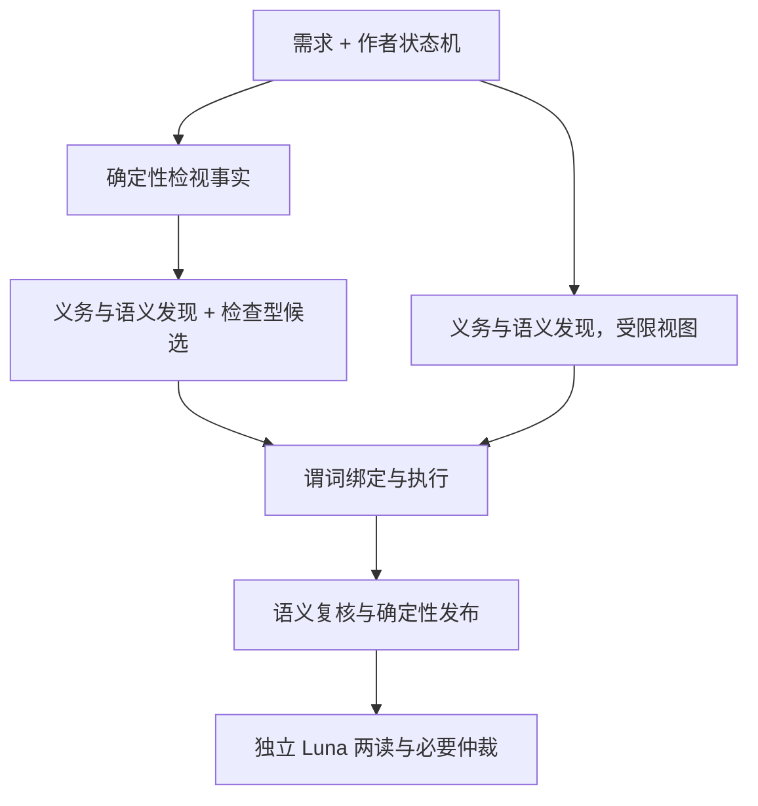

# A1-ext 无检视事实消融：四模型覆盖损失与论文叙事

> 本文是用户明确要求沉淀的实验结果型学术讨论材料，供导师讨论与论文写作使用。设计边界依据用户与事前登记；数据解释与机制推断不代表导师已确认的新意见。数字来自[A1-ext 正式报告](../paper_stm_issue_discover/reports/2026-09-12-10-17-38-a1-ext-three-model-no-inspect-results.md)及其[冻结归档](../paper_stm_issue_discover/final_results/a1_ext_20260911/README.md)，核验日期 2026-09-12。每个数字标注证据级别：**M** 机械可复算（`analyze_a1_ext.py` 重跑得同一个数），**S** 抽样人读（本次 AI 逐条核对的源文本样例，给出样本量），**I** 推断（数据一致但无直接记录，只写“指向”“一致于”）。本轮新增人工确认数为 0。

## 一、为什么要把 A1 从一个模型扩到四个

Paper1 的 C-1 主张“模型检视事实引导的行为问题发现”：把工具对作者状态机算出的结构与拓扑事实接入候选发现，使方法能直接引用并检查跨迁移的行为信息。对应的 RQ3 在 O2（Paper1 中文全文草稿，子 PR #212）中原来只有 gpt-5.6-luna 一行结果，而 RQ4（中间引导消融 A3）与 RQ5（执行反馈消融 A4）都是四模型表。这造成两个问题：C-1 的摘要与结论只能写“在 gpt-5.6-luna 上”，而 §7 最有辨识度的发现“检视事实与中间引导相互依赖”只有一个模型支撑。

A1-ext 用与 A1（gpt-5.6-luna 上的单模型 no-inspect 消融，子 PR #205）完全相同的 `no-inspect` 干预，在 Claude Sonnet 5、Qwen3.8-27B、Muse Glimmer-30B 三个固定配置上各跑 54 个输入对 × 3 轮，并用同一提供方、同一协议的 Luna judge 裁定全部报告。它回答的问题是：关闭检视事实后固定台账的覆盖损失是否跨模型成立、损失落在哪一层与哪一类条目上、报告有效比例是否同向变化。它不回答检视事实的单独因果贡献，因为对照 Full 来自另一次历史运行，也不回答 C-1 是否整体成立，因为 no-inspect 保留了 FCSTM、作者源追踪与全部 12 条谓词。

## 二、干预与判定装置

### 2.1 检视事实是什么，no-inspect 拿掉了什么

检视事实（inspection）是方法在 LLM 发现之前由确定性工具对作者状态机计算出的事实，例如某状态没有出边、某初始边带触发、某状态从初始配置不可达，以及由这些事实派生的检查型候选、补充义务、预检与抑制。`no-inspect` 关闭这些事实的生产、注入与派生链，也关闭内部语义判定中依赖它们的确定性校验；保留 FCSTM 编译与作者源追踪、普通契约提取与两路语义发现、12 条类型化谓词的真实执行、确定性发布与去重，以及独立外部 judge。

| 功能 | Full | no-inspect |
| --- | --- | --- |
| 确定性检视事实与派生候选、补充义务、预检、抑制 | 生产并注入发现与复核 | 关闭 |
| 内部语义判定中依赖检视事实的校验 | 保留 | 关闭 |
| 契约提取、补全、语义发现、前沿扩充、语义复核与修订 | 保留 | 保留，使用受限视图 |
| 12 条谓词的绑定、编译、真实执行 | 保留 | 保留 |
| 确定性发布、真值拦截、去重 | 保留 | 保留 |
| 独立外部评价 | 保留 | 保留 |

图中左路为 Full，右路为 no-inspect；两路共享谓词执行、发布与评价。这是一组事实与派生机制的联合干预，没有保持等调用预算，也没有逐个隔离检查型候选、补充义务或预检。

### 2.2 网格、数据来源与判定装置

网格为冻结的 54 个 NL/STM 输入对，属于 9 个 NL 簇（同一份自然语言需求生成的 6 个制品构成一簇），每对三轮，每模型 162 格；三模型共 486 格 method、486 格 judge，1964 份发布报告全部裁定，pending 为 0（M）。台账 145 条，L0/L1/L2 为 71/35/39；expected-round 指一条台账条目在一轮中的一次命中机会，145 × 3 = 435 为 hit@1 分母。Full 对照为 E2（三模型完整方法与直接发现基线的双臂实验，2026-09-07 前后冻结）归档中同模型的 ours 臂，即完整方法臂的 162 格，只读引用；gpt-5.6-luna 一行来自 A1 归档，其对照为 v61，即 Luna 完整方法的冻结历史运行，同样只读。

判定装置是固定的 `gpt-5.6-luna` 外部 judge，协议 v3.11：每份报告两次独立有效性阅读，分歧时进入必要仲裁，再在隔离步骤判定报告与台账条目的关系：FULL 为报告完整对应某条目，PARTIAL 为部分对应；relation_first 是 judge 协议中关系闭合的既定顺序设置，与 A1 相同。有效性步骤只读报告、需求、作者源与允许的制品事实，不读台账、方法内部标签、执行 verdict 或 Full 裁定。三模型分别产生 528/678/732 份有效性仲裁凭证、145/193/178 次关系仲裁（M）。judge 走 aizzz 通道，与 A1 的 Luna judge 同一提供方；A3 与 E2（首批 6 格 Sonnet judge 除外）的 judge 走 sub2api 通道。全部为自动裁定，没有人类复核，本文的“独立”指材料与流程隔离。

### 2.3 术语速查

| 术语 | 定义 |
| --- | --- |
| K / N / I | 有 FULL 或 PARTIAL 台账关系的有效报告 / 无关系的有效报告 / 无效报告；N 不是独立新缺陷数 |
| 普通 precision | (K+N)/R，全部发布报告进入分母 |
| strict precision | 有效且外部 D1/D2 的报告数 / R |
| D0 / D1 / D2 | 外部裁定的缺陷成立强度：违反未建立或设计读法正当 / 事实成立但有合法替代读法 / 事实与被违反要求成立且无替代读法 |
| FULL / PARTIAL | 报告与台账条目的关系：完整对应 / 部分对应；只有 K 报告的 FULL 关系计入命中 |
| expected-round | 一条台账条目在一轮中的一次命中机会；145 条 × 3 轮 = 435 |
| NL 簇 | 同一份自然语言需求生成的 6 个制品，共 9 簇；配对 bootstrap 以簇为重采样单位 |
| hit@1 / hit@3 / hit@all | 三轮 expected-round 的 FULL 命中数 / 435；至少一轮命中的条目 / 145；三轮均命中的条目 / 145 |
| L0 / L1 / L2 | 台账条目的问题层级：点状对齐 / 结构或局部状态 / 跨迁移或路径行为 |
| W0 / W1 / W2 | 方法侧证据资格：缺少定位 / 有来源支撑无合格执行确认 / 满足身份与绑定资格的机械执行证据；与 D、L 无一一对应 |
| 候选 | 进入绑定与执行前的全部生成主张，比发布报告多 |

## 三、四模型结果

### 3.1 主表

表 1 为各模型三轮 pooled 结果（M）。

| 模型 | 条件 | 报告 R | K/N/I | 普通 precision | strict precision | hit@1 | hit@3 | hit@all |
| --- | --- | --- | --- | --- | --- | --- | --- | --- |
| Sonnet | Full | 823 | 536/183/104 | 87.36% | 78.98% | 291/435（66.90%） | 122/145 | 69/145 |
| Sonnet | no-inspect | 536 | 280/160/96 | 82.09% | 76.49% | 201/435（46.21%） | 98/145 | 33/145 |
| Muse | Full | 910 | 544/229/137 | 84.95% | 78.24% | 322/435（74.02%） | 124/145 | 88/145 |
| Muse | no-inspect | 690 | 345/187/158 | 77.10% | 72.46% | 215/435（49.43%） | 92/145 | 51/145 |
| Qwen | Full | 958 | 599/256/103 | 89.25% | 81.52% | 311/435（71.49%） | 125/145 | 81/145 |
| Qwen | no-inspect | 738 | 386/248/104 | 85.91% | 82.11% | 240/435（55.17%） | 103/145 | 53/145 |
| Luna（A1 归档） | Full v61 | 903 | 561/198/144 | 84.05% | 75.08% | 323/435（74.25%） | 130/145 | 82/145 |
| Luna（A1 归档） | no-inspect | 814 | 392/262/160 | 80.34% | 77.40% | 233/435（53.56%） | 91/145 | 65/145 |

四模型的 hit@1 分别下降 20.69、24.60、16.32、20.69 个百分点（pp），hit@3 下降 16.55、22.07、15.17、26.90 pp，hit@all 下降 24.83、25.52、19.31、11.72 pp（M）。有效报告在三个新模型上从 2347 减至 1606，减少 31.57%；无效报告从 344 变为 358，只增加 14（M）。因此损失主要表现为有效发现减少，而不是无效报告大量增加；Sonnet 的无效报告绝对数甚至下降 8，其 precision 仍下降是因为有效报告减少得更多。

### 3.2 覆盖损失的结构

三个新模型九组逐轮 hit 全部低于同轮 Full，加上 Luna 三组共 12/12 同向（M）。Muse 三轮 Δhit 为 −24.83、−24.83、−24.14 pp，几乎不随轮次变化；Sonnet 与 Qwen 第三轮损失更深，分别为 −27.59 与 −22.07 pp。

L 分层是本次最清楚的结构信号（M）。L2 hit@1 在四模型上从 79.49%/66.67%/66.67%/82.91% 降到 33.33%/23.93%/40.17%/42.74%，下降 46.15、42.74、26.50、40.17 pp；三轮稳定命中的 L2 条目从 22/20/19/28 降到 4/3/7/10。L0 也下降 16.90 至 22.07 pp。L1 在 −9.52 至 +4.76 pp 之间，Sonnet 恰好持平。所以“检视事实主要扩大行为层覆盖”这一 A1 单模型的表述，在四个配置上得到同向支持；L1 不能写成任何统一方向。

以“台账 ID × 轮次”为单位看命中集合的迁移（M）：Full 独有命中在四模型上为 146/134/117/127 个，no-inspect 独有为 56/27/46/37 个，其中 no-inspect 独有的 L2 单元只有 7/9/14/8 个。no-inspect 不是 Full 的严格子集，但它新增的命中集中在 L0/L1。

### 3.3 区间

九个 NL 簇的配对 bootstrap 95% 区间（seed 20260906，10000 次；M）：

| 模型 | Δhit@1 | Δhit@all | ΔL2 hit@1 | Δprecision | Δstrict precision |
| --- | --- | --- | --- | --- | --- |
| Sonnet | [−31.63, −13.04] | [−39.42, −14.79] | [−69.17, −30.86] | [−7.69, −2.66] | [−6.83, +2.48] |
| Muse | [−30.95, −19.17] | [−33.98, −18.38] | [−68.25, −23.15] | [−15.02, −1.42] | [−14.11, +1.88] |
| Qwen | [−26.44, −6.98] | [−32.12, −6.88] | [−65.43, −3.14] | [−9.31, +1.27] | [−4.09, +4.94] |
| Luna（A1 归档） | [−36.00, −9.22] | [−26.23, −2.07] | [−84.13, −14.07] | [−11.80, +3.29] | 归档未含 |

覆盖类区间在四模型上全部不跨零；逐簇 Δhit@1 在 Sonnet 为 9/9 簇为负，Muse、Qwen 为 8/9，留一簇后 Δhit@1 仍全部为负（M）。区间只表达这九簇组成下的敏感性，不消除历史运行差异，也没有 p 值或多重检验校正。

## 四、下降落在哪里

### 4.1 依赖结构事实的台账类

按冻结台账轴筛选 FULL 命中，分母为 3 轮乘该类条目数，每格为 Full → no-inspect（M）。

| 台账类 | 条目数 | Sonnet | Muse | Qwen | Luna |
| --- | --- | --- | --- | --- | --- |
| 意外终止 unintended_terminal | 19 | 48 → 12 | 37 → 3 | 42 → 9 | 52 → 8 |
| 触发 trigger | 25 | 64 → 18 | 59 → 31 | 60 → 24 | 66 → 26 |
| 全局或 pair 级条目（元素轴无取值） | 41 | 95 → 43 | 82 → 25 | 77 → 47 | 95 → 51 |
| 不可达 unreachable | 8 | 21 → 8 | 19 → 4 | 16 → 17 | 17 → 16 |
| 效果 effect | 18 | 30 → 37 | 50 → 47 | 48 → 45 | 43 → 51 |
| 状态 state | 17 | 29 → 34 | 45 → 41 | 38 → 39 | 28 → 35 |
| 迁移 transition | 38 | 61 → 58 | 75 → 64 | 76 → 76 | 77 → 58 |

意外终止类在四模型上损失最重：57 个 expected-round 中 Full 命中 37 至 52 个，no-inspect 只剩 3 至 12 个。带触发的初始边等触发类条目与全局或 pair 级条目也同向大幅下降。效果与状态类持平或略升，说明普通语义路径仍会提出这两类主张。不可达类出现模型分歧：Sonnet、Muse 下降，Qwen、Luna 几乎不变。这个分层与检视事实主要提供“无出边”“初始边带触发”这类需要遍历结构才能确认的事实相一致（I）；它是探索性分层，没有为每类建立独立对照。

### 4.2 候选与证据资格的组成

从方法原件计数（M）：三模型候选总数下降 17% 至 25%，带谓词候选下降 32% 至 44%，W2 候选从 255/451/385 降到 90/224/238，发布报告中的 W2 从 177/281/253 降到 48/114/152。W0 候选数几乎不变。保留 12 条谓词和真实执行，并没有保住可执行证据的数量：没有前置事实时，一部分行为主张在到达谓词之前就不存在。这与 A1 单模型的观察一致，也解释了为什么 Qwen 在 strict 口径下不降，因为剩余的可执行主张仍能获得 W2 与 D1/D2，只是变少了（I）。

### 4.3 三个来源可核查的案例

三个案例按机制目的选择，覆盖 3 个输入对，每对取一个模型一个轮次的 Full/no-inspect 两格，共 6 组、12 格，作者源 NL/STM 与冻结报告理由由本次 AI 逐条核对（S，12 格）；各案例中四模型的逐轮命中来自 `results.json`（M）。它们不是随机样本，不估计机制占比；报告 ID、裁定与 hash 在正式报告第 5.4 节与附录。

**死端状态（pair 0004）。** 列车控制需求要求到站后进入 `Stopping`、检测到障碍时进入 `EmergencyStopping`；作者状态机给这两个状态写了入边却没有任何出边，根层也没有终止符。台账把两处死端登记为 L2 意外终止。Full 的 Sonnet、Muse、Qwen、Luna 三轮全部命中，Sonnet 与 Muse 的报告带谓词 V1 与 W2 执行证据；no-inspect 的四模型三轮全部未命中，Sonnet 只报了 `DoorsClosing` 的局部初始目标问题，Muse 报了三条被判无效的“不匹配”主张。死端候选的入口来自检视事实，这一点在这里有直接对应（I）。

**带触发的初始边（pair 0040）。** 需求写“when power on, the system turn into human driving mode”，作者状态机把 `Power On` 挂在根层唯一的初始边上，复合态默认入口也带了触发。台账登记两条 L0 触发类条目。Full 的四模型三轮全部命中；no-inspect 的四模型三轮全部未命中，Qwen 只报了一条台账外的缺失迁移，Luna 报了两条台账外的守卫与触发主张。带触发的初始边是典型的确定性结构事实，四个模型在没有该事实时都没有把它作为缺陷提出（S）。

**不可达子态（pair 0002）。** 需求点名 `PumpControl` 下的三个子态，作者状态机的复合态初始边进入一个未另行声明的 `InitialState`，没有任何迁移进入这三个子态。Full 的 Qwen 三轮均未命中，Muse 命中两轮；no-inspect 的 Qwen 在两轮、Muse 在三轮以 S2 谓词报告“缺少从 `PumpControl` 到 `WaterState` 的迁移”等命中，且带 W2 证据（M）。普通语义路径直接从需求点名的子态出发核对迁移存在性，与不可达类在 Qwen、Luna 上不降的表现一致，说明并非所有拓扑类问题都依赖检视事实。作者制品用 `--` 分隔的区涉及并发语义，不在本方法断言对象内，本例不对区语义作判断（S）。

## 五、精确率为什么依模型

普通 precision 在 Sonnet、Muse 上下降 5.27、7.84 pp，区间不跨零；在 Qwen、Luna 上下降 3.34、3.71 pp，区间跨零。strict precision 三个新模型的区间全部跨零，Luna 归档为 +2.31 pp（M）。有效但非 D1/D2 的报告在三个新模型上从 69/61/74 变为 30/32/28（M），因此普通 precision 的下降有一部分是这类弱证据有效报告减少所致，不能解释为所有证据强度下都变差。

一个与计数相容的解释是：检视事实同时带来两类候选，一类是能获得强执行证据的结构主张，一类是需要语义复核才能确认的弱主张；关闭后前者大量消失，后者在不同模型上以不同比例消失，剩余报告的有效比例便依模型走向（I）。本次数据不能分辨这两类的具体份额，也不能把 Qwen 的 strict 持平写成“发现能力未受损”，因为它的 hit@1、hit@all 和 L2 都明确下降。

## 六、A1-ext 为论文提供哪一层证据

E2 已给出完整方法相对同模型直接发现基线的端到端增益；A1 给出在 gpt-5.6-luna 上关闭检视事实后的覆盖损失；A1-ext 把后者扩展到另外三个配置。

| 论文论证 | 本次可用证据 | 学术口径与范围 |
| --- | --- | --- |
| 检视事实主要扩大行为层覆盖（C-1，RQ3） | 四模型 hit@1、hit@3、hit@all、L2 hit@1、strict hit@1 全部下降，覆盖类区间不跨零，12/12 组逐轮同向；L2 下降 26.50 至 46.15 pp，L1 变化小 | 支持从“在 gpt-5.6-luna 上”升为四配置的方向一致性；仍是同模型历史配对比较 |
| 检视事实对报告有效比例的作用 | Sonnet、Muse 普通 precision 区间不跨零地下降；Qwen、Luna 跨零；strict 三模型跨零 | 只能写“依模型而异”，不能写“四模型精度统一下降” |
| 检视事实与中间引导相互依赖 | no-inspect 的 hit@1 在 Sonnet、Muse 上低于 E2 直接发现基线（46.21% 对 55.40%，49.43% 对 56.78%），Qwen 略高（55.17% 对 51.72%）；L2 hit@1 在 Sonnet、Muse 低于基线，Qwen 与基线持平（47 对 49，无区间） | 与“缺少检视事实时完整方法相对基线的覆盖增益大部分消失”一致；基线对照为事后描述性比较，未事前登记 |
| 机制解释：结构事实是死端与带触发初始边等条目的候选入口 | 意外终止类 57 个单元中命中从 37 至 52 降到 3 至 12；三个案例中两类条目四模型零命中 | 与该解释一致，不构成组件级因果证据 |

表内数字均为 M（见 §3 至 §5），基线行为事后描述。基线对照一行需要单独说明。E2 基线是同模型的直接发现臂，其 hit@1 为 Sonnet 55.40%、Muse 56.78%、Qwen 51.72%，L2 hit@1 为 56/117、39/117、49/117（M，直接由 E2 归档重算）。no-inspect 的 L2 hit@1 为 39/117、28/117、47/117：Sonnet、Muse 明显低于基线，Qwen 与基线持平（47 对 49，无区间）。也就是说在这三个配置上，保留全部中间引导、谓词与执行而只拿掉检视事实的方法，在行为层覆盖上没有超过直接发现。这是 §7“相互依赖”发现在另一侧的三模型版本，Luna 的基线对照本文未给出；A3 已从中间引导一侧给出四模型的同向结果。两侧的干预都是联合干预，交互效应没有单独测量。

**可直接用于论文的口径。** 在四个固定模型配置、同一批 54 个输入对与三轮重复上，关闭检视事实一致减少固定台账的覆盖：hit@1 下降 16.32 至 24.60 个百分点，行为层 L2 下降 26.50 至 46.15 个百分点，三轮稳定命中的 L2 条目减少一半以上，九簇配对区间均不跨零。损失集中在意外终止、带触发初始边与全局或 pair 级条目，效果与状态类持平或略升。报告有效比例的变化依模型而异：Sonnet、Muse 明确下降，Qwen、Luna 区间跨零。这支持检视事实对行为层覆盖的贡献在四个配置上方向一致；它不支持“检视事实是行为覆盖的唯一来源”，因为无检视条件在不可达类与部分效果、状态类条目上仍有命中甚至增益。

## 七、边界与未测

1. Full 对照来自 2026-09-07 前后的 E2 运行，本次 no-inspect 于 09-11 运行，方法源码提交、并发、judge 通道均不同；差值不是严格单因素因果估计。
2. no-inspect 关闭的是一组事实与派生机制；检查型候选、补充义务、预检、抑制各自的贡献没有隔离。
3. 判定为自动 Luna 两读加仲裁，新增人工确认 0；Muse 0059 第三轮曾出现 judge 在一条报告上六轮坚持校验器拒绝组合的结构性死路，按 v61 先例以同一代码重采样一次成功，原失败保留。
4. Qwen 5 格在两次本机到 GPU 节点隧道中断前后落为 provider 失败（2 格 Connection error、2 格 600 秒超时、1 格由超时诱发的调用配额耗尽），按事前登记以隔离 run 重跑一次并替换，原失败回执保留；Sonnet 首次启动因 tmux 会话缺代理环境全部 403，整 run 排除。替换格与 Muse 0059 的重采样 judge 进入统计，原失败回执与 403 run 不进入统计；处置逐条记录在归档的 INCIDENTS.md。
5. 基线对照为事后描述，未在事前登记中列为主指标；L1 方向、不可达类分歧与 Qwen 的 strict 持平都提示“分层解释”比“单一效果判断”更稳。
6. 样本来自固定语料的 9 个 NL 簇，不能泛化到任意工业模型或所有语言适配器；同一 NL 下的模型与轮次不是独立样本。

## 八、稳定事实与复核入口

| 入口 | 用途 |
| --- | --- |
| [A1-ext 正式报告](../paper_stm_issue_discover/reports/2026-09-12-10-17-38-a1-ext-three-model-no-inspect-results.md) | 全量主表、24 行逐轮、分层、命中集合迁移、内容轴、候选组成、三案例、区间与审计附录 |
| [A1-ext 冻结归档](../paper_stm_issue_discover/final_results/a1_ext_20260911/README.md) | 三模型两臂逐报告标签、来源 hash、事故记录与 provider-free 复算 |
| [A1-ext 事前登记](../paper_stm_issue_discover/discover_matrix/docs/generations/a1_ext_20260911/preregistered.md) | 干预、假设、并发顺序、失败处理与退出门 |
| [A1 报告](../paper_stm_issue_discover/reports/2026-09-06-19-49-18-a1-no-inspect-v61-results-cn.md) | Luna 单模型 no-inspect 的完整结果与历史偏离 |
| [A3 talk](./2026-09-10-实验-A3中间引导消融与论文叙事.md) | 中间引导一侧的四模型消融，与本文构成 §7 相互依赖发现的两侧 |
| [E2 入口](../paper_stm_issue_discover/final_results/e2_20260907/README.md) | 三模型 Full 与基线的冻结来源 |

本文不修改台账或冻结标签；未撤回此前任何口径。运行期间用于 30 分钟播报的只读脚本给出的中间数字与最终归档一致，最终以归档为准。后续写作引用数值时应从正式报告回到 `results.json`，区分计数（M）、样例（S）与推断（I）。
