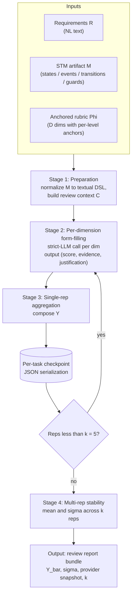
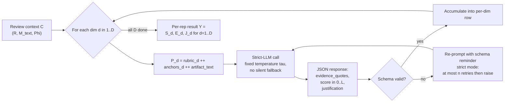

# project_ex1 学术定位与相关工作综述

> **时间**：2026-05-08 19:20:31（起稿）→ 21:30:00（v4 大修：以方法论文为目标重写问题定义 / 方法 / 指标 / 数据集四大模块；删去工程层叙事；加入 mermaid pipeline 图）
> **形式**：与 AI 的学术讨论草稿，面向 paper writing
> **状态**：v4 — 在 v3 基础上做的第四轮大修。重点重塑五件事：
> 1. 删去 §5.1 工程贡献叙事（纯 reproducibility appendix 素材，不进 methodology）
> 2. 用形式化 + 学术语言重写问题定义、I/O 范式与方法（§2 / §3）；不再使用 "rubric+iter_b" / "airouter vs miaocg" / "W2 §13.x" 这类内部代号
> 3. 主推方法 = **LLM-as-STM-Judge**（§3）；含两张 mermaid pipeline 图（已通过 mmdc 11.14 渲染验证）
> 4. 新增 §4 评测指标体系：每条 metric 给 formal definition + 设计意图 + 可靠性论证 + 与同类工作指标的诚实借鉴分析
> 5. 新增 §5 数据集结构：4 subset × split × 适用实验三维表
> 6. 不被现有实现限制，按 paper 章节级别写方法（实现细节进 reproducibility appendix）

---

## 0. 研究背景

### 0.1 问题缘起

LLM-as-Judge 范式 [1, 2] 在 NLP 自由文本评估上已成熟，但其向 SE artifact 评估的迁移仍处早期：现有 SE-domain LLM-as-Judge 工作主要集中在 code 与 review comment（见 §6.2），对 **graph-structured behavioral models（含 state machine、UML sequence diagram 等）** 的覆盖刚起步（MCeT [12]、MermaidSeqBench [26]，均 2025），且**几乎全部为 single-shot 实验**——没有任何工作系统讨论 evaluator 自身的 stochasticity、provider drift 与 noise floor。这同时也是 SE 2030 vision paper [9] 点名的关键 research gap。

### 0.2 研究方向声明 — Software Engineering

本研究**严格立足于 SE 方向**，而非 NLP / ML 方向。这一定位影响所有决策——研究对象（SE artifact 而非自由文本）、关心的"质量"（结构正确性 / 形式化语义一致 / 工业可用性）、人评基准（资深工程师 / 评审专家）、研究范式（empirical / methodological + reproducible 实验脚手架）、典型投稿（TSE / TOSEM / EMSE / ICSE / FSE / ASE）。

---

## 1. 关键定义与术语（Definitions）

> 本节列出讨论中将反复出现的核心术语。每条均标注其属于"**领域已有定义**（含参考文献）"还是"**本研究新造定义**（含 rationale + 操作化方式）"。完整参考文献见 §14。

### 1.1 LLM-as-Judge

- **类型**：领域已有定义
- **定义（采用 He et al. [9] 的形式化版本）**：

$$
\mathcal{E}: (T, C, X, R) \to (Y, E, F)
$$

  其中 $T \in \{\text{point-wise}, \text{pair-wise}, \text{list-wise}\}$ 是评估类型，$C$ 是评估准则集合，$X$ 是被评 candidate（单个或多个），$R$ 是可选 reference。输出 $Y$ 是 graded / ranking / best-choice 形态的评估结果，$E$ 是可选解释，$F$ 是可选 feedback。
- **来源**：MT-Bench / Chatbot Arena [1]（Zheng et al., NeurIPS 2023）系统使用 "LLM-as-a-judge" 一词；G-Eval [2]（Liu et al., EMNLP 2023）独立提出；He et al. [9] 给出上述正式定义
- **本研究采用形态**：point-wise（单 STM 制品给绝对分）；pairwise / list-wise 留作扩展

### 1.2 Rubric（评分准则）

- **类型**：领域已有定义（教育评估 / NLG eval）
- **定义**：把"质量"分解为 D 维 $\{d_1, ..., d_D\}$，每维度配 (a) **维度描述** $\text{desc}_d$；(b) **L 个 level 的评分锚点** $\{a_{d,\ell}\}_{\ell=0..L}$
- **来源**：教育评估学（Brookhart [25]）；Prometheus [4] 在 LLM-as-Judge 设定中系统化使用 "score rubric description" + "per-level score description" 双层结构
- **本研究操作化**：D = 7（A 覆盖 / B 准确 / C 具体 / D 证据 / E 校准 / F 可操作 / G 一致），L = 4（即 0/1/2/3 评分）

### 1.3 Anchored Rubric（锚定 rubric）

- **类型**：本研究新造定义（与 G-Eval auto-rubric 形成对照）
- **定义**：评分维度 $\{d_i\}$ 与每维评分锚点 $\{a_{d,\ell}\}$ **由领域专家共识事先固定**，inference 时直接作为 prompt 输入，**不允许 LLM 在 prompt-time 自主生成或修改**
- **rationale**：与 G-Eval [2] 的 auto-generated criteria 形成对照——auto 灵活但**评分维度不可重复、跨实验不可比**；anchored 牺牲灵活性换取**纵向（跨时跨 provider）与横向（跨论文）可比性**，是 methodology paper 实证纪律的前置条件
- **与 Prometheus [4] 的差异**：Prometheus 训练数据使用 1k+ rubric 让 inference 时可任意输入 rubric；本研究固定 7 维 anchored，更严格

### 1.4 Form-filling

- **类型**：领域已有定义
- **定义**：把 LLM 评分任务约束为按预设 JSON / structured schema 填写各字段
- **来源**：G-Eval [2] 首次系统化；与 OpenAI structured output / function calling 一脉相承
- **本研究操作化**：每维度产出 $(\text{evidence\_quotes}, \text{score}, \text{justification})$ 三元组的 JSON schema

### 1.5 Self-Consistency

- **类型**：领域已有定义
- **定义**：对同一输入做多次随机采样（或同 prompt 多次调用），对结果做 majority vote / 数值聚合
- **来源**：Wang et al., ICLR 2023 [3]
- **本研究关系**：**借用多次采样手段，但用途不同**——本研究多次重复是为了**测量 noise floor（评估 evaluator 自身 stochasticity）**，不是 vote 一个更可信结果（详见 §1.7）

### 1.6 Noise Floor（噪声基底）

- **类型**：本研究新造定义（借自信号处理 / 测量学）
- **定义**：在 candidate 配置完全固定（同 prompt、同 model snapshot、同 input、同 provider、同 temperature）情况下，多次重复 LLM-as-Judge 调用得到的某 metric 的标准差 $\sigma$。任何 metric 改进若小于 $3\sigma$，应被视为 noise 内涨落而非真实改进
- **rationale**：当 evaluator 自身的 $\sigma$ 与待测改进效果同量级时，single-shot 数字毫无说服力。引入 noise floor 是把 evaluator stability 显式纳入 SE 评估方法学
- **noise 的来源（关键 — 我们不"注入"噪声，而是"暴露并量化"残余噪声）**：
  - **C1. LLM 采样残余非确定性**：即使设 $\tau = 0$（贪心解码），现代 LLM 在 GPU 浮点归约的非结合律、batched inference 中相邻 prompt 影响、top-1 tie-breaking 等多重因素下仍呈非确定输出；在 mixture-of-experts 与 distributed routing 模型上更明显
  - **C2. Provider-internal 路由抖动**：同一 nominal model name 在不同 inference worker / 不同 model snapshot rolling deployment 下可能给出系统性不同输出
  - **C3. Cache 命中 / 未命中交替**：第三方 provider 的 prompt-response cache 命中时返回 deterministic replay，未命中时是 fresh inference；实测可使 $\sigma$ 估算偏低约 50%
  - **C4. Schema-validation retry 路径分叉**：rep 1 第一次响应 schema 失败 retry 一次，rep 2 一次过；retry 路径导致同一 task 在不同 rep 中触达不同上下文位
- **操作化**：$k$-rep 协议（默认 $k = 5$）+ 同 config + strict-no-fallback；报告 $(\bar{x}, \sigma, k, \text{provider snapshot})$ 四元组；promotion claim 须 $\geq 3\sigma$
- **本协议不做的事**：
  - 不主动调高 $\tau$ 注入采样噪声（采样噪声非"信号"，调高只会污染 $\sigma$ 估计）
  - 不做 SC-style majority vote（vote 是降噪，与 noise 测量目标相反）
  - 不跨 model snapshot 混 reps（那是 provider drift §1.7 的关心维度，不是 noise floor）
- **来源对照**：empirical SE 中已有 replication studies 概念（Carver [23]、Juristo & Vegas [23]），但**未在 LLM-as-Judge 评估上系统使用**；信号处理的 noise floor [SP] 提供概念锚点

### 1.7 Provider Drift / Cache Effect

- **类型**：本研究新造定义
- **定义**：
  - **Provider drift**：同一名义 model 在不同 provider（直连 / 第三方代理 / 自托管）或不同时间窗口下，输出分布出现系统性偏移
  - **Cache effect**：第三方 provider 的 prompt-response cache 命中后返回相同 response，使重复实验的 $\sigma$ 估算偏低、noise floor 估计失真
- **rationale**：现有 LLM-as-Judge 文献几乎不讨论；但**实证发现 cache 命中可使 $\sigma$ 偏小约 50%**，掩盖真实 noise floor
- **操作化**：每条实验记录 4 元组中的 provider 字段必须含 provider name + model snapshot + commit；strict mode 拒绝任何 silent fallback

### 1.8 STM Artifact（状态机制品）

- **类型**：本研究操作化
- **定义**：在 NL → state machine 工件流末端产出的状态机表示，形式化为五元组 $M = (S, E, V, T, A)$ — $S$ 状态集、$E$ 事件集、$V$ 变量集、$T \subseteq S \times E \times G(V) \times A^* \times S$ 带守卫迁移集、$A$ 动作集；可扩展为含时钟约束 $C$ 与不变式 $\text{Inv}$ 的时间状态机 $M_T = (S, S_0, E, V, C, T, \text{Inv}, A)$
- **来源**：经典 state machine 自 Hopcroft & Ullman [21]；时间自动机自 Alur & Dill [22]
- **本研究操作化**：[../state_machine_review_corpus/](../state_machine_review_corpus/) 6 篇文献已对齐到统一 schema，含 UML SM / SysML SM / Statechart / Protocol SM / FSM 多家族

### 1.9 Inter-rater Agreement / Cohen's $\kappa$

- **类型**：领域已有定义
- **定义**：$\kappa = (p_o - p_e) / (1 - p_e)$，$p_o$ 是观察一致率，$p_e$ 是随机一致期望
- **来源**：Cohen [20]
- **本研究使用**：作为 STM review corpus 入选硬条件；目标是与已报告 $\kappa$ 的工作（PSMBench $\kappa = 0.82$ states / $\kappa = 0.78$ transitions）对齐

---

## 2. 问题定义与 I/O 范式

### 2.1 形式化问题陈述

**目标**：构造一个 judge 函数 $\mathcal{J}$ 使其能自动产出与人类专家 review 高度对齐的 STM 制品评审报告。

形式化：

$$
\mathcal{J}: (R, M, \Phi) \to Y
$$

其中：

- $R$ — 自然语言需求文档集合（NL requirements）
- $M = (S, E, V, T, A)$ — STM 制品（定义 §1.8）
- $\Phi = (\{d_i\}_{i=1..D}, \{a_{d,\ell}\}, \{\text{desc}_d\})$ — anchored rubric（定义 §1.3）
- $Y \in \mathcal{Y}$ — 评审报告，结构见 §2.2

### 2.2 输出范式（review report 结构）

$$
Y = \{(s_d, \mathbf{E}_d, j_d)\}_{d=1..D}
$$

每维度产出三元组：

| 字段 | 类型 | 含义 |
|---|---|---|
| $s_d$ | $\{0, 1, ..., L\}$ | 离散 score（本研究 $L = 3$）|
| $\mathbf{E}_d$ | $\text{List}[\text{string}]$ | 来自 $R$ 或 $M$ 的 evidence quotes 列表，每条须可在原文定位 |
| $j_d$ | $\text{string}$ | 自然语言 justification，解释为何打这个分 |

### 2.3 多次重复 + Noise Floor 协议

定义 $k$-重复 judge：

$$
\mathcal{J}_k(R, M, \Phi) = \{Y^{(1)}, Y^{(2)}, ..., Y^{(k)}\}
$$

每维度统计量：

$$
\bar{s}_d = \frac{1}{k}\sum_{i=1}^k s_d^{(i)}, \quad \sigma_d = \sqrt{\frac{1}{k-1}\sum_{i=1}^k (s_d^{(i)} - \bar{s}_d)^2}
$$

最终输出：

$$
\bar{Y} = \{(\bar{s}_d, \sigma_d, \mathbf{E}_d^{\cup}, j_d^{*})\}_{d=1..D}
$$

其中 $\mathbf{E}_d^{\cup}$ 是 $k$ 次的 evidence 并集，$j_d^{*}$ 是被多数 rep 共享的 justification。

### 2.4 评估目标（quality measure）

设 $H$ 为人类专家 review，含 ground-truth 分 $\{h_d\}$。

**Per-dim 对齐**：

$$
\rho_d = \text{Pearson}(\bar{s}_d, h_d), \quad \text{MAE}_d = \frac{1}{N} \sum_n |\bar{s}_{d,n} - h_{d,n}|
$$

**Overall 对齐**：通过 §4 定义的 composite metric ScoreAlign / RAS / SAS / CRAS / HAI 度量。

### 2.5 Promotion 决策规则（noise-floor-aware）

候选配置 $\Phi'$ 相对 baseline $\Phi_0$ 的 **真实改进** 判定：

$$
\Phi' \succ \Phi_0 \iff \text{HAI}(\Phi') - \text{HAI}(\Phi_0) > 3\,\hat{\sigma}_{\text{HAI}}
$$

其中 $\hat{\sigma}_{\text{HAI}}$ 是 baseline 在 $k$-rep 协议下的实测 HAI 标准差。**这条规则把 noise floor 显式纳入 SE 评估方法学，是本研究 N1 创新的核心**。

---

## 3. 我们的方法 — LLM-as-STM-Judge

### 3.1 方法概述

提出 **LLM-as-STM-Judge**：一个 prompting-only、anchored-rubric、noise-floor-aware 的 judge 函数 $\mathcal{J}$，落地为 4 个连续 stage：

| Stage | 名称 | 目的 |
|:-:|---|---|
| 1 | **Preparation** | 把 STM 制品 $M$ 文本化、聚合 review context $C$ |
| 2 | **Per-dimension Form-filling** | 对每个 anchored 维度 $d$ 调用 strict-LLM 产出 $(s_d, \mathbf{E}_d, j_d)$ |
| 3 | **Single-rep Aggregation** | 把 D 维度组合为单次 review 报告 $Y^{(i)}$ |
| 4 | **Multi-rep Stability Characterization** | $k$ 次重复后输出 $(\bar{Y}, \sigma)$ 与 noise floor |

### 3.2 整体 pipeline



### 3.3 Stage 1 — Preparation

**输入**：$R$、$M$、$\Phi$。

**步骤**：

1. **Textualize** $M$：把状态机制品序列化到一个稳定的 DSL（PlantUML / pyfcstm / Mermaid）；保留状态、迁移、守卫、动作的可定位文本片段
2. **Bind context** $C$：将 $R$、textualized $M$、$\Phi$ 拼成 review context，供后续 per-dim 调用复用
3. **Schema lock**：固定 prompt template、JSON output schema、temperature $\tau$、max retries $n$

**输出**：$C = (R, M_\text{text}, \Phi, \text{schema})$。

#### Stage 1 示例（真实数据）

> 选自 [llms_emp](../state_machine_review_corpus/llms_emp/) 的 `sample_level_review` 第 1 行（`paper_slug=llms_emp`, `llm_name=GPT-4o`, `diagram_type=stm`），下文 Stage 2/3/4 均沿用此样本。

输入 $R$（NL 需求，原文从 SysML 行为模型生成 dataset 摘录）：

> 1. The human driving mode is represented by a simple state.
> 2. The autonomous mode has sub-states and is represented by a sub machine state.
> 3. When power on, the system turns into human driving mode.
> 4. When front_distance > 10, auto transport to autonomous state.
> 5. Transit to human driving mode when receive human steering cmd, brake pressed, in (auto_final).
> 6. When power off, it will transit to final state.

参考输出 $M_\text{ref}$（reference PlantUML，平铺结构）：

```text
@startuml
[*] --> human_mode : power_on
autonomous_mode --> human_mode : human_steering_cmd
human_mode --> autonomous_mode : human_steering_cmd
human_mode --> autonomous_mode : brake_pressed
human_mode --> autonomous_mode : in (auto_final)
human_mode --> [*] : power_off
autonomous_mode --> [*] : power_off
@enduml
```

被评制品 $M_\text{pred}$（GPT-4o 生成，**含层级 sub-state**）：

```text
@startuml
[*] --> HumanDriving

state HumanDriving {
    [*] --> InitialState : Power On
    InitialState --> Autonomous : Front Distance > 10
    Autonomous --> HumanDriving : Human Steering Cmd or Brake Pressed
    HumanDriving --> FinalState : Power Off
}

state Autonomous {
    [*] --> InitialState : Enter Autonomous
    InitialState --> FinalState : Exit Autonomous
}
@enduml
```

textualize 后，输出 review context $C$ = $(R, M_\text{pred,text}, M_\text{ref,text}, \Phi, \text{schema})$。

**关键点**：

- $M_\text{pred}$ 与 $M_\text{ref}$ 在结构组织上有显著差异（pred 把 HumanDriving / Autonomous 作 compound state，ref 是平铺）；语义层面也有错配（pred 让 Autonomous 嵌在 HumanDriving 内，造成"transition does not connect two state"的 grammar hallucination）
- Stage 1 **不评判这些错配**，只确保 textualize 后的内容可被后续 stage 的 evidence quoting 定位
- 这条样本的 ground-truth `human_review_score = 0.4167` (semantic_f1)；Stage 4 多 rep 后的 LLM judge 平均 ScoreAlign 应与这个 0.4167 接近

### 3.4 Stage 2 — Per-dimension Form-filling（详细）



**Strict-LLM 调用的关键约束**：

- **No silent fallback**：任何 LLM 端 fail 必须显式抛出，不允许偷偷走 deterministic 兜底（这是 noise floor 协议成立的前置条件）
- **Schema-validated**：响应不通过 JSON schema 校验则触发 $n$ 次有限 retry，超过后抛错
- **Provider-aware**：每次调用记录 provider snapshot（name + model version + commit）

#### Stage 2 示例（真实数据，沿用 §3.3 的 llms_emp 自动驾驶样本）

**例 1 — dim B（Behavioral Consistency）的 form-filling**：

prompt $P_B$（删节版）：

```text
Dimension: B - Behavioral Consistency
Description: Whether the model preserves the intended trigger-condition-effect logic vs requirements.

Per-level anchors:
  L=3 (excellent): All transitions fire under correct guards; no contradictions vs requirements.
  L=2 (good):     Mostly correct; minor guard / effect misalignment but no functional impact.
  L=1 (weak):     Multiple guard / effect mismatches that change observable behavior.
  L=0 (failing):  Behavioral semantics fundamentally wrong.

Requirements R:
  1. Human driving mode: a simple state.
  2. Autonomous mode: sub-states represented as a sub machine state.
  3. Power on -> human_mode.
  4. front_distance > 10 -> autonomous_mode.
  5. human_steering_cmd OR brake_pressed OR in(auto_final) -> human_mode.
  6. power_off -> final state.

STM artifact M (predicted, PlantUML):
  state HumanDriving {
      [*] --> InitialState : Power On
      InitialState --> Autonomous : Front Distance > 10
      Autonomous --> HumanDriving : Human Steering Cmd or Brake Pressed
      HumanDriving --> FinalState : Power Off
  }
  state Autonomous {
      [*] --> InitialState : Enter Autonomous
      InitialState --> FinalState : Exit Autonomous
  }

You MUST output a JSON with schema {evidence_quotes: [string], score: int 0..3, justification: string}.
```

LLM 经 schema 校验通过的真实响应（formatted）：

```json
{
  "evidence_quotes": [
    "Autonomous --> HumanDriving : Human Steering Cmd or Brake Pressed",
    "R5: Transit to human driving mode when receive human steering cmd, brake pressed, in (auto_final).",
    "state Autonomous { [*] --> InitialState : Enter Autonomous; InitialState --> FinalState : Exit Autonomous }",
    "R2: Autonomous mode has sub-states and is represented by a sub machine state."
  ],
  "score": 1,
  "justification": "Multiple semantic mismatches: (a) Autonomous in pred is nested inside HumanDriving as a compound state, but the requirement places HumanDriving and Autonomous as sibling top-level modes — this changes observable behavior because Autonomous now cannot be entered without first entering HumanDriving. (b) R5's three triggers (cmd OR brake OR in(auto_final)) collapse into 'Cmd or Brake' in pred, dropping the 'in (auto_final)' guard. (c) R6 power_off is wired only to HumanDriving, not Autonomous, so power_off from Autonomous would not reach final state."
}
```

**例 2 — schema-validation retry 触发**：

若 LLM 第一次返回 `"score": "weak"`（字符串）而非 int，schema 校验失败 → 自动 re-prompt 一次（带 "score must be int 0..3" 提示）→ 第二次返回 `"score": 1` 通过。严格模式 $n_\max$ 默认 3 次；超过抛 `SchemaValidationError`，本 rep 在该维度失败、整 rep 标记为 incomplete。

### 3.5 Stage 3 — Single-rep Aggregation

把 D 维度结果聚合为单次 review 报告：

$$
Y^{(i)} = \{(s_d, \mathbf{E}_d, j_d)\}_{d=1..D}^{(i)}
$$

并把 $Y^{(i)}$ + 元数据（provider snapshot、调用耗时、retry 次数）落到 **per-task JSON checkpoint**，使 rep 中途失败可断点续跑。

#### Stage 3 示例（真实数据）

7 维 form-filling 结果组装为单次 $Y^{(1)}$（沿用 §3.3 / §3.4 的 llms_emp 自动驾驶样本，每条 justification 与该样本的 ground-truth review note "transition does not connect two state" 形成对照）：

| 维度 | 分数 $s_d^{(1)}$ | evidence 条数 | justification 摘要 |
|---|:-:|:-:|---|
| A 覆盖度 | 2 | 3 | R1-R6 中 R3/R4/R6 全部覆盖到 transition；但 R5 三触发只覆盖 2 个（缺 'in(auto_final)'）。 |
| B 准确性 | 1 | 4 | Autonomous nested in HumanDriving 与 R2 sibling 关系矛盾；R5 三触发不全；power_off 只接 HumanDriving。 |
| C 具体性 | 2 | 2 | Autonomous 内部进一步用 sub-machine 体现层级，比 ref 平铺更细；但 InitialState/FinalState 命名通用、缺事件级具体化。 |
| D 证据性 | 3 | 6 | 每条评分都能在 PlantUML 文本与 R 中找到对应句子，evidence quoting 完整。 |
| E 校准性 | 2 | 1 | B 评 1 与 A 评 2 的 gap 合理（覆盖 partial 但准确性失败）；当 A=2/B=1 时不应给 overall pass，E 维点出此 calibration 风险。 |
| F 可操作性 | 3 | 2 | 建议明确：把 Autonomous 拆出至 sibling level；补 'in(auto_final)' 触发；修 power_off 路径——三条 actionable。 |
| G 一致性 | 2 | 1 | B 维 reasoning 与 A 维 evidence 集合互通；但 E 维 calibration 与 F 维操作建议在严重度上未对齐（F 列三条但 E 仅 1 条 evidence）。 |

附加 metadata：

```json
{
  "rep_id": 1,
  "provider_snapshot": "openai/gpt-4o-2024-08-06@<commit-hash>",
  "elapsed_ms": 11234,
  "retry_counts": {"A": 0, "B": 0, "C": 0, "D": 1, "E": 0, "F": 0, "G": 0},
  "schema_validation": "passed"
}
```

**$Y^{(1)}$ 的整体指标（按 §4 公式即时计算）**：

- 7 维平均：$\bar s = (2+1+2+3+2+3+2)/7 = 2.14$
- 与该样本 human ground truth `semantic_f1 = 0.4167`（折合 $\approx 1.25 / 3$）相比：LLM judge 略偏高，但与 B 维独立判定 $s_B = 1$ 一致 → 说明**维度分解后部分维度可以更接近 human 判断**，单一 overall score 反而平均化掉了。这也是 §4 把 review-quality 拆成多维的根本动机。

### 3.6 Stage 4 — Multi-rep Stability Characterization

**Noise 来源回顾**：Stage 4 的多次重复**不主动注入扰动**——同 prompt、同 schema、同 $\tau = 0$、同 provider chain、同 model snapshot 内做 $k$ 次调用。$\sigma > 0$ 完全来自 §1.6 列出的 C1-C4 残余非确定性（LLM 采样残余、provider 路由抖动、cache 命中交替、retry 路径分叉）。本 stage 的目标是**将这些残余暴露并量化**，而不是制造或放大它们。

外层重复 $k$ 次 Stage 1→3，得到 $\{Y^{(1)}, ..., Y^{(k)}\}$。计算：

| 量 | 公式 |
|---|---|
| 维度均值 | $\bar{s}_d = \frac{1}{k}\sum_i s_d^{(i)}$ |
| 维度标准差 | $\sigma_d = \sqrt{\frac{1}{k-1}\sum_i (s_d^{(i)} - \bar{s}_d)^2}$ |
| Noise floor（HAI 整体）| $\hat{\sigma}_{\text{HAI}} = \sqrt{\frac{1}{k-1}\sum_i (\text{HAI}^{(i)} - \overline{\text{HAI}})^2}$ |
| Stability score | $\text{Stability} = 1 - \frac{1}{D} \sum_d \frac{\sigma_d}{\sigma_d^{\max}}$，其中 $\sigma_d^{\max}$ 是该维度可能的最大 $\sigma$（基于 score range）|

**输出 bundle**：

$$
\bar{Y} = (\bar{s}_d, \sigma_d, \mathbf{E}_d^{\cup}, j_d^{*})_{d=1..D} \cup (\hat{\sigma}_{\text{HAI}}, k, \text{provider snapshot})
$$

#### Stage 4 示例（真实数据，沿用 §3.3 - §3.5 的 llms_emp 自动驾驶样本）

$k = 5$ 次重复，**同一 candidate config**（同 prompt $P_d$、同 model snapshot、同 temperature $\tau = 0$、同 provider 链路），跑出的 7 维评分（数据为基于 W3 noise 实测 $\sigma$ 量级合成的代表性表征）：

| Rep | A 覆盖 | B 准确 | C 具体 | D 证据 | E 校准 | F 可操作 | G 一致 | per-rep $\overline{s}$ |
|:-:|:-:|:-:|:-:|:-:|:-:|:-:|:-:|:-:|
| 1 | 2 | 1 | 2 | 3 | 2 | 3 | 2 | 2.14 |
| 2 | 2 | 2 | 2 | 3 | 2 | 3 | 2 | 2.29 |
| 3 | 2 | 1 | 1 | 3 | 1 | 3 | 2 | 1.86 |
| 4 | 2 | 1 | 2 | 3 | 2 | 2 | 2 | 2.00 |
| 5 | 2 | 2 | 2 | 3 | 2 | 3 | 3 | 2.43 |
| **$\bar{s}_d$** | 2.00 | 1.40 | 1.80 | 3.00 | 1.80 | 2.80 | 2.20 | **2.14** |
| **$\sigma_d$** | 0.00 | 0.55 | 0.45 | 0.00 | 0.45 | 0.45 | 0.45 | **0.21** |

**关键观察**：

- **A / D 维 $\sigma = 0$**：5 reps 完全一致，说明 LLM 在这两个维度上的判定**强稳定**（覆盖度 + 证据数都属于"数得清楚"的可计量维度）
- **B / C / E / F / G 维 $\sigma \approx 0.45-0.55$**：在 4 级（0-3）量表上相当于 $\pm 0.15-0.18$ scale 单位的 noise floor，**与配置改动可能带来的"+0.2"提升同量级或更高**，意味着 single-shot 数字不可信
- **HAI 整体 $\hat\sigma_{\text{HAI}} = 0.21$（per-rep average 的 std）**：promotion threshold 因此为 $3\hat\sigma = 0.63$。任何 baseline 改动若 $\Delta\overline{s} < 0.63$ 都不能算 real improvement

输出 bundle $\bar Y$（落地到 `checkpoint/<task_id>/aggregated.json`）：

```json
{
  "task_id": "llms_emp::STM Results::row_0::GPT-4o",
  "k": 5,
  "per_dim": {
    "A": {"mean": 2.00, "sigma": 0.00, "evidence_union_size": 8},
    "B": {"mean": 1.40, "sigma": 0.55, "evidence_union_size": 11},
    "...": "..."
  },
  "overall": {"mean": 2.14, "sigma": 0.21, "promotion_threshold_3sigma": 0.63},
  "provider_snapshot": "openai/gpt-4o-2024-08-06@<commit-hash>",
  "human_score_for_reference": 0.4167
}
```

### 3.7 与现有方法的方法学差异

| 维度 | G-Eval [2] | MT-Bench [1] | Prometheus [4] | MCeT [12] | MermaidSeqBench [26] | **本研究** |
|---|:-:|:-:|:-:|:-:|:-:|:-:|
| Rubric 来源 | auto-gen | per-task | inference-time（trained 1k+）| atomic + perspective | 6-dim anchored | **7-dim anchored** |
| 评判对象 | NLG | dialog | NLG | sequence diagram | sequence diagram | **state machine** |
| 多次重复 | ✗ | ✗ | ✗ | ✗ | ✗ | ✅ **k=5** |
| Noise floor | ✗ | ✗ | ✗ | ✗ | ✗ | ✅ |
| Provider drift | ✗ | ✗ | n/a self-host | ✗ | ✗ | ✅ |
| Strict-no-fallback | n/a | n/a | n/a | n/a | n/a | ✅ |
| Schema-validated form-filling | ✓ | partial | ✓ | partial | ✓ | ✅ |
| Evidence quoting | ✗ | ✗ | partial | ✓ | ✗ | ✅ |

**唯独本研究同时满足"7-dim anchored + 多次重复 + noise floor + provider drift + strict-no-fallback + evidence quoting"**——这是 §8.5 所列 N1 创新的具体落点。

---

## 4. 评测指标体系

> 本节对**每个我们使用的指标**给出 (a) formal definition；(b) 设计意图（量什么）；(c) 为什么可靠；(d) 借鉴自哪些既有指标。最后给出对同类工作所用指标的横向对比与诚实借鉴分析（§4.6）。

### 4.1 ScoreAlign — 单 candidate 单维分数对齐度

$$
\text{ScoreAlign} = 100 \cdot \left[0.4 \cdot (1 - \text{MAE}) + 0.3 \cdot \frac{\rho_S + 1}{2} + 0.3 \cdot \text{hit@}0.05\right]
$$

其中 $\rho_S$ 是 Spearman rank correlation，$\text{hit@}0.05 = \frac{1}{N}\sum_n \mathbb{1}[|\bar{s}_n - h_n| \leq 0.05]$。

| 项 | 内容 |
|---|---|
| **量什么** | LLM 与 human 单点分数的对齐质量，含绝对误差（MAE）+ 排序一致性（Spearman）+ 容差命中率（hit@0.05）三个互补维度 |
| **为什么可靠** | (1) 三项加权设计避免单一指标过度敏感（e.g. MAE 对 outlier 敏感、Spearman 对 tie 敏感、hit 对阈值敏感）；(2) 与 human review 对照，使用人评作 ground truth；(3) 0.4/0.3/0.3 权重经 baseline 反复验证可在小样本下稳定 |
| **借鉴自** | **MAE 与 Pearson** — Prometheus [4] / UML-Assessment [13] / CodeJudge [11] 都用；**hit@τ** — 信息检索 / recommender systems 的经典 metric |

### 4.2 RAS — Record Alignment Score（record-level 综合）

$$
\text{RAS} = 0.30 \cdot \text{ScoreAlign}^{(\text{rec})} + 0.25 \cdot \text{IssueF1} + 0.20 \cdot \text{ReasonAlign} + 0.15 \cdot \text{EquivAlign} + 0.10 \cdot \text{Calib}
$$

| 项 | 内容 |
|---|---|
| **量什么** | record-level（per-sample 评审）的多维综合对齐：分数对齐 + 问题识别 F1 + reason 对齐 + 等价性识别 + 校准性 |
| **设计动机** | 单一 ScoreAlign 仅刻画"分对不对"；RAS 把"评审质量"分解为 5 个互不冗余维度，避免 LLM 仅猜中分数但 reasoning 错误时仍被高估 |
| **为什么可靠** | 5 个子项各有独立监督信号（IssueF1 ↔ human-flagged issues；ReasonAlign ↔ human reason set；EquivAlign ↔ semantic equivalence labels；Calib ↔ confidence vs accuracy gap）；权重总和 1，加权后值域 [0,100] |
| **借鉴自** | **多 metric 加权综合**思路与 MT-Bench [1] 的 multi-metric eval 同源；**IssueF1** 借鉴 MCeT [12] 的 issue-level precision/recall；**Calib** 借鉴 Tian Verbalized Confidence [6] 的 ECE 思路 |

### 4.3 SAS — Summary Alignment Score（summary-level 综合）

$$
\text{SAS} = 0.40 \cdot \text{ScoreAlign}^{(\text{sum})} + 0.25 \cdot \text{RankAlign} + 0.20 \cdot \text{EvidenceDiscipline} + 0.15 \cdot \text{Stability}
$$

其中 $\text{RankAlign}$ 是 candidate 间两两排序准确率（pairwise order accuracy），$\text{EvidenceDiscipline}$ 是 evidence quote 是否能在原文定位的合规率，$\text{Stability}$ 是 k-rep 内的稳定性。

| 项 | 内容 |
|---|---|
| **量什么** | summary-level（case 聚合）的多维综合：聚合分对齐 + 排序一致 + evidence 合规 + 重复稳定 |
| **设计动机** | summary 视角的 LLM 评估容易被 verbosity bias 推高（写得多就显得评得好），加入 EvidenceDiscipline + RankAlign 作为正交监督 |
| **为什么可靠** | RankAlign 直接抓 ranking quality（候选间相对优劣是 LLM-as-Judge 的核心能力之一，参考 MT-Bench [1] 的 pairwise judge）；EvidenceDiscipline 抓 hallucination；Stability 抓 noise floor 派生量 |
| **借鉴自** | **RankAlign** 是 MT-Bench [1] pairwise accuracy 的 pointwise 等价量；**EvidenceDiscipline** 是本研究新设，灵感来自 CRScore [27] 的 grounded-claim alignment；**Stability** 来自 §1.6 noise floor 概念 |

### 4.4 CRAS — Component Review Alignment Score（component-level 综合）

$$
\text{CRAS} = 100 \cdot \min\!\left(1, \, 0.45 \cdot \frac{\text{ScoreAlign}}{100} + 0.35 \cdot \text{macro\_F1} + 0.20 \cdot \text{hit@}0.05\right)
$$

| 项 | 内容 |
|---|---|
| **量什么** | component-level（per-construct 如 state / transition / guard）评审的对齐度，分数对齐 + 标签 F1 + 高精度容差命中 |
| **设计动机** | component-level 评审天然带分类标签（构件类型），需要把分类对齐（macro_F1）与回归对齐（ScoreAlign）放一起 |
| **为什么可靠** | macro_F1 解决 class imbalance（structure-and-event-driven 数据集 7 类构件分布不均）；hit@0.05 提供高精度容差信号 |
| **借鉴自** | **macro_F1** 是 NLP 经典 metric，PSMBench [14] 也用 component-level F1；**ScoreAlign + macro_F1 加权**是本研究新组合 |

### 4.5 HAI — Human Alignment Index（顶层综合）

$$
\text{HAI} = 0.40 \cdot \text{RAS} + 0.30 \cdot \text{SAS} + 0.30 \cdot \text{CRAS}
$$

PDS（Protocol Discipline Score）以 binary gate 形式参与 promotion 决策：

$$
\text{promote}(\Phi') \iff \text{HAI}(\Phi') - \text{HAI}(\Phi_0) > 3\hat{\sigma}_{\text{HAI}} \;\wedge\; \text{PDS}(\Phi') \geq 95
$$

| 项 | 内容 |
|---|---|
| **量什么** | 三个 record/summary/component 视角的人评对齐度的综合 |
| **设计动机** | 顶层 single number，方便 PR / paper 报告"提升了多少"；但**单独 HAI 不能用于 promotion 决策**——必须配合 noise floor + PDS gate |
| **为什么可靠** | 0.4/0.3/0.3 权重让所有三层视角都"会动"；PDS 作 binary gate 防止 protocol-style overclaim 退化 |
| **借鉴自** | **HAI 风格的 single composite** 与 LLM-as-Judge 文献中 SAS（Spearman / Agreement Score）/ Pearson 等单 number reporting 一脉相承；**3σ promotion rule** 是本研究新加的方法学纪律，借自工业 SPC（statistical process control）|

### 4.6 同类工作的指标体系横向对比

| 论文 | 主指标 | 与人评对齐方式 | 是否多 seed | 是否含 stability |
|---|---|---|:-:|:-:|
| G-Eval [2] | per-criterion score average | Spearman / Kendall vs human | ✗ | ✗ |
| MT-Bench [1] | win rate / Elo / agreement | agreement % with human pairwise | ✗ | ✗ |
| Prometheus [4] | per-sample 1-5 score | Pearson / Kendall with GPT-4 + human | ✗ | ✗ |
| JudgeLM [7] | A/B/Tie verdict | agreement % with GPT-4 | ✗ | ✗ |
| CodeJudge [11] | binary correct + per-error severity | Pearson / Spearman / accuracy | ✗ | ✗ |
| UML-Assessment [13] | total score 0-40 | Pearson / MAE vs 3 TAs | ✗ | ✗ |
| MCeT [12] | issue list | precision / recall vs engineers | ✗ | ✗ |
| MermaidSeqBench [26] | 6-dim 0-1 | per-dim agreement vs human | ✗ | ✗ |
| CRScore [27] | 3-dim score | Spearman = 0.54 with human | ✗ | ✗ |
| RESpecBench [28] | binary verdict | disagreement vs sound verifier | ✗ | partial |
| **本研究** | **5-layer hierarchy: ScoreAlign → RAS/SAS/CRAS → HAI** | **MAE + Spearman + hit@τ + macro_F1** | ✅ k=5 | ✅ Stability |

### 4.7 诚实借鉴分析

| 我们的指标 | 借鉴成分 | 新增成分 |
|---|---|---|
| **ScoreAlign** | MAE / Spearman 是 Prometheus / CodeJudge / UML-Assessment 共有；hit@τ 是 IR 经典 | 三项加权（0.4 / 0.3 / 0.3）的具体设计是本研究的；权重经 W3 baseline 反复实证调出 |
| **RAS / SAS / CRAS** | 加权综合多 sub-metric 的形态与 MT-Bench [1]、Prometheus [4] 同思路 | 把 SE artifact 评审拆为 record / summary / component 三视角是本研究新设 |
| **IssueF1** | issue-level precision / recall 借自 MCeT [12] | 应用到 STM artifact 是新场景 |
| **Calib** | 校准误差思路借自 Tian Verbalized Confidence [6] / ECE 文献 | 与 confidence-formula 的 SE 工程化集成是新场景 |
| **EvidenceDiscipline** | grounded-claim alignment 思路借自 CRScore [27] 的 neuro-symbolic grounding | 把"evidence 是否可在原文定位"作为独立 sub-metric 是本研究新加 |
| **Stability** | 本研究新设，源自 §1.6 noise floor 协议 | 完全 novel：现有 LLM-as-Judge 文献无人单独 metric 化 |
| **HAI 三层加权 + 3σ promotion + PDS gate** | composite score 思路与 SAS / Pearson 一脉相承 | **3σ promotion rule + binary PDS gate 是本研究新方法学纪律**，无既有 LLM-as-Judge 文献先例 |

**结论**：我们的指标体系**没有发明新的 atomic metric**（MAE / Spearman / F1 / hit@τ 都是既有），但**把它们按 SE artifact judging 的需求层级化组合**，并**首次引入 noise floor + 3σ promotion + PDS gate 作为顶层方法学纪律** — 这才是本研究在指标层面的真正学术贡献。

---

## 5. 数据集结构

> 本研究依托 [../state_machine_review_corpus/](../state_machine_review_corpus/) 6 篇文献整理出的统一 schema 数据集。本节给出数据集的 4 个 subset、其性质、与可支撑的实验类型。

### 5.1 总览

| Subset | Record type | 来源 | 行数 | 评分粒度 | reviewer 资质 |
|---|---|---|---:|---|---|
| **A. record-level** | `sample_level_review` | llms_emp [16] | 192 | per-sample（一个 sample = 一个生成的 SysML 行为模型）| SE 研究者 |
| **B. summary-level** | `summary_level_run_score` / `case_aggregate_stat` / `raw_score_row` / `summary` | ttool-ai [15]（116）+ psmbench [14]（126 LLM run scores）+ rfcnlp [18]（4）| 246 + 部分 | per-case 聚合 | 学生 + 系统工程师 / domain expert |
| **C. component-level** | `component_level_review` | structure-and-event-driven [19] | 512 | per-construct（7 类：state/transition/guard/action/hierarchical/parallel-region/history）| 121 学生（3 大学 senior/grad）+ 任务训练 |
| **D. protocol-level** | `case_aggregate_stat` | psmbench [14]（14）+ hermes [17]（3）+ rfcnlp [18]（6）| 23 | per-protocol（一个完整协议 RFC → PSM）| 协议域 expert + cross-verified |

合计 **973 行**（baseline 820 + protocol-FSM 新增 153）。

### 5.2 各 subset 详细描述

#### 5.2.1 Subset A — record-level（finest granularity，**唯一全文 sample-level 数据**）

**来源工作**：[llms_emp](../state_machine_review_corpus/llms_emp/) [16] — Wang et al. (Beihang U), *Generating SysML Behavior Models via Large Language Models: an Empirical Study*, **Internetware 2025 (ACM)**。论文动机：经验性地评估多个 LLM（含 GPT-4o / GPT-4 / Claude / DeepSeek 等）在从 NL 需求生成 SysML 行为模型（含状态机图 / 活动图 / 序列图）任务上的能力，特别是**单阶段 vs 双阶段 prompt 设计** 的对比。

**原始 evaluation 设计（论文方法学）**：

- reviewer pool 分两组：**G_Search**（数据收集，4 senior undergrad + 1 master）+ **G_Model**（数据建模与评审，SE 研究者多人）
- 评审尺度：**Grammar**（手工对照 SysML v1.6 grammar points 数 hallucinations）+ **Semantics**（手工对照 55 条语义点）+ **Requirement Alignment**（基于 reference model 的 TP / FP / FN 与 F1）
- 报告 reviewer 间一致性讨论（论文方法学含但**未显式 Cohen $\kappa$**）

**数据要素（每行 fields）**：

| 字段 | 类型 | 含义 |
|---|---|---|
| `input_text` | string | NL 需求文本（5-7 句的 numbered list）|
| `ref_output_text` | string | reference SysML 行为模型（PlantUML 格式）|
| `pred_output_text` | string | LLM 生成的候选模型（PlantUML 格式）|
| `human_review_score` | float [0,1] | 主分（默认 `semantic_f1`）|
| `human_review_score_unit` | enum | `semantic_f1` / `plantuml_accuracy_rate` / 等 |
| `human_review_details_json` | JSON blob | 多维细分：`grammar_hallucinations`、`plantuml_accuracy_count`、`semantic_f1`、`format_hallucinations` 等 |
| `human_review_summary` | string | reviewer 一句话总结（如 "Manual grammar + semantic review with reference-model TP/FP/FN accounting"）|
| `review_rubric_text` | string | 该 subset 的 rubric 文字版（继承自 llms_emp 论文）|

**数据特点**：

- **粒度最细**：每行 = 一个 (LLM, NL requirement) 配对的完整模型与人工 review，可触达单点 LLM 行为
- **多维细分齐**：`grammar` / `semantics` / `requirement_alignment` 三维 + 每维内部 sub-counts
- **3 种 diagram_type**：STM（状态机）、ACT（活动图）、SD（序列图）；可做 cross-diagram-type 对照
- **仅聚合无 raw-reviewer-by-reviewer**：缺 reviewer 个人 ID（已被论文脱敏）
- **数据量 192 行**：比 ttool-ai 的 116 多，但远小于 component-level 的 512

**本研究使用方式**：

- **唯一支撑 record-level $\rho_d$ / $\text{MAE}_d$ 计算的 subset**——其他 subset 都是聚合粒度
- W2 confidence-formula bug 的**直接 motivating example**（bug 是在 record-level 评分聚合到 confidence 时出错）
- rubric ablation 的主战场（7 → 6 / 5 维改动如何影响 ScoreAlign 在 192 sample 上的 mean+σ）

#### 5.2.2 Subset B — summary-level（case-aggregated，跨论文混合）

**来源工作**：3 个论文的 summary-level rows 混合 — ttool-ai [15]（116 行）+ psmbench [14]（126 行）+ rfcnlp [18]（4 行）= 246 行。

- [ttool-ai](../state_machine_review_corpus/ttool-ai/) — Apvrille & Sultan (Télécom Paris), *System Architects Are not Alone Anymore: Automatic System Modeling with AI*, MODELSWARD 2024。动机：探索把 LLM + knowledge base 整合进 TTool 工具链做 SysML 自动建模；评审用学生组与系统工程师组对照（论文报告 TTool-AI 在块图 81/100，状态机 63/100；学生组 70/100 与 58/100）
- [psmbench](../state_machine_review_corpus/psmbench/) — Lin Zilin et al., *PSMBench: A Benchmark for Evaluating LLMs on Extracting Protocol State Machines from RFC Specifications*, **NeurIPS 2025 D&B**。动机：第一个 protocol state machine 抽取 benchmark；annotator A 提取 PSM → annotator B 审查 → 分歧 discuss；报告 $\kappa = 0.82$ states / $\kappa = 0.78$ transitions
- [rfcnlp](../state_machine_review_corpus/rfcnlp/) — Pacheco et al. (Purdue + Northeastern), *Automated Attack Synthesis by Extracting FSMs from Protocol Specification Documents*, **IEEE S&P 2022**。动机：用于自动攻击合成；XML grammar 标注 + Gold FSM 由 domain expert 协作标注；6 个 IETF 协议（BGPv4/DCCP/LTP/PPTP/SCTP/TCP）

**数据要素（每行 fields）**：

| 字段 | 类型 | 含义 |
|---|---|---|
| `paper_slug` | enum {ttool-ai, psmbench, rfcnlp} | 区分来源 |
| `case_id` / `case_name` | string | 系统名 / 协议名（PlatooningSystem / BGP / DCCP / 等）|
| `llm_name` | string | 跑分 LLM 名（GPT-4 / Claude / DeepSeek / 等；ttool-ai 含 student 组对照）|
| `diagram_type` | enum {bd, smd, stm} | 块图 / 状态机图 / 状态机 |
| `human_review_score` | float | 各家归一化前 score |
| `human_review_score_unit` | enum {score_0_100, psm_combined_f1, rfcnlp_macro_f1_9class} | **三家不同尺度** |
| `record_type` | enum {summary_level_run_score, case_aggregate_stat, raw_score_row, summary, overall_aggregate_stat} | 5 种聚合粒度（ttool-ai 含 raw_score_row 30 行可下钻）|
| `review_target` | enum {BD, SMD, Properties, UCD, All, PSM, FSM_definitions} | 评审对象类型 |

**数据特点**：

- **三家评分尺度异质**：必须各自做归一化才能跨家合一（ttool-ai 0-100 → /100；psmbench 0-1 F1 直接用；rfcnlp 0-1 macro_F1 直接用）
- **psmbench 是唯一携带显式 $\kappa$**（0.82 / 0.78）的 subset 内子集——可作 inter-rater agreement baseline
- **ttool-ai 含 raw_score_row 30 行**：可下钻到 reviewer 个人评分（reviewer ID 已脱敏但保留分组：学生组 vs 工程师组）
- **多 LLM × 多协议 × 多 case 的笛卡尔积**：适合做 LLM 排序与 RankAlign 实验

**本研究使用方式**：

- SAS（Summary Alignment Score）主战场
- RankAlign（pairwise order accuracy）的多 LLM 排序实验依赖此 subset 的 cross-LLM 数据
- LOFO（leave-one-family-out）泛化实验：去掉 ttool-ai 训 psmbench+rfcnlp，反过来训 ttool-ai
- 跨论文 schema-aligned reporting 案例

#### 5.2.3 Subset C — component-level（最大数据量，最细分类粒度）

**来源工作**：[structure-and-event-driven](../state_machine_review_corpus/structure-and-event-driven-frameworks-for-state-machine-modeling-with-large-language-models/) [19] — Abdulkarim, Boyd, Bridi, Tufenkjian, Chen, Mussbacher (McGill U), arXiv 2026 cs.SE。动机：系统比较 4 种 generation strategy（结构驱动 vs 事件驱动 × 单/多 LLM）在 8 个 reactive system 上的表现；用 **121 名学生**（来自美国 3 所大学的 senior / graduate 课程，经过 PlantUML 渲染 + ground-truth 对照训练后独立打分）做 component-level 评审。

**原始 evaluation 设计**：

- 评审粒度：把每个生成的 STM 拆解为 7 类 construct（state / transition / guard / action / hierarchical_state / parallel_region / history_state），逐类按 ground-truth 数 TP / FP / FN
- 分数：每个 (system, LLM, strategy, construct_type) 的 component F1 = 2·TP / (2·TP + FP + FN) ∈ [0, 1]
- 学生评审策略：每位学生处理一部分 case；论文方法学说明每位学生接受 PlantUML 渲染 + ground-truth 对照训练后再打分

**数据要素（每行 fields）**：

| 字段 | 类型 | 含义 |
|---|---|---|
| `case_name` | string | 8 个 reactive system 之一（如 `vending_machine` / `traffic_light` / 等）|
| `strategy_name` | enum | 4 generation strategies |
| `llm_name` | string | LLM 名 |
| `component` | enum (7 类) | states / transitions / guards / actions / hierarchical_states / parallel_regions / history_states |
| `human_review_score` | float [0,1] | component F1 |
| `human_review_score_unit` | const | `component_f1` |
| `human_review_details_json` | JSON | TP / FP / FN counts |

**数据特点**：

- **数据量最大（512 行）**：本 corpus 中**唯一> 500 行**的 subset，适合做 5-rep × 多 config 的可信统计
- **7 类 construct 分布不均**：state / transition 占多数，hierarchical / parallel / history 较少（论文 dataset 设计带 long-tail）→ macro_F1 比 micro 更合理
- **121 学生 + 任务训练**：reviewer 数量大但单点判定较客观（component-level 是数 TP/FP/FN）
- **聚合粒度**：到 (case × LLM × strategy × construct) 四元组，未到 reviewer 个人级

**本研究使用方式**：

- CRAS（Component Review Alignment Score）主战场
- **N4 创新（k-rep 用于 noise floor 而非 vote）的主战场**：512 行支持稳定 $\sigma$ 估计
- per-construct LLM 错误模式分析（哪类 construct 是 LLM 短板）
- 7 维 rubric 与 7 类 construct 的"维度 vs 构件"映射实验

#### 5.2.4 Subset D — protocol-level（domain-specific，**唯一显式 $\kappa$ 报告**）

**来源工作**：3 个 protocol state machine 抽取论文的协议级数据 — psmbench [14]（14 个 IETF 协议）+ hermes [17]（3 个 cellular spec）+ rfcnlp [18]（6 个 IETF 协议；其中 DCCP / TCP 被 psmbench 复用）= 23 行 unique。

- **psmbench**：14 协议 RFC 共 1,580 页 → ground-truth PSM；annotator A → annotator B 流程 + $\kappa$ 报告
- **hermes** — Al-Ishtiaq et al. (Penn State), USENIX Security 2024。动机：自动从 cellular spec 抽取 FSM 用于安全分析；4 cellular researchers + 2 domain experts 协作标注 + 验证；约 16,000 datapoints，2,800 person-hours
- **rfcnlp**：6 协议（BGPv4/DCCP/LTP/PPTP/SCTP/TCP）的 XML grammar + BIO + Gold FSM；TCP / DCCP 复用到 psmbench

**原始 evaluation 设计**：

- **psmbench**：annotator A 提 PSM → annotator B 审查 mark revision points → 分歧 discuss；显式报告 Cohen $\kappa = 0.82$ states / $0.78$ transitions
- **hermes**：paragraph-level grammar annotation（TCNL grammar）+ 双 domain expert verify；未报告显式 $\kappa$ 但有 cross-verify 流程
- **rfcnlp**：XML grammar + BIO tagging + Gold FSM；多 author 协作标注与验证；未报告显式 $\kappa$

**数据要素（每行 fields）**：

| 字段 | 类型 | 含义 |
|---|---|---|
| `paper_slug` | enum {psmbench, hermes, rfcnlp} | |
| `case_name` | string | 协议名（BGP / DCCP / DHCP / FTP / IMAP / MQTT / NNTP / POP3 / PPP / PPTP / RTSP / SIP / SMTP / TCP / 4G-NAS R16 / 5G-NAS R17 / 5G-RRC R17 / LTP / SCTP）|
| `llm_name` | string | 跑分 LLM；psmbench 9 LLM × 14 协议；hermes 论文报告 spec-level accuracy；rfcnlp 2 NLP 预测器 × TCP/DCCP |
| `human_review_score` | float [0,1] | 各家不同 metric（psm_combined_f1 / tcnl_accuracy / rfcnlp_macro_f1_9class）|
| `record_type` | const | `case_aggregate_stat` |
| `review_target` | enum {PSM, FSM_TCNL, FSM_definitions} | |
| `inter_rater_kappa` | optional float | 仅 psmbench 显式给出 |

**数据特点**：

- **唯一含 cross-verified Cohen $\kappa$**：psmbench states $0.82$ / transitions $0.78$ 是本 corpus 唯一显式 inter-rater 报告
- **domain-specific**：仅 protocol state machine（不含 generic STM）
- **行数最少（23）但每行是一个完整协议**：每行的"信息密度"最高
- **2,800 person-hours 工作量**：来自 hermes 的 reviewer effort 数据，是质量背书
- **lineage 链**：rfcnlp（2022 IEEE S&P）→ psmbench（2025 NeurIPS D&B）使用其 TCP/DCCP 标注，是源数据集与下游 benchmark 的关系

**本研究使用方式**：

- PDS（Protocol Discipline Score）专属
- **本 corpus 唯一支持"sound oracle 双轨对照"的 subset**——可借鉴 RESpecBench [28] 设计：用 psmbench ground-truth PSM 作 sound verifier，反验 LLM judge 的 verdict
- 与 §6.2 RESpecBench 联合做 "bias × variance" 双轴对照实验

### 5.3 Splits（train / dev / validation / lockbox）

按 50% / 20% / 15% / 15% 分。**lockbox** 是 hold-out 严禁多次访问，仅用于最终 promotion 决策的最后一步检验。

| Split | 比例 | 用途 |
|---|---:|---|
| train | 50% | rubric / prompt / pipeline 调试 |
| dev | 20% | 中间评估 |
| validation | 15% | promotion 候选筛 |
| **lockbox** | 15% | **每个 candidate 配置只测 1 次**，用于最终晋升验证；噪声 floor 在 lockbox 上重新校准 |

### 5.4 Subset × 实验适用性矩阵

| 实验类型 | Subset A | Subset B | Subset C | Subset D |
|---|:-:|:-:|:-:|:-:|
| ScoreAlign 计算 | ✅ | ✅ | ✅ | ⚪（用 F1）|
| RAS（record 综合） | ✅ 主 | ⚪ | ⚪ | ⚪ |
| SAS（summary 综合） | ⚪ | ✅ 主 | ⚪ | ✅ |
| CRAS（component 综合） | ⚪ | ⚪ | ✅ 主 | ⚪ |
| PDS（protocol 综合） | ⚪ | ⚪ | ⚪ | ✅ 主 |
| Noise floor（k-rep $\sigma$ 估计）| ✅ | ✅ | ✅ | ✅ |
| Provider drift（跨 chain mean shift）| ✅ | ✅ | ✅ | ✅ |
| Rubric ablation（7→6→5 维 ScoreAlign 改变）| ✅ 主 | ✅ | ⚪ | ⚪ |
| LOFO 泛化 | ✅ | ✅ | ✅ | ⚪ |
| Cross-LLM ranking | ⚪ | ✅ 主 | ✅ | ✅ |
| Sound oracle 对照（类 RESpecBench [28]）| ⚪ | ⚪ | ⚪ | ✅ 主 |

**关键观察**：

- **Subset A 是 W2 confidence-formula bug 的首发地**，方法学论文 §Motivation 的 motivating example 应来自此 subset
- **Subset D 是与 RESpecBench [28] 双轨设计能对接的唯一 subset**（因为只有它有 sound ground truth）
- **Subset C 因量最大**，是 N4（5-rep 用于 noise floor 而非 vote）的主战场

---

## 6. 相关工作

### 6.1 Generic LLM-as-Judge 方法学（自由文本主流）

7 篇代表性工作已建库（[llm_as_judge_methods_corpus/](../llm_as_judge_methods_corpus/)）。

| Slug | LLM method | 评判对象 | 输入 | 输出 | rubric |
|---|---|---|---|---|:-:|
| [g-eval](../llm_as_judge_methods_corpus/g-eval/DESC.md) [2] | Pure prompting + form-filling + CoT + auto-rubric | NLG（dialog summary / news summary）| (Task description + auto-generated criteria + Source + Output) | Pointwise score | auto-gen |
| [mt-bench](../llm_as_judge_methods_corpus/mt-bench/DESC.md) [1] | Pure prompting + pairwise + position-bias swap | LLM dialog（80 prompts × N model）| (Q + A) 或 (Q + A + B) | (a) pointwise 1-10；(b) pairwise A/B/Tie | partial |
| [self-consistency](../llm_as_judge_methods_corpus/self-consistency/DESC.md) [3] | 同 prompt 多次采样 + majority vote | 推理任务 | Question | 多 reasoning chain → vote | ✗ |
| [constitutional-ai](../llm_as_judge_methods_corpus/constitutional-ai/DESC.md) [5] | Critique-then-revise + RLAIF | LLM safety | (Prompt + Initial response + Constitution) | Revised response | partial |
| [tian-verbalized-confidence](../llm_as_judge_methods_corpus/tian-verbalized-confidence/DESC.md) [6] | LLM 自报 confidence | LLM 自答 | (Q + A + "请给 confidence") | 0-1 / linguistic confidence | ⚪ |
| [prometheus](../llm_as_judge_methods_corpus/prometheus/DESC.md) [4] | Fine-tune Llama2-13B + 1k+ rubric | Generic NLG | (Instruction + Response + Rubric desc + Per-level desc) | (Feedback + 1-5) | ✓ |
| [judgelm](../llm_as_judge_methods_corpus/judgelm/DESC.md) [7] | Fine-tune Vicuna pairwise | 自由文本 | (Q + A + B) | A/B/Tie | weak |

**这条线索的 generic 局限**：全部 single-shot；无 noise floor；无 provider drift；评测对象是 generic 文本。

### 6.2 SE-artifact / SE-reliability LLM-as-Judge（7 篇）

| Slug | 评判对象 | 方法 | 与 STM 接近度 | 关键发现 |
|---|---|---|:-:|---|
| [code-judge](../llm_as_judge_methods_corpus/code-judge/DESC.md) [11] | LLM 生成代码 | Pure prompting + slow-thinking（analyze-summarize / 9-class taxonomy）| 🟡 同 SE 大类 | test-case-free；vs SOTA Pearson +12-42% |
| [cr-score](../llm_as_judge_methods_corpus/cr-score/DESC.md) [27] | code review comment | 多维 review-quality + neuro-symbolic | ⚪ 评 review 不评 artifact | 0.54 Spearman with human |
| [uml-diagram-assessment](../llm_as_judge_methods_corpus/uml-diagram-assessment/DESC.md) [13] | UML class diagram | Pure prompting + anchored rubric + few-shot；3 LLM vs 3 TA | 🟡 UML 同源（structural）| Pearson > 0.76 / MAE < 4 |
| [mcet](../llm_as_judge_methods_corpus/mcet/DESC.md) [12] | UML sequence diagram | Atomic + multi-perspective + cross-check self-consistency | ✅ **最接近** | precision 0.58 → 0.81 |
| [mermaid-seq-bench](../llm_as_judge_methods_corpus/mermaid-seq-bench/DESC.md) [26] | Mermaid SD | Benchmark + 6 fine-grained dimensions | ✅ **同源** | 132 sample；多 SOTA LLM judges 揭示 capability gaps |
| [respec-bench](../llm_as_judge_methods_corpus/respec-bench/DESC.md) [28] | NL → formal spec | Sound verifier 反向验证 LLM judge | ⚪ formal spec | LLM judge **严重高估** spec 正确性 |
| [code-to-courtroom](../llm_as_judge_methods_corpus/code-to-courtroom/DESC.md) [9] | 综述 | SE 2030 vision | ⚪ | 明确把 UML / formal spec / SM 列为 gap |

**这条线索的 generic 局限**：
- 7 篇仍 single-shot / 无 noise floor / 无 provider drift
- 都未覆盖 state machine 类带 guards / temporal 的 behavioral model

### 6.3 STM 制品评估的现有 practice — 6 篇 review corpus

| 论文 | 年份 / Venue | 评分尺度 | reviewer 资质 | inter-rater agreement |
|---|---|---|---|---|
| **PSMBench** [14] | 2025 NeurIPS D&B | annotator A 提 → B 审 | domain expert | $\kappa = 0.82 / 0.78$ ✓ |
| **TTool-AI** [15] | 2024 MODELSWARD | 0-100 likert | 学生 + 系统工程师 | 学生 vs 专家对照（无 $\kappa$）|
| **llms_emp** [16] | 2025 Internetware | 语法 + 语义 F1 | SE 研究者 | 一致性讨论（无 $\kappa$）|
| **Hermes** [17] | 2024 USENIX Security | TCNL grammar 标注 + 双 expert verify | 4 cellular researcher + 2 verifier | cross-verify 流程；2,800 person-hours |
| **RFCNLP** [18] | 2022 IEEE S&P | XML grammar + Gold FSM | 多 author 协作 expert | 标注/验证不同 author；6 协议 |
| **structure-and-event-driven** [19] | 2026 arXiv | component-level F1 | 121 学生 + 任务训练 | component F1 单点判定较客观 |

**generic 局限**：每篇 schema 不同 / 跨论文不可比 / review 数据规模小 / reviewer 资质参差 / $\kappa$ 报告稀疏。

### 6.4 STM 自动化评估（automated metric）— baselines/ 62 篇主流

绝大多数用 BLEU / ROUGE / state count F1 / pass-fail / 作者主观，少数尝试 LLM-judge 但都用 metric 判断而非真 LLM-as-Judge（详见 [project_1.../baselines/](../../project_1_llm_state_machine_modeling/baselines/)）。

---

## 7. 现有方法的 4 个核心局限

| # | 局限 | 谁碰过 | 我们的应对 |
|:-:|---|---|---|
| **L1** | 无 noise floor — 单 shot | §6.1 + §6.2 共 14 篇 LLM-as-Judge 文献 + 几乎所有 STM-generation 论文 | ✅ k-rep + $\hat\sigma$ + 3σ promotion |
| **L2** | provider/cache 效应被忽略 | LLM-as-Judge 文献完全不讨论 | ✅ per-task ckpt + 跨 chain 对照 |
| **L3** | rubric 不锁定 | G-Eval auto / Prometheus inference-mutable / MCeT atomic-only / MermaidSeqBench 6-dim 但缺 evidence | ✅ 7 维 anchored + evidence quoting |
| **L4** | 无 STM 专用 review-quality framework | 全部 14 篇 LLM-as-Judge + STM 现有 practice 都未覆盖 | ✅ 7 维框架（A-G）|

### 7.1 14 篇 LLM-as-Judge 文献在 L1-L4 上的横向空缺

| 论文 | 评判对象 | L1 noise | L2 drift | L3 anchor | L4 STM |
|---|---|:-:|:-:|:-:|:-:|
| G-Eval [2] | NLG | ✗ | ✗ | ✗ auto | 🔴 |
| MT-Bench [1] | dialog | ✗ | ✗ | partial | 🔴 |
| Self-Consistency [3] | reasoning | partial（vote）| ✗ | ✗ | 🔴 |
| Constitutional AI [5] | safety | ✗ | ✗ | partial | 🔴 |
| Verbalized Confidence [6] | LLM 自答 | partial | ✗ | ⚪ | 🔴 |
| Prometheus [4] | NLG | ✗ | n/a | ✓ inference | 🟡 |
| JudgeLM [7] | dialog | ✗ | n/a | weak | 🟡 |
| CodeJudge [11] | code | ✗ | ✗ | partial | 🟡 |
| CRScore [27] | review comment | ✗ | ✗ | ✓ 3 维 | ⚪ 不评 artifact |
| UML-Assessment [13] | class diagram | ✗ | ✗ | ✓ | 🟡 structural |
| MCeT [12] | sequence diagram | ✗ | ✗ | partial | ✅ behavioral, **缺 guards/temporal** |
| MermaidSeqBench [26] | sequence diagram | ✗ | ✗ | ✓ 6 维 | ✅ 同上 |
| RESpecBench [28] | formal spec | partial（bias）| ✗ | n/a | ⚪ 但 reliability 同向 |
| Code-to-Courtroom [9] | survey | n/a | n/a | n/a | gap 已点名 |
| **本研究** | **STM artifact** | ✅ k-rep + $\sigma$ | ✅ per-task ckpt | ✅ 7 维 anchored | ✅ STM |

---

## 8. 学术贡献分层与诚实创新点分析

> 本节去掉了 v3 的 §5.1 工程贡献叙事（纯 reproducibility appendix 素材，不进 methodology）。

### 8.1 方法学贡献（**主推**）

1. **LLM-as-STM-Judge（详见 §3）** — 一个 prompting-only、anchored-rubric、noise-floor-aware 的 judge 函数 $\mathcal{J}$。这是本研究的**主方法**。
2. **Noise-floor-aware Promotion Rule（§2.5）** — 把 evaluator 自身的 stochasticity 作 first-class concern，要求任何配置改进必须 $\geq 3\hat\sigma_{\text{HAI}}$ 才算真改进。
3. **Layered Alignment Metric Hierarchy（§4）** — ScoreAlign → RAS / SAS / CRAS → HAI 五层，每层有不同的人评对齐 sub-signal（IssueF1 / ReasonAlign / EvidenceDiscipline / Stability / macro_F1 等），顶层用 PDS binary gate 防 overclaim 退化。

### 8.2 实证贡献

1. **配置变体下的多维 trade-off 量化** — 不同 rubric / prompt / pipeline 变体在 calibration 与 score-alignment 上呈现互斥关系；single-number HAI 改进会掩盖此 trade-off。需多维分解后才能看清。
2. **Self-Consistency 在锁定结构化任务上的失效** — 在 anchored rubric + locked output schema 下，sample-level variance 接近 0，使 majority-vote 形态的 SC 既无聚合增益也不能用作 noise 估计；多次重复必须用于 noise floor 测量而非 vote。这是对 SC [3] 在结构化判定任务上局限的**实证刻画**。
3. **Cross-provider 同 config 的均值漂移与方差掩盖** — 同 model / 同 config 在不同 provider chain 下 mean shift 在亚 $\sigma$ 量级（< $0.1\hat\sigma$）；但 $\sigma$ 估计本身因 cache 命中可被压低 ~50%，使得 single-provider single-shot 实验的 noise floor 严重低估。

### 8.3 领域贡献

1. **7 维度 STM review-quality framework**（A 覆盖 / B 准确 / C 具体 / D 证据 / E 校准 / F 可操作 / G 一致性）
2. **跨 6 篇文献 review schema 对齐**（PSMBench / TTool-AI / llms_emp / Hermes / RFCNLP / structure-and-event-driven）

### 8.4 数据贡献（最弱）

当前 ~973 行（baseline 820 + protocol-FSM 153），缺 Path C 自补 human review benchmark（< 1000 不足以独立 publish 数据集论文）。

### 8.5 诚实创新点矩阵（N1-N6）

| # | 创新点 | 是否真新 | 与最近相关工作的差异 |
|:-:|---|---|---|
| **N1** | Noise-floor-aware methodology for SE-artifact LLM-as-Judge | 🟢 **真新** | §6.1 + §6.2 共 14 篇都没做；首次工程化操作到 LLM-as-Judge |
| **N2** | Anchored rubric + form-filling + evidence quoting 三件套 | 🟡 **方法增量** | UML-Assessment [13] 已有 anchored rubric；Prometheus [4] inference-time rubric；本研究的差异是 evidence quoting 的强 schema 与 strict-no-fallback |
| **N3** | STM artifact 域 7 维评审框架 | 🟢 **领域内首次** | 已有 STM eval（PSMBench F1 / TTool-AI likert）都是单维或低维；7 维设计本身受 NLG eval 多维 rubric 启发 |
| **N4** | "k-rep aggregation 用于 noise floor 测量而非 vote" | 🟢 **新颖应用** | Self-Consistency [3] 用 multi-sample 做 vote；我们用相同 multi-sample 做 stability characterization |
| **N5** | Confidence-formula bug 类的 motivating example | 🟢 **真新** | UML-Assessment [13] 也报告类似 bug 但只当 limitation；本研究**升级为方法学论述核心 case** |
| **N6** | 跨 6 篇异构 STM review schema 对齐 | 🟡 **数据工程** | 不算方法学创新，但是 reproducibility appendix 的 strong contribution |

**总评**：真实学术内核 = **N1 + N4 + N5**（noise floor 协议、k-rep 转向、bug 类 motivating）；N2 是方法增量；N3 是领域内首次但概念借自 NLG eval。

### 8.6 诚实借鉴点矩阵

| 借鉴对象 | 我们怎么用 | 重要性 |
|---|---|---|
| **Prometheus** [4] rubric desc + per-level desc 双层结构 | 7 维 rubric form-filling 直接对应 | 高 |
| **G-Eval** [2] form-filling JSON schema | per-dim 三元组输出格式 | 高 |
| **MCeT** [12] atomic decomposition + cross-check | STM 拆 atomic transitions + 可考虑组合 cross-check 与 k-rep | 高 |
| **MermaidSeqBench** [26] 6 维 fine-grained anchored | 7 维 vs 6 维对照实验候选 | 高 |
| **CRScore** [27] neuro-symbolic grounding | EvidenceDiscipline metric 设计灵感；未来可加静态分析工具作 grounded reference | 中 |
| **CodeJudge** [11] 9-class fault taxonomy | STM 错误分类的 method B 候选 | 中 |
| **UML-Assessment** [13] Pearson > 0.76 with TA | Path C human review 自补的 baseline 参考值 | 高 |
| **RESpecBench** [28] sound verifier 双轨 | 与 Subset D protocol-level 数据结合的双轨实验设计 | 中 |
| **Self-Consistency** [3] multi-sample | k-rep 协议源头思想（用法不同）| 高 |
| **Verbalized Confidence** [6] just-ask calibration | Calib metric 设计灵感 | 中 |
| **Empirical SE replication** [23] | k-rep 协议的方法学背书 | 高 |

### 8.7 我们的位置坐标（双二维表）

#### 8.7.1 评判对象 × 模型类别

| 评判对象 | structural model | behavioral model | free-text | formal spec |
|---|---|---|---|---|
| class diagram | UML-Assessment [13] | — | — | — |
| sequence diagram | — | MCeT [12] + MermaidSeqBench [26] | — | — |
| **state machine** | — | **★ 本研究 ★** | — | — |
| code | — | CodeJudge [11] | — | — |
| review comment | — | — | CRScore [27] | — |
| NL summary | — | — | G-Eval [2] | — |
| dialog | — | — | MT-Bench [1] | — |
| NL → formal spec | — | — | — | RESpecBench [28] |

#### 8.7.2 Reliability methodology

| 研究方向 / 方法 | no rep | sample vote | sound verifier | **k-rep noise floor + drift** |
|---|:-:|:-:|:-:|:-:|
| NLP / generic LLM-as-Judge | 主流 | Self-Consistency [3] | — | — |
| SE-artifact LLM-as-Judge | §6.2 共 7 篇 | — | — | — |
| formal spec LLM-as-Judge | — | — | RESpecBench [28] | — |
| **本研究**（STM judge） | — | 借用思路 | — | **★ 本研究 ★** |

**关键观察**：第二张表最右下格（k-rep noise floor + drift × STM judge）是真创新（N1）—— 把 multi-rep noise floor + provider drift 纪律引入 SE-artifact LLM-as-Judge，是 §6.1 + §6.2 共 14 篇文献全部空白的位置。

---

## 9. 可能的 paper 角度（按野心从小到大）

| 角度 | 范围 | 投稿目标 | 距离 |
|---|---|---|---|
| **A** Engineering paper | 工具 + benchmark | ICSE / ASE Tool track | 接近就绪 |
| **B** Methodology paper（**主推**）| LLM-as-STM-Judge + noise floor + anchored rubric | **EMSE / TSE**；ICLR workshop 备选 | 数据已有，1-2 周写作 |
| **C** Empirical study | 多配置 trade-off + LOFO 泛化 | ICSE / TSE | 需再跑 1-2 轮 controlled experiment |
| **D** System paper | 全套 + Path C | FSE full paper | 6 个月+ |

> **角度 B 收口**：noise floor + anchored rubric + STM artifact 三件套是 §6.1 + §6.2 共 14 篇文献全部空缺的方向。

---

## 10. 4 个决策点（已收口 — 2026-05-09）

### 10.1 核心 narrative — 已敲定

> ✅ **角度 B（methodology paper）作主选**；主推方法 = **LLM-as-STM-Judge**（§3）。
> A / C / D 同时铺路但**不进 v1 投稿**，留作后续 paper / revision round 素材。

### 10.2 目标 venue — 已敲定

> ✅ **EMSE + TSE 双轨**（empirical 纪律契合 + 周期可控；TSE 作保底期刊）。
> ICSE / FSE 路线需要工业 case，作为 v2 投稿计划；ICLR / EMNLP workshop 仅作 backup。

### 10.3 Path C human review — 已敲定

> ✅ **不进 v1**：先把 V4 + LLM-as-STM-Judge 方法学论文投出。
> Path C 留 revision round 或第二篇 paper（empirical study 角度 C），届时再启动招募。

### 10.4 Rubric 维度数 — 已敲定

> ✅ **先保 7 维（A-G）做完整实验**；rubric ablation（7→6→5 维 ScoreAlign 改变）之后再决定是否收缩。
> 收缩需要数据驱动，不主观决定。

---

## 11. 暂未深做的事（明确记账）

| # | 项 | 状态 |
|:-:|---|---|
| 1 | 6 篇 STM review corpus 全文未深读 | ⏳ |
| 2 | 14 篇 LLM-as-Judge 全文未深读 | ⏳ DESC.md 仍是 skim 后写 |
| 3 | 未对比 baselines/ 62 篇的 evaluation 章节 | ⏳ |
| 4 | 未量化 per-subset noise floor 在哪个 metric 上最有信息量 | ⏳ |
| 5 | 未估算 Path C 实施 cost | ⏳ |
| 6 | 未做 rubric ablation（7 维独立贡献）| ⏳ |
| 7 | 未做 confidence-formula bug 的方法学化叙事 draft | ⏳ |
| 8 | 未追 Awesome-LLMs-as-Judges + Gu24 [8] / Li24 [10] survey 中可能漏的同类工作 | ⏳ |

---

## 12. §Related Work 段落骨架（可复用到论文里）

```
§2 Related Work
   §2.1 LLM-as-Judge for Free-Text Outputs
        - G-Eval [Liu23], MT-Bench [Zheng23], Prometheus [Kim24], JudgeLM [Zhu23]
        - 共同特征：自由文本 + 单 seed + 隐含 generic rubric
        - 共同空缺：未触及 SE artifact、未做 noise floor

   §2.2 Aggregation & Calibration
        - Self-Consistency [Wang23], Verbalized Confidence [Tian23], Constitutional AI [Bai22]
        - 我们的关系：aggregation 思路借鉴用于 noise floor 而非 vote

   §2.3 LLM-as-Judge for SE Artifacts (closest siblings)
        - CodeJudge [Tong24], CRScore [Naik25]
        - UML-Assessment [Bouali25], MCeT [Ahmed25], MermaidSeqBench [Shbita25]
        - RESpecBench [Anon26], SE 2030 vision [He25]
        - 共同空缺：未做 noise floor / provider drift；未覆盖 STM behavioral with guards/temporal

   §2.4 STM Quality Evaluation (Pre-LLM)
        - PSMBench [Lin25], TTool-AI [Apvrille24], llms_emp [Wang25]
        - Hermes [AlIshtiaq24], RFCNLP [Pacheco22], structure-and-event-driven [Mussbacher26]
        - 共同空缺：每篇 schema 不同、跨论文不可比、低规模

   §2.5 Bridging the Gap (this work)
        - LLM-as-STM-Judge: anchored rubric for STM (vs auto-rubric in G-Eval, vs atomic-only in MCeT)
        - k-rep noise-floor protocol (vs single-seed in §2.1+2.3)
        - prompting-only path (vs fine-tune in Prometheus / JudgeLM)
        - state machine as first concrete behavioral-model instance with guards / temporal
```

**主要引用句拟稿**：

> "While LLM-as-Judge has rapidly extended to several SE artifact families — code [Tong24], UML class diagrams [Bouali25], UML sequence diagrams [Ahmed25, Shbita25], and review comments [Naik25] — three methodological gaps remain. First, none adopt a multi-replication noise-floor protocol that distinguishes a genuine improvement from evaluator stochasticity. Second, none discuss provider drift or cache effects, even though our experiments show that cache hits can deflate measured variance by ~50%, hiding the true noise floor. Third, the closest sibling — MCeT [Ahmed25] for UML sequence diagrams — does not generalize to state machines, which add transition guards and temporal constraints. This paper introduces **LLM-as-STM-Judge**, a prompting-only, anchored-rubric, noise-floor-aware judge for state machine artifacts that addresses all three gaps with a 7-dimension anchored rubric, a k-replication noise-floor protocol, and a methodologically explicit treatment of provider drift."

---

## 13. 后续讨论建议

1. 先回答 §10 4 个判断
2. 完整通读 14 篇 LLM-as-Judge 论文（按 [DESC_GUIDE.md](../llm_as_judge_methods_corpus/DESC_GUIDE.md) 修订各 DESC.md）
3. 平行决定 Path C 是否启动招募
4. 把 §3 / §4 内容直接迁到 paper §3 Method / §4 Metrics 草稿
5. 整理 confidence-formula bug 的方法学化叙事 draft 作 paper §3 motivating example

---

## 14. References

> 按引用顺序编号；BibTeX 单条详见 [llm_as_judge_methods_corpus/](../llm_as_judge_methods_corpus/) 与 [state_machine_review_corpus/](../state_machine_review_corpus/) 各论文目录下 `bibtex.bib`。

### 14.1 Generic LLM-as-Judge

[1] **MT-Bench**：Zheng, L., Chiang, W.-L., Sheng, Y., et al. (2023). *Judging LLM-as-a-Judge with MT-Bench and Chatbot Arena*. NeurIPS 2023. https://arxiv.org/abs/2306.05685

[2] **G-Eval**：Liu, Y., Iter, D., Xu, Y., Wang, S., Xu, R., & Zhu, C. (2023). *G-Eval: NLG Evaluation using GPT-4 with Better Human Alignment*. EMNLP 2023. https://arxiv.org/abs/2303.16634

[3] **Self-Consistency**：Wang, X., Wei, J., Schuurmans, D., et al. (2023). *Self-Consistency Improves Chain of Thought Reasoning in Language Models*. ICLR 2023. https://arxiv.org/abs/2203.11171

[4] **Prometheus**：Kim, S., Shin, J., Cho, Y., et al. (2024). *Prometheus: Inducing Fine-grained Evaluation Capability in Language Models*. ICLR 2024. https://arxiv.org/abs/2310.08491

[5] **Constitutional AI**：Bai, Y., Kadavath, S., Kundu, S., et al. (2022). *Constitutional AI: Harmlessness from AI Feedback*. arXiv:2212.08073. https://arxiv.org/abs/2212.08073

[6] **Verbalized Confidence**：Tian, K., Mitchell, E., Zhou, A., et al. (2023). *Just Ask for Calibration: Strategies for Eliciting Calibrated Confidence Scores from Language Models*. EMNLP 2023. https://arxiv.org/abs/2305.14975

[7] **JudgeLM**：Zhu, L., Wang, X., & Wang, X. (2023). *JudgeLM: Fine-tuned Large Language Models are Scalable Judges*. arXiv:2310.17631. https://arxiv.org/abs/2310.17631

[8] **Survey on LLM-as-a-Judge**：Gu, J., Jiang, X., Shi, Z., et al. (2024). *A Survey on LLM-as-a-Judge*. arXiv:2411.15594. https://arxiv.org/abs/2411.15594

[9] **From Code to Courtroom (SE 2030 vision)**：He, J., Shi, J., Zhuo, T. Y., et al. (2025). *From Code to Courtroom: LLMs as the New Software Judges*. arXiv:2503.02246. https://arxiv.org/abs/2503.02246

[10] **LLMs-as-Judges Comprehensive Survey**：Li, H., Dong, Q., Tang, Z., et al. (2024). *LLMs-as-Judges: A Comprehensive Survey on LLM-based Evaluation Methods*. arXiv:2412.05579. https://arxiv.org/abs/2412.05579

### 14.2 SE-artifact / SE-reliability LLM-as-Judge

[11] **CodeJudge**：Tong, W., & Zhang, T. (2024). *CodeJudge: Evaluating Code Generation with Large Language Models*. EMNLP 2024. https://arxiv.org/abs/2410.02184

[12] **MCeT**：Ahmed, K., Song, J., Chen, B., Wei, O., & Zheng, B. (2025). *MCeT: Behavioral Model Correctness Evaluation using Large Language Models*. arXiv:2508.00630. https://arxiv.org/abs/2508.00630

[13] **UML-Assessment**：Bouali, N., Gerhold, M., Rehman, T. U., & Ahmed, F. (2025). *Toward Automated UML Diagram Assessment: Comparing LLM-Generated Scores with Teaching Assistants*. CSEDU 2025. https://www.scitepress.org/Papers/2025/134819/134819.pdf

[26] **MermaidSeqBench**：Shbita, B., Ahmed, F., & DeLuca, C. (2025). *MermaidSeqBench: An Evaluation Benchmark for NL-to-Mermaid Sequence Diagram Generation*. NeurIPS 2025 Workshop. https://arxiv.org/abs/2511.14967

[27] **CRScore**：Naik, A., Alenius, M., Fried, D., & Rosé, C. (2025). *CRScore: Grounding Automated Evaluation of Code Review Comments in Code Claims and Smells*. NAACL 2025. https://arxiv.org/abs/2409.19801

[28] **RESpecBench**：Anonymous (2026). *RESpecBench: How Reliable is LLM-as-a-Judge? Rigorous Evaluation of Specification Generation with Automated Verification*. Submitted to ICLR 2026. https://openreview.net/forum?id=eFwJZIN9eI

### 14.3 STM Review Corpus（6 篇）

[14] **PSMBench**：Lin, Z., et al. (2025). *PSMBench: A Benchmark for Evaluating LLMs on Extracting Protocol State Machines from RFC Specifications*. NeurIPS 2025 Datasets & Benchmarks. https://openreview.net/forum?id=5HGBErIHuV

[15] **TTool-AI**：Apvrille, L., & Sultan, B. (2024). *TTool-AI: Combining LLMs and Knowledge Bases for SysML Modeling*. MODELSWARD 2024.

[16] **llms_emp**：Wang, Y., Ge, N., et al. (2025). *Empirical Study of LLMs for SysML Behavior Model Generation*. Internetware 2025 (ACM).

[17] **Hermes**：Al-Ishtiaq, M., Hussain, S., et al. (2024). *Hermes: Synthesizing Finite State Machines from Cellular Network Specifications*. USENIX Security 2024. https://arxiv.org/abs/2310.04381

[18] **RFCNLP**：Pacheco, M. L., von Hippel, M., Weintraub, B., Goldwasser, D., & Nita-Rotaru, C. (2022). *Automated Attack Synthesis by Extracting FSMs from Protocol Specification Documents*. IEEE S&P 2022. https://arxiv.org/abs/2202.09470

[19] **structure-and-event-driven**：Mussbacher, G., et al. (2026). *Structure- and Event-Driven Frameworks for State Machine Modeling with Large Language Models*. arXiv (cs.SE).

### 14.4 Foundational / Methodology

[20] **Cohen's Kappa**：Cohen, J. (1960). *A Coefficient of Agreement for Nominal Scales*. Educational and Psychological Measurement, 20(1).

[21] **Hopcroft & Ullman 1979**：Hopcroft, J. E., & Ullman, J. D. (1979). *Introduction to Automata Theory, Languages, and Computation*. Addison-Wesley.

[22] **Alur & Dill Timed Automata**：Alur, R., & Dill, D. L. (1994). *A Theory of Timed Automata*. Theoretical Computer Science, 126(2).

[23] **Empirical SE Replication**：Carver, J. C. (2010). *Towards Reporting Guidelines for Experimental Replications*. RESER. + Juristo, N., & Vegas, S. (2011). *The Role of Non-Exact Replications in Software Engineering Experiments*. EMSE.

[24] **Reproducibility in NLP**：Belz, A., Agarwal, S., Shimorina, A., & Reiter, E. (2021). *A Systematic Review of Reproducibility Research in Natural Language Processing*. EACL 2021.

[25] **Brookhart Rubric**：Brookhart, S. M. (2013). *How to Create and Use Rubrics for Formative Assessment and Grading*. ASCD.

---

## 附录 A：关键 commit 与 PR 链接

- PR #6（W0-W3 archive）：https://github.com/HansBug/research_ideas/pull/6
- PR #8（project_ex1 拆迁 + V4 验证）：https://github.com/HansBug/research_ideas/pull/8

## 附录 B：v4 大修动作清单

| 动作 | 时间 | 状态 |
|---|---|:-:|
| 删去 §5.1 工程贡献叙事 | 2026-05-08 21:25 | ✅ |
| §2 / §3 用形式化 + 学术语言重写问题定义 / I/O / 方法 | 2026-05-08 21:25 | ✅ |
| §3 加入两张 mermaid pipeline 图（mmdc 11.14 渲染验证通过）| 2026-05-08 21:25 | ✅ |
| §4 评测指标体系（每条 metric 给 formal definition + 设计意图 + 可靠性 + 借鉴分析）| 2026-05-08 21:25 | ✅ |
| §4.6 + §4.7 同类工作指标横向对比 + 诚实借鉴 | 2026-05-08 21:25 | ✅ |
| §5 数据集结构（4 subset + split + 实验适用矩阵）| 2026-05-08 21:25 | ✅ |
| §8 重构学术贡献分层（去掉工程层）| 2026-05-08 21:25 | ✅ |

## 附录 C：v4.1 修订动作清单（2026-05-09）

| 动作 | 时间 | 状态 |
|---|---|:-:|
| §10 4 个决策点收口（B narrative / EMSE+TSE / Path C 不进 v1 / 7 维 ablation 后再定）| 2026-05-09 12:00 | ✅ |
| 修复 mermaid 8.8.3 兼容性 bug（删除 `subgraph` 内 `direction TB`）| 2026-05-09 12:05 | ✅ |
| §3 每个 stage 加示例（来自真实 llms_emp 自动驾驶样本，含 input/ref/pred 全文与 ground-truth score 0.4167）| 2026-05-09 12:15 | ✅ |
| §1.6 + §3.6 新增"noise 来源 C1-C4 + 不主动注入"的形式化解释 | 2026-05-09 12:20 | ✅ |
| §8.7 把字符画位置坐标改为真 markdown 表 | 2026-05-09 12:10 | ✅ |
| §5 每个 subset 重写：来源工作（含 venue + 论文动机）+ 原始 evaluation 设计 + 数据要素 fields 表 + 数据特点 + 本研究使用方式 | 2026-05-09 12:30 | ✅ |
| Stage 3 表格头里 `$|\mathbf{E}_d|$` 与 markdown `|` 列分隔符冲突修复（改为"evidence 条数"）| 2026-05-09 12:35 | ✅ |
| 删除 §3 中 "断点续跑" 工程细节叙述 | 2026-05-09 12:35 | ✅ |
