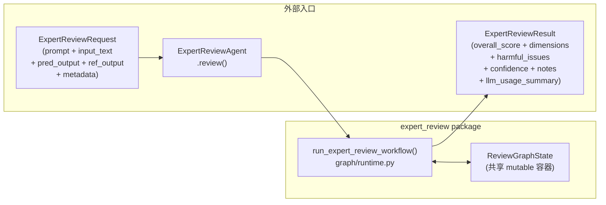
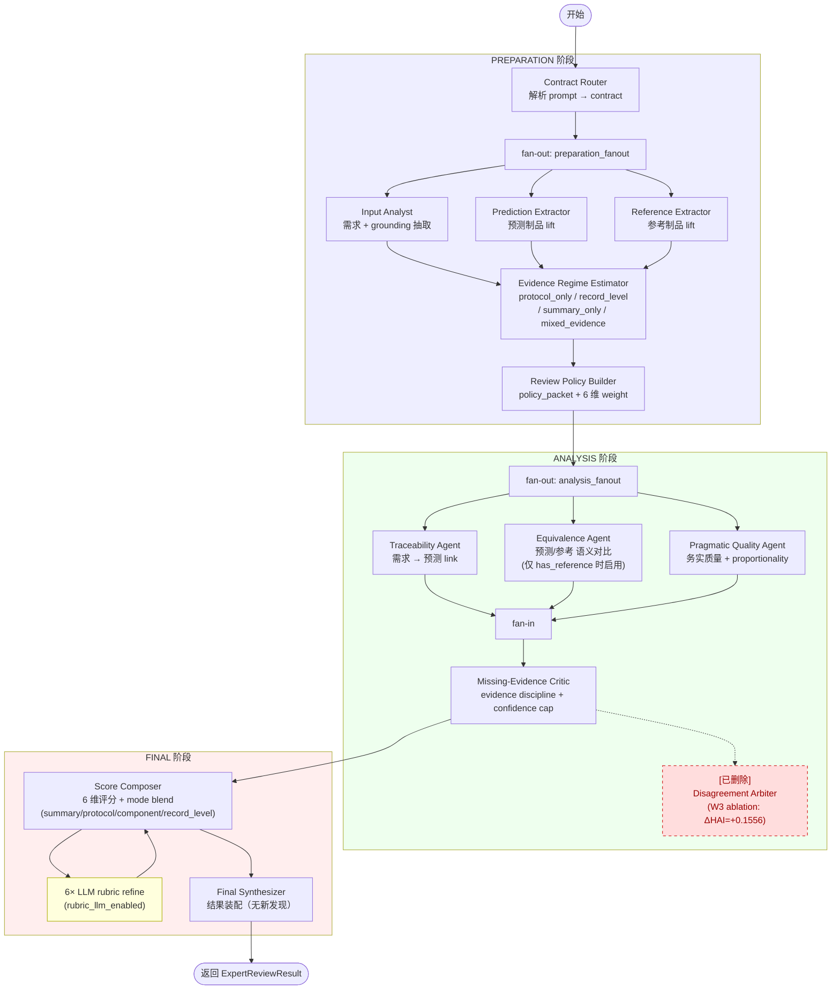
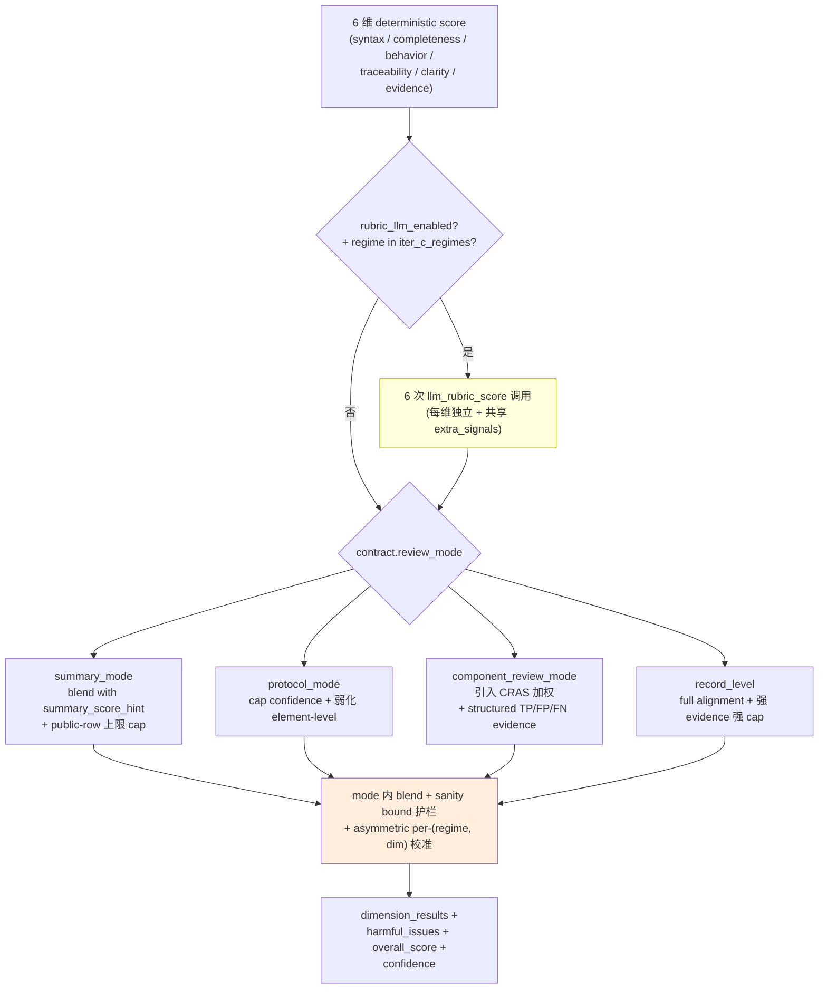
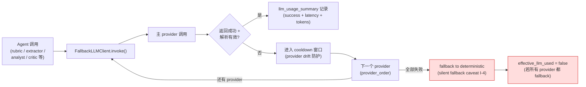
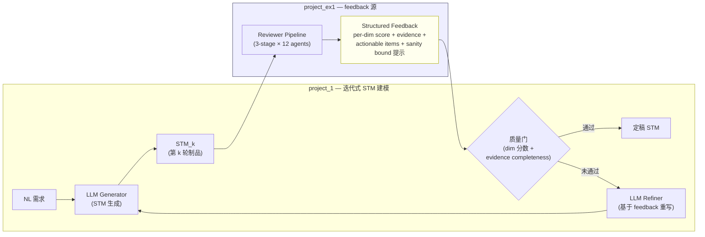

# project_ex1 — 项目归档准备 + 重构规划 + LLM-as-feedback 路线讨论

> **时间**：2026-05-09 15:19:23 起稿
> **形式**：W4.x 工作收口 + 项目归档前的最终盘点 + 后续路线说明
> **状态**：本项目计划在当前 PR 上**说明状况后 merge 到 `main`**，随后**回归 `project_1`**继续推进；本文件是归档前的最后一份内部记录
> **关联文档**：
>
> 1. [2026-05-08-19-20-31-AI-讨论-project_ex1学术定位与相关工作综述.md](./2026-05-08-19-20-31-AI-讨论-project_ex1学术定位与相关工作综述.md) — 学术定位主稿（v4.3）
> 2. [2026-05-09-12-58-25-AI-讨论-prompt实现一致性待处理清单.md](./2026-05-09-12-58-25-AI-讨论-prompt实现一致性待处理清单.md) — I-1 ~ I-20 不一致清单 + Part II 代码事实档案

---

## 0. 摘要

本次讨论一次性沉淀以下三件事：

1. **现状盘点**：W4.x 完整收口后的代码状态（pydoc 100%、死代码清理、阶段口径冻结）与遗留待办（20 条 prompt-implementation 不一致 + 6 大目录散乱）；
2. **重构规划**：把 `src/` 当前混合状态（importable package + CLI 脚本 + 实验脚本 + 流程文档）拆成 6 大职责清晰的物理路径，并提供 9-commit TDD 增量执行计划，作为下一阶段重启时的施工说明书；
3. **路线转向**：与导师讨论后，把 `LLM-as-Judge` 重新定位为 `LLM-as-feedback` —— 不再单独作为评估子系统存在，而是**作为 `project_1` 迭代式状态机建模闭环里的反馈源**进入下一阶段使用。

本项目的当前形态作为"特别独立的 review 子系统"将进入归档状态。重构与方法重新落地的工作不在归档前完成，而是在 `project_1` 的下一轮工作中**以 feedback 角色被重新激活**。

---

## 1. 现状盘点

### 1.1 已完成（W4.x 期间）

#### A. 工程层面

1. **3-stage runtime 已经稳定**：[src/expert_review/graph/runtime.py](../src/expert_review/graph/runtime.py)
   - `PREPARATION`：Contract Router → 并行三抽取（Input / Prediction / Reference Extractor）→ Evidence Regime Estimator → Review Policy Builder
   - `ANALYSIS`：并行三审（Traceability / Equivalence / Pragmatic Quality）→ Missing-Evidence Critic
   - `FINAL`：Score Composer（含 6 维 rubric LLM refinement）→ Final Synthesizer
   - W3 ablation 验证后 `Disagreement Arbiter` 已删除（ΔHAI=+0.1556 反向贡献），仅保留中文 audit 注释作为历史 trail
2. **死代码清理（W4.x Phase 0）**：
   - `legacy/` 目录整体删除（外部 0 引用）
   - `Disagreement Arbiter` 字符串残留在 4 个文件中清理完毕
   - 42/42 unit tests 全程绿
3. **中文 RST pydoc 全量补全（W4.x Phase 1-9）**：
   - 64 个 Python 文件，module / class / function / method 四级覆盖率 100%
   - module docstring 含 4 段标准结构（作用 / 设计思路 / 关键约束 / caveat）
   - 公共 API 配 `Examples::` 段，可被 `pytest --doctest-modules` 验证
   - 共计 **419 zh + 15 en items**（en 部分为外部 schema 兼容遗留，未触动）
4. **README + GUIDE 同步**：[src/expert_review/README.md](../src/expert_review/README.md)、[src/expert_review/GUIDE.md](../src/expert_review/GUIDE.md) 与当前代码状态一致；`Phase 7 ~ Phase 15` 阶段口径全部冻结
5. **benchmark harness 稳定**：`scope=phase7` / `scope=phase14` / `scope=phase15` 三套对比面落地，`validation + lockbox + LOFO + lockbox residual audit` 默认验收链固定

#### B. 方法学层面

1. **Anchored rubric 6 维 + 5+1 双轨聚合** 形成稳定方法学骨架（详见学术定位主稿 §3）
2. **3 道晋升门**（Q1 双轨 / Q2 evidence consistency / Q3 multi-rep stability）固定为评估口径
3. **Sanity bound 机制**（per-dim + per-(regime, dim) 非对称）作为 LLM refinement 与 deterministic estimate 之间的护栏
4. **PDS / HAI / RAS / SAS / CRAS / normalized_mae / Calib / Stability** 八指标体系闭环

#### C. 文档与材料层面

1. **学术定位主稿 v4.3**（[2026-05-08-19-20-31-AI-讨论-project_ex1学术定位与相关工作综述.md](./2026-05-08-19-20-31-AI-讨论-project_ex1学术定位与相关工作综述.md)）
   - §0~§14 完整结构，含 3 张 mermaid + 28 条参考文献 + 真实片段 case study
2. **LLM-as-Judge 文献库**：[llm_as_judge_methods_corpus/](../llm_as_judge_methods_corpus/)
   - 14 篇论文（7 通用 + 7 SE 相关），每篇配 `paper.pdf` / `paper_content.txt` / `bibtex.bib` / `DESC.md`
3. **STM 评估材料库**：[state_machine_review_corpus/](../state_machine_review_corpus/)
4. **不一致清单 v2 大扩充**（[2026-05-09-12-58-25-AI-讨论-prompt实现一致性待处理清单.md](./2026-05-09-12-58-25-AI-讨论-prompt实现一致性待处理清单.md)）
   - Part I：I-1 ~ I-20 共 20 条不一致 issue
   - Part II：II-A ~ II-L 代码架构事实档案

### 1.2 待办（按风险等级）

#### P0（致命，方法叙事必须修）

1. **I-7**：`k-rep / 3σ / noise floor` 完全未实现 —— 学术稿声称 multi-rep stability 实际只有 `_rerun_subset` 的 2-rep
2. **I-1**：`evidence_discipline` prompt-implementation 错配 —— LLM 从未看到 reviewer 的 V_1 输出，实际在做 self-prediction 而非 self-audit（用户在 v4.3 主稿中已选定 option C "5+1+derived" 路线，但代码尚未对齐）
3. **I-12**：Operability proxy 完全未实现 —— 主稿提到的"评估自动化代价"维度只有 placeholder

#### P1（重要，影响数据可信度）

4. **I-13**：score-to-label 双阈值系统 —— `judgement_from_score`（0.90/0.75/0.55/0.35）与 `_band_from_score`（0.85/0.65/0.45/0.25）共存，结论会因调用入口不同而差异
5. **I-15**：Score Composer mode-specific shaping 在 paper narrative 中被过度简化为"5+1 平均"，实际包含 summary_mode / protocol_mode / component_review_mode / record_level 四种 blend 路径
6. **I-2**：`vv_role_coverage` 是 `VV_ROLE_HINTS` 硬编码关键词匹配，不是 LLM 评估
7. **I-9**：Calibration 实际是 `Brier + ECE` 加权（0.55:0.45），不是单 ECE
8. **I-3 / I-4 / I-5 / I-6 / I-8 / I-10 / I-11 / I-14 / I-16 ~ I-20**：详见 [2026-05-09-12-58-25-AI-讨论-prompt实现一致性待处理清单.md](./2026-05-09-12-58-25-AI-讨论-prompt实现一致性待处理清单.md)

#### P2（结构层，影响协作效率）

9. **目录散乱**：详见 §2 重构规划

---

## 2. 重构规划（推迟到归档之后或随 project_1 重新激活）

### 2.1 现状散乱情况

按职责把当前文件分到 12 个域：

| 域 | 路径 | 当前问题 |
|----|------|----------|
| A. importable package | `src/expert_review/` | 内部结构良好，但根层混着 docs（PYDOC_INVENTORY.md / PYDOC_ITEMS.md / GUIDE.md / README.md） |
| B. CLI / 入口脚本 | `src/run_expert_review.py` / `src/align_ttool_expert_review.py` | 与 importable package **同级**，包内外混杂 |
| C. 复现配置 | `src/config.py` / `src/tasks.py` | 同样在 src/ 顶层 |
| D. 数据准备 / fixture | 散落在 `experiments/build_*` | 33 个脚本全部在仓库顶层 `experiments/` |
| E. 实验运行 | 同 D，混 `analyze_*` / `run_*` / `assemble_*` | 没有按"准备 / 运行 / 分析 / 汇报"分层 |
| F. 包级 docs | `src/expert_review/{README,GUIDE,PYDOC_*}.md` | 与代码同目录，文件类型混杂 |
| G. 流程 docs | 无独立位置 | 比如 `REPRODUCTION_REPORT.md` 在 src/ 顶层 |
| H. designs | `src/expert_review/designs/` | 设计文档跟代码混在一起 |
| I. 测试 | `src/expert_review/test_*.py`（3 文件） | 跟代码同目录，没有独立 `tests/` |
| J. discussions | `discussions/` | 状态良好 |
| K. corpus | `llm_as_judge_methods_corpus/` / `state_machine_review_corpus/` | 状态良好 |
| L. 项目入口 | 无 `pyproject.toml` / 无 `Makefile` | 没有顶层标准化入口 |

### 2.2 推荐的 6 域物理重构

```
project_ex1_llm_judge_for_stm/
├── pyproject.toml              # NEW：顶层标准化入口
├── README.md                   # 项目入口（保留）
├── AGENTS.md                   # 软链 → CLAUDE.md（保留）
│
├── src/                        # 仅放可导入 Python package
│   └── expert_review/
│       ├── agents/
│       ├── graph/
│       ├── prompts/
│       ├── schemas/
│       ├── tools/
│       ├── compatibility/
│       ├── benchmark/          # NEW：从 3127 行的 benchmark.py 拆出
│       │   ├── __init__.py
│       │   ├── harness.py      # _rerun_subset / scope dispatch
│       │   ├── metrics.py      # ScoreAlign / RAS / SAS / CRAS / PDS / HAI / Calib
│       │   └── splits.py       # family-aware greedy split
│       ├── batch.py
│       ├── inventory.py
│       ├── llm_telemetry.py
│       └── ...
│
├── tests/                      # 所有测试集中
│   ├── test_review.py
│   ├── test_benchmark.py
│   └── test_batch.py
│
├── reproduction/               # 复现链（CLI + 配置 + 数据准备 + 实验）
│   ├── README.md
│   ├── cli/
│   │   ├── run_expert_review.py
│   │   └── align_ttool_expert_review.py
│   ├── config/
│   │   ├── config.py
│   │   └── tasks.py
│   ├── data_prep/              # build_* 类脚本
│   └── experiments/            # analyze_* / run_* / assemble_*
│
├── docs/                       # 所有静态文档
│   ├── api/                    # 自动生成的 pydoc / sphinx 入口
│   ├── designs/                # 移自 src/expert_review/designs/
│   ├── reports/                # REPRODUCTION_REPORT.md 等
│   └── process/                # PYDOC_INVENTORY.md / PYDOC_ITEMS.md / GUIDE.md
│
├── discussions/                # 不动（保持现状）
├── llm_as_judge_methods_corpus/ # 不动
└── state_machine_review_corpus/ # 不动
```

### 2.3 6 个决策点（D1-D6）

> 当前**全部锁定为暂定推荐**，重构正式启动前由用户回看 + 复核。

| 决策 | 问题 | 暂定推荐 |
|------|------|----------|
| **D1** | `src/` 顶层 4 个 .py 怎么办？ | **方案 C**：移到 `reproduction/cli/` + `reproduction/config/` |
| **D2** | `benchmark.py`（3127 行）怎么办？ | **拆分**为 `benchmark/{harness, metrics, splits}.py` |
| **D3** | `src/expert_review/designs/` 怎么办？ | **移到 `docs/designs/`** |
| **D4** | `README.md` + `GUIDE.md` 怎么办？ | **留在 `src/expert_review/`**（包级 README 是 Python 社区习惯） |
| **D5** | 是否引入 lint / format 工具链？ | **引入 ruff + black**，写到 pyproject.toml |
| **D6** | `experiments/` 怎么处置？ | **整体迁入 `reproduction/experiments/`** |

### 2.4 9-commit TDD 增量执行计划

| Commit | 改动 | 检查点 |
|--------|------|--------|
| C1 | 新建 `pyproject.toml` + 顶层 `tests/` + 测试迁移 | `pytest tests/` 全绿 |
| C2 | `src/` 顶层 4 个 .py 移到 `reproduction/cli/` + `reproduction/config/` | CLI 入口可执行 |
| C3 | `experiments/` → `reproduction/experiments/` | 一致性脚本可跑 |
| C4 | `src/expert_review/designs/` → `docs/designs/`；包级 .md 移到 `docs/process/` | 链接有效 |
| C5 | `benchmark.py` 拆分阶段 1：`benchmark/harness.py` | 测试绿 |
| C6 | `benchmark.py` 拆分阶段 2：`benchmark/metrics.py` | 测试绿 |
| C7 | `benchmark.py` 拆分阶段 3：`benchmark/splits.py` + `__init__.py` re-export | 测试绿 |
| C8 | 引入 ruff + black + 修可发现的格式问题 | lint pass |
| C9 | 同步 README / GUIDE / discussions 引用 | 链接全部有效 |

> **重要**：**重构不在本归档前执行**，仅作为下一次启动时的施工说明书保留。

---

## 3. 完整 Mermaid 流程图

> 反映 `src/expert_review/graph/runtime.py` 当前真实运行结构（W4.x 收口版本），含已删除的 arbiter 历史标记、Score Composer 的 6 维 rubric 调用、fan-out/fan-in 模式与 ReviewGraphState 共享容器。

### 3.1 顶层调用链



### 3.2 3-stage langgraph 详细流程



### 3.3 Score Composer 内部 mode 分发（issue I-15 关键）



### 3.4 LLM 失败回退链（FallbackLLMClient）



### 3.5 数据流（每 stage 输入 / 输出 → ReviewGraphState 字段）

| Stage | Agent | 输入字段 | 输出 state 字段 |
|-------|-------|----------|-----------------|
| PREP | Contract Router | `request.prompt` | `state.contract` |
| PREP | Input Analyst | `request.input_text` + `prompt` | `state.input_dossier` |
| PREP | Prediction Extractor | `request.pred_output` | `state.pred_dossier` |
| PREP | Reference Extractor | `request.ref_output` | `state.ref_dossier` |
| PREP | Evidence Regime Estimator | prompt + 三 dossier | `state.regime` |
| PREP | Review Policy Builder | contract + regime + 三 dossier | `state.policy_packet` + `state.dimensions` |
| ANALYSIS | Traceability Agent | input + pred dossier | `state.trace_results` |
| ANALYSIS | Equivalence Agent | input + pred + ref dossier | `state.equivalence_report` |
| ANALYSIS | Pragmatic Quality Agent | contract + regime + policy + input + pred | `state.quality_report` |
| ANALYSIS | Missing-Evidence Critic | 上述全部 | `state.evidence_critic` |
| FINAL | Score Composer | dimensions + 全部 dossier/report | `state.dimension_results` + `state.harmful_issues` + `state.overall_score` + `state.confidence` |
| FINAL | Final Synthesizer | request + 全部 state | `state.result` |

---

## 4. LLM-as-feedback 路线（导师讨论后的转向）

### 4.1 重新定位

与导师本次讨论后形成的关键洞察：

> **原 `LLM-as-Judge` 子系统可以重新定位为 `LLM-as-feedback`，融入 `project_1` 的迭代式状态机建模闭环。**

这一重新定位的核心论点是：

1. **同一套 reviewer 系统**既可以作为**评估器**（学术稿 §3 当前定位），也可以作为**反馈源**（提供 per-dim 分数 + structured evidence + actionable items）；
2. **`project_1` 本身是迭代式建模**：LLM 生成 STM → 评估 → 修复 → 再生成 → ……；
3. 当前的 reviewer 输出**完全可以作为下一轮 prompt 的"建设性 critique" 部分**，从而把"被动评估"变成"主动 feedback signal"。

### 4.2 可能的架构骨架



### 4.3 与原方法叙事的差异

| 维度 | 原 `LLM-as-Judge` | 新 `LLM-as-feedback` |
|------|-------------------|----------------------|
| 主要用户 | 评估者 / 论文 reviewer | `project_1` Generator + Refiner |
| 输出格式 | 数字分数 + evidence + 报告 | 结构化 critique + 可消化的 actionable list |
| 评估对象 | 静态 STM | 迭代轮次中的"当前最佳版本" |
| 使用频次 | 一次性最终评估 | 每轮 STM 生成后调用 |
| 与论文写作绑定 | 直接作为 §Method | 作为 `project_1` 的子组件 + ablation 维度 |
| Anchored rubric 的角色 | 评分锚点 | feedback 模板 + 引导 refine 方向 |

### 4.4 对当前 ex1 工作的可重用性盘点

| 资产 | feedback 路线下的用途 |
|------|----------------------|
| 6 维 anchored rubric | **直接复用**为 feedback 模板 |
| 3-stage runtime | **直接复用**为 feedback 生成管线 |
| Score Composer mode 分发 | **降级简化**：feedback 不需要复杂的 score blend，可主要走 `record_level` mode |
| 8 指标体系 | **简化**：保留 PDS / RAS / Stability 作为 feedback 质量自检；HAI / SAS / CRAS 不再是主指标 |
| Sanity bound | **保留**作为 feedback 的可信区间标注 |
| LLM-as-Judge 文献库 | **拓展**为 LLM-as-feedback / iterative refinement / self-critique 文献库 |
| benchmark harness | **改造**为 closed-loop benchmark：评估"经过 N 轮 feedback 后的 STM 质量提升" |
| 20 条不一致清单 | 大部分仍然有效，**优先级会随 feedback 角色变化**（如 I-15 mode shaping 优先级降低，I-1 evidence_discipline 优先级升高） |

### 4.5 后续在 project_1 中重启时的入口

1. 保留本项目作为**只读资产仓库**（package + corpus + discussions）
2. 在 `project_1` 中新建 `feedback/` 子模块，**通过 `import expert_review` 复用**而不是 fork
3. 在 `project_1` 的迭代式 prompt 模板中，把 reviewer 输出作为**第二段 system context**（"以下是上一轮模型的 review 结论，请优先针对 ××× 进行修复"）
4. 增加一个 closed-loop benchmark：`HAI 单点 vs HAI@3rd-iter vs HAI@5th-iter`，验证 feedback 是否真的带来收敛

---

## 5. 项目归档计划

### 5.1 归档的范围

本项目以 `dev/project_ex1_split` 分支为最终状态进行归档：

1. **代码**：维持 W4.x 收口版本（pydoc 100%、死代码已清、3-stage runtime 稳定）
2. **文档**：维持当前 README / GUIDE / 设计文档 / 学术定位主稿 / 不一致清单
3. **数据**：state_machine_review_corpus 与 llm_as_judge_methods_corpus 不动
4. **重构**：**不执行**（仅以本文件 §2 的形式留下施工说明书）

### 5.2 归档的方式

1. 提交本讨论文件
2. 推送到远端 `dev/project_ex1_split`
3. 在 PR 评论中说明：
   - 已完成内容（W4.x 收口 + pydoc 100% + 死代码清理 + benchmark harness 稳定）
   - 遗留 20 条不一致（指向 [I-1 ~ I-20 清单](./2026-05-09-12-58-25-AI-讨论-prompt实现一致性待处理清单.md)）
   - 重构已规划但**有意推迟**（指向本文件 §2）
   - 路线转向（`LLM-as-feedback` 融入 `project_1`，指向本文件 §4）
4. PR 合入 `main`

### 5.3 PR 评论草稿

> **建议在 PR 上贴的中文说明（待用户审定后再发布）：**
>
> 本 PR 是 `project_ex1` 的 W4.x 收口 + 项目归档 PR。已完成：
>
> 1. 中文 RST pydoc 4 级覆盖率 100%（419 zh + 15 en items）
> 2. `legacy/` 目录整体删除 + Disagreement Arbiter 字符串残留清理
> 3. README + GUIDE 与代码状态对齐，Phase 7 ~ 15 阶段口径冻结
> 4. 学术定位主稿（v4.3）+ I-1 ~ I-20 不一致清单 + 重构规划 + 归档说明 4 份 discussion
> 5. 42/42 unit tests + 全量 doctest 绿
>
> 故意未做：
>
> 1. 20 条 prompt-implementation 不一致 issue（详见清单）
> 2. 6 大目录散乱的物理重构（已规划 9-commit 增量执行方案）
> 3. benchmark.py（3127 行）的拆分
>
> 后续路线：本子系统将以 `LLM-as-feedback` 形态重新激活到 `project_1` 的迭代式建模闭环里，而不是以独立子系统继续推进。详见 `discussions/2026-05-09-15-19-23-AI-讨论-项目归档与重构规划与LLM-as-feedback路线.md`。
>
> 合入后本仓库的 `project_ex1_llm_judge_for_stm/` 目录将作为只读资产保留。

---

## 6. 接力点（下次启动时优先看这里）

> 不论是直接重启 ex1，还是从 `project_1` 那侧反向复用，下面是**最快进入状态**的阅读路径。

### 6.1 重启 ex1 时

1. 先看本文件 §1.2（待办）+ §2（重构规划）
2. 再看 [I-1 ~ I-20 清单](./2026-05-09-12-58-25-AI-讨论-prompt实现一致性待处理清单.md) 的 P0 部分
3. 再看 [学术定位主稿 v4.3](./2026-05-08-19-20-31-AI-讨论-project_ex1学术定位与相关工作综述.md) §10 决策点
4. 最后看 [src/expert_review/README.md](../src/expert_review/README.md) + [GUIDE.md](../src/expert_review/GUIDE.md)

### 6.2 在 project_1 中复用 ex1 时

1. 先看本文件 §4（feedback 路线）
2. 再看 [src/expert_review/__init__.py](../src/expert_review/__init__.py) 暴露的对外 API：
   - `ExpertReviewRequest` / `ExpertReviewResult` / `review_artifacts()` / `review_model()`
3. 再看 [src/expert_review/graph/runtime.py](../src/expert_review/graph/runtime.py) 的 `run_expert_review_workflow()` 与 §3.2 的 mermaid
4. 再看 `state_machine_review_corpus/` 里的 STM 评估材料（可作为初始 fixture）

### 6.3 关键数据 / 文件索引

| 类型 | 路径 |
|------|------|
| 主入口 | [src/expert_review/agent.py](../src/expert_review/agent.py) |
| 主 runtime | [src/expert_review/graph/runtime.py](../src/expert_review/graph/runtime.py) |
| Score Composer | [src/expert_review/agents/score_composer.py](../src/expert_review/agents/score_composer.py) |
| benchmark | [src/expert_review/benchmark.py](../src/expert_review/benchmark.py) |
| schema | [src/expert_review/schema.py](../src/expert_review/schema.py) |
| 单元测试 | [src/expert_review/test_review.py](../src/expert_review/test_review.py)（39 KB）+ test_benchmark.py + test_batch.py |
| 学术稿 v4.3 | [discussions/2026-05-08-19-20-31-...综述.md](./2026-05-08-19-20-31-AI-讨论-project_ex1学术定位与相关工作综述.md) |
| 不一致清单 v2 | [discussions/2026-05-09-12-58-25-...清单.md](./2026-05-09-12-58-25-AI-讨论-prompt实现一致性待处理清单.md) |
| 本文件 | discussions/2026-05-09-15-19-23-...路线.md |

---

## 7. 备注与结束语

1. 本项目作为**自研 LLM-as-Judge 子系统**的独立形态在此告一段落
2. 6 维 anchored rubric + 3-stage runtime + sanity bound 的设计**已被验证可工作**，可以以"反馈源"的角色进入下一阶段使用
3. 未完成的工程清理（重构 / I-1~I-20）**不阻塞 project_1 的复用** —— 因为这些 issue 主要影响"作为独立 paper 提交"时的方法叙事一致性，而**作为 feedback 源使用时大部分 issue 优先级会下降**
4. 后续 paper 若要发表 ex1 单独工作，建议先解决 P0 的 3 条（I-1 / I-7 / I-12），P1 的剩余 issue 可以按"已知局限"在 §Limitations 中诚实记录

